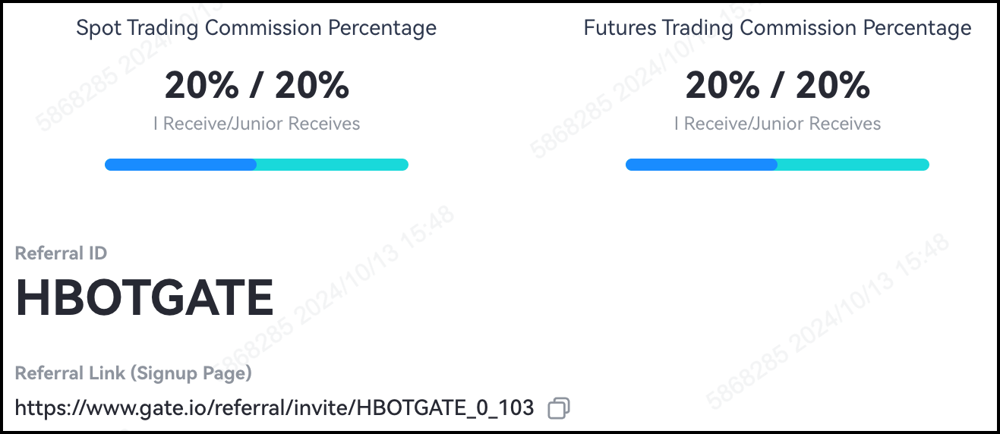

## Run Hummingbot and Get Rebates on Your Trading Fees!

When you sign up for an account with our partner exchanges using the Hummingbot referral link, you will receive a rebate on your trading fees!

Please see the table below for the exchanges that support this program, as well as instructions on how to join for each exchange.

| Exchange | Your Fee Rebate        | Referral Link |
|----------|-------------------|---------------|
| OKX      | 20%             | [Sign Up](https://www.okx.com/join/1931920269) |
| Huobi    | 20%               | [Sign Up](https://www.htx.com.pk/invite/en-us/1h?invite_code=re4w9223) |
| Gate.io  | 20%               | [Sign Up](https://www.gate.io/referral/invite/HBOTGATE_0_103) |
| Kucoin   | 20%             | [Sign Up](https://www.kucoin.com/r/af/hummingbot) |
| Binance  | 10%               | [Sign Up](https://accounts.binance.com/register?ref=CBWO4LU6) |

## How to Join

### OKX

1. **Sign Up**: Register for a OKX account using our [referral link](https://www.okx.com/join/1931920269).
2. **Start Trading**: Use Hummingbot to trade on OKX and automatically receive a **20% fee rebate** on each trade!

### Huobi

1. **Sign Up**: Register for a Huobi account using our [referral link](https://www.htx.com.pk/invite/en-us/1h?invite_code=re4w9223).
2. **Start Trading**: Use Hummingbot to trade on Huobi and automatically receive a **20% fee rebate** on each trade!

### Gate.io

1. **Sign Up**: Register for a Gate.io account using our [referral link](https://www.gate.io/referral/invite/HBOTGATE_0_103).
2. **Start Trading**: Use Hummingbot to trade on Gate.io and automatically enjoy a **20% fee rebate** on each trade!

### Kucoin

1. **Sign Up**: Register for a Kucoin account using our [referral link](https://www.kucoin.com/r/af/hummingbot).
2. **Start Trading**: Use Hummingbot to trade on Kucoin and receive a **20% fee rebate** fee rebate on each trade!

### Binance

1. **Sign Up**: Register for a Binance account using our [referral link](https://accounts.binance.com/register?ref=CBWO4LU6).
2. **Start Trading**: Use Hummingbot to trade on Binance and automatically receive a **10% fee rebate** on each trade!

## Why should you support us?

This supports our work at the not-for-profit Hummingbot Foundation. To keep Hummingbot open source and free, we have broker agreements with exchange partners, in which the exchanges share a portion of the trading fees with us, at zero cost to you.

## How do exchange affiliate and API broker programs work?

When you sign up for an account using our referral link, a portion of your trading fees are rebated back to us, which supports our work at the not-for-profit Hummingbot Foundation. We then share a portion of these rebates with you!

In addition, some exchanges have an API broker program, in which they rebate an additional portion of their trading fees to us based on the volume of orders you submit through Hummingbot. Every time you use Hummingbot to submit an order, it sends an HTTP request to the API of the exchange. The exchange then identifies that the HTTP request for the order is coming from a user who is using the Hummingbot codebase, it checks for the metadata in the HTTP request for a Hummingbot identifier. If the identifier is present, the exchange knows that the order is coming from a Hummingbot user and will rebate a portion of the trading fees to us, separate from the affiliate rebate.
 