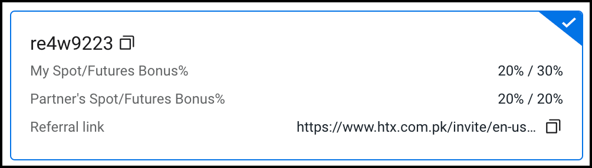
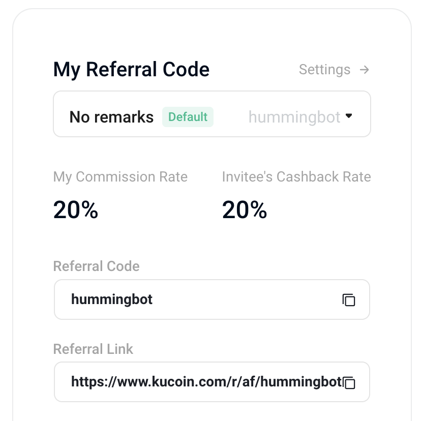

## Run Hummingbot and Get Fee Rebates!

Certain partner exchanges allow their broker partners to allocate a certain percentage of their fee share to users. For these exchanges, we will allocate a portion of our total fee share to users as an additional incentive to run Hummingbot. This means that any users who sign up using our referral link and/or use Hummingbot will earn rebates on their trading fees and those they refer!

## How to Join

### Huobi

1. **Sign Up**: Register for a Huobi account using our [referral link](https://www.htx.com.pk/invite/en-us/1h?invite_code=re4w9223).
2. **Verify Your Account**: Complete any required KYC verification steps as prompted by Huobi.
3. **Start Trading**: Use Hummingbot to trade on Huobi and automatically receive fee rebates.

### Gate.io

1. **Sign Up**: Register for a Gate.io account using our [referral link](https://www.gate.io/referral/invite/HBOTGATE_0_103).
2. **Verify Your Account**: Complete any required KYC verification steps as prompted by Gate.io.
3. **Start Trading**: Use Hummingbot to trade on Gate.io and enjoy fee rebates.

### Binance

1. **Sign Up**: Register for a Binance account using our [referral link](https://accounts.binance.com/register?ref=CBWO4LU6).
2. **Verify Your Account**: Complete any required KYC verification steps as prompted by Binance.
3. **Start Trading**: Use Hummingbot to trade on Binance and receive fee rebates.

**Note**: Our application to the Binance Affiliate Program is pending.

### KuCoin

**Note**: Our application to the KuCoin Affiliate Program is pending.

## Why should you support us?

This supports our work at the not-for-profit Hummingbot Foundation. To keep Hummingbot open source and free, we have broker agreements with exchange partners, in which the exchanges share a portion of the trading fees with us, at zero cost to you.

## How do exchange broker programs work?

Every time you use Hummingbot to submit an order, it sends an HTTP request to the API of the exchange. The information of the order is placed in the body and the authentication in the headers of the HTTP request (exact implementation differs per exchange).

In order for the exchange to identify that the HTTP request for the order is coming from a user who is using the Hummingbot codebase, it checks for the metadata in the HTTP request for a Hummingbot identifier.
