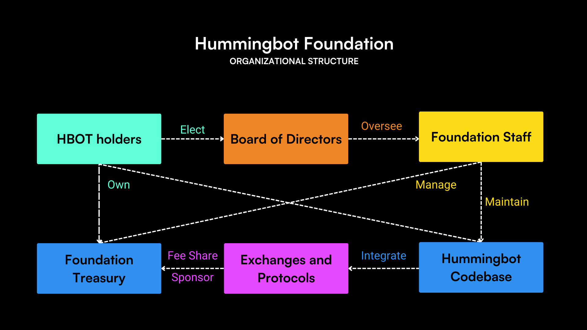

Hummingbot is an open source framework for building high-frequency market making and algorithmic trading bots, maintained by [Hummingbot Foundation](./foundation.md) and supported by key [sponsors and backers](./sponsors.md).

Our mission is to make sophisticated trading strategies and technology accessible to everyone and to level the playing field for traders around the globe Here are the core principles that underpin Hummingbot’s development:

* **Open Source**: The Hummingbot codebase is publicly available, auditable, and free
* **Modular**: Hummingbot modules can be independently built, used, and maintained by community members
* **Extensible**: Users can use Hummingbot to create any trading strategy on any exchange and blockchain
* **All Levels**: Hummingbot is designed for use by individuals and professionals alike

## History

Hummingbot was originally built and open sourced by [CoinAlpha](https://coinalpha.com) in April 2019. Hummingbot pioneered a modular architecture that allowed external developers to contribute new exchange connectors and trading strategies into a shared, community-maintained codebase. Read the original [Hummingbot whitepaper](/blog/hummingbot-whitepaper/) and the [origin story](/blog/from-hedge-fund-to-market-making-bot-the-hummingbot-origin-story/) blog post for more details.

Later, the Hummingbot team wrote the [Liquidity Mining whitepaper](/blog/liquidity-mining-whitepaper/) that described an economic model for decentralized market making and subsequently launched the [Miner liquidity mining platform](/blog/introducing-liquidity-mining-a-marketplace-for-market-makers/).

In December 2021, CoinAlpha [spun off](/blog/introducing-the-hummingbot-foundation/) the Hummingbot Foundation as a new open source entity that maintains the Hummingbot Github repository and administers a decentralized, community-driven governance system utilizing the [HBOT token](/blog/introducing-the-hummingbot-governance-token-hbot/).

Today, Hummingbot is a bazaar-style open source project with many contributors and users around the world, both individual and professional.
