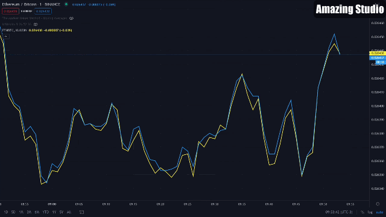

# Commands and Configs - Price Source

Welcome back to the series of articles where you will learn how to make the best use of your Hummingbot configurations.

In the two latest articles ([Part 1](../commands-and-configs-part-1/) and [Part 2](../commands-and-configs-part-2/)), we went through all the commands you can use on your client terminal and the global configurations.

Today we will talk about the configuration settings related to the markets and the price information, and how you can use them for your benefit.

What you will learn:

- How to make your Hummingbot use a reference price from a source different from the exchange it is trading on;

- What are the various price sources Hummingbot can use as a reference;

- How the information about price moves around different markets;

- Why use the price information from a different source.

<!-- more -->

#### Price is information and information is money

Before exploring the next set of configurations, we have to talk a bit about price.

**But what is Price?**

In the most basic sense, price is the amount of money two parties agree to trade something. It doesn’t necessarily reflect the value of whatever is being exchanged, but that is a talk for another moment.

And what makes things really interesting is that the price of anything, be it a physical good or a cryptocurrency, is never constant over time.

Supply, demand, perceived value, future expectation, liquidity… all that and more can have an impact on the price of what is being traded.

Have you ever stopped to think that all these factors that influence the price of some can differ depending on in which market the negotiation is happening?

For example, think about mangos. Mangos are a pretty common fruit here in Brazil, and you can find them really cheap on any street market or grocery store around here. But if you want to buy mangos in Canada, for example, I am certain that they will be a lot more expensive.

#### Different markets, same rules

When we talk about financial assets, like cryptocurrencies, it isn’t much different.

Take a quick look around. You will find out that there are no less than 300 different cryptocurrency exchanges worldwide, each with different negotiation models, functionalities, governance models, and under different government laws.

It is like a big sea, where each exchange is an island with its own population, culture and set of rules and laws.  However, they all have one thing in common: they trade the same type of merchandise.

#### Price information travels, and arbitrageurs are the ships

As we already know, the inefficiencies caused by the highly fragmented cryptocurrency market create a lot of opportunities for arbitrageurs, who can take advantage of the price discrepancies between all the markets. You can set up your own arbitrage bot with Hummingbot too, and learn more about how arbitrage works:  [What is arbitrage?](../what-is-arbitrage/index.md)

But what makes the arbitrage operations interesting regarding this current discussion is that they are the main actors that reconcile the price differences between all these different markets.

Take a look at what happens with the price on the pair ETHBTC on two different exchanges, Binance (Blue) and Kucoin (Yellow):

As you can see, Kucoin prices are lagging behind Binance prices, and always moving to catch up.

What happens here is that Binance has more trading volume, more traders, and the prices move way faster there.

When the price discrepancies between both exchanges arise, arbitrage bots and other market participants act to take advantage of this difference.  As a result, Kucoin prices and Binance prices will eventually converge.

#### Price information flows from high trade volume to low trade volume markets

This is usually how the price information flows. Since there are a lot more trades happening on a high volume exchange and generally a lot more traders, there is a higher probability of the market showing a “fair” price; more traders and trades equals more information to more quickly arrive at “consensus”.

But that is not always the case. 

For example, cryptocurrency markets are open 24/7, and as humans usually sleep 8 hours during the night, depending on the timezone, you will see more or less activity on different exchanges, depending on where its customers live.

An exchange located in China might have different peak trading hours than an exchange located in the US, and it might lead the price information during that specific time frame.

#### How to take advantage of price information with Hummingbot

So why should you use a different price source when you are market-making?

As seen in the example above about the ETHBTC pair on Binance and Kucoin, the market with more trading volume/liquidity will often be the “price leader” and be followed by the other exchanges.

Therefore, when you are market-making on a less liquid exchange, it might be worth considering using prices from a more liquid exchange to set your spreads.

If you are a Hummingbot user, you already have a great tool at your disposal to use this price information in your favor.

The configuration instructions below guide you on how to set a different price source to be used as the pricing reference for your bot.

#### price_type

With `config price_type` you can set the reference price that will be used to calculate your bid and ask offer.

The price value of the bid and ask offer created by Hummingbot uses the following formula: 

Bid price = (price_reference - price_reference * bid_spread)

Ask price = (price_reference + price_reference * ask_spread)

There are 5 options to choose:

**mid_price**

The default option,  where the price reference is calculated as the average of the best bid and the best ask offers currently on the exchange order book.

(best bid price + best ask price) / 2

**last_price**

With `last_price`, the bot will use the price from the last trade that happened on the exchange. This price can usually be seen on the exchange’s Trades table.

**last_own_trade_price**

Similar to `last_price`, but limited to only your bot’s trades.

**best_bid & best_ask**

As the names imply, the price used as reference will be the current best bid or best ask offer on the exchange order book.

#### price_source

This is the parameter that allows you to set your pricing source.

**current_market**

The default setting, where the bot gets its reference price from the exchange it’s trading on.

**external_market**

Setting `external_market` allows the bot to use pricing from any of the exchanges it is connected to (through the `connect` command).

**custom_api**

Selecting `custom_api` allows you to connect to any custom price source. The API just needs to return a decimal number corresponding to a market price for the asset pair you are trading.

#### price_source_exchange

If `price_souce = external_market` this configuration option will define wich exchange the price information will come from.

It must be an exchange added with the `connect` command.

#### price_source_market

This parameter is the reference trading pair on the price source exchange.

Usually, this will be the same trading pair as the one you’re trading (for example, BTC-ETH price source if you’re trading BTC-*ETH).  However, they don’t have to be the same.  For example, you can use BTC-USD as the price source to trade BTC-USDT.

#### price_source_custom_api

The address of the custom api if you `price_source` is configured to `custom_api`.

#### take_if_crossed

On the rare occasion that the price on the lagging exchange moves so far away from the price source exchange’s price that it creates a trading opportunity,why not take advantage of it?

For example, the price on the exchange you are using as the `price_source` can result in a situation where the orders that bot creates would end up taking other others that are already on the book.

Normally, a market maker is only creating orders. But by enabling the `take_if_crossed` parameter, the bot will take orders that are at a better price than the order it is trying to create..  For example, if prices on the source exchange quickly move dramatically higher, the new bid price based on this new price may be higher than the best ask price on the lagging exchange.  In this case, instead of placing a bid order at the higher price, the bot would first take/fill the ask orders at any lower price.

#### Conclusion
Being a good trader is about using all available information to find profitable conditions.

Price is an important piece of information, and understanding how this information flows between all the different markets can improve trading performance.

At first glance, the huge amount of exchanges that exist in the cryptocurrency space compared to traditional financial markets might seem to scatter the information around.

But these exchanges are way more connected via the accessibility that this assortment of markets allows.

Because of that (and how advanced the information technology is), the information will propagate between them, and all we have to do is to know what to look for and where to look at...

### Join our community!

You can be part of our community by joining us on our [Discord channel](https://discord.hummingbot.io.) to talk about the hummingbot, strategies, liquidity mining and anything else related to the cryptocurrency world, and receive direct support from our team.

To keep up with the news and updates make sure to follow us on [Twitter](https://twitter.com/hummingbot_io), and our Community on [Reddit](https://www.reddit.com/r/Hummingbot/).

On our [Youtube Channel](https://www.youtube.com/channel/UCxzzdEnDRbylLMWmaMjywOA?sub_confirmation=1) you can find a lot of content about market making, including interviews with professional traders and cryptocurrency related events.
