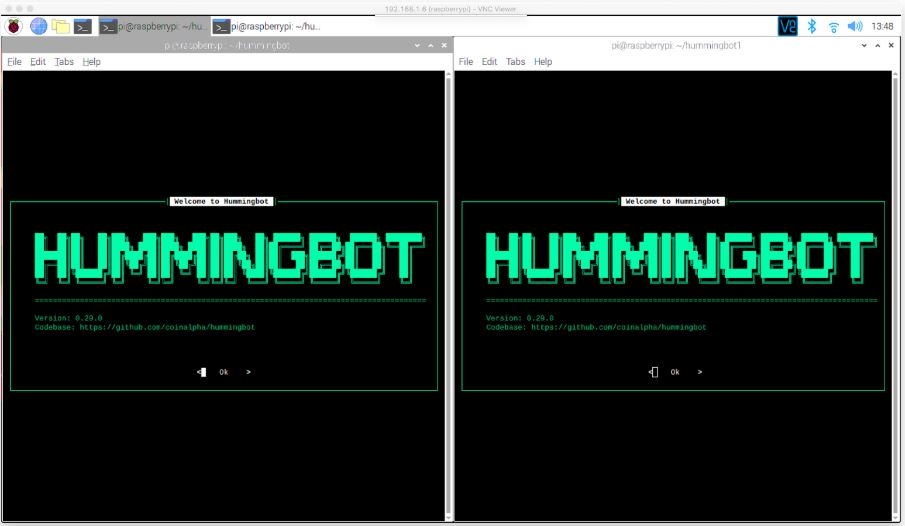
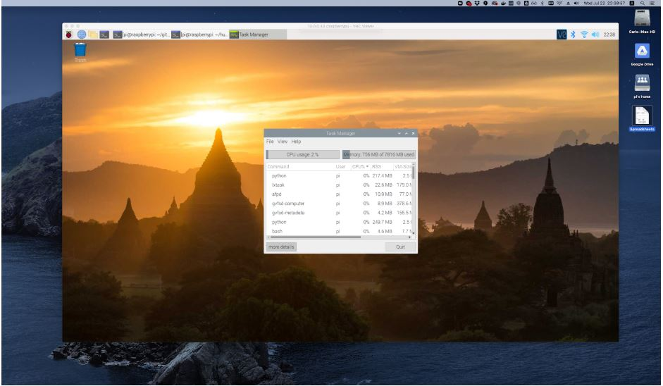
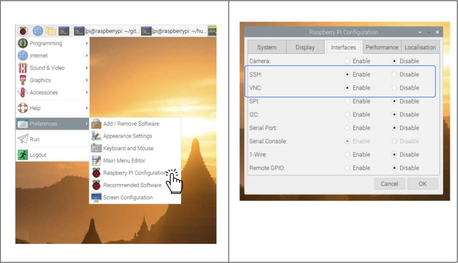

# Deploying Hummingbot on a Raspberry Pi


*Firstly, we owe much of this blog post's content to one of our community members, @Punkhead, on our Discord. He experimented with running Hummingbot on a Raspberry Pi and achieved success! He also shared his experience in a Reddit post: [Hummingbot on RPI4, how-to](https://www.reddit.com/r/Hummingbot/comments/h83lhv/hummingbot_on_rpi4_howto/).*

<!-- more -->

### Why Run Hummingbot on a Raspberry Pi?

While we generally recommend deploying Hummingbot on a cloud server for long-term usage, running it on a Raspberry Pi presents a compelling alternative. Cloud servers are ideal for 24/7 operation in a market that never sleeps. They offer dedicated resources and reduced risks of system crashes. However, they come with monthly costs and might not be ideal for everyone.

Running Hummingbot on a Raspberry Pi offers similar benefits to a cloud server, such as having a dedicated machine. Raspberry Pis are cost-effective, easy to set up, energy-efficient, and incur no recurring fees. These devices can reliably run multiple Hummingbot instances. Of course, if you have an unreliable internet connection or power supply, a cloud server might still be preferable.

### Required Equipment


Building a Raspberry Pi requires:

- **Raspberry Pi Board**: We used a Raspberry Pi 4 with 8 GB RAM for testing.
- **SD Card**: Acts as the data store for the Raspberry Pi. A reader/USB adapter is needed if the SD card isn't preloaded with an OS.
- **USB-C Power Supply**
- **Mini-HDMI Display Cable**: Necessary only for setup.
- **Case**: Optional, but recommended.

Purchasing components is straightforward on Amazon.com or through retailers listed on [Raspberry Pi’s website](https://www.raspberrypi.org/). While all-in-one kits are available, buying individual components allows for greater customization.


### System Requirements

Our tests showed that each Hummingbot instance requires approximately 200 MB of RAM and 600-650 MB of hard drive space. Thus, even Raspberry Pis with less than 8 GB RAM are suitable. Punkhead successfully runs 17 instances on his Raspberry Pi!

The most resource-intensive part is compiling from source, which utilizes 100% CPU for a few minutes during installation or updates.

### Installing Hummingbot

Currently, Hummingbot installation on a Raspberry Pi is only possible by compiling from source. Although this process is more complex than using binaries or Docker, the following guide will assist you.

### Preparing the Raspberry Pi for Installation

#### Step 1: Install 64-bit Raspberry Pi OS

A 64-bit OS is required to run Hummingbot. Raspberry Pi offers a beta 64-bit version of their OS, available for download [here](https://www.raspberrypi.org/forums/viewtopic.php?t=275370).

#### Step 2: Load the Image File to Your SD Card

Follow Raspberry Pi's [installation guide](https://www.raspberrypi.org/documentation/installation/installing-images/) for detailed instructions. For Mac OS users, [this guide](https://www.raspberrypi.org/documentation/installation/installing-images/mac.md) explains how to load the OS using the `diskutil` command line tool.

#### Step 3: Boot Your Raspberry Pi

Insert the SD card and connect the power source to boot. Follow the prompts for initial setup.

#### Install Hummingbot Dependencies

##### Step 1: Open the Terminal

Access the terminal via the shortcut in the top left corner of the desktop.

##### Step 2: Install from Source

Update the repository and install important dependencies:
```
sudo apt update
sudo apt upgrade -y
sudo apt-get install build-essential libssl-dev libffi-dev gcc python3-dev python-dev python3.7 -y
```

Install Miniforge:
```
wget https://github.com/conda-forge/miniforge/releases/download/4.11.0-4/Miniforge3-4.11.0-4-Linux-aarch64.sh
sh Miniforge3-4.11.0-4-Linux-aarch64.sh
```

Restart the terminal:
```
exec bash
```

Install `conda-build`:
```
conda install conda-build
```

Clone the Hummingbot repository:
```
git clone https://github.com/hummingbot/hummingbot.git
```

!!! note
    If you need to switch branches (ie. `development` branch) then after cloning the repository use the command `git checkout [branch_name]` to switch branches. For example, to switch to the development branch use `git checkout development`

Change directory into the Hummingbot folder:
```
cd hummingbot
```

Run the `install` command:
```
./install
```

Activate the `conda` environment:
```
conda activate hummingbot
```

Clean your Hummingbot directory and then compile:

```
./clean && ./compile
```

Launch Hummingbot:

```
./start
```

And that’s it! Hummingbot should be up and running.

### Running Multiple Bots



To run multiple bots, clone the Hummingbot repository into separate folders and compile each instance independently.

**Running Multiple bot with tmux**

Tmux, a terminal multiplexer, allows the management of multiple Hummingbot instances from a single installation. Learn more about Tmux [here](https://linuxize.com/post/getting-started-with-tmux/)

### Remote Control with VNC Viewer

The Raspberry Pi supports SSH and VNC, allowing remote control from other devices.



**Step 1. Enable SSH and VNC on your Raspberry Pi**

**Option 1: Terminal using `raspi-config`**

```bash
sudo raspi-config
```

Under Interfacing Options, enable SSH and VNC.

**Option 2: Access in Raspberry Pi Configuration**

Select the menu in the top left corner of the screen then go to **Preferences** > **Raspberry Pi configuration** > **Interfaces** from there you will see options to enable SSH and VNC.



**Step 2. Get your Raspberry Pi’s private IP address**

Use`ifconfig` to find the IP address for VNC Viewer. For SSH, use `ssh pi@[ipaddress]`. The IP address is listed under `inet`, excluding localhost (127.0.0.1):


