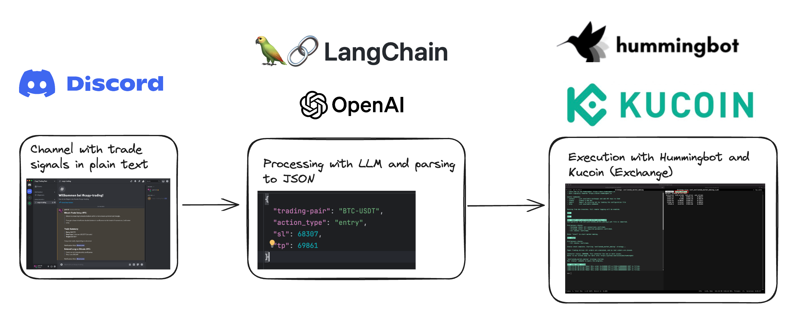
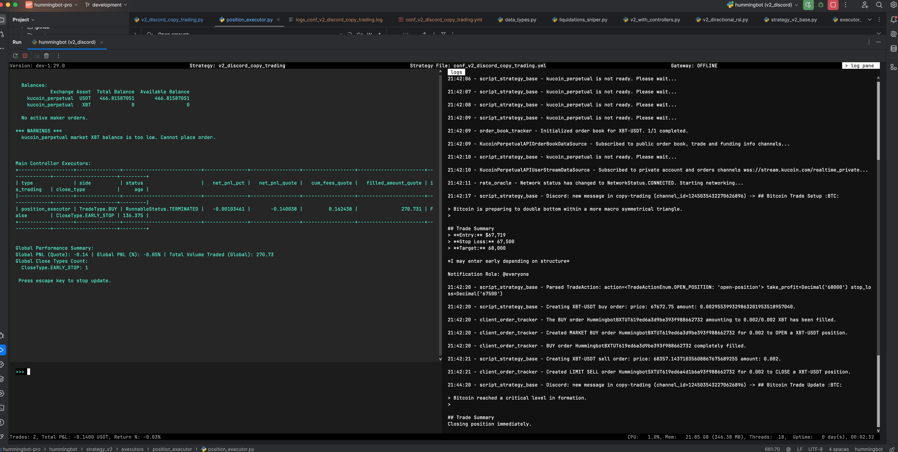
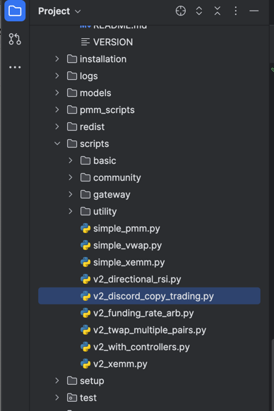
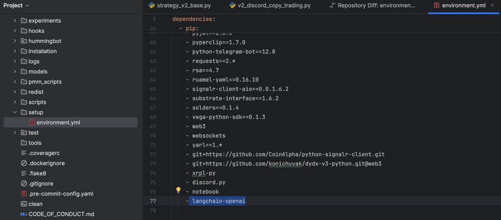

# Leveraging AI for Automated Copy-Trading on Discord

*by Patrick Meier*

In my previous article, [AI in Action: How LLMs Are Shaping Finance, Trading, and Software](https://www.linkedin.com/pulse/ai-action-how-llms-shaping-finance-trading-software-patrick-meier-eipae), I promised to explore a few ideas together with you. 

Today, I'm excited to share a detailed look at one of those ideas: using AI to automate copy-trading based on signals from Discord channels. 

I'm honored and excited to have the opportunity to share this strategy with the Hummingbot Community here on the Academy.

## Introduction

The integration of AI into trading strategies has opened up new possibilities for automation and efficiency. One particularly promising application is the automation of copy-trading based on messages from Discord channels. 

Many trading groups on Discord have skilled traders whose signals can be highly profitable. However, manually acting on these signals is time-consuming and prone to errors. By leveraging AI, we can transform unstructured messages into actionable data, automating the entire process.

## The Strategy

I have developed a working strategy that utilizes AI to parse trading signals from Discord and execute trades on KuCoin using Hummingbot. 



Here’s a step-by-step breakdown of how it works:

## 1. Receiving a Trading Message

The process begins with receiving an unstructured trading message from a Discord channel. The challenge here is that the message can be anything, even unrelated to trading, so we need to make the system resilient to those events. 

For example, consider the following message:

------
## Bitcoin Trade Setup :BTC:

> Bitcoin is preparing to double bottom within a more macro symmetrical triangle.
> 

## Trade Summary
> **Entry:** $67,719
> **Stop Loss:** 67,500
> **Target:** 68,000

*I may enter early depending on structure*

Notification Role: @everyone

-------

## 2. Parsing the Message

Using Langchain and a well-crafted prompt, we convert the unstructured message into a structured JSON/Python format that can be processed further. 

Here’s an example of the code used for parsing:

```python
class TradeActionEnum(str, Enum):  
    OPEN_POSITION = 'open-position'  
    CLOSE_POSITION = 'close-position'  
    NO_ACTION = 'no-action'  
  
  
class TradeAction(BaseModel):  
    action: TradeActionEnum  
    take_profit: Decimal = Field(None, description="The take profit price")  
    stop_loss: Decimal = Field(None, description="The stop loss price")
```

And this is the prompt used to make sure we parse only relevant messages and ignore others: 

```
You help me to act on specific trade signals that I present you with as discord messages. I have a programmatic subscription to a discord trading channel, where an elite trader posts his trades when he enters and exits. The goal is to copy trade those signals. You act as intermediary to make that messages actionable for me in a valid JSON structure.   

IMPORTANT: there are messages for other pairs, but you care only about {trading_pair} Trades. You can however extrapolate "BTC-USDT" to also work if just "Bitcoin" is meant in the message, but not for example "Cardano". Also there are messages like adjusting stop-loss or informational ones (like videos). You ignore those and only care about entering and probably exiting positions. Whenever you receive an action that is not actionable you return "no-action" as recommendation, so I know I have nothing to do. Also if there are multiple take profits or trailing stops ignore it as well as I cannot handle that at the moment. Only have simple trades for me.  
  
{format_instructions}  
  
Here is the message: {message}
```

## 3. Executing the Trade

Once the message is parsed, we execute the trade on KuCoin. This method can be adapted for any exchange supported by Hummingbot, making it highly versatile.

## Demo and Source Code

Here you can see a demo of the running strategy that is connected with a test-channel on Discord where I copied some real trading-messages from other groups to test it.



### Full Strategy Code

```python
import asyncio
import os
import time
from decimal import Decimal
from enum import Enum
from typing import Dict, List

import discord
from langchain_core.output_parsers import PydanticOutputParser
from langchain_core.prompts import PromptTemplate
from langchain_openai import ChatOpenAI
from pydantic import BaseModel, Field, validator

from hummingbot.client.config.config_data_types import ClientFieldData
from hummingbot.connector.connector_base import ConnectorBase
from hummingbot.core.data_type.common import OrderType, PositionMode, PriceType, TradeType
from hummingbot.data_feed.candles_feed.candles_factory import CandlesConfig
from hummingbot.strategy.strategy_v2_base import StrategyV2Base, StrategyV2ConfigBase
from hummingbot.strategy_v2.executors.position_executor.data_types import PositionExecutorConfig, TripleBarrierConfig
from hummingbot.strategy_v2.models.executor_actions import CreateExecutorAction, StopExecutorAction


class TradeActionEnum(str, Enum):
    OPEN_POSITION = 'open-position'
    CLOSE_POSITION = 'close-position'
    NO_ACTION = 'no-action'


class TradeAction(BaseModel):
    action: TradeActionEnum
    take_profit: Decimal = Field(None, description="The take profit price")
    stop_loss: Decimal = Field(None, description="The stop loss price")


class DiscordCopyTradingConfig(StrategyV2ConfigBase):
    # override default values
    markets: Dict[str, List[str]] = {}
    controllers_config: List[str] = []
    candles_config: List[CandlesConfig] = []

    exchange: str = Field(
        default="kucoin_perpetual",
        client_data=ClientFieldData(
            prompt_on_new=True,
            prompt=lambda mi: "Exchange where the bot will trade"
        ))

    trading_pair: str = Field(
        default="XBT-USDT",
        client_data=ClientFieldData(
            prompt_on_new=True,
            prompt=lambda mi: "Trading pair where the bot will trade"
        ))

    leverage: int = Field(
        default=5,
        gt=0,
        client_data=ClientFieldData(
            prompt_on_new=True,
            prompt=lambda mi: "Leverage (e.g. 5 for 5x)"
        ))

    position_mode: PositionMode = Field(
        default="ONEWAY",
        client_data=ClientFieldData(
            prompt_on_new=True,
            prompt=lambda mi: "Position mode (HEDGE/ONEWAY)"
        ))

    open_ai_token: str = Field(
        default=os.getenv("OPEN_AI_TOKEN"),
        client_data=ClientFieldData(
            prompt_on_new=False,
            prompt=lambda mi: "Open-AI token (used by LangChain) to parse the messages"
        )
    )

    discord_bot_token: str = Field(
        default=os.getenv("DISCORD_BOT_TOKEN"),
        client_data=ClientFieldData(
            prompt_on_new=False,
            prompt=lambda mi: "Discord bot token used to listen to the messages"
        )
    )

    discord_channel_id: int = Field(
        default=0,
        client_data=ClientFieldData(
            prompt_on_new=True,
            prompt=lambda mi: "Discord channel ID to monitor for copy trades"
        )
    )

    order_amount_quote: Decimal = Field(
        default=100,
        gt=0,
        client_data=ClientFieldData(
            prompt_on_new=True,
            prompt=lambda mi: "Order amount per Trade in quote asset"
        )
    )

    @validator('position_mode', pre=True, allow_reuse=True)
    def validate_position_mode(cls, v: str) -> PositionMode:
        if v.upper() in PositionMode.__members__:
            return PositionMode[v.upper()]
        raise ValueError(f"Invalid position mode: {v}. Valid options are: {', '.join(PositionMode.__members__)}")


class DiscordCopyTrading(StrategyV2Base):

    @classmethod
    def init_markets(cls, config: DiscordCopyTradingConfig):
        cls.markets = {config.exchange: {config.trading_pair}}

    def __init__(self, connectors: Dict[str, ConnectorBase], config: DiscordCopyTradingConfig):
        super().__init__(connectors, config)
        self.config = config
        self.init_discord_client()
        self.init_langchain()
        self.trading_actions = []

    def init_discord_client(self):
        # Configure Discord-Client
        intents = discord.Intents.default()
        intents.message_content = True
        self.discord_client = discord.Client(intents=intents)

        # Register event handlers
        self.discord_client.event(self.on_ready)
        self.discord_client.event(self.on_message)

        # Start the discord client
        self.discord_client_task = asyncio.create_task(self.discord_client.start(self.config.discord_bot_token))

    def init_langchain(self):
        llm = ChatOpenAI(model="gpt-4o",
                         temperature=0,
                         max_retries=1,
                         api_key=self.config.open_ai_token)

        output_parser = PydanticOutputParser(pydantic_object=TradeAction)

        prompt_template = """
           You help me to act on specific trade signals that I present you with as discord messages. I have a programmatic subscription to 
           a discord trading channel, where an elite trader posts his trades when he enters and exits. The goal is to copy trade those signals. 
           You act as intermediary to make that messages actionable for me in a valid JSON structure. 

           IMPORTANT: there are messages for other pairs, but you care only about {trading_pair} Trades. You can however extrapolate "BTC-USDT" to 
           also work if just "Bitcoin" is meant in the message, but not for example "Cardano". Also there are messages like adjusting stop-loss or 
           informational ones (like videos). You ignore those and only care about entering and probably exiting positions. Whenever you receive an 
           action that is not actionable you return "no-action" as recommendation, so I know I have nothing to do. Also if there are multiple take 
           profits or trailing stops ignore it as well as I cannot handle that at the moment. Only have simple trades for me.

           {format_instructions}

           Here is the message: {message}
           """

        prompt = PromptTemplate(
            template=prompt_template,
            input_variables=["message", "trading_pair"],
            partial_variables={"format_instructions": output_parser.get_format_instructions()},
        )

        self.chain = prompt | llm | output_parser

    async def on_ready(self):
        self.logger().info(f'Logged in as {self.discord_client.user}')

    async def on_message(self, message):
        if message.channel.id == self.config.discord_channel_id:
            self.logger().info(f'Discord: new message in {message.channel.name} (channel_id={message.channel.id}) -> {message.content}')

            try:
                trade_action = self.chain.invoke({"message": message.content, "trading_pair": self.config.trading_pair})

                self.logger().info(f"Parsed TradeAction: {trade_action}")

                # Add to the queue to be processed
                if trade_action is not None and trade_action.action != TradeActionEnum.NO_ACTION:
                    self.trading_actions.append(trade_action)

            except Exception:
                self.logger().error("Error while handling message from Discord!", exc_info=True)

        else:
            self.logger().info(f'Discord: ignored message in {message.channel.name} (channel_id={message.channel.id})')

    def create_actions_proposal(self) -> List[CreateExecutorAction]:

        create_actions = []

        mid_price = self.market_data_provider.get_price_by_type(self.config.exchange,
                                                                self.config.trading_pair,
                                                                PriceType.MidPrice)

        # if there are actions waiting to be processed
        if len(self.trading_actions) > 0:
            for trade_action in self.trading_actions:
                if trade_action.action == TradeActionEnum.OPEN_POSITION:

                    # Calculating the stop_loss percentage and take_profit percentage as PositionExecutor only supports percentage-values and not
                    # fixed prices
                    stop_loss_percentage = (trade_action.stop_loss / mid_price) / 100
                    take_profit_percentage = (trade_action.take_profit / mid_price) / 100

                    triple_barrier_config = TripleBarrierConfig(
                        stop_loss=stop_loss_percentage,
                        take_profit=take_profit_percentage,
                        open_order_type=OrderType.MARKET,
                        take_profit_order_type=OrderType.LIMIT,
                        stop_loss_order_type=OrderType.MARKET,
                    )

                    if trade_action.take_profit > mid_price:
                        # Long position
                        create_actions.append(CreateExecutorAction(
                            executor_config=PositionExecutorConfig(
                                timestamp=time.time(),
                                connector_name=self.config.exchange,
                                trading_pair=self.config.trading_pair,
                                side=TradeType.BUY,
                                entry_price=mid_price,
                                amount=self.config.order_amount_quote / mid_price,
                                triple_barrier_config=triple_barrier_config,
                                leverage=self.config.leverage
                            )))
                    elif trade_action.take_profit < mid_price:
                        # Short position
                        create_actions.append(CreateExecutorAction(
                            executor_config=PositionExecutorConfig(
                                timestamp=time.time(),
                                connector_name=self.config.exchange,
                                trading_pair=self.config.trading_pair,
                                side=TradeType.SELL,
                                entry_price=mid_price,
                                amount=self.config.order_amount_quote / mid_price,
                                triple_barrier_config=triple_barrier_config,
                                leverage=self.config.leverage
                            )))

                    # Remove the current action from the list
                    self.trading_actions.remove(trade_action)

        return create_actions

    def stop_actions_proposal(self) -> List[StopExecutorAction]:
        stop_actions = []

        if len(self.trading_actions) > 0:
            for trade_action in self.trading_actions:
                if trade_action.action == TradeActionEnum.CLOSE_POSITION:
                    active_executors = self.get_active_executors(self.config.exchange,
                                                                 self.config.trading_pair)

                    stop_actions.extend([StopExecutorAction(executor_id=e.id) for e in active_executors])

                    # Remove the current action from the list
                    self.trading_actions.remove(trade_action)

        return stop_actions

    def get_active_executors(self, connector_name: str, trading_pair: str):
        return self.filter_executors(
            executors=self.get_all_executors(),
            filter_func=lambda executor: executor.connector_name == connector_name and executor.trading_pair == trading_pair and executor.is_active
        )

    def on_stop(self):
        self.discord_client_task.cancel()

    def apply_initial_setting(self):
        connectors_position_mode = {}
        for controller_id, controller in self.controllers.items():
            config_dict = controller.config.dict()
            if "connector_name" in config_dict:
                if self.is_perpetual(config_dict["connector_name"]):
                    if "position_mode" in config_dict:
                        connectors_position_mode[config_dict["connector_name"]] = config_dict["position_mode"]
                    if "leverage" in config_dict:
                        self.connectors[config_dict["connector_name"]].set_leverage(leverage=config_dict["leverage"],
                                                                                    trading_pair=config_dict["trading_pair"])
        for connector_name, position_mode in connectors_position_mode.items():
            self.connectors[connector_name].set_position_mode(position_mode)
```

### Running it yourself

To run it yourself you need to follow a few steps...

**1 - Add the source code to the `scripts` folder**



**2 - Add `langchain-openai` as dependency**



**3 - Configure and run the strategy in Hummingbot CLI**

### Conclusion

The integration of AI into trading strategies can really be a game-changer. In this example we have seen how easy GenAI can be integrated with your trading bots. 

Of course this code is only a starting point and can be expanded much further. 

I hope you enjoyed it and stay tuned for the next article.