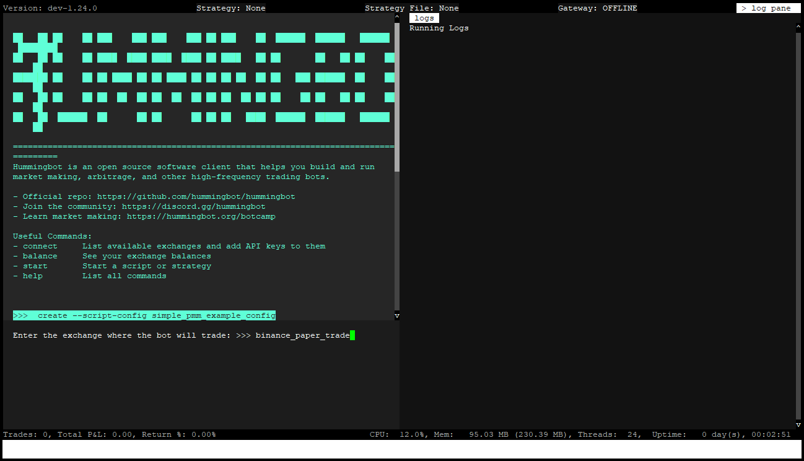
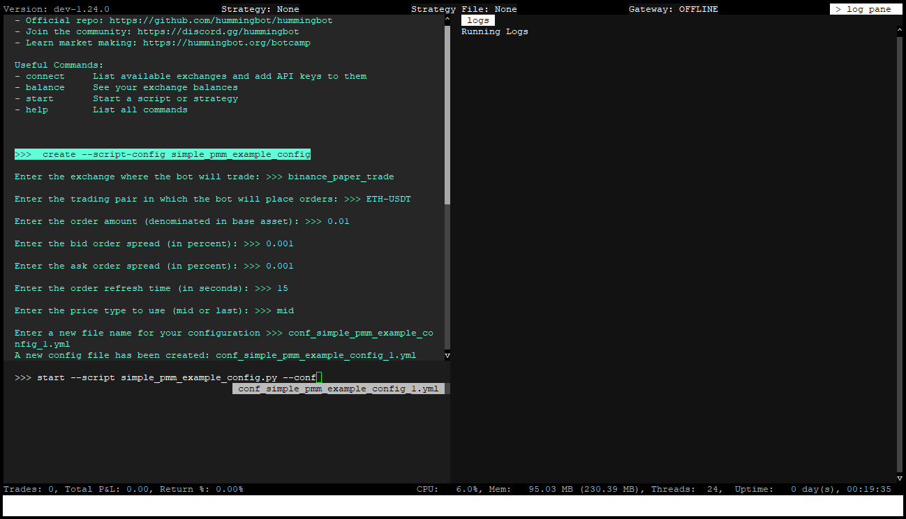
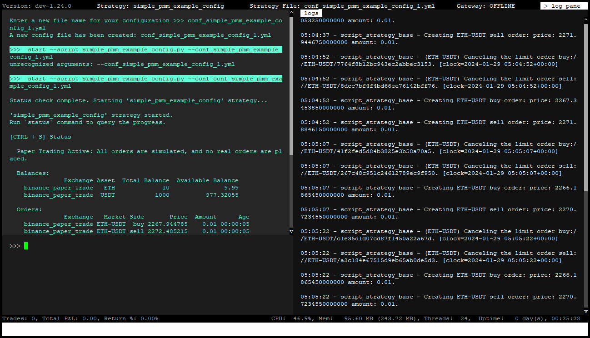

# Docker Installation Guide - 3 - Running a Script

## Simple Directional RSI Example

Let's use the `v2_directional_rsi.py` script. This is a configurable script that uses the Relative Strength Index (RSI) to trade cryptocurrency futures contracts. For configurable scripts, the first step is to create a config file. Here's how to create one:

```
create --script-config v2_directional_rsi.py

```

When you use the `create --script-config` and press <kbd>SPACE</kbd> Hummingbot will display available scripts in the scripts folder, as shown below.

[](create-script-config.png)

If you don't see any scripts under the `/scripts` folder, run these commands in the terminal to make them appear: 

```bash
sudo chmod -R a+rw ./hummingbot_files
docker cp hummingbot:/home/hummingbot/scripts-copy/. ./hummingbot_files/scripts/
```

Select the `v2_directional_rsi.py` script and press <kbd>ENTER</kbd>. 

[](config-script.png)

You will then be guided to configure the settings. At this stage, you may modify the options or simply hit <kbd>ENTER</kbd> to accept the default values. After finalizing the configuration, name the config file and press <kbd>ENTER</kbd> to save it.

[](save-config.png)


Once the config is saved we can now launch the script. Enter the command below to launch the script!

```
start --script v2_directional_rsi.py --conf conf_v2_directional_rsi_config_1.yml
```

Note that the autocomplete will popup after pressing <kbd>SPACE</kbd> after both the `--script` and `--conf` parameters so you can just select the correct script / config file from the list and then press <kbd>ENTER</kbd>

[](load-config-script.png)

After pressing <kbd>ENTER</kbd> you should be able to see activity in the log pane. Use the `status` command for more details or press <kbd>CTRL</kbd> + <kbd>S</kbd>. It should resemble the screen below.

```
status
```


[](script-status.png)

To stop the script from running, type the `stop` command in the Hummingbot terminal

```
stop
```

Congratulations! You've successfully run your first scripts Next, we'll learn how to connect API keys for live trading.

[Connecting your API Keys](4-api-keys.md){ .md-button .md-button--primary }
