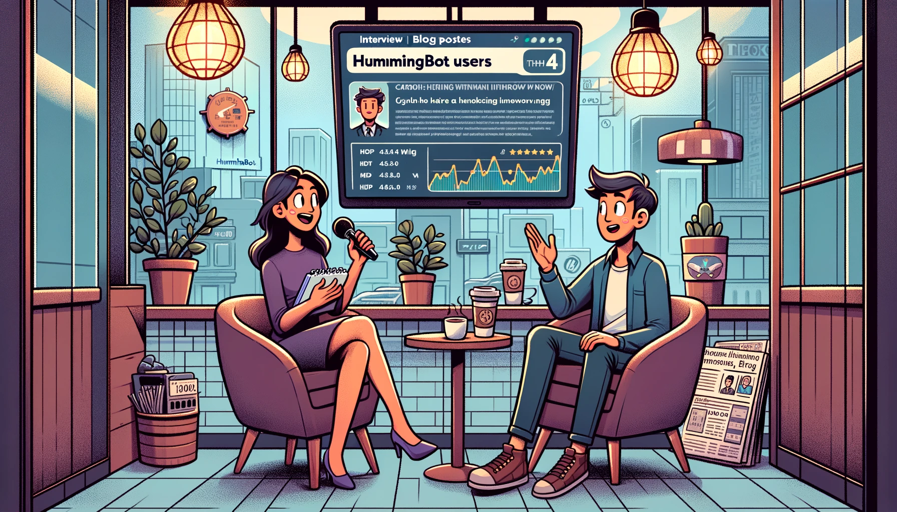
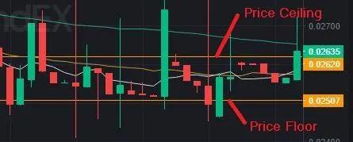
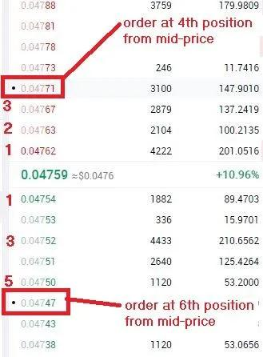

# Favorite Hummingbot Parameters from Trader Jazzy

*By Jazzy Obmaz*

Hey guys, Jazzy here. I am officially helping my sister, [Dalskie](../capital-deployment-with-hummingbot/index.md), operate the Hummingbot bots.

I'm not yet well-versed in crypto & trading, but I find it an intriguing and unbelievable world to live in. I am thrilled to have realized my long-time dream of working from home and being my own boss, so to speak. What a wonderful, life-changing opportunity this is for my family, especially financially. A huge thank you to Hummingbot!

Regarding our bot strategy, we are using the **Pure Market Making (PMM) Strategy**.

Okay, a reminder: this post is NOT financial advice, and any user following it will be solely responsible for his/her own results. Please don't blame me for any future losses you may experience. It's not because of me, Hummingbot, or the strategy; it's due to people panic selling. Period.

So, why the PMM strategy? Well, it works and it's simple. I have learned to use it even without a nerdy background. It's not that I am super smart or anything; it's thanks to the software or strategy itself. And of course, thanks to Dalskie.

I am now about to share the favorite parameters that I set for all bots. Roll up your sleeves, guys; let's get officially started.

<!-- more -->

First, I highly recommend using the **price_ceiling** and **price_floor** parameters for all bots, no exception. I usually set them at **3-5%** from the mid-price. You can use this Excel file for easier calculations. These parameters are extremely important so bots will not be tricked into buying at a high price and then selling at a low price. You know, those candle wicks. They won't be scary anymore. Yes, this is extra work, but it's extra money saved, well worth it if you ask me. Alternatively, you can use the price band script. I don't know how. You can ask the community via Discord; I heard you've got kind members and support always willing to help.

Second, I recommend making the **filled_order_delay** a bit longer. I usually set it at **180-360 seconds**. We have tested as short as 3-5 seconds, but it's extremely dangerous as other bots can rinse and repeat unprofitable trades every 3-5 seconds, resulting in our capital losses. So, making those bots wait longer for our new orders will make them forget about us, apparently.

Third, set **Kill_switch_enabled** to **True** and set **Kill_switch_rate** to your comfortable minimum value. I usually set it to **-2 to -3**. When this is triggered, I need to check the chart to see if the candle currently has a long red body. If yes, I adjust the order_amount to $20-$40. If no, I just stop & restart the bot. The kill switch is always good to set to prevent or limit big losses due to abnormal bot trading activities, which are very rare but always possible.

Fourth, set **order_refresh_time** and **max_order_age** to a longer value. I usually set these to **65 to 125 seconds**. We have tested as low as 3-5 seconds, and have missed a lot of liquidity mining rewards, and have been banned/rate-limited by exchanges. These are not worth it, guys. Moreover, low values do not guarantee that your orders will not be filled when the market moves. It's a slim chance, second to winning the lottery, maybe. I don't know.

Fifth, set a **balance limit** for both USDT and Token for all bots, no exception. I usually give a **$20-$30 allowance** for the balance limit. You can use this **excel file** for easier calculation and faster copy-paste into the bot terminal. It works for USDT pairs only, and you'll need to adjust ROUND values for decimal output. I'm sure you can figure that out. You can even make it better. Please share back to the community later. The balance limit prevents the accumulation of tokens to an undesired dollar amount, helping you control inventory. Extremely important.

Sixth, set **ask_spread** and **bid_spread** at the 4th to 6th position from the mid-price. Exact values vary; some pairs will have **0.05 or 0.50 or 0.80**. So, set it accordingly on a pair-to-pair basis. Please guys, don't be too greedy to be in the 1st to 3rd position. I've been there, done that; it's not always a good outcome. Remember the bad bots out there. So, spare yourself from becoming their victim.

Seventh, set the **order_amount to the same range** at the 3rd to 6th position from the mid-price. I usually set it at **$60-$100** for the initial start of the bots, **$20-$40** for a red market, and gradually increase it up to **$200-300** max for a green market. If you place a large amount, your order becomes like a strong magnet that can be filled by other bots frequently. If you want a large amount, it's better to increase your ask & bid spreads accordingly.

I am surprised to have the lucky number 7 above. There is an eighth item, about using scripts, but it's out of my experience to explain it here. Maybe next time. I was told the script is just basic stuff and has minimal impact yet, unlike the ones I shared above, which are extremely important, once again reminding you.

I have to insert this another extremely important concept. I have given ranges of values for different parameters above; these are the actual values that we are using. This also means that we do not have template parameters for all bots. Each pair is treated individually and respectfully to warrant a unique set of parameters. No, guys, don't copy & paste. Try your best to understand the parameters and the pairs; then you too will succeed. Lastly, parameters are not set-and-forget things. You need to keep adjusting based on chart movements. I usually change spreads and order amounts throughout the day or whenever the chart becomes volatile.

Putting experiences into words is no easy task. Please pardon any language and grammar issues. I have re-read and changed many times. I did my best. I hope it's clear and useful, especially for beginners, as I made it as practical as possible. Thank you for reading!

