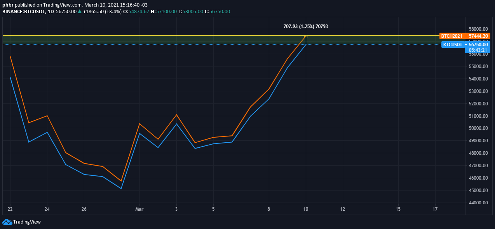

# Guide to the Spot-Perpetual Arbitrage Strategy


Welcome back to the Hummingbot Academy!

Each Hummingbot release brings exciting new features, and version 0.37 is no exception.

This version introduces two significant enhancements to our favorite algorithmic trading robot:

*   Perpetual Protocol connector: a new decentralized AMM protocol for derivatives markets operating on Ethereum's layer 2 xDai.
*   Spot-perpetual markets arbitrage strategy: an innovative strategy enabling traders to capitalize on price discrepancies between these market types.

In this article, we'll delve into the new spot-perpetual arbitrage strategy, elucidate its logic, and discuss identifying lucrative trading opportunities.

<!-- more -->

## What Exactly is a Futures Market?

Spot markets are straightforward: set a price to buy or sell an asset, and upon transaction, buyers and sellers finalize the exchange.

Futures markets differ slightly: instead of trading the actual asset, participants engage in a contractual agreement to deliver the underlying asset on a specified future date.

While future contracts are primarily used by traders to speculate on price movements, leveraging high leverage possibilities, they serve a more practical purpose: enabling commodities production chain participants (producers, exporters, miners, etc.) to mitigate price fluctuation risks.

For instance, a rice farmer beginning his season's cultivation (rice takes about 130 days to harvest) might sell a future rice contract at the current price to safeguard against uncertain future prices.


_Rice plantation at Itigi, Tanzania. Source: [Wikimedia commons](https://commons.wikimedia.org/wiki/File:Rice_at_plantation_at_Itigi_Tanzania.jpg)_

If the market price drops, he secures his profit margin and averts loss. Conversely, a price increase would mean a missed opportunity for higher profits, but his initial risk is mitigated.

On the trade's flip side, a food processing company might seek to lock in today's raw material costs for its post-harvest manufacturing.

## Contract Expiration Dates

Futures contracts are traded independently of the underlying asset's spot price. Their market price reflects future asset price expectations: a higher future price suggests an anticipated asset price increase.

Typically, every futures contract has an expiration date. As this date approaches, the disparity between the futures contract price and the spot market price of the underlying asset narrows, often to zero.

This convergence is evident when comparing their price trends over time. For example, observe the price gap between the BTCUSDT spot market (blue line) and the Bitcoin futures contract expiring on 03-26 (orange line):


**2.49% difference on the first day of trading.**


**1.25% difference 15 days before the expiration date.**

As [Investopedia.com](https://www.investopedia.com/terms/c/convergence.asp#:~:text=What%20Is%20Convergence%3F,as%20the%20delivery%20date%20approaches.&text=The%20two%20prices%20must%20converge,for%20a%20risk%2Dfree%20profit.) explains, convergence occurs because the market won't allow a commodity to have two distinctly different prices simultaneously. For example, two gas stations on the same block rarely display significantly different prices, as drivers will naturally gravitate toward the cheaper option.

## Perpetual Contracts: Futures Markets Without an Expiration Date

The concept of perpetual future contracts, proposed in 1992 by economist [Robert Shiller](https://en.wikipedia.org/wiki/Robert_J._Shiller), wasn't realized until 2016 with BitMEX's Bitcoin perpetual futures.

One might ask, "How can price convergence occur without an expiration date?"

This is where funding rate payments come into play. Typically, these payments occur every eight hours (though timing can vary by exchange, with Perpetual protocol using a one-hour interval), where traders pay each other based on their open positions at the time.

You can explore [this detailed article on funding rates](https://medium.com/derivadex/what-is-the-funding-rate-for-perpetual-swaps-a0335c4228a9) for more information. Briefly, the funding rate's direction indicates the difference between spot and perpetual prices:


```
if perpetual price > spot price => funding_rate is positive
if perpetual price < spot price => funding_rate is negative
```


Additionally:

*   Positive funding rates entail long traders paying short traders.
*   Negative rates mean short traders pay long traders.

The anticipated outcome is that leverage-induced liquidations will align the perpetual market price more closely with the spot market price.

## Identifying Arbitrage Opportunities

The essence of arbitrage lies in price convergence.

As discussed earlier, futures and spot market prices invariably tend toward parity over time.

Consider this simple arbitrage scenario (excluding fees):

On day 1, prices are as follows:

**BTC perpetual price: $51,000**

**BTC spot price: $50,000**

Arbitrage commences by shorting on the perpetual market and buying the equivalent BTC amount on the spot market. Assume an order size of 1 BTC.

On day 2, as prices converge:

**BTC perpetual price: $52,000**

**BTC spot price: $52,000**

The arbitrage is closed, and the operation's results are:

Perpetual outcome: **- $1,000**

Spot outcome: **+ $2,000**

**Net profit: + $1,000**

While seemingly straightforward, several risks must be considered.

## Potential Risks

Although generally low-risk, this strategy is not without hazards:

Note: We focus solely on spot-perpetual arbitrage risks applicable to Hummingbot usage. Traditional futures contracts carry their distinct arbitrage risks.

**Liquidation:** Leveraged trading in future markets carries a liquidation risk if price convergence is delayed. Use leverage judiciously.

**Execution:** Opportunity detection and execution have a time gap. Delays can result in missed opportunities or unfavorable execution prices.

**Liquidity:** Low liquidity markets can suffer from price impacts due to thin order books, especially with large orders or in the presence of numerous high-frequency bots, leading to "fake liquidity."

## Starting Arbitrage with Hummingbot

Version 0.37 introduces the `spot_perpetual_arbitrage` strategy, configurable via the `create` command.


The configuration process involves:

- Selecting a spot connector.
- Choosing the trading pair for the spot market.
- Opting for a perpetual exchange.
- Picking the trading pair for the perpetual market.
- Setting the BTC order size.
- Determining leverage for the derivative exchange.
- Specifying the minimum spread for initiating and closing arbitrage.
- Deciding on funding rate utilization.
- Adding a slippage buffer for market orders.
- Naming your strategy configuration file.

After configuration, simply enter `start` and monitor the bot for arbitrage opportunities!

## Join Our Community

Our community, comprising market makers and arbitrageurs, actively supports each other in maximizing Hummingbot's potential. Join our [Discord channel](https://discord.com/invite/hummingbot) for discussions on Hummingbot, strategies, liquidity mining, and more. Our team provides direct support here.

Stay informed about updates by following us on [Twitter](https://twitter.com/hummingbot_io) and joining our [Reddit Community](https://www.reddit.com/r/Hummingbot/).

Explore market making and related topics through interviews with professional traders and cryptocurrency event news on our [Youtube Channel](https://www.youtube.com/channel/UCxzzdEnDRbylLMWmaMjywOA?sub_confirmation=1).
