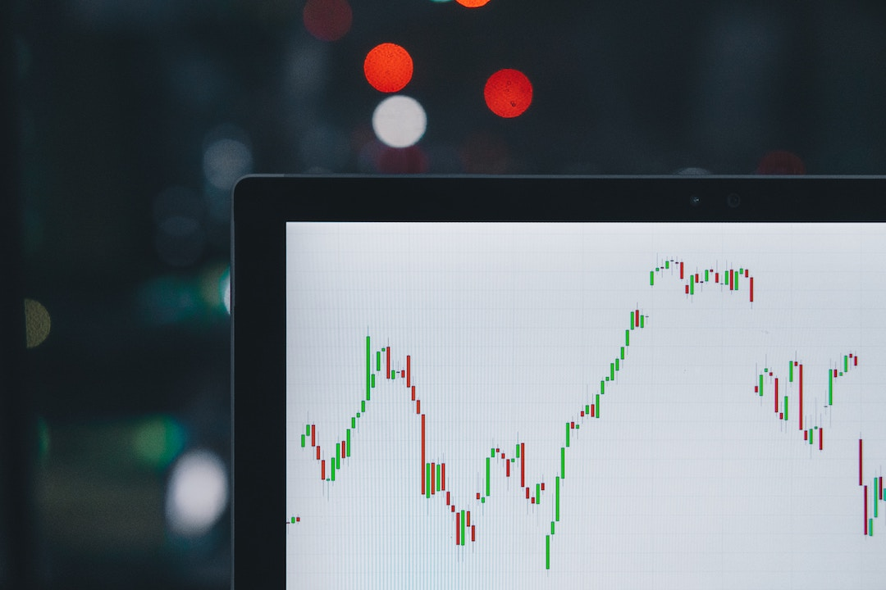

# Managing Your Bot's Performance


Tracking your cryptocurrency trading profits and losses (P&L) is essential for evaluating the effectiveness of your trading strategies, investment decisions, and portfolio management approach. In traditional financial markets, calculating P&L is straightforward, thanks to established conventions and regulations. However, in the cryptocurrency realm, this task becomes more complex due to:

1. Market fragmentation: Crypto traders often have assets across multiple exchanges and wallets.
2. Varied asset pricing conventions (e.g., some assets are priced against Bitcoin or Ethereum).
3. Non-standardized accounting methodologies.

This post will address these challenges and offer tips for determining the profitability of your crypto trading strategies.

## TLDR

Hummingbot calculates profitability by comparing the portfolio value of the starting balance and the current balance, based on the **current exchange rate**.


<!-- more -->

## Summary

- [Which asset should be used to benchmark your profit or loss - fiat, Ether, or Bitcoin?](#which-asset)
- [How does Hummingbot measure performance?](#how-measure)
- [Other considerations](#considerations) 

### Which Asset Should Be Used to Benchmark Your Profit or Loss - Fiat, Ether, or Bitcoin?

Stock and derivative traders in traditional finance often use fiat assets to measure their performance. However, in the cryptocurrency world, this is not as straightforward due to the lack of standardized best practices. One significant challenge in tracking P&L is the variety of currencies that can be used: fiat currencies, Bitcoin/Ether, or base/quote currencies. 


At first glance, measuring performance in terms of a fiat asset seems intuitive, but many exchanges do not support fiat currencies. Moreover, alternative stablecoins such as USDC, TUSD, USDT, and DAI can fluctuate against the USD. Additionally, price fluctuations between cryptocurrencies and fiat currencies make it challenging to accurately assess a portfolio management strategy within the cryptocurrency world.

Many traders use Bitcoin to gauge their portfolio performance. Given that Bitcoin is a common “entry point” into the cryptocurrency world, this choice is logical for traders assessing their overall portfolio management strategy. A similar rationale applies to using Ether, another common entry point into cryptocurrency trading.

For traders focusing on the performance of an individual trade or trading strategy, using the base/quote currency of a trading pair is most sensible. Fluctuations in the exchange rate between the trading pair currencies and Bitcoin/Ether/fiat currencies can obscure the success of a strategy or an individual trade. We discuss this in more detail [below](#dynamic).

> The formula noted above in the TL;DR section is applicable to portfolios using multiple trading strategies across various exchanges.

### How Does Hummingbot Measure Performance?

It's vital for users to know whether they are gaining or losing money while using Hummingbot. In version 0.9.0, we introduced a performance analysis feature in the ‘history’ command.

There are many factors that complicate performance analysis. Hummingbot currently supports three different trading strategies, and our performance analysis computation needed to be applicable to any strategy. Two of these strategies allow trading different pairs on different exchanges, requiring the feature to account for multiple balances across various platforms.


With constantly shifting token quantities, it's crucial to measure performance without the influence of fluctuating exchange rates. We explored several methods for measuring trade performance.

#### Example Calculations

Consider the following scenario:

* Trading on the ETH/BTC pair on Coinbase Pro. Starting with **50 ETH** and **1.0 BTC**, at an **initial price of 0.02** (1 ETH = 0.02 BTC).
* After some trades, holding **60 ETH** and **0.7 BTC**, with the **exchange rate increased to 0.025** (1 ETH = 0.025 BTC).

#### A Dynamic Model

The most intuitive way to calculate change in portfolio value is by computing the value at the start and end of trading. This **dynamic method** uses the exchange rate between base and quote assets to compute portfolio value.


Applying this to our example, the starting portfolio value (50 ETH and 1.0 BTC at an initial price of 0.02) is:


```
(50 ETH * 0.02) + 1.0 = 2.0 BTC 
```

At the end of the trading, we have 60 ETH and 0.7 BTC at a price of 0.025, so the total value of our portfolio now is 

```
(60 ETH * 0.025) + 0.7 = 2.2 BTC. 
```


However, if no trades were made, the portfolio would now be worth:


```
(50 ETH * 0.025) + 1.0 = 2.25 BTC
```

This is 0.05 BTC less than what our portfolio is currently worth. **That is, we actually would have made more money if we hadn’t made any trades.**

This example illustrates a key issue with interpreting profitability using a dynamic exchange rate: fluctuations in the exchange rate distort the perceived success of trading. 

---

#### The fixed alternative

The issues we faced using the dynamic method implied that we needed to interpret profitability with a **fixed exchange rate**. The next most logical method was to compute the starting and current portfolio values in terms of the exchange rate at the point in time at which the trading was started. 



Using this method, our starting portfolio would be worth: 

```
(50 ETH * 0.02) + 1.0 BTC = 2.0 BTC
```

Our current portfolio would be worth:

```
(60 ETH * 0.02) + 0.7 BTC = 1.9 BTC 
```

This approach provides a more accurate reflection of trading success, but doesn't consider market fluctuations in the exchange rate.

#### A Blended Consensus

To avoid the inaccuracies of the dynamic method and the limitations of the fixed method, we developed a **blended approach**. It uses the current exchange rate to compute both the implied starting portfolio value and the actual value of the current portfolio.


Applying this to our example, the starting portfolio is valued at:


```
(50 ETH * 0.025) + 1.0 BTC = 2.25 BTC
```

Out current portfolio would be worth:

```
(60 ETH * 0.025) + 0.7 BTC = 2.2 BTC
```

If the exchange rate further increases to 0.03 (1 ETH = 0.03 BTC), and the portfolio changes to 70 ETH and 0.6 BTC, the values are:

Starting portfolio:


```
(50 ETH * 0.03) + 1.0 BTC = 2.5 BTC
```

Our current portfolio would be worth:

```
(70 ETH * 0.03) + 0.6 BTC = 2.7 BTC
```

This system avoids the pitfalls of the dynamic exchange rate while accounting for market fluctuations.

**Hummingbot uses this method to compute profits and losses.** 

The final calculation is a division of the current portfolio value by the starting portfolio value, both in terms of the current exchange rate. This yields a percentage indicating the profitability of the trading. 

When a Hummingbot user calls the ‘history’ command, this percentage is displayed in the profitability section.

> This method also extends to multiple exchanges. For instance, if trading WETH/DAI on DDEX and ETH/USDC on Coinbase, the starting and current values of ETH and USDC are converted to WETH and DAI using current conversion rates. The portfolio values are then computed using the current WETH/DAI exchange rate.

## Other Considerations


Currently, Hummingbot's performance analysis only considers the quantities of the base and quote tokens. Most exchanges charge fees as a percentage of the quote token quantity traded, but some may use a third token for fees (e.g., Binance offers a discount for fees paid in BNB coin). Hummingbot’s tool does not currently account for such scenarios.

Moreover, this feature does not include rewards from Hummingbot's liquidity bounties program, potentially underestimating actual gains. While currently reporting overall trade performance, future Hummingbot releases may provide profitability metrics for individual trades.
