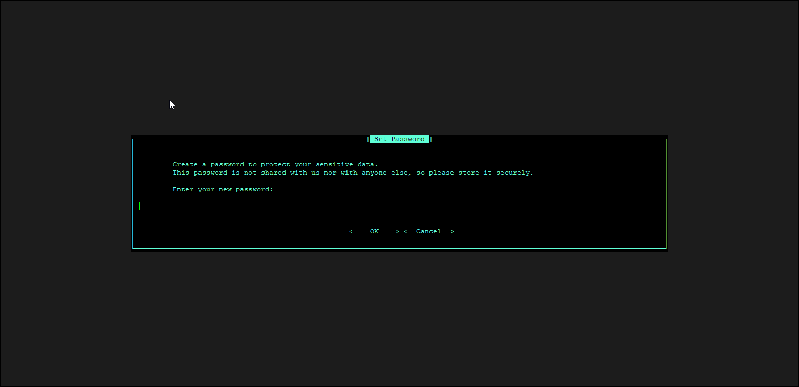

# Understanding the Hummingbot Interface

Hummingbot is a **Command Line Interface (CLI)** system, designed to facilitate automated, algorithmic trading on cryptocurrency exchanges. A CLI, or Command Line Interface, is a text-based user interface used to interact with software. Unlike graphical user interfaces (GUIs) which rely on graphical elements such as windows, icons, and buttons, a CLI requires users to input text commands to execute specific functions or tasks. 

## Create a Password

If you are using Hummingbot for the first time, the system will prompt you to create a password. There are no character requirements, although we recommend using a strong password for additional security.

The password in Hummingbot encrypts sensitive data such as API keys, secret keys, and wallet private keys. For security reasons, the password is only stored locally in encrypted form, and we do not have access to it.

After you set a password you should now be in the main Hummingbot screen

## User Interface Guide

The CLI is divided into five panes:

* **Input pane (lower left)**: Where users enter commands

* **Output pane (upper left)**: Prints the output of the user's commands

* **Log pane (right)**: Log messages

* **Top navigation bar**: Displays the status of the following items:
    
    - Version 
    - Strategy
    - Strategy File 

* **Bottom navigation bar**: 

    - Trades
    - CPU
    - MEM
    - Threads
    - Duration

For more detailed information on the interface see [User Interface](../../../client/user-interface.md)

## Useful shortcuts    
      
- <kbd>CTRL</kbd> + <kbd>P</kbd> + <kbd>CTRL</kbd> + <kbd>Q</kbd> - This exits the bot but keeps it running in the background

- <kbd>CTRL</kbd> + <kbd>X</kbd> - Exits config

- Double <kbd>CTRL</kbd> + <kbd>C</kbd> - Exits the bot completely

- `CTRL + V` to paste in Hummingbot does not work, to paste try one of the following commands:

    - <kbd>CTRL</kbd>+<kbd>SHIFT</kbd>+<kbd>V</kbd>

    - <kbd>SHIFT</kbd> + RMB (right-mouse button)

    - <kbd>SHIFT</kbd> + <kbd>INS</kbd>

In the next section we'll learn how to run a simple pmm script

[Running a Script](2-run-script.md){ .md-button .md-button--primary }
