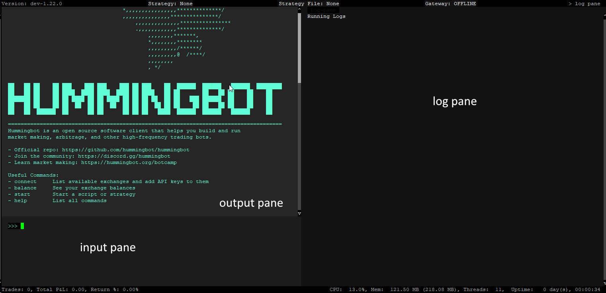

# Docker Installation Guide - User Interface

Hummingbot operates through a **Command Line Interface (CLI)**, a text-based system ideal for automated cryptocurrency trading. Unlike graphical interfaces, CLIs rely on text commands to function. Let's dive into how to use it effectively.

## Create a Password

If you are using Hummingbot for the first time, the system will prompt you to create a password. There are no character requirements, although we recommend using a strong password for additional security.

The password in Hummingbot encrypts sensitive data such as API keys, secret keys, and wallet private keys. For security reasons, the password is only stored locally in encrypted form, and we do not have access to it.

After you set a password you should now be in the main Hummingbot screen

## User Interface Guide

The CLI is organized into several key areas:

- **Input Pane (Lower Left)**: Here, you input your commands.

- **Output Pane (Upper Left)**: This displays the results of your commands.

- **Log Pane (Right)**: Here, you can view log messages.

- **Top Navigation Bar**: Shows the version, current strategy, and strategy file.

- **Bottom Navigation Bar**: Displays trades, CPU usage, memory, threads, and duration.

For a more in-depth look, visit [User Interface](../../../client/user-interface.md)

## Useful shortcuts    
      
- <kbd>CTRL</kbd> + <kbd>P</kbd> + <kbd>CTRL</kbd> + <kbd>Q</kbd> - This exits the bot but keeps it running in the background

- <kbd>CTRL</kbd> + <kbd>X</kbd> - Exits config

- Double <kbd>CTRL</kbd> + <kbd>C</kbd> - Exits the bot completely

- `CTRL + V` to paste in Hummingbot does not work, to paste try one of the following commands:

    - <kbd>CTRL</kbd>+<kbd>SHIFT</kbd>+<kbd>V</kbd>

    - <kbd>SHIFT</kbd> + RMB (right-mouse button)

    - <kbd>SHIFT</kbd> + <kbd>INS</kbd>

Next, let's learn about running a simple PMM script in Hummingbot

[Running a Script](3-run-script.md){ .md-button .md-button--primary }
