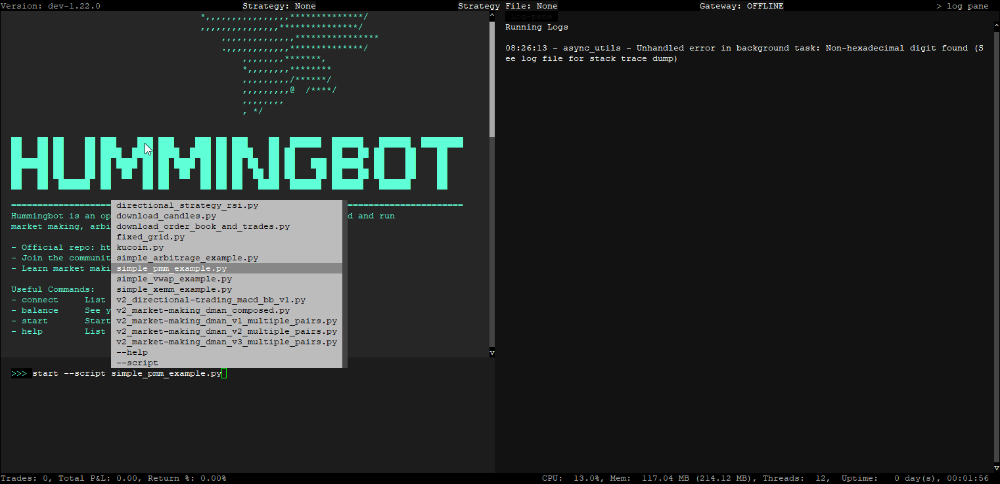
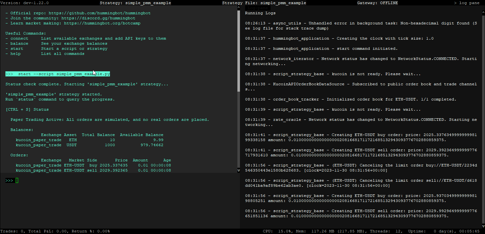
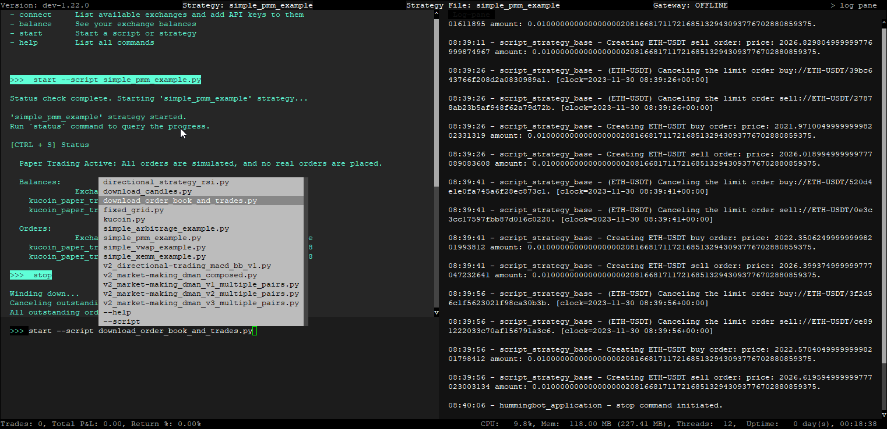

# Running a Script

## Simple PMM Example

We'll start by running the `simple_pmm_example.py` script. This script will try to create orders using the ETH-USDT pair on paper trading. Use the following command in the Hummingbot terminal to start the script

```
start --script simple_pmm_example.py
```

When you type the `--script` command and press <kbd>SPACE</kbd> the list of available scripts in the `scripts` folder should be listed like in the screenshot below. 



If you don't see any scripts under the /scripts folder you may need to run the following commands below in the terminal to get the scripts to show up. 

```bash
sudo chmod -R a+rw ./hummingbot_files
docker cp hummingbot:/home/hummingbot/scripts-copy/. ./hummingbot_files/scripts/
```

When you start the script there should be some activity in the log pane indicating the script is running. You can also use the `status` command to get the output pane to display more information. It should look like the screen below - 




To stop the script from running, type the **stop** command in the Hummingbot terminal

```
stop
```

## Download Order Book Data

Let's try another example and this time we'll try to fetch order book data using the **download_order_book_and_trades.py** script.
This script is pre-configured to download the "ETH-USDT & BTC-USDT" pairs using Binance paper trade. 

Use the following command in the Hummingbot terminal to start the script:

```
start --script download_order_book_and_trades.py
```



Once you press <kbd>ENTER</kbd>, the script will start running and downloading the order book information. Give this a few minutes as it will take some time to download the data. 

After a few minutes check the `hummingbot_files/data` folder and you should see the following text files:

```
binance_paper_trade_BTC-USDT_order_book_snapshots_2023-xx-xx.txt
binance_paper_trade_BTC-USDT_trades_2023-xx-xx.txt
binance_paper_trade_ETH-USDT_order_book_snapshots_2023-xx-xx.txt
binance_paper_trade_ETH-USDT_trades_2023-xx-xx.txt
```

Back in the Hummingbot terminal, if the log pane just shows `binance is not ready. Please wait....` just ignore this and send the `stop` command to stop the bot. 

Congratulations! You have now run your first two scripts. In the next section we'll connect our API keys to be able to do live trading. 

[Connecting your API Keys](3-api-keys.md){ .md-button .md-button--primary }
