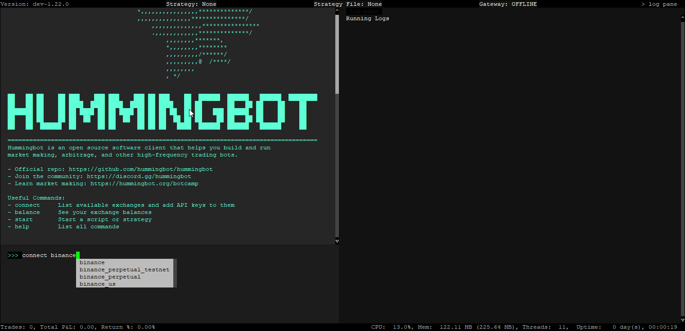
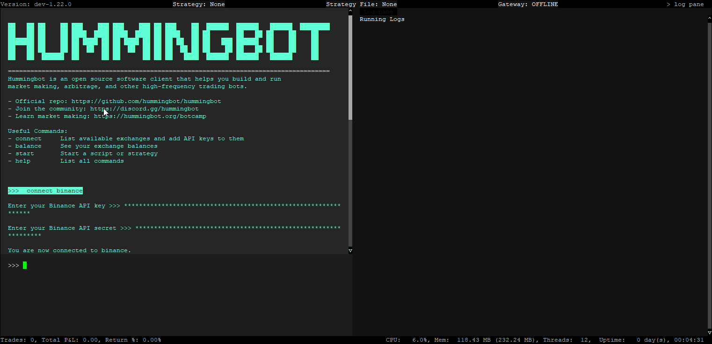
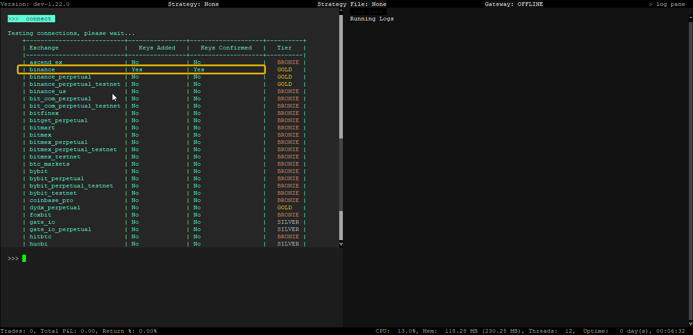

# Connecting your API Keys

While paper trading in Hummingbot doesn't require API keys, live trading does. This guide will help you connect your exchange API keys to Hummingbot for real-time trading.

## Generate API Keys
 
First, you need to generate API keys from the exchange you wish to connect. Each exchange has its own setup process.

In this example, we'll connect **Binance API** keys. Head over to the [Binance Connector Docs](https://docs.hummingbot.org/exchanges/binance/#generate-api-keys) for instructions on how to generate API keys for [Binance](../../../exchanges/binance/index.md).

Check the [Connectors list](../../../exchanges/index.md) for a list of exchanges that are currently integrated with Hummingbot

!!! Warning
    Please always keep your API keys secure and do not share them. 

## Connect API keys to Hummingbot

In the Hummingbot run the `connect` command for the exchange we want to connect to. In this case for Binance use the command below - 

```
connect binance
```



You should get a prompt to enter in your API keys - you can use the following commands below to paste them into the Hummingbot terminal. Note that `CTRL + V` doesn't work and you'll get a `Pyperclip error` in the log panel if you try to use it. 

  - <kbd>CTRL</kbd>+<kbd>SHIFT</kbd>+<kbd>V</kbd>

  - <kbd>SHIFT</kbd> + RMB (right-mouse button)

  - <kbd>SHIFT</kbd> + <kbd>INS</kbd>



After entering your API keys you should get a success message if everything went through okay. You can also confirm by running the `connect` command again and check that both columns next to Binance are showing `Yes`. 




Now your Binance API keys are connected to Hummingbot. Repeat these steps for other exchanges as needed.

[Running a V2 Script](4-run-v2.md){ .md-button .md-button--primary }