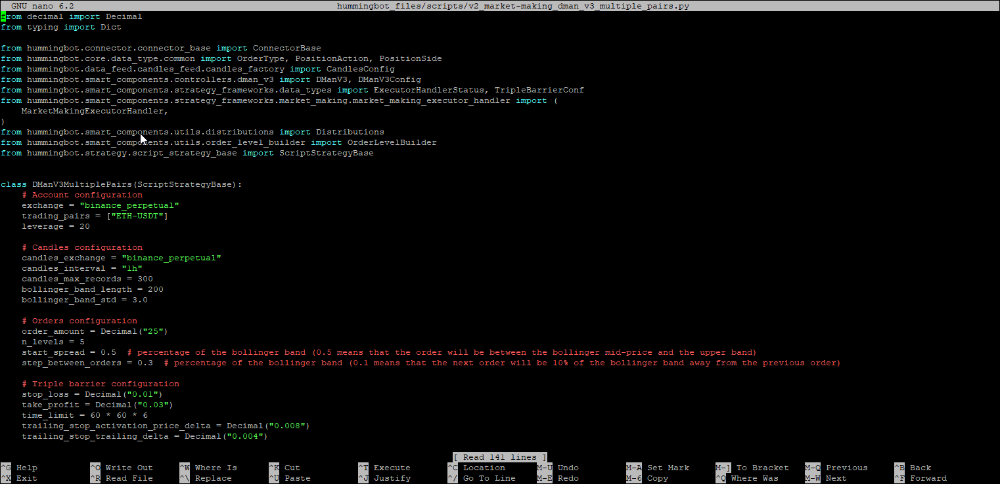

# Running a V2 Script

In this section we'll configure and then run one of the v2 scripts - `v2_market-making_dman_v3_multiple_pairs.py`

## Opening the script

Before we run the strategy we'll need to make some changes to the parameters first. We'll use the `nano` command line editor to make the changes to the script first. Run the following commands in the terminal

```bash
nano hummingbot_files/scripts/v2_market-making_dman_v3_multiple_pairs.py
```



If you are not familiar with how to use `nano` you can use any other text editor you are familiar with and then copy the file back into the `hummingbot_files/scripts` folder. 

Here is the link to the script file - <https://github.com/hummingbot/hummingbot/blob/master/scripts/v2_market-making_dman_v3_multiple_pairs.py>

## Configuring the parameters