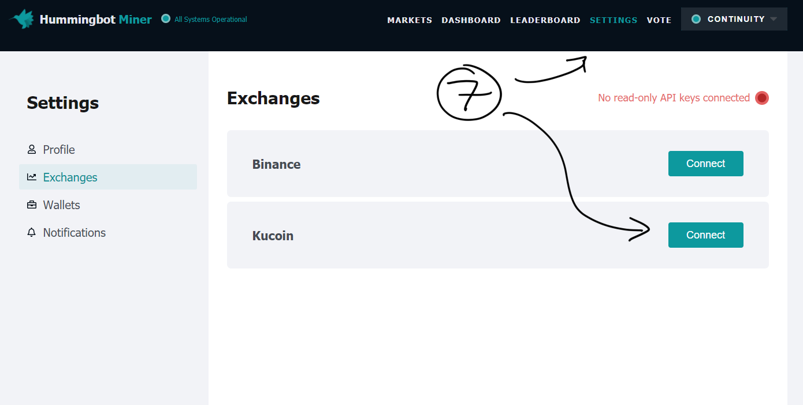

# Liquidity Mining with Hummingbot - Part 2: Configure Miner

This is **part 2** of the Liquidity Mining Quickstart Guide:

1. [Create API Keys]
2. **Configure Miner**
3. [Install Hummingbot]
4. [Create Bot]
5. [Earn Rewards]

## Create a Miner account

Miner is a liquidity mining platform where you can run market making bots to earn liquidity rewards on various exchanges. In this step, you will add your read-only API key to Miner so that you can earn and monitor rewards for the orders placed by your bots.

> Users are free to download and run Hummingbot without signing up on the mining platform. The liquidity mining strategy in particular, however, is optimized for participating in Miner campaigns.

1. Navigate to [Miner](https://miner.hummingbot.io), and click on `Log in`

2. Select `Sign up`

3. Enter your email address, read and agree to the [Terms of Service](https://coinalpha.com/terms-of-use/), then click on `Create account`

4. Check your email to confirm your account

5. On the Miner email, click on `Log in to Miner`

> After clicking on the link sent by email, a new tab will open confirming that you are logged into Miner. You may close it and return to your original tab.

6. You should now be logged into Miner with your new account.

7. Go to the Settings page, and add the read-only API to your account.

Add the read-only API key, Secret key, and Passphrase generated in [step one][Create API Keys]

> Please do not attempt to use the same API key on more than one Miner account. Doing so will be seen as an attempt to cheat the system, since this could potentially cause users to be rewarded multiple times for the same orders, and will result in blacklisting.

Next, you'll need to [install hummingbot][Install Hummingbot]

[Create API Keys]: 1-create-keys.md
[Install Hummingbot]: 3-install-hummingbot.md
[Create Bot]: 4-create-bot.md
[Earn Rewards]: 5-earn-rewards.md
