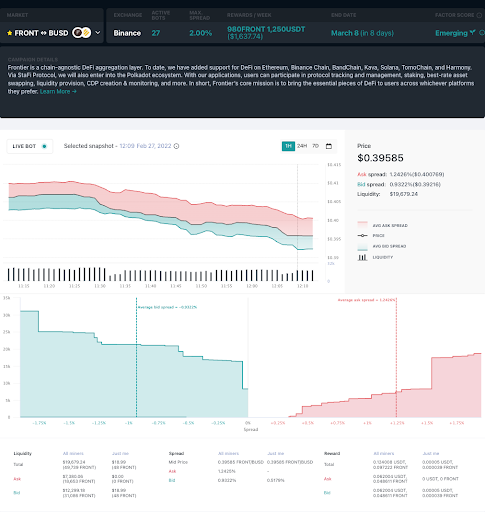

# The Orders Must Flow from Trader Mobiwan

*by Mohammed Badran*

In the fictional world of Dune, the most precious substance in the universe is the spice. The spice extends life, expands consciousness, and is vital to space travel.

Likewise, in the very real world of liquidity mining, the most precious substance in the market is the order. The order allows trading, enables market making, and is vital to liquidity rewards.

<!-- more -->

*Liquidity rewards are what market makers earn for providing liquidity to trading pairs at a certain depth on an order book.*

In Dune, it is an absolute truth that *the spice must flow*. This serves as a useful analogy for liquidity mining. If you want meaningful rewards, then *the orders must flow* continuously. Let’s call this *order flow*.

And we're not just talking about any orders. The orders must meet the criteria for earning liquidity rewards. Let’s call these *mining orders*.

This brings us to our challenge: it is surprisingly difficult to keep these orders flowing. As you may have realized, it takes practice and persistence to maintain a healthy order flow. Many obstacles can get in the way, and when they do, they *will* disrupt your rewards. But there is hope!

Let's examine some of these obstacles through the eyes of Marvin Miner. Marvin has some experience with market making but is relatively new to liquidity mining. He has prepared the groundwork, deployed a couple of Hummingbot instances, and configured them to trade on markets with active campaigns.

Marvin is attacking liquidity mining with vigor, but little does he know that the world is conspiring against him. From bot misconfiguration to market volatility to API errors — it seems like every day, Marvin encounters issues that disrupt his rewards. And he is not happy about this *at all*.

So, how does Marvin manage to overcome these problems?

**Spoiler**: it all works out in the end. Marvin discovers three steps to increasing his order flow:

1. Ensuring mining orders are valid,
2. Then creating as many mining orders as possible,
3. And, finally, preventing mining blockers.

It’s as simple as it sounds, but the devil is in the detail.

## Step 1: Ensure Mining Orders are Valid

Marvin understands that mining orders must meet certain criteria to be eligible for rewards.

As a quick summary, liquidity rewards are weighted on three factors:

1. **Time** — The age and frequency of the order.
2. **Spread** — The order depth, i.e., the distance of the order from the mid-price.
3. **Size** — The amount of the order.

The higher the weighting, the higher the rewards earned per minute. The precise formula is explained in the guide to [demystifying liquidity mining rewards](../demystifying-liquidity-mining-rewards/index.md), a highly recommended read.

Marvin configured his bots to meet the above criteria, but despite this, his orders were invalid surprisingly often, which took a toll on his order flow. Here’s what happened.

### Time

Marvin studied Hummingbot’s [strategy config docs](../../../strategies/pure-market-making.md) and carefully configured his bots. He had decided to keep [max_order_age](../../../strategy-configs/max-order-age.md) at the default 1800 (seconds, i.e., 30 minutes). This happens to be the maximum age allowed for mining orders; anything older than that is considered ‘stale’ and ignored by Hummingbot Miner’s Rewards Engine.

Marvin had also configured [order_refresh_time](../../../strategies/pure-market-making.md) to 1800 (seconds), and had left [order_refresh_tolerance](../../../strategy-configs/order-refresh-tolerance.md) at the default 0 (%). Marvin understood that this combination of parameters would only refresh his orders if the asset’s price changed or if the order age reached 30 minutes, whichever occurred first. This meant that his orders were not being needlessly refreshed, which seemed optimal.

The problem was that this combination resulted in a delay when an order remained for 30 minutes and was only recreated afterward. If the Rewards Engine happened to be taking a snapshot during this window, it would find a slightly stale or missing order. This occurred often enough to impact his order flow.

#### Solution

Marvin configured [order_refresh_time](../../../strategies/pure-market-making.md) to 300 (seconds), which recreated his orders every five minutes.

As a failsafe, Marvin configured [max_order_age](../../../strategy-configs/max-order-age.md) to 300 (seconds) as well, in case his orders were not refreshed for any reason (for example, the asset price staying the same).

This new combination ensured Marvin’s orders were refreshing well before the 30-minute age limit, which prevented them from going stale and missing out on rewards (unless an error occurred, which we’ll address later).

### Spread

Another requirement for valid mining orders is that their spreads must fall within the limits defined by their [liquidity mining campaigns](https://miner.hummingbot.io/markets?ref=blog.hummingbot.org). These spreads usually range from 1% to 2%, but they can be higher or lower, depending on the campaign.

Marvin is not incompetent, as you know by now, so he had configured his bots to place orders within the spread limits. But as you’ll remember, to prevent his orders from going stale, Marvin had recently configured [order_refresh_time](../../../strategies/pure-market-making.md) and [max_order_age](../../../strategy-configs/max-order-age.md) to 300 (seconds). This created a new problem: when the price moved quickly within a five-minute candle, the spreads of Marvin’s orders would often rise above the limits, which made them invalid. This would only be corrected after five minutes, when his orders were next refreshed.

Additionally, in an attempt to optimize his bots and reduce trading losses, Marvin had been experimenting with parameters like [order_refresh_tolerance](../../../strategy-configs/order-refresh-tolerance.md), [order_optimization](../../../strategy-configs/order-optimization.md), and [hanging_orders](../../../strategy-configs/hanging-orders.md). The combinations of these parameters often increased his order spreads, which frequently made them invalid.

Lastly, Marvin had been participating in a campaign with a maximum spread of 2%, and was placing orders at a spread of 1.5%. On the following week, the campaign decreased their maximum spread to 1% (which they sometimes do), but Marvin didn’t get the memo.

All of these issues invalidated Marvin’s mining orders, which significantly decreased his order flow.

#### Solution

Marvin configured [order_refresh_time](../../../strategies/pure-market-making.md) to 10 (seconds), which frequently recreated his orders as the price changed. Where the price went, Marvin’s desired orders and spreads now followed.

Marvin also reset the experimental parameters like [order_refresh_tolerance](../../../strategy-configs/order-refresh-tolerance.md) to their defaults. He decided to only configure one new parameter at a time, while closely monitoring its impact on his order spreads and trading balance.

Lastly, Marvin followed all of Hummingbot’s announcement channels so he could find out about any campaign changes. He subscribed to the [Newsletter](https://hummingbot.substack.com/?ref=blog.hummingbot.org), joined the #miner-announcements channel on the [Discord](https://discord.hummingbot.io/?ref=blog.hummingbot.org), and reviewed the [Markets](https://miner.hummingbot.io/markets?ref=blog.hummingbot.org) page every week, for good measure.

### Size

The last weighting factor for liquidity rewards is order size, or order amount. This is generally not an obstacle for earning rewards, unless the size is below the exchange’s minimum limit. (In that case, the exchange will reject the order and return an error, which we’ll explore later.)

Marvin regularly placed small mining orders, but that did not make his orders invalid. It did, however, often yield negligible rewards, which did not impact his order flow, in itself. In other words, Marvin was able to maintain a steady stream of valid mining orders, regardless of their order size.

### Order Tracking

To ensure that his mining orders were valid at all times, Marvin kept regular watch of Hummingbot’s [Rewards](https://miner.hummingbot.io/dashboard/rewards?ref=blog.hummingbot.org) page. This showed his active campaigns and the rewards he had earned for the previous snapshots (with a 30-minute delay). Marvin regularly drilled down to individual reward snapshots on the Markets page to study his earnings in detail.

If a bot was not showing on the Rewards page, Marvin would check Hummingbot’s [Order Tracker](https://miner.hummingbot.io/dashboard/order-tracking?ref=blog.hummingbot.org). From there, he would filter by market (campaign) and order status, checking that his recent orders were showing up on the chart.

To confirm that his orders were actually placed on the exchange, Marvin would often log into his exchange’s website or app and browse to the trading console for his campaigns. This would show his orders on the order book, in real-time.

If, after all of this, anything looked amiss — for example, new bots placing orders on the exchange, but not appearing on the order tracker — then Marvin knew something was wrong. When Marvin couldn’t figure out the problem, he knew to contact the [Hummingbot Support Team](https://support.hummingbot.io/?ref=blog.hummingbot.org) to help him investigate.

## Step 2: Create as many mining orders as possible

As we’ve mentioned, Marvin is pretty switched on. He knows that the more orders he creates, the higher the potential for earning liquidity rewards. That much seems obvious.

With this in mind, Marvin prepared his bots for maximum trading action. Despite that, his bots regularly only had a single order on each side of the order book, sometimes only one order on one side, and occasionally, no orders at all. As you can imagine, this severely impacted his order flow. No orders = no rewards.

Let’s find out why this happened.

Marvin had set [order_levels](../../../strategy-configs/order-levels.md) to 1 (order) because he wanted to keep things simple and easy to manage. This is a sensible strategy, and it worked well for Marvin, but it capped the maximum number of orders to two: one on each side of the order book — even when he had the ability to place more.

More painfully, as a way of [managing inventory risk](../what-is-inventory-risk/index.md), Marvin would often enable parameters like [ping_pong](../../../strategy-configs/ping-pong.md), which alternates buy and sell orders. This decreased his order flow by half! Along the same lines, Marvin configured [filled_order_delay](../../../strategy-configs/filled-order-delay.md) to 900 (seconds), which introduced a 15-minute delay after orders were filled before placing new ones. This brought his order flow to a halt during that window.

#### Solution

Marvin learned that maximizing mining orders is more challenging than it seems. He went back to [first principles](https://en.wikipedia.org/wiki/First_principle?ref=blog.hummingbot.org), reviewed several trading scenarios, and considered:

1. Should he have mining orders for that scenario?
2. If the answer was yes, did he have those orders in place?
3. If the answer was no, then he was missing out on liquidity rewards.

As a result of this exercise, Marvin decided to keep [order_levels](../../../strategy-configs/order-levels.md) at 1 (order). He didn’t want the complexity that comes with multiple levels of buy and sell orders at the same time.

But Marvin also realized he had a higher risk appetite than when he first started liquidity mining. He decided to prioritize earning liquidity rewards over trading losses.

He reasoned that the rewards he earned would compensate for any losses he incurred. This justified placing more mining orders when he would have otherwise held back.

Armed with this new focus, Marvin configured [filled_order_delay](../../../strategy-configs/filled-order-delay.md) to a more conservative 300 (seconds), thereby decreasing the delay to five minutes.

Along the same lines, he disabled [ping_pong](../../../strategy-configs/ping-pong.md) so as to simultaneously place orders on both sides of the order book. He then said a short prayer to the market gods, because there is no Hummingbot configuration for that.

Lastly, Marvin reviewed his campaign budgets, then instructed his bots to stick to the budgeted amounts. Specifically, he configured [inventory_skew](../../../strategy-configs/inventory-skew.md) and [balance_limit](../../../global-configs/balance-limit.md) to buy and sell his desired inventory percentages, maintain a buffer of funds, and adhere to global balance limits. This took a fair bit of trial and error, but when it all came together, it bumped up his order flow, and, as a bonus, helped him [manage inventory risk](../what-is-inventory-risk/index.md).

## Recap

In the previous steps, Marvin reviewed his liquidity mining setup and refactored it to ensure that:

1. His mining orders were always valid, and
2. He was creating as many mining orders as possible.

As a result, Marvin significantly increased his order flow, which ultimately earned him more rewards.

In the next installment, we’ll look at the third and final step: preventing mining blockers. We’ll discover new obstacles that Marvin encounters, and find out what he does to overcome them. Stay tuned!
