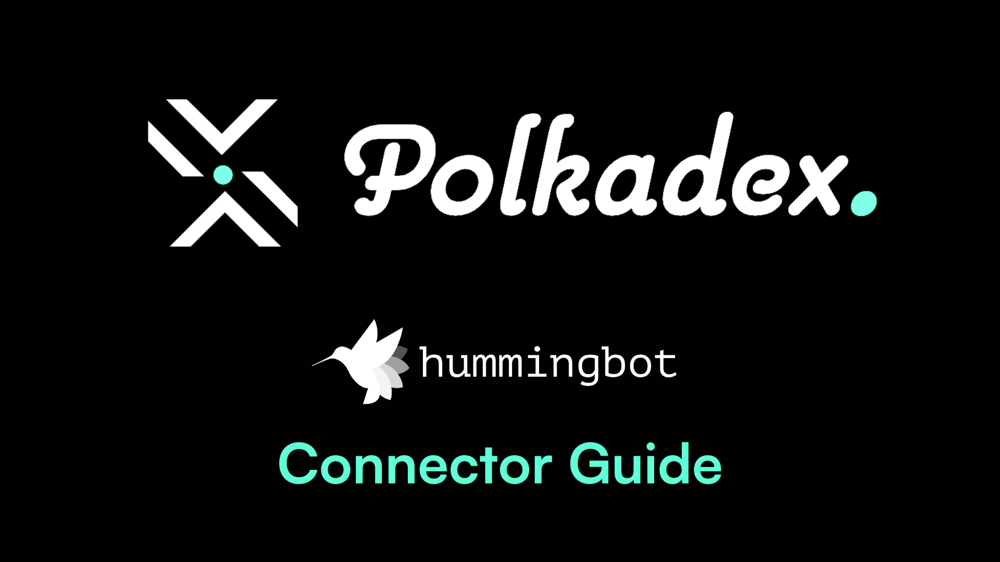
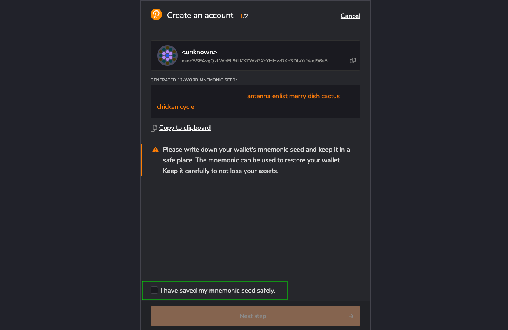
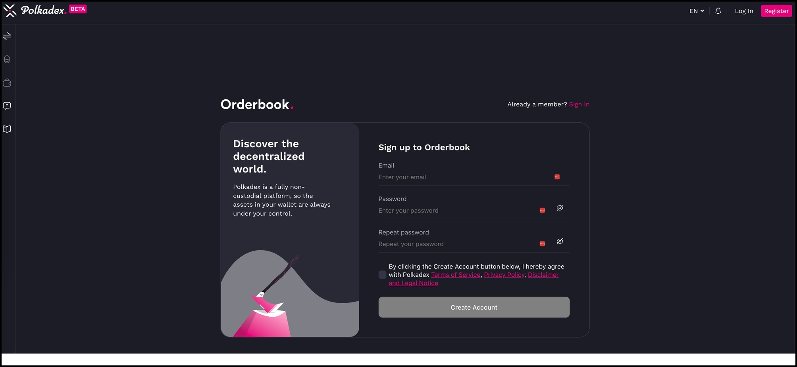
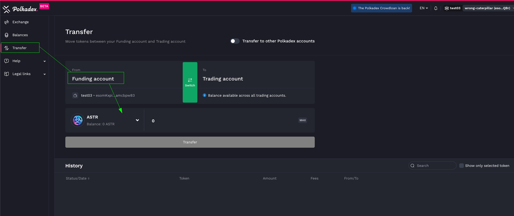

# Using Polkadex with Hummingbot



## Introduction

**Polkadex** is a state-of-the-art decentralized exchange on the Polkadot network, offering a seamless blend of the high-speed trading typically found on centralized platforms with the security and autonomy of a DEX. This guide walks through setting up a Polkadex wallet and initiating trading with Hummingbot. 

By leveraging Polkadex and Hummingbot, traders can enjoy a high-performance, secure, and automated trading experience without the custodial risks, making it an ideal platform for both novice and seasoned traders in the cryptocurrency ecosystem.

<!-- more -->


## Install the Polkadex Extension

First things first, let's set up your Polkadex extension by visiting [polkadot.js.org/extension](https://polkadot.js.org/extension/)




Ensure the security of your wallet by keeping a copy of the mnemonic seed in a safe location.

## Register Your Account on Polkadex

Now, let's get you registered on Polkadex:

- Visit [https://orderbook.polkadex.trade](https://orderbook.polkadex.trade/)
- Create an account by providing the necessary details.



## Register Your Funding Account

Your Polkadex extension accounts will serve as your funding accounts. Here's how to set it up:

- Select your preferred account on the Polkadex extension.

  

  

- Your accounts will be visible on the Polkadex exchange. Click "Use in Orderbook" for the account you wish to select.

## Import Your Trading Account

Let's generate your trading account seed:

- Visit [https://orderbook-internal.polkadex.trade/](https://orderbook-internal.polkadex.trade/)
- Create a new trading account, select the funding account, and provide a name.

  

- Once created, you'll receive a mnemonic passphrase. Go back to [orderbook.polkadex.trade](https://orderbook.polkadex.trade/), import the account using the mnemonic phrase.

  


## Add Balances and Start Trading

You're almost there! Now, let's add some balances:

- Navigate to the "Balances" tab on [orderbook.polkadex.trade](https://orderbook.polkadex.trade/)
- Deposit your preferred tokens and get started with Hummingbot!


## Install Hummingbot


There are two main methods to install Hummingbot:

### Docker

For most new users, we recommend installing Hummingbot using Docker.

- [Docker Quickstart Guide](https://hummingbot.org/academy-content/docker-installation-guide/)

### Source

We recommend installing Hummingbot from source if you meet any of the following criteria:

- You want to customize or extend the Hummingbot codebase.
- You want to build new components like connectors or strategies.
- You want to learn how Hummingbot works at a deeper, technical level.

Guides for various environments:

  - [Linux](../../../installation/linux.md)
  - [Windows](../../../installation/windows.md)
  - [MacOS](../../../installation/mac.md)


## Connect your Polkadex Wallet to Hummingbot


- Execute the following command to connect Hummingbot and add your Polkadex trading seed phrase

```
connect polkadex

```

- Execute "balance" command to check your assets 
- Launch your preferred trading strategy!


For more detailed information, check out [docs.polkadex.trade](https://docs.polkadex.trade/polkadexOrderbookFAQHowToTransferDeposits/)


Happy trading on Polkadex! 🚀