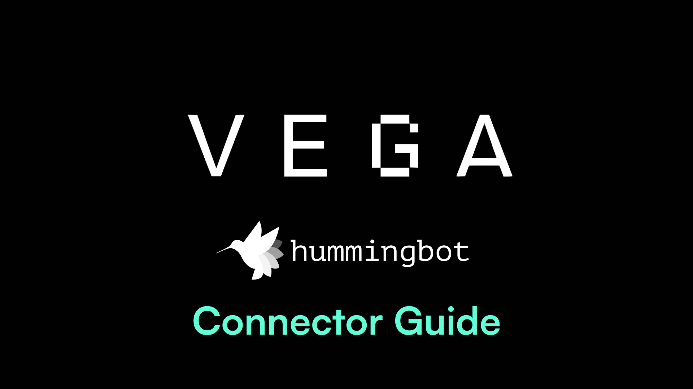
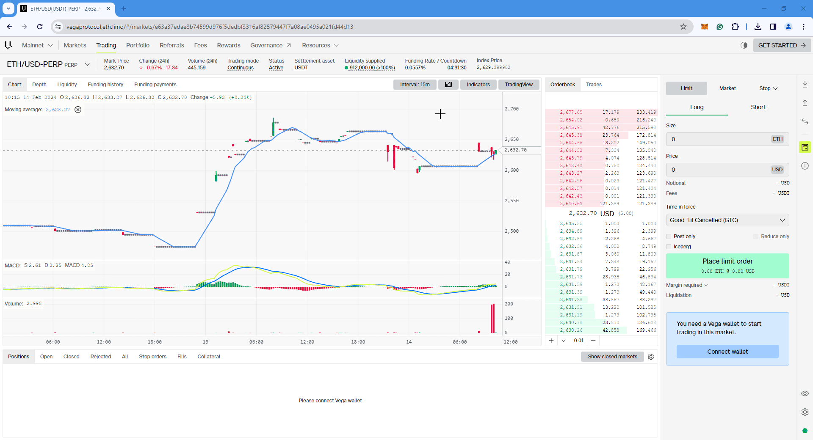
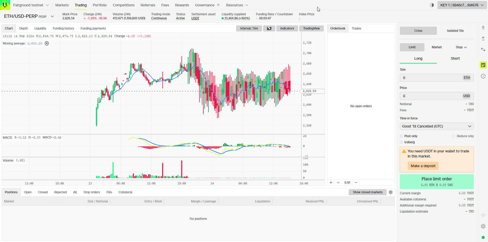
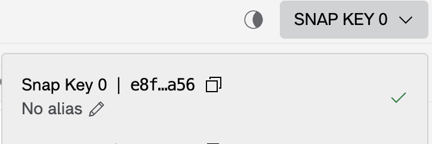
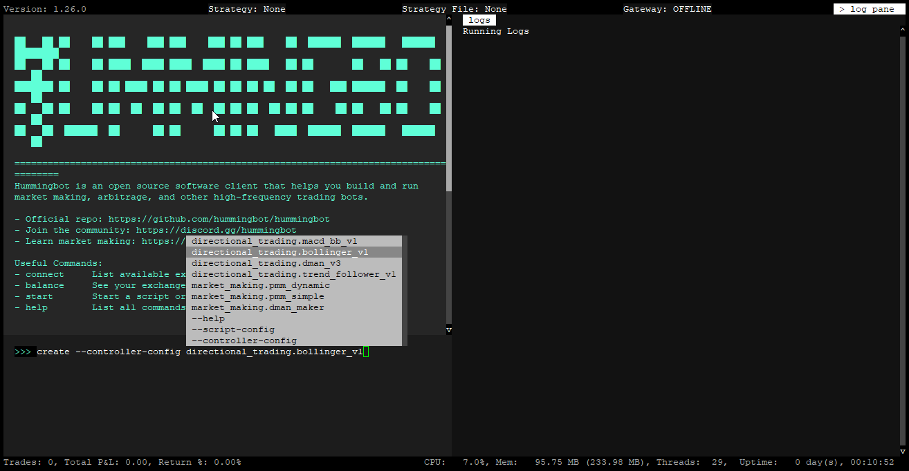
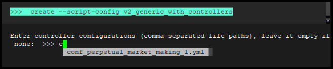
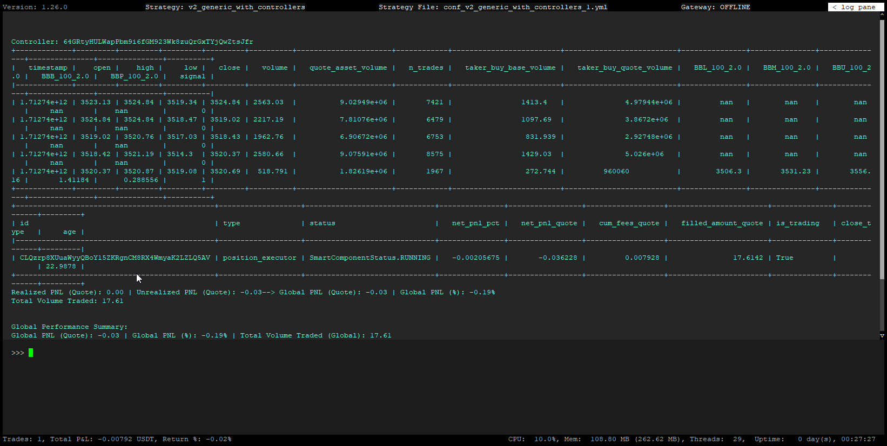
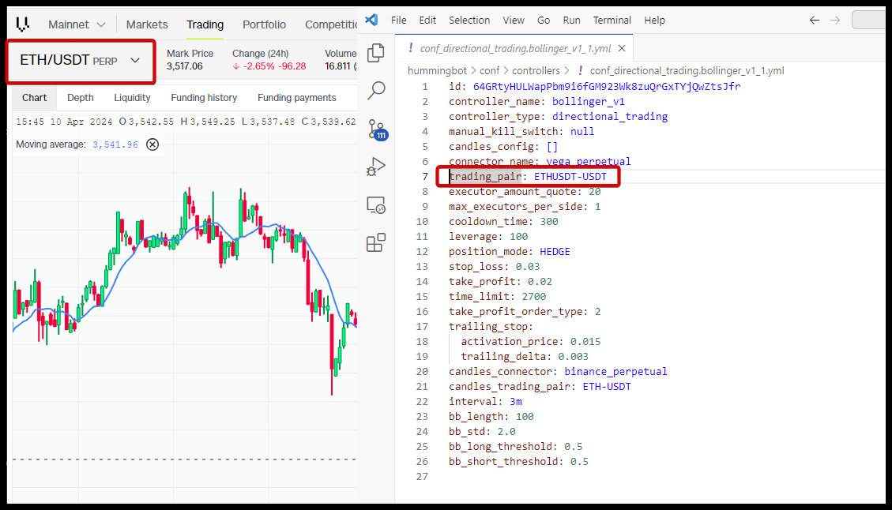

# Using Vega Protocol with Hummingbot




## Introduction

Welcome to our user tutorial on integrating the power of **Vega Protocol** with **Hummingbot** for your trading journey. In this guide, we'll walk you through the detailed steps required to seamlessly set up a Vega Wallet, link it with Hummingbot, and embark on your trading adventures. 

Whether you're new to automated trading or looking to leverage Vega Protocol's decentralized trading capabilities, this guide is designed to provide you with all the information you need to get started. Let's dive into the world of blockchain-based trading with **Vega Protocol** and **Hummingbot**, and unlock new possibilities in your trading strategy.

<!-- more -->

## Prerequisites

### Create a Vega Wallet

A **Vega Wallet** is essential for interacting with Vega, whether it's for staking or trading. The Vega Wallet apps allow you to manage wallets and key pairs, deposit and withdraw assets, stake, and sign transactions. There are several options for creating a Vega Wallet, including **Chrome/Firefox** browser extensions, or a **desktop/CLI** app. 

If you have an existing Metamask account, you can set up a Vega Key through **Metamask Snaps**, which we recommend below.

<br>

**Metamask Snap** (recommended)

For those using the MetaMask extension on **Chrome** or **Firefox**, there's no need to set up a separate Vega Wallet to generate and utilize a Vega key. Simply launch Chrome or Firefox and visit the [Vega Console](https://console.vega.xyz/).

**Let's Begin!**

[](metamask_snap_01.gif)


**Steps:**

- Click on **Getting Started** in the top right corner or **Connect Wallet** at the bottom right corner.

- You should get a popup on the screen, select the second option **Install Vega Metamask Snap**

- Metamask will open a series of requests pop-ups, review them and Approve

- Once this is done, go back to the previous popup and click on **Connect via Metamask Snap** 

- You should get a popup saying **Successfully Connected** and you're now ready to deposit or transfer assets and use your new Vega keypair.

<br>

**Alternate Vega Wallet Setup Methods**

**Browser Extension**

- [Chrome extension:](https://chrome.google.com/webstore/detail/vega-wallet-mainnet/codfcglpplgmmlokgilfkpcjnmkbfiel)

- [Firefox extension:](https://addons.mozilla.org/en-GB/firefox/addon/vega-wallet-mainnet/)


**Desktop Wallet**

- [Download the app:](https://github.com/vegaprotocol/vegawallet-desktop/releases) On GitHub, download the desktop app for your operating system.

- [Get started:](https://docs.vega.xyz/mainnet/tools/vega-wallet/desktop-app/getting-started) Read a guide on using the desktop app to connect an existing Vega wallet, create or restore a wallet and start interacting with your keys.


<br>

### Deposit Funds

Follow these steps to deposit and fund your wallet for trading on Vega:

!!! Note
    Please ensure your wallet has sufficient balance, including ETH for gas fees 

[](metamask_deposit.gif)

**Steps:**

- Navigate to the **Deposit** button located on the right-hand side of the screen to begin the deposit process.

- If it's your first time depositing a particular token, you'll need to approve it. Click **Approve** and then confirm this action in MetaMask.

- Choose the token you wish to deposit from the dropdown menu, enter the amount, and then click **Deposit** to proceed.

- Wait for the blockchain to confirm the transaction. Once confirmed, your deposited balance will be visible in the **Order** section, ready for trading.

<br>

## Install Hummingbot

There are two main methods to install Hummingbot:

### Docker

For most new users, we recommend installing Hummingbot using Docker.

- [Docker Quickstart Guide](https://hummingbot.org/academy-content/docker-installation-guide/)

### Source

We recommend installing Hummingbot from source if you meet any of the following criteria:

- You want to customize or extend the Hummingbot codebase.
- You want to build new components like connectors or strategies.
- You want to learn how Hummingbot works at a deeper, technical level.

Guides for various environments:

  - [Linux](../../../installation/linux.md)
  - [Windows](../../../installation/windows.md)
  - [MacOS](../../../installation/mac.md)

<br>

## Connect your Vega Wallet to Hummingbot

To connect your Vega Wallet to Hummingbot and unlock full trading capabilities, you need two important pieces of information: your **Snap Key** (also known as Vega Party ID) and your **wallet seed phrase**. Here's how you can find and use them:

### Snap Key (Vega Party ID)

After connecting your Vega Wallet, look for your **Snap Key** in the top right corner of the screen. The Snap Key is crucial as it acts as your **Vega Party ID**, which will be required when setting up the wallet connection in Hummingbot.

[](snap_key.png)

The Snap Key section, when clicked, automatically copies the address to your clipboard which you can then paste when prompted for the **Vega Party ID** in Hummingbot.

[](metamask_snap_02.gif)

### Metamask Wallet Seed Phrase (Secret Recovery Phrase)

Your **wallet seed phrase** is a separate piece of information, typically a series of words provided when you initially set up your wallet. This phrase acts as a backup to access your wallet and should be kept secure and private. 

When connecting your Vega Wallet to Hummingbot, you will be prompted to enter this seed phrase as part of the authentication and setup process.

Here's how to get your **wallet seed phrase** from Metamask

{: style="height:497px;width:296px"} &nbsp;&nbsp;&nbsp;&nbsp; {: style="height:497px;width:296px"}

**Retrieving your wallet seed phrase from Metamask:**

- Navigate to the three-dot menu at the top right and select **Settings** > **Security & Privacy**.
- Choose **Reveal Secret Recovery Phrase**.
- Confirm your identity by answering two security questions, then enter your Metamask password and click **Next**.
- Press the **Hold to Reveal SRP** button to view your wallet seed phrase.


**Security Notice:** Your wallet seed phrase is extremely sensitive. Keep it confidential and never share it online or with anyone you don't trust. Always ensure you're in a secure and private environment when handling your seed phrase.

<br>

### Hummingbot **connect** command

The **connect** command lets you add your user credentials in order to connect to an exchange or protocol. For centralized exchanges, this command asks you for your API key, while blockchain protocols asks you for your private key.

Hummingbot stores both API keys and private keys on the local machine in encrypted form, with the Hummingbot client password as the key.

[](connect_vega.gif)

**Connect Vega Wallet**

- To connect to **Vega mainnet** run the command below 

```
connect vega_perpetual
```

- To connect to the **Vega testnet** or fairground run the command below

```
connect vega_perpetual_testnet
```

- You will be prompted to enter your **Vega public key** first (Snap Key), followed by your **wallet seed phrase**. If both credentials are valid, you should get a message saying **You are now connected to vega_perpetual / testnet**

- To confirm the connection, you can run the balance command below to see if Hummingbot is able to pull the available balance from the exchange

```
balance
```

## Starting Your first script

In this example we'll show you how to use Vega with the newer Strategy V2 script with a directional trading controller. We'll be using the [v2_generic_with_controllers.py](https://github.com/hummingbot/hummingbot/blob/master/scripts/v2_generic_with_controllers.py) script and the [bollinger_v1.py](https://github.com/hummingbot/hummingbot/blob/master/controllers/directional_trading/bollinger_v1.py) controller


First let's configure our controller. Run the command below to create the controller config:

```
create --controller-config directional_trading.bollinger_v1
```

[](image14.png)

Follow the prompts and enter in the values for the controller config. You can always make changes to the config later. One important change you'll need to make is the **candles_connector** config since Vega does not currently support candles feed yet. 

We'll use the candles feed from Binance Perpetual for example and since we're trading on the **ETHUSDT-USDT** pair we'll use the **ETH-USDT** trading pair on Binance Perpetual. 

For reference here's an example controller config below: 

!!! Note
    **Disclaimer**: The values shown below are provided as generic defaults and serve as a basic starting point for configuring your Hummingbot instance. Due to the highly dynamic and personal nature of trading, these settings may not be optimal for every user or market condition. It is crucial for users to perform their own research, consider their unique trading goals, risk tolerance, and market analysis to adjust these configurations accordingly. Always remember that trading involves risk, and it's important to experiment and optimize settings on a simulation or with small amounts before applying them to live markets. The following configurations are examples only and should be customized based on individual requirements and circumstances.


```bash
id: 64GRtyHULWapPbm9i6fGM923Wk8zuQrGxTYjQwZtsJfr
controller_name: bollinger_v1
controller_type: directional_trading
manual_kill_switch: null
candles_config: []
connector_name: vega_perpetual
trading_pair: ETHUSDT-USDT
executor_amount_quote: 20
max_executors_per_side: 1
cooldown_time: 300
leverage: 100
position_mode: HEDGE
stop_loss: 0.03
take_profit: 0.02
time_limit: 2700
take_profit_order_type: 2
trailing_stop:
  activation_price: 0.015
  trailing_delta: 0.003
candles_connector: binance_perpetual
candles_trading_pair: ETH-USDT
interval: 3m
bb_length: 100
bb_std: 2.0
bb_long_threshold: 0.5
bb_short_threshold: 0.5

```

The controller config YAML file is located under the **/conf/controllers** folder inside your Hummingbot folder. You can use any text editor or IDE like VSCode to open the YAML file and make changes. Any changes made to this file will apply to the running bot during the next refresh cycle. 


Next, we'll need to create the script config using the following command: 

```
create --script-config v2_generic_with_controllers
```

You'll be prompted to enter the controller configuration, make sure to select the controller config we created earlier. 


[](image3.png)


Once this is done, we can now start the bot using the below command: 


```
start --script v2_generic_with_controllers.py --conf conf_v2_generic_with_controllers_1.yml

```

Your bot should now be running and start placing orders. You can run the **status** command shown below or press <kbd>CTRL</kbd> + <kbd>S</kbd> to check the bot status

```
status
```

[](image5.png)

You can click on the log pane at the top right corner of the screen to hide it and see more status info

[](image6.png)


## Modifying the Script / Controller

As mentioned above, you can edit the controller YAML file under the **conf/controllers** folder to make changes on-the-fly to the config values. You can also make changes to the script config file and add another controller for a different pair or perhaps use another controller like the **dman_v3** controller running a different pair. Here's how you would make changes: 

- Create your controller config first using the **create --controller-config** command, in the example below there is a new controller config named **conf_directional_trading.dman_v3_1.yml** based on the **dman_v3** controller and trading on the **SNX-USDT** pair

- Edit the script config using a text editor (located under **/conf/scripts**) and add your new controller config to the script config file - 

**Script Config File**

```bash 
markets: {}
candles_config: []
controllers_config:
- conf_directional_trading.bollinger_v1_1.yml
- conf_directional_trading.dman_v3_1.yml
config_update_interval: 60
script_file_name: v2_generic_with_controllers.py
```

**Controller Config File**

```bash
id: 8RsgZ4hdw2JjvLiz6ivVLWYRjh1vrJN8bTtv9fs4DWAV
controller_name: dman_v3
controller_type: directional_trading
manual_kill_switch: null
candles_config: []
connector_name: vega_perpetual
trading_pair: SNX-USDT
executor_amount_quote: 100.0
max_executors_per_side: 2
cooldown_time: 300
leverage: 20
position_mode: HEDGE
stop_loss: 0.03
take_profit: 0.02
time_limit: 2700
take_profit_order_type: 2
trailing_stop:
  activation_price: 0.015
  trailing_delta: 0.003
candles_connector: vega_perpetual
candles_trading_pair: SNX-USDT
interval: 30m
bb_length: 100
bb_std: 2.0
bb_long_threshold: 0.0
bb_short_threshold: 1.0
dca_spreads:
- 0.001
- 0.018
- 0.15
- 0.25
dca_amounts_pct:
- 0.25
- 0.25
- 0.25
- 0.25
dynamic_order_spread: false
dynamic_target: false
activation_bounds:
- 1


```

For more info on the **Strategy V2 Framework** check out the docs [here](../../../v2-strategies/index.md)


<br>

**Trading Pairs**

See screenshot below for an example or refer to the following table which shows the available trading pairs on Vega and how they should be entered in Hummingbot strategies or scripts. 

[](image2.png)

!!! Note 
    The trading pairs listed below may change over time, the information below is valid as of 4/10/2024
   
| Mainnet Trading Pairs | Hummingbot          | | Fairground Trading Pairs | Hummingbot                     |
|---------------------- |---------------------|-|--------------------------|--------------------------------|
| ETH/USDT-PERP         | ETHUSDT-USDT        | | BTC/USDT-PERP            | BTCUSDT-USDT                   |
| LDO/USDT-PERP         | LDOUSDT-USDT        | | BTCUSD.PYTH.PERP         | BTCUSDTPYTHPERPNOI-USDNOI      |
| BTC/USDT-PERP         | BTCUSDT-USDT        | | ETH/USDT-PERP            | ETHUSDT-USDT                   |
| INJ/USDT-PERP         | INJUSDT-USDT        | | JUPUSDT.PYTH.PERP        | JUPUSDTPYTHPERPNOI-USDNOI      |
| SNX/USDT-PERP         | SNXUSDT-USDT        | | INJ/USDT-PERP            | INJUSDT-USDT                   |
| SOL/USDT-PERP         | SOLUSDT-USDT        | | LDO/USDT-PERP            | LDOUSDT-USDT                   |
|                       |                     | | SNX/USDT-PERP            | SNXUSDT-USDT                   |


## Known Issues

??? info "vega_perpetual not ready"
    ```
    2024-02-14 09:59:38,522 - 1423 - hummingbot.client.hummingbot_application - INFO - Creating the clock with tick size: 1.0
    2024-02-14 09:59:38,525 - 1423 - hummingbot.client.hummingbot_application - INFO - start command initiated.
    2024-02-14 09:59:39,001 - 1423 - hummingbot.strategy.script_strategy_base - WARNING - vega_perpetual is not ready. Please wait...
    2024-02-14 09:59:40,001 - 1423 - hummingbot.strategy.script_strategy_base - WARNING - vega_perpetual is not ready. Please wait...
    2024-02-14 09:59:41,001 - 1423 - hummingbot.strategy.script_strategy_base - WARNING - vega_perpetual is not ready. Please wait...
    2024-02-14 09:59:42,000 - 1423 - hummingbot.strategy.script_strategy_base - WARNING - vega_perpetual is not ready. Please wait...
    2024-02-14 09:59:42,954 - 1423 - hummingbot.connector.derivative.vega_perpetual.vega_perpetual_derivative.VegaPerpetualDerivative - INFO - Network status has changed to NetworkStatus.CONNECTED. Starting networking...
    2024-02-14 09:59:43,001 - 1423 - hummingbot.strategy.script_strategy_base - WARNING - vega_perpetual is not ready. Please wait...
    2024-02-14 09:59:44,000 - 1423 - hummingbot.strategy.script_strategy_base - WARNING - vega_perpetual is not ready. Please wait...
    2024-02-14 09:59:45,001 - 1423 - hummingbot.strategy.script_strategy_base - WARNING - vega_perpetual is not ready. Please wait...
    2024-02-14 09:59:46,000 - 1423 - hummingbot.strategy.script_strategy_base - WARNING - vega_perpetual is not ready. Please wait...
    2024-02-14 09:59:47,000 - 1423 - hummingbot.strategy.script_strategy_base - WARNING - vega_perpetual is not ready. Please wait...
    2024-02-14 09:59:47,671 - 1423 - hummingbot.client.hummingbot_application - INFO - stop command initiated.
    2024-02-14 09:59:49,273 - 1423 - hummingbot.core.rate_oracle.rate_oracle - INFO - Network status has changed to NetworkStatus.CONNECTED. Starting networking...
    2024-02-14 09:59:53,933 - 1423 - hummingbot.client.hummingbot_application - ERROR - MQTT is already stopped!
    2024-02-14 23:45:21,966 - 684 - hummingbot.client.hummingbot_application - INFO - Creating the clock with tick size: 1.0
    2024-02-14 23:45:21,969 - 684 - hummingbot.client.hummingbot_application - INFO - start command initiated.
    2024-02-14 23:45:22,000 - 684 - hummingbot.strategy.script_strategy_base - WARNING - vega_perpetual is not ready. Please wait...
    2024-02-14 23:45:23,001 - 684 - hummingbot.strategy.script_strategy_base - WARNING - vega_perpetual is not ready. Please wait...
    2024-02-14 23:45:24,001 - 684 - hummingbot.strategy.script_strategy_base - WARNING - vega_perpetual is not ready. Please wait...
    2024-02-14 23:45:24,159 - 684 - hummingbot.connector.derivative.vega_perpetual.vega_perpetual_derivative.VegaPerpetualDerivative - INFO - Network status has changed to NetworkStatus.CONNECTED. Starting networking...
    2024-02-14 23:45:25,000 - 684 - hummingbot.strategy.script_strategy_base - WARNING - vega_perpetual is not ready. Please wait...
    2024-02-14 23:45:26,000 - 684 - hummingbot.strategy.script_strategy_base - WARNING - vega_perpetual is not ready. Please wait...
    2024-02-14 23:45:27,001 - 684 - hummingbot.strategy.script_strategy_base - WARNING - vega_perpetual is not ready. Please wait...
    2024-02-14 23:45:28,000 - 684 - hummingbot.strategy.script_strategy_base - WARNING - vega_perpetual is not ready. Please wait...
    2024-02-14 23:45:29,001 - 684 - hummingbot.strategy.script_strategy_base - WARNING - vega_perpetual is not ready. Please wait...
    2024-02-14 23:45:30,000 - 684 - hummingbot.strategy.script_strategy_base - WARNING - vega_perpetual is not ready. Please wait...
    2024-02-14 23:45:31,001 - 684 - hummingbot.strategy.script_strategy_base - WARNING - vega_perpetual is not ready. Please wait...
    2024-02-14 23:45:32,001 - 684 - hummingbot.strategy.script_strategy_base - WARNING - vega_perpetual is not ready. Please wait...
    2024-02-14 23:45:33,001 - 684 - hummingbot.strategy.script_strategy_base - WARNING - vega_perpetual is not ready. Please wait...
    2024-02-14 23:45:34,001 - 684 - hummingbot.strategy.script_strategy_base - WARNING - vega_perpetual is not ready. Please wait...
    2024-02-14 23:45:34,460 - 684 - hummingbot.connector.derivative.vega_perpetual.vega_perpetual_derivative.VegaPerpetualDerivative - INFO - Connected to Vega Protocol endpoint: https://darling.network/
    ```

- The first time you start the script the log pane might spam the message shown above, this is normal as the bot is trying to connect to the node. Just give the bot a minute or so as it tries to connect. 


??? info "Failed to submit buy order"
    ```   
    Traceback (most recent call last):
      File "/home/hummingbot/hummingbot/connector/exchange_py_base.py", line 452, in _create_order
        await self._place_order_and_process_update(order=order, **kwargs,)
      File "/home/hummingbot/hummingbot/connector/derivative/vega_perpetual/vega_perpetual_derivative.py", line 456, in _place_order_and_process_update
        exchange_order_id, update_timestamp = await self._place_order(
      File "/home/hummingbot/hummingbot/connector/derivative/vega_perpetual/vega_perpetual_derivative.py", line 543, in _place_order
        transaction = await self._auth.sign_payload(order_payload, "order_submission")
      File "/home/hummingbot/hummingbot/connector/derivative/vega_perpetual/vega_perpetual_auth.py", line 78, in sign_payload
        self._client: Client = Client(
      File "/opt/conda/envs/hummingbot/lib/python3.10/site-packages/vega/client.py", line 54, in __init__
        self._starting_block_height = self._core_data_client.LastBlockHeight(
      File "/opt/conda/envs/hummingbot/lib/python3.10/site-packages/grpc/_channel.py", line 1160, in __call__
        return _end_unary_response_blocking(state, call, False, None)
      File "/opt/conda/envs/hummingbot/lib/python3.10/site-packages/grpc/_channel.py", line 1003, in _end_unary_response_blocking
        raise _InactiveRpcError(state)  # pytype: disable=not-instantiable
    grpc._channel._InactiveRpcError: <_InactiveRpcError of RPC that terminated with:
    	status = StatusCode.UNAVAILABLE
    	details = "connection error: desc = "transport: Error while dialing: dial tcp 127.0.0.1:3002: connect: connection refused""
    	debug_error_string = "UNKNOWN:Error received from peer ipv4:54.180.211.130:3007 {created_time:"2024-02-06T12:25:12.356527762+00:00", grpc_status:14, grpc_message:"connection error: desc = \"transport: Error while dialing: dial tcp 127.0.0.1:3002: connect: connection refused\""}"
    >
    2024-02-06 12:25:12,360 - 15 - hummingbot.connector.derivative.vega_perpetual.vega_perpetual_derivative.VegaPerpetualDerivative - WARNING - Failed to submit BUY order to Vega_perpetual. Check API key and network connection. 
    ```
    Github Issue Link - [https://github.com/hummingbot/hummingbot/issues/6835](https://github.com/hummingbot/hummingbot/issues/6835)


- When using a public node, there may be instances where the bot attempts to create orders but fails. This failure could be attributed to losing connection with the node. The bot is designed to automatically attempt reconnection. However, if reconnection efforts fail, consider stopping the bot and restarting it.

??? info "Buy order amount is less than the minimum order size"
    ```
    2024-02-14 23:46:21,686 - 684 - hummingbot.connector.derivative.vega_perpetual.vega_perpetual_derivative.VegaPerpetualDerivative - WARNING - Buy order amount 0 is lower than the minimum order size 0.001. The order will not be created, increase the amount to be higher than the minimum order size.
    2024-02-14 23:46:21,690 - 684 - hummingbot.core.event.event_reporter - EVENT_LOG - {"timestamp": 1707925581.0, "order_id": "VGHBBEPUT611596998f17a44a669251c", "order_type": "OrderType.MARKET", "event_name": "MarketOrderFailureEvent", "event_source": "vega_perpetual"}
    2024-02-14 23:46:21,690 - 684 - hummingbot.strategy.script_strategy_base - INFO - Creating ETHUSDPERP-USDT buy order: price: NaN amount: 0.
    2024-02-14 23:46:21,690 - 684 - hummingbot.smart_components.executors.position_executor.position_executor - INFO - Placing close order --> Filled amount: 0 | TP Partial execution: 0
    2024-02-14 23:46:21,692 - 684 - hummingbot.connector.client_order_tracker - INFO - Order VGHBBEPUT611596998f17a44a669251c has failed. Order Update: OrderUpdate(trading_pair='ETHUSDPERP-USDT', update_timestamp=1707925581.0, new_state=<OrderState.FAILED: 6>, client_order_id='VGHBBEPUT611596998f17a44a669251c', exchange_order_id=None, misc_updates=None)
    2024-02-14 23:46:21,692 - 684 - hummingbot.connector.derivative.vega_perpetual.vega_perpetual_derivative.VegaPerpetualDerivative - WARNING - Buy order amount 0 is lower than the minimum order size 0.001. The order will not be created, increase the amount to be higher than the minimum order size.
    2024-02-14 23:46:21,763 - 684 - hummingbot.core.event.event_reporter - EVENT_LOG - {"timestamp": 1707925581.0, "order_id": "VGHBBEPUT61159699976cc44a669251c", "order_type": "OrderType.MARKET", "event_name": "MarketOrderFailureEvent", "event_source": "vega_perpetual"}
    2024-02-14 23:46:21,764 - 684 - hummingbot.strategy.script_strategy_base - INFO - Creating ETHUSDPERP-USDT buy order: price: NaN amount: 0.
    2024-02-14 23:46:21,764 - 684 - hummingbot.smart_components.executors.position_executor.position_executor - INFO - Placing close order --> Filled amount: 0 | TP Partial execution: 0
    2024-02-14 23:46:21,766 - 684 - hummingbot.connector.client_order_tracker - INFO - Order VGHBBEPUT61159699976cc44a669251c has failed. Order Update: OrderUpdate(trading_pair='ETHUSDPERP-USDT', update_timestamp=1707925581.0, new_state=<OrderState.FAILED: 6>, client_order_id='VGHBBEPUT61159699976cc44a669251c', exchange_order_id=None, misc_updates=None)
    2024-02-14 23:46:21,766 - 684 - hummingbot.connector.derivative.vega_perpetual.vega_perpetual_derivative.VegaPerpetualDerivative - WARNING - Buy order amount 0 is lower than the minimum order size 0.001. The order will not be created, increase the amount to be higher than the minimum order size.
    2024-02-14 23:46:21,771 - 684 - hummingbot.core.event.event_reporter - EVENT_LOG - {"timestamp": 1707925581.0, "order_id": "VGHBBEPUT61159699a97aa44a669251c", "order_type": "OrderType.MARKET", "event_name": "MarketOrderFailureEvent", "event_source": "vega_perpetual"}
    2024-02-14 23:46:21,771 - 684 - hummingbot.strategy.script_strategy_base - INFO - Creating ETHUSDPERP-USDT buy order: price: NaN amount: 0.
    2024-02-14 23:46:21,772 - 684 - hummingbot.smart_components.executors.position_executor.position_executor - INFO - Placing close order --> Filled amount: 0 | TP Partial execution: 0
    2024-02-14 23:46:21,773 - 684 - hummingbot.connector.client_order_tracker - INFO - Order VGHBBEPUT61159699a97aa44a669251c has failed. Order Update: OrderUpdate(trading_pair='ETHUSDPERP-USDT', update_timestamp=1707925581.0, new_state=<OrderState.FAILED: 6>, client_order_id='VGHBBEPUT61159699a97aa44a669251c', exchange_order_id=None, misc_updates=None)
    2024-02-14 23:46:21,806 - 684 - hummingbot.connector.derivative.vega_perpetual.vega_perpetual_derivative.VegaPerpetualDerivative - WARNING - Buy order amount 0 is lower than the minimum order size 0.001. The order will not be created, increase the amount to be higher than the minimum order size.
    2024-02-14 23:46:21,813 - 684 - hummingbot.core.event.event_reporter - EVENT_LOG - {"timestamp": 1707925581.0, "order_id": "VGHBBEPUT61159699ab4c344a669251c", "order_type": "OrderType.MARKET", "event_name": "MarketOrderFailureEvent", "event_source": "vega_perpetual"}
    2024-02-14 23:46:21,814 - 684 - hummingbot.strategy.script_strategy_base - INFO - Creating ETHUSDPERP-USDT buy order: price: NaN amount: 0.
    2024-02-14 23:46:21,814 - 684 - hummingbot.smart_components.executors.position_executor.position_executor - INFO - Placing close order --> Filled amount: 0 | TP Partial execution: 0
    2024-02-14 23:46:21,816 - 684 - hummingbot.connector.client_order_tracker - INFO - Order VGHBBEPUT61159699ab4c344a669251c has failed. Order Update: OrderUpdate(trading_pair='ETHUSDPERP-USDT', update_timestamp=1707925581.0, new_state=<OrderState.FAILED: 6>, client_order_id='VGHBBEPUT61159699ab4c344a669251c', exchange_order_id=None, misc_updates=None)
    2024-02-14 23:46:21,817 - 684 - hummingbot.connector.derivative.vega_perpetual.vega_perpetual_derivative.VegaPerpetualDerivative - WARNING - Buy order amount 0 is lower than the minimum order size 0.001. The order will not be created, increase the amount to be higher than the minimum order size.
    2024-02-14 23:46:21,862 - 684 - hummingbot.core.event.event_reporter - EVENT_LOG - {"timestamp": 1707925581.0, "order_id": "VGHBBEPUT61159699b5bdf44a669251c", "order_type": "OrderType.MARKET", "event_name": "MarketOrderFailureEvent", "event_source": "vega_perpetual"}
    2024-02-14 23:46:21,862 - 684 - hummingbot.strategy.script_strategy_base - INFO - Creating ETHUSDPERP-USDT buy order: price: NaN amount: 0.
    2024-02-14 23:46:21,863 - 684 - hummingbot.smart_components.executors.position_executor.position_executor - INFO - Placing close order --> Filled amount: 0 | TP Partial execution: 0
    ```

- This is a known issue where the bot tries to close the position but is unable to capture the order amount - there should be a fix implemented soon. 


---

**[Placeholder for additional Vega info]**

---

## Additional Resources

- Vega Mainnet: [Explore Markets](https://vegaprotocol.eth.limo/#/markets)

- Vega Testnet: [Join the Testnet](https://vegafairground.eth.limo/)

- Testnet Faucet: [Get Testnet Tokens](https://www.infura.io/faucet/sepolia)


For a comprehensive list of Vega Wallet alternatives and more about Vega Snaps, visit the [Vega Wallet intro page](https://docs.vega.xyz/mainnet/tools/vega-wallet).


**Snaps Resources:**

- [Github](https://github.com/vegaprotocol/vega-snap) link to the source code for the Vega snap integration

- [Metamask Snaps](https://metamask.io/snaps/) - link to documentation


