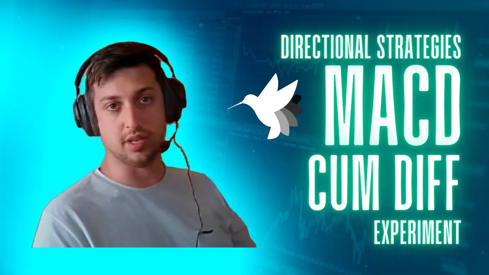
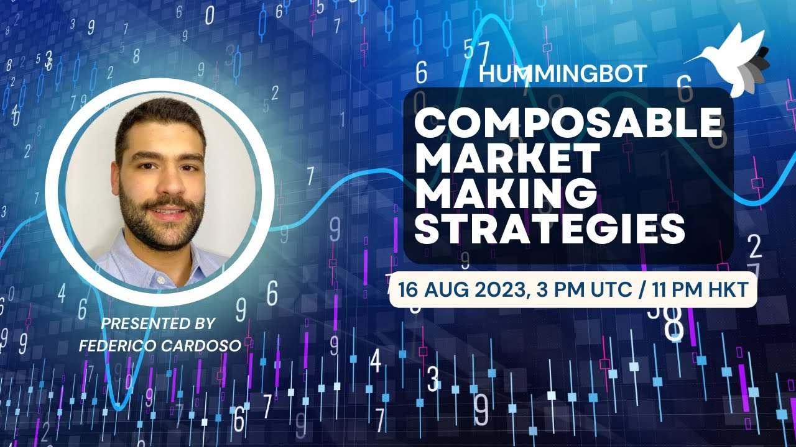
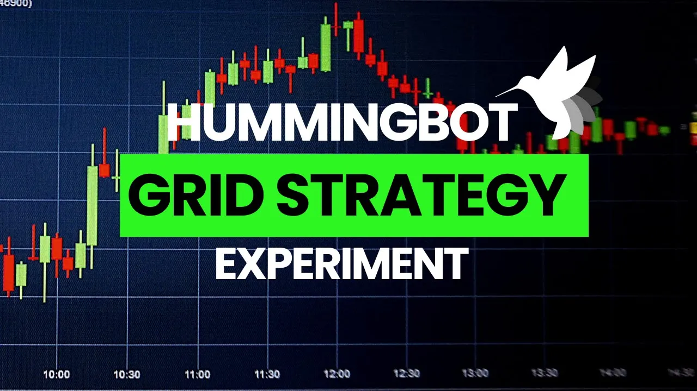

---
hide:
 - navigation
 - toc
---

# Hummingbot Academy

### Free resources that help you understand the basics of algo trading and market making.

 

[See All Articles](tags.md){ .md-button .md-button--primary }

[Accelerate Your Learning With Botcamp](/botcamp){ .md-button }

---

## Trading Concepts

-   
-   
-   

## Basic Strategies

-   
-   
-   

## Advanced Strategies

-   
-   
-   
-   
-   
-   

