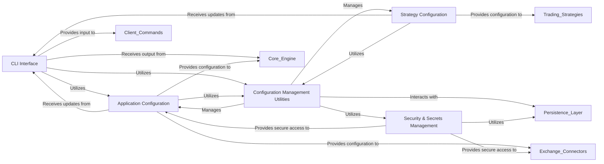
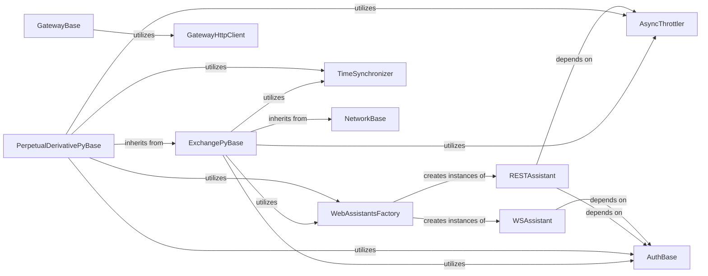
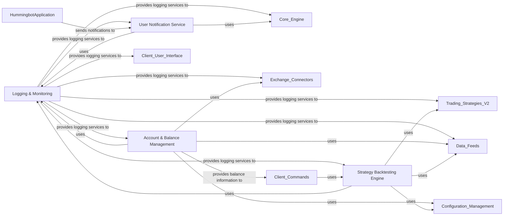

# Hummingbot Architecture Overview

```mermaid
graph LR
    Core_Orchestration_Engine_COE_["Core Orchestration Engine (COE)"]
    User_Interface_Configuration_UIC_["User Interface & Configuration (UIC)"]
    Exchange_Gateway_Integration_EGI_["Exchange & Gateway Integration (EGI)"]
    Market_Intelligence_Data_MID_["Market Intelligence & Data (MID)"]
    Trading_Logic_Order_Management_TLOM_["Trading Logic & Order Management (TLOM)"]
    Performance_Reporting_PR_["Performance & Reporting (PR)"]
    Core_Orchestration_Engine_COE_ -- "orchestrates" --> User_Interface_Configuration_UIC_
    Core_Orchestration_Engine_COE_ -- "initializes" --> Exchange_Gateway_Integration_EGI_
    Core_Orchestration_Engine_COE_ -- "initializes" --> Market_Intelligence_Data_MID_
    Core_Orchestration_Engine_COE_ -- "manages" --> Trading_Logic_Order_Management_TLOM_
    Core_Orchestration_Engine_COE_ -- "sends events to" --> Performance_Reporting_PR_
    User_Interface_Configuration_UIC_ -- "configures" --> Core_Orchestration_Engine_COE_
    User_Interface_Configuration_UIC_ -- "configures" --> Exchange_Gateway_Integration_EGI_
    User_Interface_Configuration_UIC_ -- "configures" --> Trading_Logic_Order_Management_TLOM_
    Performance_Reporting_PR_ -- "reports to" --> User_Interface_Configuration_UIC_
    Exchange_Gateway_Integration_EGI_ -- "reports events to" --> Core_Orchestration_Engine_COE_
    Exchange_Gateway_Integration_EGI_ -- "feeds" --> Market_Intelligence_Data_MID_
    Exchange_Gateway_Integration_EGI_ -- "updates" --> Trading_Logic_Order_Management_TLOM_
    Trading_Logic_Order_Management_TLOM_ -- "requests" --> Exchange_Gateway_Integration_EGI_
    Exchange_Gateway_Integration_EGI_ -- "reports to" --> Performance_Reporting_PR_
    Market_Intelligence_Data_MID_ -- "feeds" --> Trading_Logic_Order_Management_TLOM_
    Market_Intelligence_Data_MID_ -- "feeds" --> Performance_Reporting_PR_
    Trading_Logic_Order_Management_TLOM_ -- "reports to" --> User_Interface_Configuration_UIC_
    Trading_Logic_Order_Management_TLOM_ -- "reports to" --> Performance_Reporting_PR_
    Performance_Reporting_PR_ -- "reports to" --> User_Interface_Configuration_UIC_
    click Core_Orchestration_Engine_COE_ href "#core-orchestration-engine-coe" "Details"
    click User_Interface_Configuration_UIC_ href "#user-interface-configuration-uic" "Details"
    click Exchange_Gateway_Integration_EGI_ href "#exchange-gateway-integration-egi" "Details"
    click Performance_Reporting_PR_ href "#performance-reporting-pr" "Details"
```

!!! info "Documentation and Diagrams Generated with CodeBoarding"
    This architecture documentation was generated using [CodeBoarding](https://codeboarding.org), a tool that uses Static Analysis and AI to analyze codebases and automatically generates detailed technical documentation.

## Overview

### Core Orchestration Engine (COE) [[Details]](#core-orchestration-engine-coe)
The central orchestrator of the Hummingbot application. It manages the bot's lifecycle, initializes core services, dispatches system-wide events, and coordinates the overall operation of all other components.

**Related Classes/Methods**:

- <a href="https://github.com/hummingbot/hummingbot/blob/master/hummingbot/client/hummingbot_application.py#L1-L1" target="_blank" rel="noopener noreferrer">`hummingbot/client/hummingbot_application.py` (1:1)</a>
- `hummingbot/core/clock.pyx` (1:1)
- <a href="https://github.com/hummingbot/hummingbot/blob/master/hummingbot/core/network_base.py#L1-L1" target="_blank" rel="noopener noreferrer">`hummingbot/core/network_base.py` (1:1)</a>

### User Interface & Configuration (UIC) [[Details]](#user-interface-configuration-uic)
Provides the interactive command-line interface (CLI) for users to interact with the bot, input commands, and view real-time status updates and logs. It also handles loading, saving, validating, and migrating all application and strategy configurations, including sensitive API keys and global settings.

**Related Classes/Methods**:

- <a href="https://github.com/hummingbot/hummingbot/blob/master/hummingbot/client/ui/hummingbot_cli.py#L1-L1" target="_blank" rel="noopener noreferrer">`hummingbot/client/ui/hummingbot_cli.py` (1:1)</a>
- <a href="https://github.com/hummingbot/hummingbot/blob/master/hummingbot/client/ui/completer.py#L1-L1" target="_blank" rel="noopener noreferrer">`hummingbot/client/ui/completer.py` (1:1)</a>
- <a href="https://github.com/hummingbot/hummingbot/blob/master/hummingbot/client/config/config_helpers.py#L1-L1" target="_blank" rel="noopener noreferrer">`hummingbot/client/config/config_helpers.py` (1:1)</a>
- <a href="https://github.com/hummingbot/hummingbot/blob/master/hummingbot/client/config/client_config_map.py#L1-L1" target="_blank" rel="noopener noreferrer">`hummingbot/client/config/client_config_map.py` (1:1)</a>
- <a href="https://github.com/hummingbot/hummingbot/blob/master/hummingbot/client/config/security.py#L1-L1" target="_blank" rel="noopener noreferrer">`hummingbot/client/config/security.py` (1:1)</a>

### Exchange & Gateway Integration (EGI) [[Details]](#exchange-gateway-integration-egi)
Provides standardized interfaces for interacting with various centralized exchanges (CEX) and decentralized exchanges (DEX) for both spot and perpetual markets. It handles order placement, cancellation, balance updates, and adheres to trading rules, including low-level API communication and rate limiting.

**Related Classes/Methods**:

- <a href="https://github.com/hummingbot/hummingbot/blob/master/hummingbot/connector/exchange_py_base.py#L1-L1" target="_blank" rel="noopener noreferrer">`hummingbot/connector/exchange_py_base.py` (1:1)</a>
- <a href="https://github.com/hummingbot/hummingbot/blob/master/hummingbot/connector/derivative_base.py#L1-L1" target="_blank" rel="noopener noreferrer">`hummingbot/connector/derivative_base.py` (1:1)</a>
- <a href="https://github.com/hummingbot/hummingbot/blob/master/hummingbot/connector/exchange/binance/binance_exchange.py#L1-L1" target="_blank" rel="noopener noreferrer">`hummingbot/connector/exchange/binance/binance_exchange.py` (1:1)</a>
- <a href="https://github.com/hummingbot/hummingbot/blob/master/hummingbot/core/gateway/gateway_http_client.py#L1-L1" target="_blank" rel="noopener noreferrer">`hummingbot/core/gateway/gateway_http_client.py` (1:1)</a>
- <a href="https://github.com/hummingbot/hummingbot/blob/master/hummingbot/connector/gateway/gateway_base.py#L1-L1" target="_blank" rel="noopener noreferrer">`hummingbot/connector/gateway/gateway_base.py` (1:1)</a>
- <a href="https://github.com/hummingbot/hummingbot/blob/master/hummingbot/core/web_assistant/web_assistants_factory.py#L1-L1" target="_blank" rel="noopener noreferrer">`hummingbot/core/web_assistant/web_assistants_factory.py` (1:1)</a>
- <a href="https://github.com/hummingbot/hummingbot/blob/master/hummingbot/core/web_assistant/rest_assistant.py#L1-L1" target="_blank" rel="noopener noreferrer">`hummingbot/core/web_assistant/rest_assistant.py` (1:1)</a>
- <a href="https://github.com/hummingbot/hummingbot/blob/master/hummingbot/core/web_assistant/ws_assistant.py#L1-L1" target="_blank" rel="noopener noreferrer">`hummingbot/core/web_assistant/ws_assistant.py` (1:1)</a>
- <a href="https://github.com/hummingbot/hummingbot/blob/master/hummingbot/core/api_throttler/async_throttler.py#L1-L1" target="_blank" rel="noopener noreferrer">`hummingbot/core/api_throttler/async_throttler.py` (1:1)</a>

### Market Intelligence & Data (MID)
Aggregates and processes external market data, such as historical candles, real-time prices, and order book depth. It also provides real-time and historical exchange rate conversions between different assets, crucial for cross-market calculations and strategy logic.

**Related Classes/Methods**:

- <a href="https://github.com/hummingbot/hummingbot/blob/master/hummingbot/data_feed/market_data_provider.py#L1-L1" target="_blank" rel="noopener noreferrer">`hummingbot/data_feed/market_data_provider.py` (1:1)</a>
- <a href="https://github.com/hummingbot/hummingbot/blob/master/hummingbot/data_feed/candles_feed/candles_base.py#L1-L1" target="_blank" rel="noopener noreferrer">`hummingbot/data_feed/candles_feed/candles_base.py` (1:1)</a>
- <a href="https://github.com/hummingbot/hummingbot/blob/master/hummingbot/data_feed/coin_gecko_data_feed/coin_gecko_data_feed.py#L1-L1" target="_blank" rel="noopener noreferrer">`hummingbot/data_feed/coin_gecko_data_feed/coin_gecko_data_feed.py` (1:1)</a>
- <a href="https://github.com/hummingbot/hummingbot/blob/master/hummingbot/core/data_type/order_book_tracker.py#L1-L1" target="_blank" rel="noopener noreferrer">`hummingbot/core/data_type/order_book_tracker.py` (1:1)</a>
- <a href="https://github.com/hummingbot/hummingbot/blob/master/hummingbot/core/data_type/user_stream_tracker.py#L1-L1" target="_blank" rel="noopener noreferrer">`hummingbot/core/data_type/user_stream_tracker.py` (1:1)</a>
- <a href="https://github.com/hummingbot/hummingbot/blob/master/hummingbot/core/rate_oracle/rate_oracle.py#L1-L1" target="_blank" rel="noopener noreferrer">`hummingbot/core/rate_oracle/rate_oracle.py` (1:1)</a>
- <a href="https://github.com/hummingbot/hummingbot/blob/master/hummingbot/core/rate_oracle/sources/rate_source_base.py#L1-L1" target="_blank" rel="noopener noreferrer">`hummingbot/core/rate_oracle/sources/rate_source_base.py` (1:1)</a>

### Trading Logic & Order Management (TLOM)
Implements various pre-defined algorithmic trading strategies (V1) and provides a modular framework for advanced strategies (V2). It tracks the lifecycle and state of all active orders placed by the bot, ensuring accurate order status, and manages the storage and retrieval of historical trading data.

**Related Classes/Methods**:

- `hummingbot/strategy/pure_market_making/pure_market_making.pyx` (1:1)
- <a href="https://github.com/hummingbot/hummingbot/blob/master/hummingbot/strategy/amm_arb/amm_arb.py#L1-L1" target="_blank" rel="noopener noreferrer">`hummingbot/strategy/amm_arb/amm_arb.py` (1:1)</a>
- `hummingbot/strategy_v2/strategy_v2_base.py` (1:1)
- <a href="https://github.com/hummingbot/hummingbot/blob/master/hummingbot/strategy_v2/controllers/controller_base.py#L1-L1" target="_blank" rel="noopener noreferrer">`hummingbot/strategy_v2/controllers/controller_base.py` (1:1)</a>
- <a href="https://github.com/hummingbot/hummingbot/blob/master/hummingbot/strategy_v2/executors/executor_base.py#L1-L1" target="_blank" rel="noopener noreferrer">`hummingbot/strategy_v2/executors/executor_base.py` (1:1)</a>
- <a href="https://github.com/hummingbot/hummingbot/blob/master/hummingbot/connector/client_order_tracker.py#L1-L1" target="_blank" rel="noopener noreferrer">`hummingbot/connector/client_order_tracker.py` (1:1)</a>
- <a href="https://github.com/hummingbot/hummingbot/blob/master/hummingbot/core/data_type/in_flight_order.py#L1-L1" target="_blank" rel="noopener noreferrer">`hummingbot/core/data_type/in_flight_order.py` (1:1)</a>
- <a href="https://github.com/hummingbot/hummingbot/blob/master/hummingbot/model/sql_connection_manager.py#L1-L1" target="_blank" rel="noopener noreferrer">`hummingbot/model/sql_connection_manager.py` (1:1)</a>
- <a href="https://github.com/hummingbot/hummingbot/blob/master/hummingbot/model/trade_fill.py#L1-L1" target="_blank" rel="noopener noreferrer">`hummingbot/model/trade_fill.py` (1:1)</a>
- <a href="https://github.com/hummingbot/hummingbot/blob/master/hummingbot/model/order.py#L1-L1" target="_blank" rel="noopener noreferrer">`hummingbot/model/order.py` (1:1)

### Performance & Reporting (PR) [[Details]](#performance-reporting-pr)
Manages the logging of all bot operations, errors, and performance metrics. It provides mechanisms for sending user notifications, tracks consolidated user asset balances across exchanges, and includes a backtesting engine for simulating strategies with historical data.

**Related Classes/Methods**:

- <a href="https://github.com/hummingbot/hummingbot/blob/master/hummingbot/logger/logger.py#L1-L1" target="_blank" rel="noopener noreferrer">`hummingbot/logger/logger.py` (1:1)</a>
- <a href="https://github.com/hummingbot/hummingbot/blob/master/hummingbot/logger/log_server_client.py#L1-L1" target="_blank" rel="noopener noreferrer">`hummingbot/logger/log_server_client.py` (1:1)</a>
- <a href="https://github.com/hummingbot/hummingbot/blob/master/hummingbot/notifier/notifier_base.py#L1-L1" target="_blank" rel="noopener noreferrer">`hummingbot/notifier/notifier_base.py` (1:1)</a>
- <a href="https://github.com/hummingbot/hummingbot/blob/master/hummingbot/user/user_balances.py#L1-L1" target="_blank" rel="noopener noreferrer">`hummingbot/user/user_balances.py` (1:1)</a>
- <a href="https://github.com/hummingbot/hummingbot/blob/master/hummingbot/remote_iface/mqtt.py#L1-L1" target="_blank" rel="noopener noreferrer">`hummingbot/remote_iface/mqtt.py` (1:1)</a>
- <a href="https://github.com/hummingbot/hummingbot/blob/master/hummingbot/strategy_v2/backtesting/backtesting_engine_base.py#L1-L1" target="_blank" rel="noopener noreferrer">`hummingbot/strategy_v2/backtesting/backtesting_engine_base.py` (1:1)</a>
- <a href="https://github.com/hummingbot/hummingbot/blob/master/hummingbot/strategy_v2/backtesting/backtesting_data_provider.py#L1-L1" target="_blank" rel="noopener noreferrer">`hummingbot/strategy_v2/backtesting/backtesting_data_provider.py` (1:1)</a>

## Core Orchestration Engine (COE)

```mermaid
graph LR
    Hummingbot_Application_COE_Core_["Hummingbot Application (COE Core)"]
    Clock["Clock"]
    Event_Management_System["Event Management System"]
    Configuration_Manager["Configuration Manager"]
    Persistence_Layer["Persistence Layer"]
    Exchange_Connectors["Exchange Connectors"]
    Trading_Strategies["Trading Strategies"]
    Market_Data_Feeds["Market Data Feeds"]
    Client_User_Interface_CLI_["Client User Interface (CLI)"]
    Web_Assistant_Network_Utilities["Web Assistant / Network Utilities"]
    Hummingbot_Application_COE_Core_ -- "manages" --> Trading_Strategies
    Hummingbot_Application_COE_Core_ -- "initializes" --> Exchange_Connectors
    Hummingbot_Application_COE_Core_ -- "uses" --> Clock
    Hummingbot_Application_COE_Core_ -- "interacts with" --> Client_User_Interface_CLI_
    Clock -- "provides timing to" --> Hummingbot_Application_COE_Core_
    Clock -- "emits events to" --> Event_Management_System
    Event_Management_System -- "dispatches events to" --> Trading_Strategies
    Exchange_Connectors -- "receives events from" --> Event_Management_System
    Configuration_Manager -- "provides settings to" --> Hummingbot_Application_COE_Core_
    Configuration_Manager -- "configures" --> Trading_Strategies
    Persistence_Layer -- "stores data from" --> Trading_Strategies
    Hummingbot_Application_COE_Core_ -- "initializes" --> Persistence_Layer
    Exchange_Connectors -- "executes orders for" --> Trading_Strategies
    Exchange_Connectors -- "provides data to" --> Market_Data_Feeds
    Exchange_Connectors -- "uses" --> Web_Assistant_Network_Utilities
    Exchange_Connectors -- "publishes events to" --> Event_Management_System
    Trading_Strategies -- "requests orders from" --> Exchange_Connectors
    Trading_Strategies -- "consumes data from" --> Market_Data_Feeds
    Market_Data_Feeds -- "supplies data to" --> Trading_Strategies
    Market_Data_Feeds -- "uses" --> Web_Assistant_Network_Utilities
    Client_User_Interface_CLI_ -- "sends commands to" --> Hummingbot_Application_COE_Core_
    Hummingbot_Application_COE_Core_ -- "displays information to" --> Client_User_Interface_CLI_
    Web_Assistant_Network_Utilities -- "provides network services to" --> Exchange_Connectors
    Web_Assistant_Network_Utilities -- "provides network services to" --> Market_Data_Feeds
```

The Core Orchestration Engine (COE) in Hummingbot serves as the central nervous system, coordinating all critical operations of the algorithmic trading platform. It ensures the bot's smooth lifecycle, from initialization to shutdown, by integrating and managing various core services. The COE's design emphasizes modularity and extensibility, allowing for flexible integration of different trading strategies, exchange connectors, and data sources, all communicating efficiently through an event-driven architecture.

### Hummingbot Application (COE Core)
The primary orchestrator of the Hummingbot application. It manages the bot's overall lifecycle, initializes and coordinates all other core components, and integrates user interaction.

**Related Classes/Methods**:

- <a href="https://github.com/hummingbot/hummingbot/blob/master/hummingbot/client/hummingbot_application.py" target="_blank" rel="noopener noreferrer">`hummingbot.client.hummingbot_application`</a>

### Clock
Provides the fundamental time-based pulse for the entire application, ensuring all time-sensitive operations and scheduled tasks are synchronized.

**Related Classes/Methods**:

- <a href="https://github.com/hummingbot/hummingbot/blob/master/bin/hummingbot.py" target="_blank" rel="noopener noreferrer">`hummingbot.core.clock`</a>

### Event Management System
Facilitates decoupled communication and coordination between all components through a robust event-driven architecture, allowing components to react to system-wide events.

**Related Classes/Methods**:

- <a href="https://github.com/hummingbot/hummingbot/blob/master/hummingbot/core/event/event_forwarder.py" target="_blank" rel="noopener noreferrer">`hummingbot.core.event.event_forwarder`</a>

### Configuration Manager
Responsible for loading, saving, and applying the bot's configuration settings, including API keys, strategy parameters, and general application preferences.

**Related Classes/Methods**:

- <a href="https://github.com/hummingbot/hummingbot/blob/master/hummingbot/client/config/client_config_map.py" target="_blank" rel="noopener noreferrer">`hummingbot.client.config.client_config_map`</a>

### Persistence Layer
Manages the connection to the database and handles the logging and persistence of critical operational data, such as trade fills, order statuses, and balance updates.

**Related Classes/Methods**:

- <a href="https://github.com/hummingbot/hummingbot/blob/master/hummingbot/model/sql_connection_manager.py" target="_blank" rel="noopener noreferrer">`hummingbot.model.sql_connection_manager`</a>

### Exchange Connectors
Modules that provide the interface for interacting with various cryptocurrency exchanges (both spot and perpetual). They handle order placement, cancellation, balance queries, and receiving real-time trade and order updates.

**Related Classes/Methods**:

- <a href="https://github.com/hummingbot/hummingbot/blob/master/hummingbot/connector/exchange_py_base.py" target="_blank" rel="noopener noreferrer">`hummingbot.connector.exchange_py_base`</a>
- <a href="https://github.com/hummingbot/hummingbot/blob/master/hummingbot/connector/perpetual_derivative_py_base.py" target="_blank" rel="noopener noreferrer">`hummingbot.connector.perpetual_derivative_py_base`</a>

### Trading Strategies
Encapsulates the algorithmic trading logic and decision-making processes. Strategies consume market data, generate trading signals, and issue orders to exchange connectors.

**Related Classes/Methods**:

- <a href="https://github.com/hummingbot/hummingbot/blob/master/hummingbot/strategy/script_strategy_base.py" target="_blank" rel="noopener noreferrer">`hummingbot.strategy.script_strategy_base`</a>
- <a href="https://github.com/hummingbot/hummingbot/blob/master/hummingbot/strategy_v2/controllers/controller_base.py" target="_blank" rel="noopener noreferrer">`hummingbot.strategy_v2.controllers.controller_base`</a>

### Market Data Feeds
Components responsible for fetching and providing real-time and historical market data, such as order books, trade histories, and candlestick data, from various sources.

**Related Classes/Methods**:

- <a href="https://github.com/hummingbot/hummingbot/blob/master/hummingbot/data_feed/data_feed_base.py" target="_blank" rel="noopener noreferrer">`hummingbot.data_feed.data_feed_base`</a>

### Client User Interface (CLI)
The primary command-line interface for users to interact with the bot. It allows for configuration, starting/stopping strategies, and monitoring the bot's status and performance.

**Related Classes/Methods**:

- <a href="https://github.com/hummingbot/hummingbot/blob/master/hummingbot/client/ui/hummingbot_cli.py" target="_blank" rel="noopener noreferrer">`hummingbot.client.ui.hummingbot_cli`</a>

### Web Assistant / Network Utilities
Provides foundational utilities for secure and efficient network communication, including managing HTTP requests, WebSocket connections, and API rate limiting.

**Related Classes/Methods**:

- <a href="https://github.com/hummingbot/hummingbot/blob/master/hummingbot/core/web_assistant/web_assistants_factory.py" target="_blank" rel="noopener noreferrer">`hummingbot.core.web_assistant.web_assistants_factory`</a>
- <a href="https://github.com/hummingbot/hummingbot/blob/master/hummingbot/core/network_base.py" target="_blank" rel="noopener noreferrer">`hummingbot.core.network_base`</a>

## User Interface & Configuration (UIC)

The User Interface & Configuration (UIC) subsystem in Hummingbot serves as the primary point of interaction for users and the central hub for managing all application and strategy configurations. It is designed to provide a robust, intuitive, and secure environment for controlling and monitoring the bot's operations.

### CLI Interface
This component provides the interactive command-line interface (CLI) through which users interact with Hummingbot. It is responsible for displaying real-time status updates, logs, and market data, as well as processing user commands and inputs. It ensures a responsive and user-friendly environment for bot control and monitoring.

**Related Classes/Methods**:

- <a href="https://github.com/hummingbot/hummingbot/blob/master/hummingbot/client/ui/hummingbot_cli.py#L51-L276" target="_blank" rel="noopener noreferrer">`hummingbot.client.ui.hummingbot_cli.HummingbotCLI` (51:276)</a>
- <a href="https://github.com/hummingbot/hummingbot/blob/master/hummingbot/client/ui/completer.py#L1-L1" target="_blank" rel="noopener noreferrer">`hummingbot.client.ui.completer` (1:1)</a>
- <a href="https://github.com/hummingbot/hummingbot/blob/master/hummingbot/client/ui/parser.py#L1-L1" target="_blank" rel="noopener noreferrer">`hummingbot.client.ui.parser` (1:1)</a>
- <a href="https://github.com/hummingbot/hummingbot/blob/master/hummingbot/client/ui/layout.py#L1-L1" target="_blank" rel="noopener noreferrer">`hummingbot.client.ui.layout` (1:1)</a>
- <a href="https://github.com/hummingbot/hummingbot/blob/master/hummingbot/client/ui/style.py#L1-L1" target="_blank" rel="noopener noreferrer">`hummingbot.client.ui.style` (1:1)</a>
- <a href="https://github.com/hummingbot/hummingbot/blob/master/hummingbot/client/ui/custom_widgets.py#L1-L1" target="_blank" rel="noopener noreferrer">`hummingbot.client.ui.custom_widgets` (1:1)</a>

### Application Configuration
This component defines and manages the global, client-specific, and connector-specific settings for the entire Hummingbot application. It uses structured data maps to store various parameters, ensuring consistent behavior across different modules.

**Related Classes/Methods**:

- <a href="https://github.com/hummingbot/hummingbot/blob/master/hummingbot/client/config/client_config_map.py#L684-L932" target="_blank" rel="noopener noreferrer">`hummingbot.client.config.client_config_map.ClientConfigMap` (684:932)</a>
- <a href="https://github.com/hummingbot/hummingbot/blob/master/hummingbot/client/config/global_config_map.py#L1-L1" target="_blank" rel="noopener noreferrer">`hummingbot.client.config.global_config_map` (1:1)</a>
- <a href="https://github.com/hummingbot/hummingbot/blob/master/hummingbot/client/config/config_data_types.py#L1-L1" target="_blank" rel="noopener noreferrer">`hummingbot.client.config.config_data_types` (1:1)</a>
- <a href="https://github.com/hummingbot/hummingbot/blob/master/hummingbot/client/config/fee_overrides_config_map.py#L1-L1" target="_blank" rel="noopener noreferrer">`hummingbot.client.config.fee_overrides_config_map` (1:1)</a>
- <a href="https://github.com/hummingbot/hummingbot/blob/master/hummingbot/client/config/gateway_ssl_config_map.py#L1-L1" target="_blank" rel="noopener noreferrer">`hummingbot.client.config.gateway_ssl_config_map` (1:1)</a>

### Configuration Management Utilities
This component provides a set of helper functions and adapters responsible for the lifecycle management of configurations. This includes loading configurations from storage, saving changes, validating inputs against defined schemas, and migrating configurations between different software versions to maintain compatibility.

**Related Classes/Methods**:

- <a href="https://github.com/hummingbot/hummingbot/blob/master/hummingbot/client/config/config_helpers.py#L57-L334" target="_blank" rel="noopener noreferrer">`hummingbot.client.config.config_helpers.ClientConfigAdapter` (57:334)</a>
- <a href="https://github.com/hummingbot/hummingbot/blob/master/hummingbot/client/config/config_helpers.py#L337-L346" target="_blank" rel="noopener noreferrer">`hummingbot.client.config.config_helpers.ReadOnlyClientConfigAdapter` (337:346)</a>
- <a href="https://github.com/hummingbot/hummingbot/blob/master/hummingbot/client/config/config_validators.py#L1-L1" target="_blank" rel="noopener noreferrer">`hummingbot.client.config.config_validators` (1:1)</a>
- <a href="https://github.com/hummingbot/hummingbot/blob/master/hummingbot/client/config/conf_migration.py#L1-L1" target="_blank" rel="noopener noreferrer">`hummingbot.client.config.conf_migration` (1:1)</a>
- <a href="https://github.com/hummingbot/hummingbot/blob/master/hummingbot/client/config/config_methods.py#L1-L1" target="_blank" rel="noopener noreferrer">`hummingbot.client.config.config_methods` (1:1)</a>
- <a href="https://github.com/hummingbot/hummingbot/blob/master/hummingbot/client/config/config_var.py#L1-L1" target="_blank" rel="noopener noreferrer">`hummingbot.client.config.config_var` (1:1)</a>

### Security & Secrets Management
This component is dedicated to the secure handling of sensitive user data, primarily API keys and other credentials. It provides mechanisms for encrypting, storing, and retrieving these secrets, protecting them from unauthorized access.

**Related Classes/Methods**:

- <a href="https://github.com/hummingbot/hummingbot/blob/master/hummingbot/client/config/security.py#L1-L1" target="_blank" rel="noopener noreferrer">`hummingbot.client.config.security.BaseSecretsManager` (1:1)</a>
- <a href="https://github.com/hummingbot/hummingbot/blob/master/hummingbot/client/config/config_crypt.py#L1-L1" target="_blank" rel="noopener noreferrer">`hummingbot.client.config.config_crypt` (1:1)</a>

### Strategy Configuration
This component specifically manages the parameters and settings for individual trading strategies. It allows users to define and customize how each strategy operates, including market pairs, order sizes, and specific algorithmic parameters.

**Related Classes/Methods**:

- <a href="https://github.com/hummingbot/hummingbot/blob/master/hummingbot/client/config/strategy_config_data_types.py#L12-L27" target="_blank" rel="noopener noreferrer">`hummingbot.client.config.strategy_config_data_types.BaseStrategyConfigMap` (12:27)</a>
- <a href="https://github.com/hummingbot/hummingbot/blob/master/hummingbot/client/config/strategy_config_data_types.py#L30-L65" target="_blank" rel="noopener noreferrer">`hummingbot.client.config.strategy_config_data_types.BaseTradingStrategyConfigMap` (30:65)</a>

## Exchange Gateway Integration (EGI)

### ExchangePyBase
Serves as the abstract base class for all centralized exchange (CEX) spot connectors. It defines the common interface and fundamental functionalities that every spot exchange connector must implement, such as order placement, cancellation, balance tracking, and market data handling.

**Related Classes/Methods**:

- <a href="https://github.com/hummingbot/hummingbot/blob/master/hummingbot/connector/exchange_py_base.py#L39-L1096" target="_blank" rel="noopener noreferrer">`hummingbot.connector.exchange_py_base.ExchangePyBase` (39:1096)</a>

### PerpetualDerivativePyBase
Serves as the abstract base class for all perpetual derivative exchange connectors. It extends ExchangePyBase and defines functionalities specific to perpetual markets, including position management, funding rates, and leverage.

**Related Classes/Methods**:

- <a href="https://github.com/hummingbot/hummingbot/blob/master/hummingbot/connector/perpetual_derivative_py_base.py#L27-L437" target="_blank" rel="noopener noreferrer">`hummingbot.connector.perpetual_derivative_py_base.PerpetualDerivativePyBase` (27:437)</a>

### GatewayBase
Serves as the abstract base class for all decentralized exchange (DEX) and gateway connectors. It defines the interface for interacting with the Hummingbot Gateway, which mediates communication with various blockchain networks and DEX protocols.

**Related Classes/Methods**:

- <a href="https://github.com/hummingbot/hummingbot/blob/master/hummingbot/connector/gateway/gateway_base.py#L31-L569" target="_blank" rel="noopener noreferrer">`hummingbot.connector.gateway.gateway_base.GatewayBase` (31:569)</a>

### GatewayHttpClient
Handles HTTP communication with the Hummingbot Gateway. It is responsible for sending requests to the Gateway and receiving responses, forming the direct communication layer for DEX interactions.

**Related Classes/Methods**:

- <a href="https://github.com/hummingbot/hummingbot/blob/master/hummingbot/core/gateway/gateway_http_client.py#L44-L781" target="_blank" rel="noopener noreferrer">`hummingbot.core.gateway.gateway_http_client.GatewayHttpClient` (44:781)</a>

### WebAssistantsFactory
A factory class responsible for creating and managing instances of RESTAssistant and WSAssistant. It ensures that web communication components are properly initialized and configured for each connector.

**Related Classes/Methods**:

- <a href="https://github.com/hummingbot/hummingbot/blob/master/hummingbot/core/web_assistant/web_assistants_factory.py#L13-L80" target="_blank" rel="noopener noreferrer">`hummingbot.core.web_assistant.web_assistants_factory.WebAssistantsFactory` (13:80)</a>

### RESTAssistant
Provides a standardized way to make REST API calls to exchanges. It encapsulates logic for request signing, error handling, and response parsing for RESTful interactions.

**Related Classes/Methods**:

- <a href="https://github.com/hummingbot/hummingbot/blob/master/hummingbot/core/web_assistant/rest_assistant.py#L13-L124" target="_blank" rel="noopener noreferrer">`hummingbot.core.web_assistant.rest_assistant.RESTAssistant` (13:124)</a>

### WSAssistant
Provides a standardized way to manage WebSocket connections with exchanges for real-time market data and user stream updates. It handles connection establishment, message sending/receiving, and error handling for WebSocket interactions.

**Related Classes/Methods**:

- <a href="https://github.com/hummingbot/hummingbot/blob/master/hummingbot/core/web_assistant/ws_assistant.py#L10-L95" target="_blank" rel="noopener noreferrer">`hummingbot.core.web_assistant.ws_assistant.WSAssistant` (10:95)</a>

### AsyncThrottler
Manages and enforces API rate limits for all outgoing requests to exchanges. It prevents the bot from exceeding exchange-specific request limits, which could lead to temporary bans or degraded performance.

**Related Classes/Methods**:

- <a href="https://github.com/hummingbot/hummingbot/blob/master/hummingbot/core/api_throttler/async_throttler.py#L53-L80" target="_blank" rel="noopener noreferrer">`hummingbot.core.api_throttler.async_throttler.AsyncThrottler` (53:80)</a>

### AuthBase
An abstract base class defining the interface for authentication mechanisms. Concrete authentication classes for each exchange (e.g., BinanceAuth) inherit from this.

**Related Classes/Methods**:

- <a href="https://github.com/hummingbot/hummingbot/blob/master/hummingbot/core/web_assistant/auth.py#L5-L19" target="_blank" rel="noopener noreferrer">`hummingbot.core.web_assistant.auth.AuthBase` (5:19)</a>

### TimeSynchronizer
Synchronizes the bot's local time with the exchange's server time. This is critical for many exchange APIs that require requests to be timestamped accurately to prevent replay attacks and ensure order validity.

**Related Classes/Methods**:

- <a href="https://github.com/hummingbot/hummingbot/blob/master/hummingbot/connector/time_synchronizer.py#L11-L95" target="_blank" rel="noopener noreferrer">`hummingbot.connector.time_synchronizer.TimeSynchronizer` (11:95)</a>

### NetworkBase
Provides a foundational base for network-related functionalities, likely including common methods for managing network state and interactions.

**Related Classes/Methods**:

- <a href="https://github.com/hummingbot/hummingbot/blob/master/hummingbot/core/network_base.py#L12-L118" target="_blank" rel="noopener noreferrer">`hummingbot.core.network_base.NetworkBase` (12:118)</a>

## Performance & Reporting (PR)

The `Performance & Reporting (PR)` subsystem, as initially described, is a broad area encompassing several critical functionalities within the Hummingbot project. Based on the project's architectural patterns (Event-Driven, Modular/Plugin, Layered) and the provided related classes, it can be effectively broken down into four distinct and fundamental components: `Logging & Monitoring`, `User Notification Service`, `Account & Balance Management`, and `Strategy Backtesting Engine`. These components are essential for the operation, user interaction, and strategic development within an algorithmic trading platform.

### Logging & Monitoring
This component is responsible for capturing, formatting, and dispatching various types of logs, including operational messages, errors, and performance data. It provides a structured logging mechanism and can send logs to a remote server for centralized monitoring and analysis. It also handles application-specific warnings. This component is fundamental for debugging, auditing, and understanding the real-time behavior and health of the trading bot.

**Related Classes/Methods**:

- <a href="https://github.com/hummingbot/hummingbot/blob/master/hummingbot/logger/logger.py#L1-L1" target="_blank" rel="noopener noreferrer">`hummingbot.logger.logger` (1:1)</a>
- <a href="https://github.com/hummingbot/hummingbot/blob/master/hummingbot/logger/log_server_client.py#L1-L1" target="_blank" rel="noopener noreferrer">`hummingbot.logger.log_server_client` (1:1)</a>
- <a href="https://github.com/hummingbot/hummingbot/blob/master/hummingbot/logger/application_warning.py#L1-L1" target="_blank" rel="noopener noreferrer">`hummingbot.logger.application_warning` (1:1)</a>
- <a href="https://github.com/hummingbot/hummingbot/blob/master/hummingbot/logger/struct_logger.py#L1-L1" target="_blank" rel="noopener noreferrer">`hummingbot.logger.struct_logger` (1:1)</a>

### User Notification Service
This component is dedicated to sending real-time notifications to users about important bot events, such as trade executions, errors, or status updates. It abstracts the underlying communication mechanism, allowing for different notification channels (e.g., MQTT). This ensures users are promptly informed about critical events without needing to constantly monitor the bot's console.

**Related Classes/Methods**:

- <a href="https://github.com/hummingbot/hummingbot/blob/master/hummingbot/notifier/notifier_base.py#L1-L1" target="_blank" rel="noopener noreferrer">`hummingbot.notifier.notifier_base` (1:1)</a>
- <a href="https://github.com/hummingbot/hummingbot/blob/master/hummingbot/remote_iface/mqtt.py#L504-L533" target="_blank" rel="noopener noreferrer">`hummingbot.remote_iface.mqtt.MQTTNotifier` (504:533)</a>

### Account & Balance Management
This component is responsible for securely connecting to various cryptocurrency exchanges, retrieving, and consolidating user asset balances. It provides a unified view of the user's portfolio across different trading venues, which is essential for accurate risk management and strategy execution.

**Related Classes/Methods**:

- <a href="https://github.com/hummingbot/hummingbot/blob/master/hummingbot/user/user_balances.py#L1-L1" target="_blank" rel="noopener noreferrer">`hummingbot.user.user_balances` (1:1)</a>

### Strategy Backtesting Engine
This component provides a robust framework for simulating trading strategies against historical market data. It allows users to test and optimize their strategies without risking real capital, offering detailed performance metrics and insights. This is crucial for strategy development, validation, and risk assessment before live deployment.

**Related Classes/Methods**:

- <a href="https://github.com/hummingbot/hummingbot/blob/master/hummingbot/strategy_v2/backtesting/backtesting_engine_base.py#L1-L1" target="_blank" rel="noopener noreferrer">`hummingbot.strategy_v2.backtesting.backtesting_engine_base` (1:1)</a>
- <a href="https://github.com/hummingbot/hummingbot/blob/master/hummingbot/strategy_v2/backtesting/backtesting_data_provider.py#L1-L1" target="_blank" rel="noopener noreferrer">`hummingbot.strategy_v2.backtesting.backtesting_data_provider` (1:1)</a>
- <a href="https://github.com/hummingbot/hummingbot/blob/master/hummingbot/strategy_v2/backtesting/executor_simulator_base.py#L1-L1" target="_blank" rel="noopener noreferrer">`hummingbot.strategy_v2.backtesting.executor_simulator_base` (1:1)</a>
- <a href="https://github.com/hummingbot/hummingbot/blob/master/hummingbot/strategy_v2/backtesting/executors_simulator/dca_executor_simulator.py#L1-L1" target="_blank" rel="noopener noreferrer">`hummingbot.strategy_v2.backtesting.executors_simulator.dca_executor_simulator` (1:1)</a>
- <a href="https://github.com/hummingbot/hummingbot/blob/master/hummingbot/strategy_v2/backtesting/executors_simulator/position_executor_simulator.py#L1-L1" target="_blank" rel="noopener noreferrer">`hummingbot.strategy_v2.backtesting.executors_simulator.position_executor_simulator` (1:1)</a>

