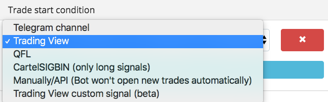
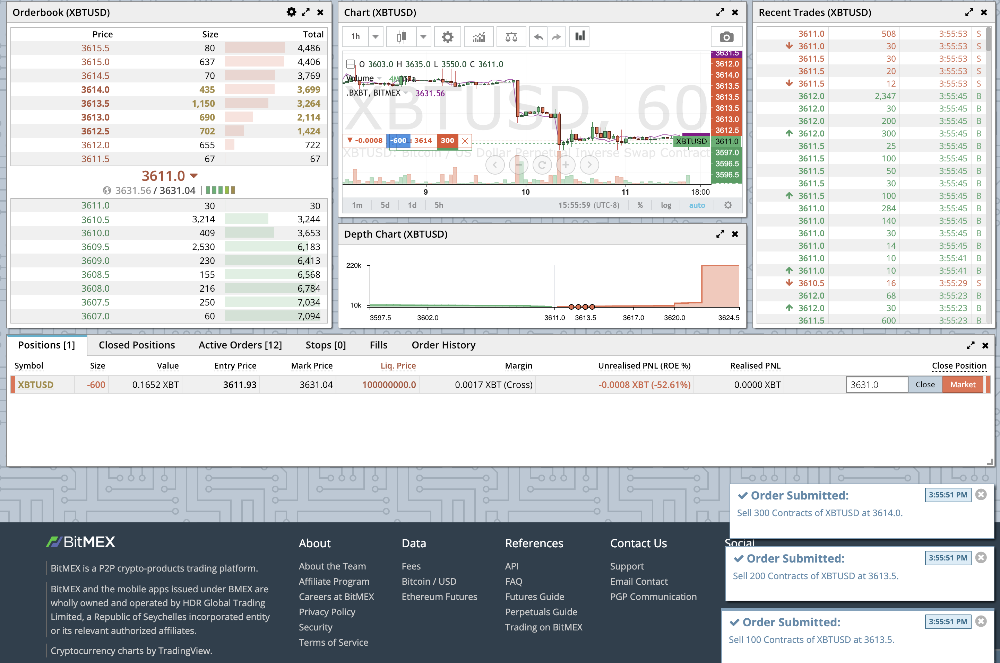
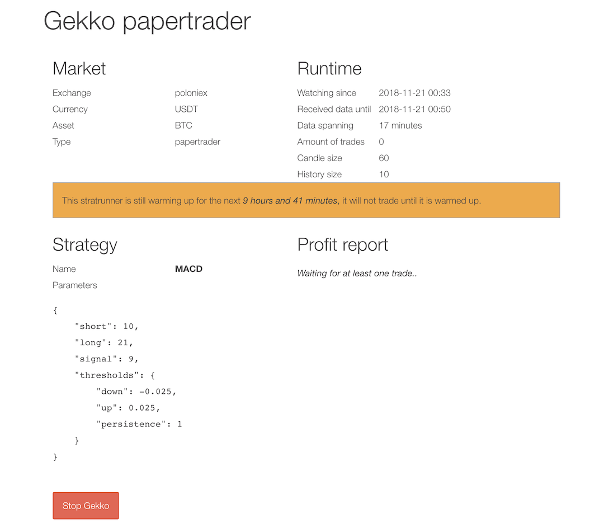
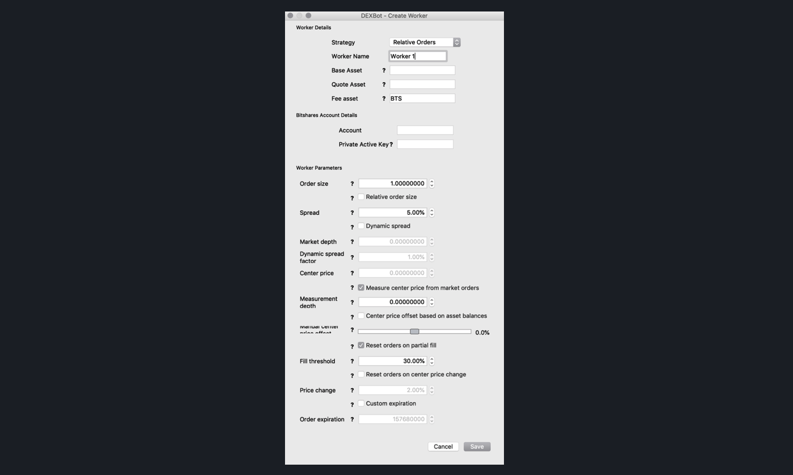
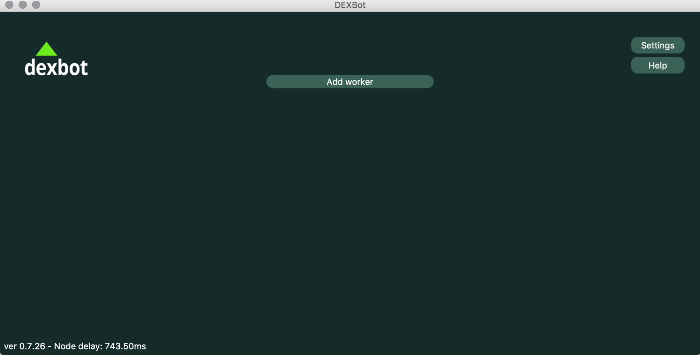
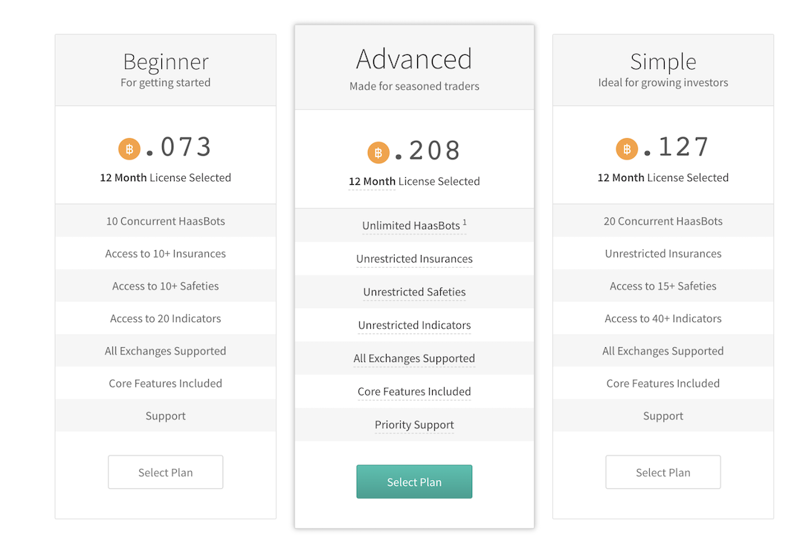

A great **user experience (UX)** is important for any product, but especially for one that automatically trades your hard-earned money, like a trading bot.  If a bot is hard to install, contains bugs, or stops working often, traders won't use it.

Since we're building Hummingbot, a cryptocurrency market making bot that anyone can run, we decided to try out some of the other crypto trading bots in the market to assess how hard or easy they were to use. Here's what we learned...

### Overview
Because cryptocurrency exchanges offer **direct market access** by making APIs available to individual traders, there are a number of software packages, both open source and commercial, that help traders run **bots** that execute automatic trading strategies. These bots focus on different strategies, such as technical analysis, arbitrage, and market making. Some bots specialize on a certain exchange, while others support multiple exchanges. Furthermore, some bots are designed exclusively for decentralized exchanges.

Due to the differences between these bots, assessing their relative trading performance would be an apples-to-oranges comparison. Instead, we decided to compare their relative ease of use of installation, configuration, and operation.

<!-- more -->

So far, we have tested the following bots:
* [3commas](#3commas)
* [BitMex sample market maker](#bitmex)
* [Gekko](#gekko)
* [Tribeca](#tribeca)
* [MakerDAO market maker keeper](#makerdao)
* [BitShares DEXBot](#dexbot)
* [HaasBot](#haasbot)

*Note that we will continue to assess these and other trading bots, so we plan on updating this post often.*

### 3Commas

[3commas](https://3commas.io/) is a popular web-based, closed-source trading bot that supports multiple exchanges and trading pairs. The bot allows users to set various parameters including stop-loss and target profit, base trader size, etc.

Getting started with 3commas is easy. Basically I created an account, and connected to exchanges using APi key and API secret that can be found on those exchanges. Having successfully connected to the exchange, a user will see his/her available fund balance on top of the page.

Now it comes to the more exciting part - setting up your bots! Overall, configuring the bot was straightforward through their intuitive form-based user interface:


3commas employs [TradingView](https://www.tradingview.com/) signals as indicators for trades.



We liked the clean and simple user interface, which works on both mobile and desktop. The trading and portfolio dashboards are intuitive and understandable by even beginner traders. It also contains a social trading element that allows you to copy other users' bot configurations. In addition, it boasts a very active and supportive Telegram community in which you can easily get answers to your questions.

Since it offers a free trial, we tested it out for a few days. While we didn't lose money, we only earned US\$0.30 from our 0.5 ETH investment during that time. This appeared to be consistent with the data provided by 3Commas, which shows that their average user has earned US\$8 lifetime profit so far.

One limitation of 3Commas is that its trading bot only supports Binance and Huobi. However, its smart trading tool, which allows users to set stop-loss and take-profit targets for their trades, supports more exchanges, including Coinbase Pro and Bitmex.

### Bitmex Sample Market Maker

The [Bitmex sample market maker bot](https://github.com/BitMEX/sample-market-maker) is open-source software maintained by Bitmex to help users act as market makers on their exchange. The installation was fairly straightforward. However, we did encounter Python version issues since we initially installed it locally on a Mac using the local version of Python 2 before realizing that the bot requires Python 3.5+. Afterwards, we used [Anaconda](https://www.anaconda.com/) to create a dedicated Python 3 environment for the bot, which allowed us to operate it alongside other applications that require Python 2.

Configuration is straightforward using parameters in a well-documented `settings.py` file. To get started, users just need to enter their Bitmex API key and have some BTC in their account. Users can define key market making parameters, such as number of bands, trade size per band, spread, etc. Upon saving any changes to the setting file, the bot automatically cancels all outstanding orders and restarts.

In addition, we appreciated that the Bitmex bot offers a few different modes to help users gain confidence before committing real capital:
* **Dry run mode**: the bot logs orders but doesn't submit them
* **Sandbox mode**: the bot creates orders in the BitMex sandbox exchange
* **Live mode**: the bot creates orders in the BitMex live exchange

While the bot is command line only and doesn't have a dedicated graphical user interface, the fact that bot trades appear on Bitmex was extremely helpful. Since the Bitmex user interface displays real-time notifications for orders submits, cancels, and fills, we gained confidence that the bot was behaving as expected.



We did, however, encounter an issue in which we set certain parameters with too much decimal precision. In response, the bot responds with a cryptic `Sanity check failed, exchange data is inconsistent` message. We recommend that BitMex handle these edge cases more gracefully by describing the problem and how users can solve it.

Finally, it's important to note that this bot is likely to lose money if users run it out of the box, a fact explicitly emphasized in the Github documentation. Users are encouraged to add custom trading

### Gekko

With 3000 downloads per month, [Gekko](https://github.com/askmike/gekko) is a popular, open source crypto trading bot.

For an open source product, it has many of the key features needed for automated trading. A simple browser-based user interface allows users to configure API keys. In addition, it contains a backtest tool that allows users to simulate strategies using historical data, as well as an active support forum. To avoid downloading overly large datasets, the Gekko web UI lets users choose the data they want to download, such as the specific exchange, dates and currency pairs.



On the downside, Gekko had to **warm up** for 10 hours before being able to trade. Also, it is limited to technical indicator-based trading strategies.

### Tribeca

[Tribeca](https://github.com/michaelgrosner/tribeca) is an open source market making bot for centralized crypto exchanges. It allows users to configure, backtest and run a bot that automatically sets and adjusts buy/sell orders, potentially profiting from the bid-ask spread.

Tribeca has a well-documented installation process. Using `docker-compose`, we were able to get the bot running within a few minutes. However, there were a number of warnings about discontinued or outdated `npm` package dependencies. This is natural since the project doesn't appear to be actively maintained o Github, with the last comments approximately one year ago.

However, configuring and successfully running the bot proved more challenging. While the [Tribeca wiki](https://github.com/michaelgrosner/tribeca/wiki) is extensive and detailed, the web-based user interface contains many parameters that users need to input in order to run the bot. Lacking default settings and/or explanation of what the parameters mean, the user interface is confusing for inexperienced traders.


The bot support Coinbase Pro, Bitfinex, OKCoin, and HitBTC. We tested the Coinbase Pro integration, which appears to work, but given the Github repo inactivity, we would not be surprised if there are issues with other exchanges.

### MakerDAO Market Maker Keeper

The DAI Stablecoin System incentivizes external agents, called keepers, to automate certain operations around the Ethereum blockchain. [Market Maker Keeper](https://github.com/makerdao/market-maker-keeper) is a set of keepers that currently facilitate market making on 13 exchanges that trade the MakerDAO-sponsored DAI stablecoin.

The initial setup requires familiarity with Python application execution and run environments. Note that we were not able to get the bot fully running since we got an error that we couldn’t figure out.

```
$ brew install python
pip install --upgrade virtualenv
```

```
$ curl https://nixos.org/nix/install | sh
source $HOME/.nix-profile/etc/profile.d/nix.sh
```

```
$ nix-channel --add https://nix.dapphub.com/pkgs/dapphub
$ nix-channel --update # => error: unable to download 'https://nix.dapphub.com/pkgs/dapphub': SSL peer certificate or SSH remote key was not OK (51)
$ nix-env -iA dapphub.{seth,jshon}
```
*Note: setzer install is currently failing*

```
# Parity command line
$ parity --unlock [“0xADDRESS”] --password /path/to/password.txt

# Or in config.toml
$ parity --config /path/to/config.toml

[account]
unlock = ["0xADDRESS"]
password = ["/path/to/password.txt"]
```
*Note: security risk; anyone who can access this node can send transactions from the unlocked account*

```
bin/oasis-market-maker-keeper \
    --rpc-host 127.0.0.1 \
    --rpc-port 8545 \
    --rpc-timeout 30 \
    --eth-from 0x00744446794297FbA0688e277723630A7EC2C595 \
    --tub-address 0x448a5065aebb8e423f0896e6c5d525c040f59af3 \
    --oasis-address 0x14fbca95be7e99c15cc2996c6c9d841e54b79425 \
    --price-feed eth_dai \
    --buy-token-address 0x89d24A6b4CcB1B6fAA2625fE562bDD9a23260359 \
    --sell-token-address 0xC02aaA39b223FE8D0A0e5C4F27eAD9083C756Cc2 \
    --config eth-dai-bands.json \
    --smart-gas-price \
    --min-eth-balance 0.2
```

```
2018-11-21 17:31:59,443 INFO     Approving OasisDEX (0x14FBCA95be7e99C15Cc2996c6C9d841e54B79425) to access our 0xC02aaA39b223FE8D0A0e5C4F27eAD9083C756Cc2 directly
2018-11-21 17:31:59,461 WARNING  Failed to send transaction ERC20Token('0xC02aaA39b223FE8D0A0e5C4F27eAD9083C756Cc2').approve(address,uint256)(['0x14FBCA95be7e99C15Cc2996c6C9d841e54B79425', <_big number_>]) with nonce=None, gas=147176, gas_price=8800000000
Traceback (most recent call last):
 ...
  File "/usr/local/lib/python3.7/site-packages/web3/manager.py", line 110, in request_blocking
    raise ValueError(response["error"])
ValueError: {'code': -32601, 'message': 'Method not found'}
```

From discussions with the folks at MakerDAO, they know that the market maker bot works because they use it internally to make markets in DAI. However, for their internal usage, they also utilize proprietary inventory and risk management modules not included in the open sourced code. They decided to open sourced the core market making engine in order to assist others who wanted to develop their own market making bots for the DAI ecosystem, but it seems like the code isn't optimized for simple, external use.

### BitShares DEXBot

[DEXBot](https://github.com/Codaone/DEXBot) is designed to provide liquidity on 15+ exchanges only on the BitShares blockchain.

**Installation**: Users need to download one of the released versions from GitHub and install following the instructions. For us, it took about 90 minutes to get it working. It requires a lot of work to enable `openssl` and adjust our Python configuration.

**Configuration and operation**: It has both GUI and command line interface. However, even with the GUI, users, especially beginner traders, need to spend some time to understand these highly technical parameters, which can be frustrating.




### HaasBot

Created by a Dutch company, [HaasBot](https://www.haasonline.com/) is a closed-source trading client that has been active since 2014. HaasBot supports all currency pairs on 10+ major exchanges, and users can choose from a plethora of trading strategies, including technical signals, market making, and cross-exchange arbitrage. It also boasts an informative and well-documented [wiki](https://wiki.haasonline.com/Main_Page).

Unfortunately, all the plans involved a significant upfront investment, and they don't appear to provide a free trial option.



Due to cost, we decided not to experiment with HaasBot at this juncture. However, from the wiki, the installation and configuration process appears to be relatively straightforward.

### Key Takeaways

Because trading bots handle real money, establishing **trust** is critically important.

User experience (the process of installing, configuring, and running the bot) plays a huge role in establishing trust. Well-designed trading bots implement some or all of these features:

* Simple installation process with few external dependencies
* Extensive documentation on the strategies and configuration parameters
* Simple user interface that shows important metrics like P&L
* Transaction logs
* Graceful shutdown

Trading bots can increase your peace of mind by saving your time and eliminating emotional trading. They provide convenience by helping to automate the execution of rules-based trading and can enable strategies optimized for risk/reward. However, there are substantial differences in ease of

 use between the bots available in the market today.

Since we're designing Hummingbot to enable anyone to run a market making bot, a simple, intuitive user interface is one of core goals.

In addition, by focusing on a relatively low-risk strategy called **cross-exchange market making** (see [Hummingbot whitepaper](../../../hummingbot.pdf) for more details), we believe that our bot will be suitable even for novice traders.