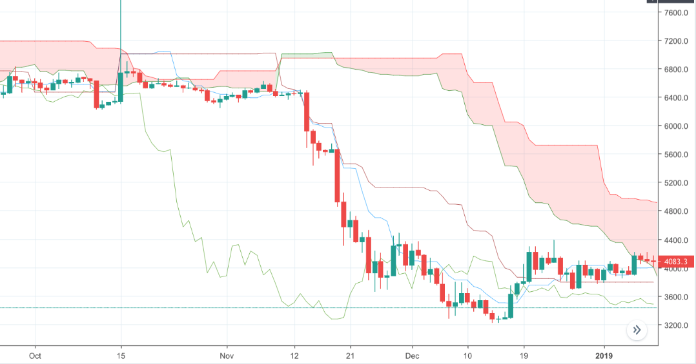

# How I started crypto trading | Interview #3

**Welcome to our new interview series *How I Started Crypto Trading*!** This is a series of short interviews that feature crypto traders with different perspectives, one at a time. The goal of these short interviews is to help beginner traders overcome the feelings of intimidation and get started with crypto trading confidently, share knowledge, experience as well as resources, and build a vibrant and collaborative community.

In this post, we will introduce Tom aka Channaholic, an engineering student and passionate crypto trader from Germany. He has started trading since early 2017 and mainly trades altcoins these days. He is a believer of decentralization and decentralized exchanges. As an evangelist within his circle, he helped many of his friends get started with crypto trading. In his spare time, he likes to play with his pet snakehead fish.

Let’s meet Tom!

<!-- more -->

### How did you become interested in crypto trading?

I heard about crypto the first time in a lecture at my university. I got interested in the technology behind it and checked it out. That was the time the hype started to take off (around early 2017) and so I jumped on the wagon as well.

### How do you trade and how do you improve your trading skills?

I only `swing trade` now. I try to analyse macro trends with moving averages or `Ichimoku`,and hold positions for a couple of months or weeks. To learn about technical analysis, I do recommend [Josh Olszewicz’s videos](https://www.youtube.com/channel/UC587BAG9cLTYtJ7Q4CqcOnw).

I mostly improved my trading skills from losing money and making mistakes. I sometimes lose as a result of a lot of impulsive actions. Now I kinda developed a technique and stuck to it.

In bull market, I benchmark my gain with bitcoin; in current market, I calculate my gain using fiat currency.

### What tools do you use to help you trade better?

TradingView is a very useful tool. (Note: TradingView is a financial visualization platform, which provide charting tools, and real-time as well as historical data.) I use it to look at charts. And I have an automated bot executing trades through Shrimpy on Binance based on the parameters I set. The bot was created by a friend of mine using Shrimpy’s API. The limitation of Shrimpy is that it can only works on single exchanges because you don’t have the withdrawal rights.

I used to run a market making bot but I don't use it anymore because I hated to have my computer running 24/7. However, if I could run it passively I would, because I still love the idea of doing market making through a bot.

### What are the most important thing you’ve learned for trading?

Never trust your gut feelings or emotions. Always try to stay **rational**. The majority is often wrong. Always reflect on yourself, and don’t act on impulse.

### What headlines surrounding cryptocurrency are you following closely these days?

I’m following developments at the tech level. I am not really listening to the FUD or Hype in the news.

### What do you think about the future of cryptocurrency?

It's clear that there are more use cases for Blockchain and Cryptocurrency that will be developed in the future. I think we can already see legit use cases in insurance or everywhere where things have to be tracked such as supply chain, authenticity, real estate, etc. Also I think that blockchain and cryptocurrency provide huge value for people where there is no developed infrastructure and legacy systems like in Venezuela and Africa.

### Vocabulary

#### Swing trading

Whereas day trading positions last less than one day, swing trading positions typically last a few days or weeks. The goal of swing trading is to capture gains from an overall trend. For more details, check out [here](https://www.ally.com/do-it-right/investing/swing-trading-strategy-guide/).

#### Ichimoku

Ichimoku, also known as Ichimoku Cloud or Ichimoku Kinko Hyo, is a moving average-based trend identification method, which provides a picture of potential price movements. Check out [here](https://www.investopedia.com/terms/i/ichimoku-cloud.asp) for more details.
