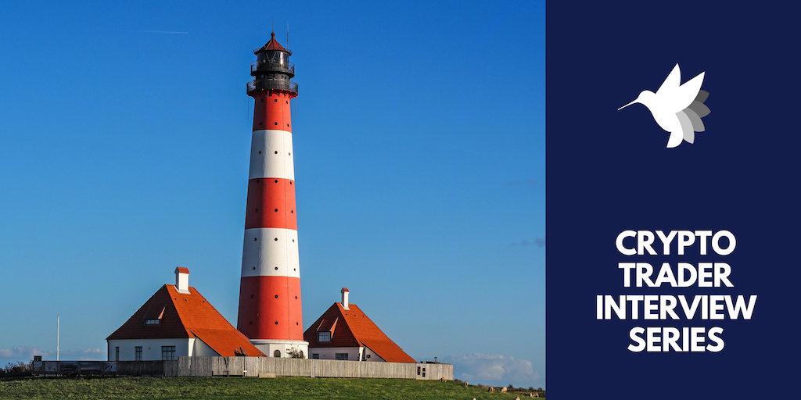
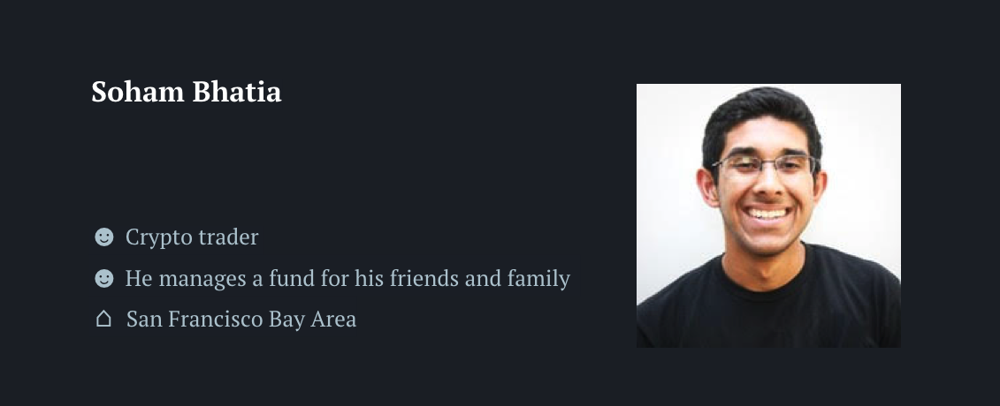

# How I started crypto trading | Interview #2

## Welcome to the 2nd interview of this series.

In this post, we will introduce Soham who is a business analyst by day and passionate crypto trader by night. He started crypto investing in late 2014 and crypto trading in early 2017. He is now managing a fund for his friends and family.

## Let’s meet Soham!

*Disclaimer: All views expressed in this interview are the interviewee’s and do not represent the opinions of hummingbot.io.*

### How did you become interested in crypto trading?

Crypto was something I wasn't necessarily looking out for. Trading wise, I’ve been trading stocks for a while. In early 2017, no one really knew what was happening [in crypto]. I was like, “oh, this is interesting”. And I kind of came back to bitcoin that I had in my life. I was like “oh, it's growing a lot like this is an interesting asset class”.

<!-- more -->

You know once you kind of go down the rabbit hole, it's tough to get out. And then as you start learning more and more, obviously you need to know about the technology as well. I was in a market where you have so much volatility.

It's funny that I had a lot of trust in the person who made me aware of crypto. I guess I had a lot of trust in doing this, so it wasn’t exactly a trust-less indie game. Obviously you have to learn to take the initiative yourself. You know, read the white paper, talk to other intelligent people, watch some youtube videos.

I think this was probably late 2014. It was like that still, very much seemed like an experiment.

### That was pretty early, even before Ethereum went live.

Yeah, I'll tell you a funny story. I missed out on the Ethereum ICO for whatever reason. But I did end up buying it eventually on Coinbase. I only came back a while after there were actually both Ethereum and Ethereum Classic, and I didn't know how it worked with two different things. At that time, I traded mostly stocks rather than cryptocurrencies.

### Since you have traded both stocks and crypto, what do you think makes trading crypto different from stocks?

In some ways, crypto trading is easier because there is very little fundamental noise in the way. So obviously there are events happening whether it's armed force or certain things being released, but you kind of realize that that gets priced in very quickly. So just because something is happening on February 25th doesn't mean that you should be prepared for that. A lot of movement gets priced in pretty quickly. So you kind of have to just focus on those technical indicators of more value.

There are also fewer overall participants so that leads to liquidity problems especially during outside of the major current. That's a challenge that people face. Of course, there's a whole security issue that you never know when it may go down. And that's always in the back of your mind. I'd say that kind of forced me to have a slightly bigger cash position.

### What tools do you use to help you trade?

TradingView is definitely the main thing. Like I said, the biggest thing is to only use three or four of those (indicators). Then I have a couple proprietary scripts that were developed by friends of mine. I also use those to some extent. My friend’s script can help me do backtesting based on the data he collected. I pay him a monthly basis for what it was in some percentage of the profits.

### That sounds interesting. So how do you improve your trading skills?

We all make mistakes. I’m focused on getting right win rates. Does it have to be above 50 percent just for your position sizing to be good enough that your winners make up for probably the losers. The biggest mistake I made early on was not understanding proper position size of my portfolio. I have stuff that would quickly spiral out of control into 5 or 10 percent or 20 percent position. I just kind of let it ride or set too wide of a stop loss (~40%) when it should have been tighter (~20%). That doesn't quite work in this market. Just definitely understand position sizing.

> Practice makes perfect. A lot of people say that you should be paper trading custom strategies, I don't believe it. I believe you should always be in real markets but trade just a really small amount of money.

Other than that, it's just like making sure you're finding the right resources. I don't like to follow too many other traders because everyone has their own systems but you do want to understand. You might find other traders to understand that way of thinking in a way that I'm not. Is there a better system I can take away? I'm always trying to sort the next source. The problem is how much of the new information can you absorb?  If only 10%, will that add any value? So I really try to absorb as much as I can.

Influencers wise, I think [Tone Vays](https://www.youtube.com/channel/UCbiWJYRg8luWHnmNkJRZEnw) does great charting. There’s really good stuff. I like what [Luke Martin](https://twitter.com/venturecoinist) is doing. Yeah, I like VentureCoinist. These are the two main people [that I follow]. There’s a lot of other noise. Oh [Peter Brandt](https://twitter.com/PeterLBrandt)! He’s really good. He doesn’t do crypto; he’s from other markets. He has 40 or 50 years of experience. Taking the lessons from somebody who started 40 or 50 years [ago] really accelerates the progress. Those are the people that I’d like meet up in person.

### So where did you meet people?

I met a couple of people at meetups such as [Blockchain Berkeley](https://blockchain.berkeley.edu/). There was a really cool one last year they had with the head trader of [Galois Capital](https://galois.capital/). I didn't really know the role that OTC desks have in this market before the meetup. They're really the ones that are responsible for a lot of the movement, like so much activity happens off chain, off the exchanges. Just understanding how they work was actually really helpful to get the overall picture of the space.

### What important lessons or insights have you learned while trading?

Yeah. Don't expect to make money. [It takes] years, if you really do believe this is something you want to do full time. And even I'm not doing it full time, I still have an additional job and there's still no way I can make enough off trading to sustain myself full time. So just make sure you do something else to somehow make sure you're doing this on the side.

Another mistake that I made was trying to make the homerun trades I missed out on a certain entry or exit on a specific point. I would try to make that money back on that same point on different trades. It's called Revenge Trading.

> The big thing is having patience and discipline. Being outside the market actually helps you be more patient and disciplined. Little things like not getting angry when you get cut off at a stop sign or a red light, just be zen about that.

### What headlines surrounding cryptocurrency are you following closely these days?

I think for my shorter term portfolio, I started to pay attention to the headlines. So I think the biggest thing that people talk about is like we need institutional capital for this to be more serious, but people forget that everyday there actually are institutions up in this market. That David Swensen of Yale started investing in crypto was a huge move, and just because you didn’t see it doesn't mean that it didn't actually happen. So I try not to let it all hang up on every word of it.

Whatever the SEC commissioner said is not really relevant. Whether you can get a crypto ETF or not, or whether the act is going to launch or not is not really relevant. You know people are obsessed with these white whales. If you have a long-term horizon, be patient. Talk to people that are actually outside of the traditional crypto media space.

### That makes sense. Do you subscribe to any newsletters, and which ones do you recommend?

I would say the [Messari](https://messari.io/) one is really good, the [Proof of Work](https://proofofwork.news/) newsletter [is also pretty good]. I like [Token Economy](https://tokeneconomy.co) as well, along with [The Information](https://www.theinformation.com/).

### What do you think about the future of cryptocurrency and the market?

Yeah, I think now security token offerings (STOs) are hot. [People say they are] going take off, and I want them to. But people are like *“ICO is over and now it's STO”*, they think in a very linear fashion and it doesn't necessarily have to move that way. I still think that the biggest use cases would be what we have for bitcoin, the digital gold, and what we have for Monero, some sort of privacy coin. I think those are the two biggest addressable markets.

Another thing is the decentralized finance scene is coming up, like 0x, Dharma, Compound. These are really interesting projects. I would say pay attention to those kind of projects or those kind of areas rather than some of the stuff like Tezos, DFINITY and even EOS. All of those stuff are potentially very promising and they can kind of solve everything at once. You can’t really do that, you have to do it piece by piece.

Any sort of decentralized exchanges, of course I'm obsessed with them. We’ll see how it goes.

### Vocabulary

#### OTC trading desk (or OTC broker)

OTC (over-the-counter) trading desks provide trading services directly to buyers and sellers, trading outside of exchanges such as Binance, Coinbase, and even decentralized exchnages. OTC traders are typicaly used by large-volume traders such as hedge funds and asset managers, with trades bilaterally agreed and negotiated with the OTC broker. For more information, click [here](https://www.finder.com/otc-cryptocurrency-trading).

