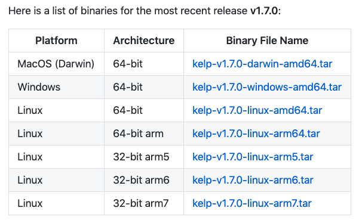
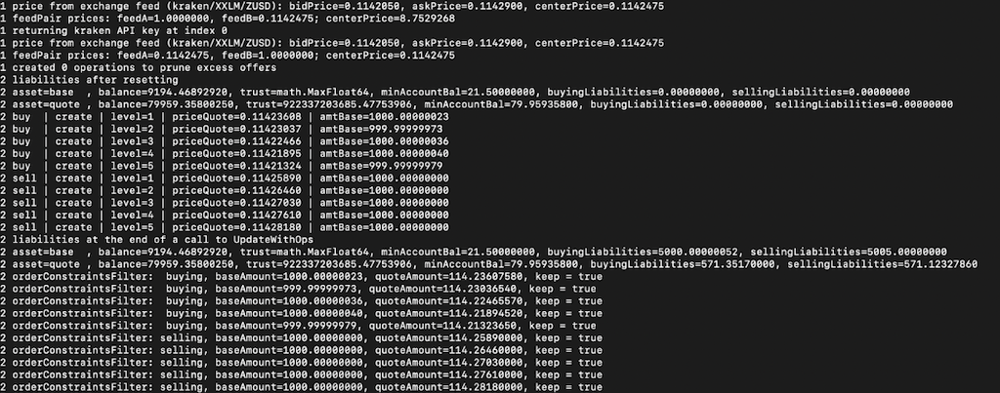
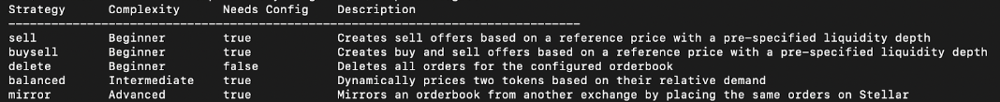
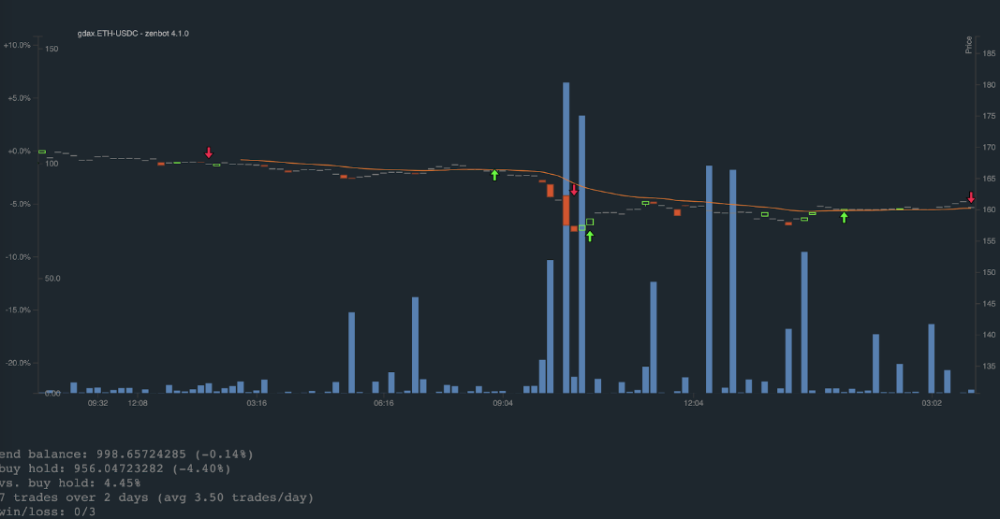
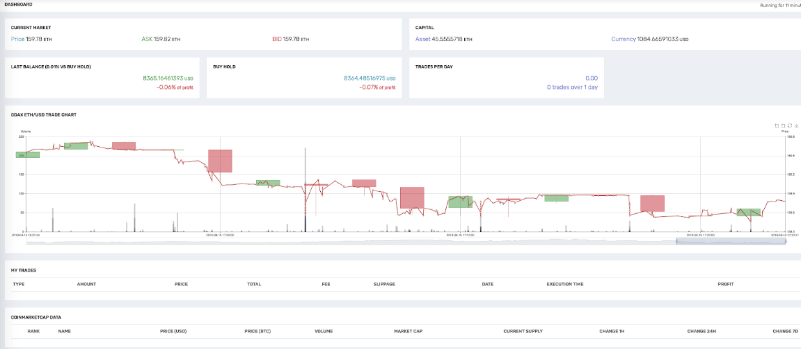
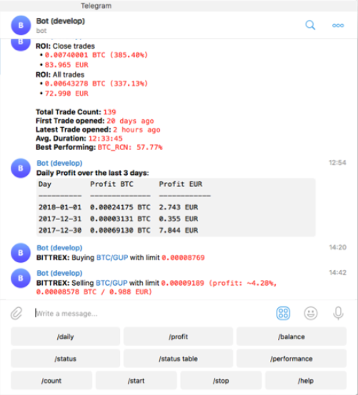
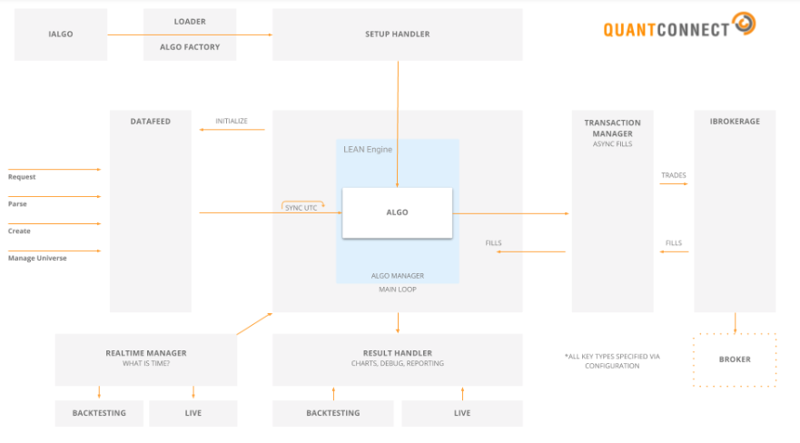

# Crypto trading bots in 2019: How easy are they to use? | Batch #2

As we build Hummingbot, we try to learn from other trading bot platforms in order to develop the best user experience for our community. We are also huge fans of other open source projects that democratize algo trading!

Building upon our well-received [crypto bot reviews post](../2019-01-crypto-bot-reviews/index.md), we have reviewed 5 more trading bots for you!

Like the previous article, we focus on each platform’s **ease of use**. However, while the previous post only addressed crypto trading bots, this post also includes reviews of two general quantitative trading platforms that will likely support crypto trading in the future:

- [Kelp](#kelp)
- [Zenbot](#zenbot)
- [freqtrade](#freqtrade)
- [Quantopian Zipline](#quantopian)
- [QuantConnect Lean](#quantconnect)

*Note that we will continue to assess these and other trading bots, so we plan on updating this post often.*

<!-- more -->

## Kelp

[Kelp](https://github.com/stellar/kelp) is a lightweight, well-documented open source project. Its main goal is to help developers create market making bots between [StellarX](https://www.stellarx.com/) and a centralized exchange.

Getting started with Kelp is relatively easy. We like how the documentation is structured by complexity. It provides concise documentation for beginners and then adds on more info for more advanced users. Since documentation for algorithmic trading bots tends to be lengthy and complicated, this approach reduces the learning curve.

It has compiled binary zip files for different, clearly-labeled environments. Its release notes come with a quickstart guide to which users can easily refer.

Like Hummingbot, Kelp also has a command line-based user interface. Running the bot is straightforward for anyone with a little technical background. Additionally, a **simulation mode** can be used for testing before you really invest your hard-earned money. In the simulation mode, kelp will print out trade details such as price, trade size, etc.

Kelp provides five easy-to-understand, intuitive strategies. We like that it labels the complexity of the strategies.

By default, Kelp only supports market making between Kraken and StellarX, so it can be a bit difficult for traders who do not have a Kraken account. However, equipped with sufficient technical skills, you are welcome to develop your own exchange connectors by reading through Kelp’s documentation, and using Kelp’s API and [ccxt](https://github.com/ccxt/ccxt), an open source library for centralized exchange connectors. In addition, Kelp provides an API for users to configure their own price feeds from sources such as [CoinMarketCap](https://coinmarketcap.com/).

For developers, nothing is better than a beautiful, well-commented code base. Kelp offers guidance on how to navigate its code base, along with a high level organization chart on the role of each folder, which is extremely helpful and necessary for external developers to contribute to the project. It sets a benchmark that we aim to meet for Hummingbot, as well.

> Overall, it’s easy to get Kelp up and running even for novice algorithmic traders. However, it might not satisfy the needs of more sophisticated users due to its reliance on `ccxt` for connectors to centralized exchanges.

## Zenbot

[Zenbot](https://github.com/DeviaVir/zenbot) is another well-maintained, open source command line-based crypto trading bot that emphasizes machine learning and backtesting. It clearly targets **quant trading power users who are also quite technical**.

Zenbot is written in Node.js, and the installation process is straightforward with the `npm install` command. To use Zenbot, you need MongoDB because many strategies are based on trends and momentum, requiring a database for price data.

It currently supports several major centralized exchanges including Binance, Bitfinex, Bitstamp, Bittrex, Gemini, HitBTC, and Kraken. Before performing live trading, a user can also run backtesting and simulations on Zenbot. Doing so requires downloading historical data first, which may take some time. After each simulation, the bot creates a chart in HTML and saves the graph in a local directory. This is such a cool feature!

Zenbot offers approximately 30 highly configurable directional strategies powered by technical indicators. One downside is that it often only provides a concise description of the strategy, littered with technical jargon such as RSI, STDDEV and MACD; some prior experience or additional research is needed for users to understand.  In general, its documentation assumes that users already have quite a bit of trading knowledge, and does not provide detailed explanations.

Zenbot also aims to provide a one-stop shop by offering a variety of plugins, such as a web dashboard, simulation charts, trade data csv file, SMS, Discord and many other notification plugins, etc.

> In short, although Zenbot supports a good number of exchanges and provides numerous cool features, it is designed more for power users with some prior trading experience.

## Freqtrade

Freqtrade is a beginner-friendly, open source technical analysis-based crypto trading bot written in Python.

The installation is pretty straight forward for anyone with a little technical background. Unlike Hummingbot, Freqtrade asks users to configure their bots during the installation process. Freqtrade allows users to set stop losses in 3 different ways, run backtesting, and customize their own strategies. By default, it only supports Binance and Bittrex, but users can add more exchanges using `ccxt`.

One of the most interesting features of Freqtrade is that users can control the bot via Telegram. This is pretty cool because it allows users to query the bot’s status from their phone anywhere and anytime, even when they don’t have access to Terminal/Bash.

Another interesting feature of Freqtrade is that instead of having users enter a list of token pairs for each strategy, freqtrade allows users to configure a trading pair blacklist and whitelist, and watches for opportunities in all the whitelisted token pairs. It also offers an option to dynamically change the whitelist based on the trading volume.

FreqTrade is well-documented, in particular with explanations of each parameter used by the bot.

> In summary, Freqtrade is beginner-friendly with some thoughtful unique features. However, it supports only two centralized exchanges at this moment and provides community support mainly on Slack and Github.

## Quantopian Zipline

Quantopian is a general web-based algo trading platform, which provides a premium membership that provides access to their best content and high-resolution historical data. [Zipline](https://github.com/quantopian/zipline) is Quantopian’s open source simulation engine, used for backtesting but not live trading.

Zipline can be run locally, in virtual environments, or with Docker. Zipline comes with all of the features of Quantopian, but not all of its data.

We tried to install Zipline but came across a Python error that we didn’t get around to resolving. Going by Zipline’s documentation and Quantopian’s website, here are

 a few things that we like about it:

- Quantopian makes an effort to educate, reducing the barrier for inexperienced traders to try out its product.
- Quantopian’s "My first algorithm" section onboards new users by  inviting them to share their first strategy, which in turn increases the bonding of its community.
- Zipline’s documentation explains the keywords that appear frequently in its codebase, which helps developers understand and navigate.

> Since Zipline is written entirely in Python, we think it’s more suitable for quant traders who are familiar with Python and `pandas`. Traders with some machine learning experience can also use `scikit-learn` with it.

## QuantConnect Lean

[QuantConnect](https://www.quantconnect.com/) is a general algo trading platform that allows developers to create their own customized quant trading strategies and live trade based on the strategies developed. [Lean](https://www.quantconnect.com/lean/) is its main trading engine, which is also open-source.

We installed QuantConnect Lean locally and ran its [Basic Template](https://github.com/QuantConnect/Lean/blob/master/Algorithm.Python/BasicTemplateAlgorithm.py) in debug mode locally. The installation is pretty straightforward. We like that Lean leverages this basic algo template as a quick introduction to new users.

Its system overview in the documentation provides easy navigation for developers.

Although Lean is written in C#, it has added support for other programming languages by offering top-level entry points and strategy files in many programming languages, making it developer friendly.

In quant trading, data is gold. QuantConnect’s Data Explorer provides insight into what the data actually looks like, which is quite a helpful feature! Good news for crypto traders: **crypto data from Bitfinex and GDAX** is also available!

> Overall, we would say QuantConnect Lean is a developer-friendly platform that is worth a try. The ability to enable live trading is definitely a plus.

### Key Takeaways

Every step in a user’s journey from documentation to installation to running a bot in production can significantly affect the user experience.

In addition to the [points](../2019-01-crypto-bot-reviews/index.md#key-takeaways) we brought up in the last post, we found the following ones also play a crucial role in the ease of use:

- Navigable, well-commented code base
- Documentation that eases the learning curve by providing simple bots aimed at beginner as well as advanced ones
- Availability of a large number of different exchange connectors
- Good onboarding experience
- Supportive and highly-engaged user community

We will apply these best practices to Hummmingbot to make it one of the most intuitive, user-friendly and stable crypto trading bots available!

