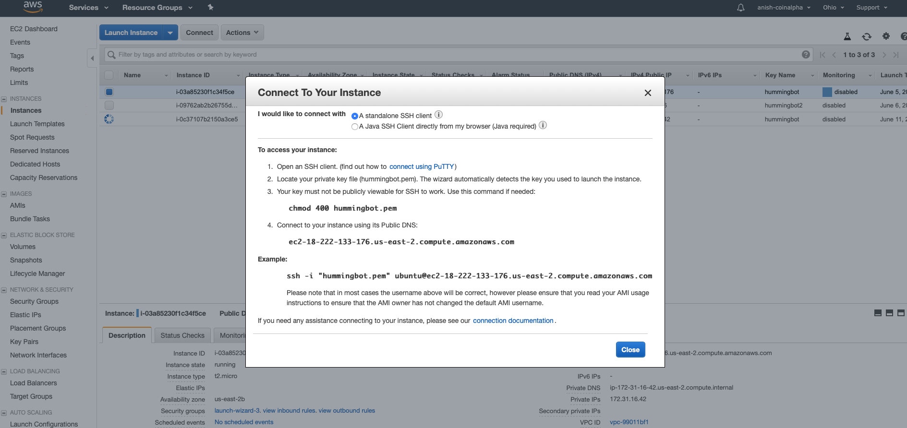

For users who are looking to run Hummingbot for prolonged periods of time, especially multiple bots simultaneously, local installation can be limiting. Currently, each bot requires its own docker image, which can use up local computing power, memory, and storage. Further, your bots can only be running for as long as your computer is in use. 

Even if these are not concerns for you, running Hummingbot in the cloud presents several advantages. For instance, Hummingbot relies on a stable connection to continuously fetch order book data and place orders. Using virtual machines can not only help ensure a seamless connection, but also increase the speed of transactions by operating on servers that are geographically closer to the exchanges. And while cloud computing was expensive and complicated in the past, modern instances are much cheaper and easier to use which has made it very feasible for individual users to operate cloud servers of their own. 

In this post, we compare the offerings of major cloud computing services relative to the needs of Hummingbot users. With the right provider and setup documentation, running a remote instance of Hummingbot has never been easier.

> TL;DR: If you would like to skip to our final recommendations, you can find them [here](#final-takeaways).

### Examining the playing field

In the last decade, cloud computing has exploded in popularity, leading to the development of dozens of different providers each with their own specializations and niches. And given the difficulty in traversing the wealth of options for a newcomer, many have [scored and ranked](https://www.zdnet.com/article/top-cloud-providers-2018-how-aws-microsoft-google-ibm-oracle-alibaba-stack-up/) cloud service platforms on a [number of metrics](https://www.techradar.com/news/best-cloud-computing-service). 

<!-- more -->

Here, we measure different cloud service systems specifically with regards to use for Hummingbot. We decided to compare platforms based on key factors which primarily include **ease of use**, **free trial flexibility**, **post-trial price**, and **overall quality**.

The four cloud-hosting companies we cover are some of the larger players in the field: 

- [Google Cloud Platform](#google-cloud-platform)
- [Amazon Web Services](#amazon-web-services)
- [Microsoft Azure](#microsoft-azure)
- [Digital Ocean](#digital-ocean)

> If you are interested in setting up Hummingbot on any of these providers, we have [installation guides](https://docs.hummingbot.io/installation/overview/#for-cloud) published on our documentation site. At the request of many users, we have also posted [useful tricks](https://docs.hummingbot.io/installation/multiple-bots/) for running the client in the background on a cloud server.

<h3 id="google-cloud-platform">Google Cloud Platform</h3>

The Google Cloud Platform began in 2008 with App Engine, a web-based framework for hosting and running applications on Google’s infrastructure. Their platform has since grown to over 90 products in services such as storage, computation, data analytics, networking, security, and big data. For the purposes of Hummingbot users, we will specifically review the **Compute Engine** product, which lets users deploy virtual machines on demand.

The setup process for users to create their own instance is very simple and intuitive. Beginning at the [GCP Free Tier Getting Started Page](https://cloud.google.com/free/) we were able to enable our free trial of GCP and launch our first instance in under 10 minutes. GCP’s web portal interface is very easy-to-follow and even lets users SSH into the virtual machine directly from the console. This is a huge benefit for users across all operating systems as there is minimal setup to be performed on the local machine.

GCP’s Free Tier comes with a 12-month free trial and $300 in credit to use across any of the available services. However, the only instance that can be set up for free is the f1-micro, which comes with 0.60 GB memory. This is probably sufficient to run one instance of Hummingbot and to test out the actual server. However, we recommend that users upgrade to an instance with at least 1 vCPU, 2 GB of RAM, and sufficient storage to run multiple bots for extended periods of time. After the free trial, the cost for each instance with the aforementioned specifications is $21.50/month.

---

To summarize our review of GCP:

##### Advantages
* Simple, easy-to-follow interface
* Reliability and robustness of service

##### Disadvantages
* Monthly cost for running instances is higher than other providers
* Free trial is restrictive for VM specs

> This cost is steeper than other cloud providers’ offerings for instances with the same specifications. In addition, the free trial is slightly restrictive as users can only use the lowest-tier instance. However, GCP makes up for this with its easy-to-follow interface and simplicity in connecting to the instance. Overall, GCP offers a very reliable and solid service that users won’t go wrong with.

<h3 id="amazon-web-services">Amazon Web Services</h3>

Amazon Web Services began in 2002 as a service for developers to build XML-based interfaces for their product catalog and grew into an infrastructure service business when Amazon realized that they held a strong core competency in that area. In 2006, AWS launched two of their biggest services to date: Elastic Cloud Compute (EC2) and Simple Storage Service (S3). For Hummingbot users, we will be specifically looking at the EC2 service.

Just like GCP, AWS has a very intuitive web interface set up process. In just a short period of time, we were able to create an AWS Free Tier account and launch our first instance. Instructions on the AWS documentation were very clear and easy-to-follow. The process to connect to the actual instance was slightly more involved than that in GCP, as there was no web interface. Even though there were additional steps to connect after setting up the instance, the instructions were clearly presented and straightforward.

AWS’s free trial comes with 12 months of EC2 usage capped at 750 hours/month. However, users on the Free Tier are only allowed to use the t2.micro instance, which provides only 1 GiB of memory. As with the Free Tier on GCP, this is not sufficient to run multiple instances of Hummingbot simultaneously. After testing out the instance, however, we recommend that users upgrade to the t2.small instance, which has 2 GiB and sufficient storage to run multiple bots simultaneously. The cost for a t2.small instance after the free trial is $16.84/month.

---

##### Advantages
* Setup is relatively straightforward
* Lowest-cost paid services

##### Disadvantages
* Free trial has limited hours per month and VM options
* Requires (free) additional software for Windows

> Like GCP, AWS’s EC2 service is robust, reliable, and mostly intuitive. From a free trial perspective, AWS has the same limitations as GCP in not being able to run instances with greater memory; however, it has a significantly lower monthly cost for running an instance with equal specifications after the trial. For users that are planning on opening multiple instances or running Hummingbot over several months, the marginal cost savings on each instance each month can add up very quickly. Taken together, AWS EC2 is a strong choice to run Hummingbot on.

<h3 id="microsoft-azure">Microsoft Azure</h3>

Microsoft Azure, formerly known as Windows Azure, was released in 2010 as a cloud computing service for building, testing, and deploying various types of applications and services via data centers managed by Microsoft. Since its release it makes up the forefront of the Microsoft Commercial Cloud, which spans from Azure to Office 365 Enterprise to new AI and Internet of Things initiatives. For Hummingbot users, the relevant offering we reviewed is the Azure Virtual Machine.

Setting up a [cloud server on Azure](https://azure.microsoft.com/en-us/free/) was a little more complicated than for other options. Several steps did not have valid defaults and advanced settings were displayed alongside required choices. This made the configuration process slightly unintuitive and led us into a key error, not creating the proper inbound ports, that prevented us from accessing the server during our first attempt. For Windows, it also requires the use of a third-party SSH software ([PuTTY is recommended](https://www.chiark.greenend.org.uk/~sgtatham/putty/latest.html)) in order to access the virtual machine, which adds additional access steps for some users.

Azure’s free trial, however, is the best among all four cloud providers surveyed. It comes with a 12-month, $200 free trial that improve upon its competitors in two ways: first, it does not require a card on file for the first month, and, second, it allows free trial users to select any specifications for its virtual machines. For the recommended 1 vCPU, 2 GB RAM, and sufficient temporary storage to operate multiple bots over longer time periods, Azure’s B1MS server is priced at a highly competitive $18.10/month.

---

##### Advantages
* Best free trial terms
* Lower end of price range

##### Disadvantages
* More complicated setup
* Requires (free) additional software for Windows

> With the combination of its free trial flexibility and affordable price point, Azure is one of the best in the game when it comes to total cost. Unfortunately, some of the setup isn’t as intuitive as other providers, and useful documentation is outside the main portal in Microsoft docs that users have to look for. However, with the Hummingbot installation guide recently updated to include detailed instructions, it checks in a strong option for users planning to run bots intensively.

<h3 id="digital-ocean">Digital Ocean</h3>

Digital Ocean began in 2011 as a cloud infrastructure provider primarily focusing on developing multi-computer scaling applications. Starting in 2013, they became one of the first cloud-service providers to offer SSD-based virtual machines, and are now one of the world’s largest web-facing hosting companies. They also have a strong developer network that provides community resources, and is generally popular among more tech-savvy users. We examined Digital Ocean’s Virtual Engine for the purposes of operating Hummingbot.

Using Digital Ocean to [create a cloud server](https://m.do.co/c/8e0adb75eb3f) was relatively simple and immediately offered optionality to run docker images in addition to Linux systems, providing multiple methods of accessing Hummingbot. It was simple to connect to the server from the listings page, and did not require any additional software for any operating systems.

Disappointingly, Digital Ocean’s free trial is the least expansive of all competitors by far. Its default credit is only $10 for a free trial, which lasts only a month even for the low specifications needed to run Hummingbot. Even with the extended free trial link, Digital Ocean only provides $50, or less than half the duration of all its rivals. It does make up for it with the lowest price point in the long-run, at just $10/month in order to run a 1 vCPU, 2 GB RAM virtual machine.

However, we also ran into a number of issues when running low-power Digital Ocean servers. The specifications which worked with other cloud hosts produced laggy and unstable VMs on Digital Ocean, whether using Docker images or a Linux machine, and the problems seemed to be inherent as they appeared before even downloading Hummingbot. We had to upgrade to the $20/month version in order to get the server stable enough to run bot instances, and even then the experience was less smooth than other options.

---

##### Advantages
* Easy to setup and use
* Lower end price for paid services

##### Disadvantages
* Worst free trial terms
* Prone to lag and errors

> Although Digital Ocean has a simple setup system and the best pricing of any cloud service provider, it has a significantly shorter free trial, albeit with more flexibility than GCP or AWS. Unfortunately, Digital Ocean servers appear to have trouble running at low specs, which is a major drawback considering the minimal system requirements of Hummingbot. Because of this, we find it difficult to recommend for Hummingbot users without a previous preference for this particular platform.

<h3 id="final-takeaways">Final Takeaways</h3>

Below is a summary of our overall rankings for each of the four providers, as well as a comparison of their free trial offerings.

### Key attribute rankings

<table style="table-layout: fixed; width: 100%">
<thead>
  <tr>
    <td style="width:20%"></td>
    <td style="width:20%">GCP</td>
    <td style="width:20%">AWS</td>
    <td style="width:20%">MS Azure</td>
    <td style="width:20%">Digital Ocean</td>
  </tr>
</thead>
<tbody>
  <tr>
    <td style="width:20%">
      <b>Ease of setting up instances</b>
    </td>
    <td style="width:20%">Quick and easy to use</td>
    <td style="width:20%">A few extra steps involved</td>
    <td style="width:20%">Requires use of a guide</td>
    <td style="width:20%">Fairly straightforward</td>
  </tr>
  <tr>
    <td style="width:20%">
      <b>Cost of recommended instance</b>
    </td>
    <td style="width:20%">$21.50/month</td>
    <td style="width:20%">$16.84/month</td>
    <td style="width:20%">$18.10/month</td>
    <td style="width:20%">$20.00/month</td>
  </tr>
  <tr>
    <td style="width:20%">
      <b>Free trial terms</b>
    </td>
    <td style="width:20%">Long duration but limited</td>
    <td style="width:20%">Long duration but limited</td>
    <td style="width:20%">Slightly shorter but unrestricted</td>
    <td style="width:20%">Much shorter but unrestricted</td>
  </tr>
</tbody>
</table>

### Free trial comparison

<table style="table-layout: fixed; width: 100%">
<thead>
  <tr>
    <td style="width:20%"></td>
    <td style="width:20%">GCP</td>
    <td style="width:20%">AWS</td>
    <td style="width:20%">MS Azure</td>
    <td style="width:20%">Digital Ocean</td>
  </tr>
</thead>
<tbody>
  <tr>
    <td style="width:20%">
      <b>Duration</b>
    </td>
    <td style="width:20%">12 months</td>
    <td style="width:20%">12 months</td>
    <td style="width:20%">12 months</td>
    <td style="width:20%">~3 months</td>
  </tr>
  <tr>
    <td style="width:20%">
      <b>Credits</b>
    </td>
    <td style="width:20%">$300</td>
    <td style="width:20%">N/A</td>
    <td style="width:20%">$200</td>
    <td style="width:20%">$50</td>
  </tr>
  <tr>
    <td style="width:20%">
      <b>Limitations</b>
    </td>
    <td style="width:20%">Only 0.6 GB RAM</td>
    <td style="width:20%">Only 1 GB RAM, max usage of 750 hours/month</td>
    <td style="width:20%">Access to all resources</td>
    <td style="width:20%">Access to all resources</td>
  </tr>
</tbody>
</table>

Given that each cloud service provider has its own strengths and weaknesses, we find that different platforms are better for different types of users. For Hummingbot operators with minimal technological background who don’t plan to use bots heavily, GCP seems the optimal choice. On the other hand, Azure offers the best free trial experience at a lower long-term price point for more tech-savvy users. AWS is the optimal choice for those planning to use Hummingbot intensely given its lowest long-term price point. 

Regardless of choice, however, running bots in the cloud is a great way to keep Hummingbot running for longer and in more diverse ways. We hope readers who are interested but looking to avoid the hassle of installing and running Hummingbot locally will consider cloud servers as another option for algo-trading on the individual level.
