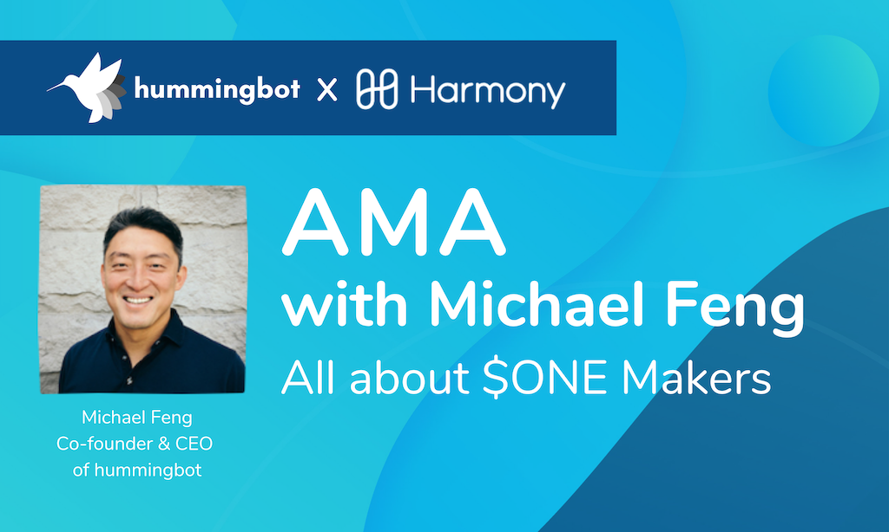

# Ask Me Anything: Harmony $ONE Makers

Michael Feng, co-founder and CEO of hummingbot, answered a bunch of questions from the community at our first AMA with Harmony team on June 20th. For some of you who didn’t make it, we put together the questions and answers here so that you won’t actually miss anything.  

##### Mike, could you introduce yourself, and tell us a little about your journey so far in the crypto space, and what led to the founding of hummingbot?

Sure, this is Mike, CEO of Hummingbot. I started my career on Wall Street before moving to Silicon Valley about 9 years ago. I started paying attention to crypto in 2014 when the Ethereum whitepaper came out. In 2017, we originally started as a quant crypto hedge fund. Since liquidity is a huge problem in crypto, we created Hummingbot, which allows anyone to run a market making bot and provide liquidity to quality projects like Harmony.

##### What is Hummingbot, and can you tell us how it works?

Hummingbot is an open source tool that helps you configure and run algorithmic trading bots. It's a bit like Bitcoin mining software: it's a software client that you run locally or in the cloud. It uses your exchange API keys to automate trading for you.

<!-- more -->

##### So what would you say has been liquidity state of crypto?

Liquidity is one of the most important qualities for a token project. First, let me define what liquidity is. Liquidity is the ability to buy and sell something in large size without moving the market. Liquidity can be measured by hard, quantifiable metrics like bid-ask spread, depth, and volume.

Academic research shows that liquidity is positively correlated with price. The top 20 coins are all very liquid, but the smaller the market cap of a coin, the less liquid it typically is. In addition, a deep, liquid market mitigates the risk of pump and dump attacks like what we saw with CLAM a few weeks ago.

##### What is market making?

Market making is a trading strategy where you post buy and sell orders directly on the order book. Market makers make money from the "bid-ask spread", since their buy orders are lower than their sell orders. Because order books change at millisecond-speed, this has historically only been available to hedge funds. We have open sourced a tool that allows anyone to do it.

##### How difficult is it to obtain liquidity in the crypto market, and what's the most significant hurdle?

It's difficult because there are few professional market makers, and they tend to focus on BTC or top-20 coins. To provide liquidity in the fast-moving crypto markets and not lose money, you need a high-frequency trading bot that can automatically adjust your orders as the market price changes. This is a big technical barrier that prevented ordinary people from participating in market making. With Hummingbot and the $ONE Makers program, now anyone eligible to trade $ONE can also provide liquidity for it.

##### Given that every market needs liquidity and this is vital to both exchanges and crypto traders, what do you think is the best way to provide steady liquidity to a market given the intrinsic volatility of crypto, would you say centralized or decentralized?

Actually, as a market maker you should ❤️ volatility. More volatile markets typically mean higher volume and higher spreads, which are the 2 major factors that help you make more profits. 

You're right - every market needs liquidity. That's why we think a decentralized solution, where anyone in the world can run a market making bot and help provide liquidity, is better in the long term.

##### A member of the community has asked for clarification on 'liquidity is correlated with price'?

Sure, there have been a number of academic studies that show that more liquid stocks tend to have a higher price than less liquid stocks, all other things being equal. 

You can also see this effect if you try to buy/sell a token in a very illiquid market. If the bid/ask spread is very high, it means that you lose money with every trade. In trading parlance, this is called slippage: the difference between the market price before a trade is executed versus the actual execution price of that trade.

##### How the liquidity will be improved? This means if I have 10 BTC and I want to buy ONE from the market, the price will not go up because a new order from this bot will appear, right?

Yes, that's one aspect of liquidity. Another aspect is in maintaining orders and helping to stabilize the price when it trends sharply. This mitigates the impact of pump and dump schemes which can adversely affect ordinary traders.

##### Speaking of price, we've heard before that 95% of crypto trading volumes at some points could be wash trading, and there have been claims that most exchanges are inevitably vulnerable to wash trading and pump and dump schemes, how should traders treat this ravaging effects pseudo-liquidity?

Fake volume is definitely a huge problem in crypto. From a market maker's standpoint, you want to provide liquidity to markets with real trading volume. That's because you depend on "takers" in the market to fill your  buy and sell orders so that you can make money. We currently support Binance, Coinbase Pro, and a few decentralized exchanges that we believe are all legitimate exchanges with real volumes.

##### How does Hummingbot tackle the issue of wash trading?

Hummingbot is just an open source tool, so it natively doesn't place any restrictions on users. However, we are very strict about preventing wash trading for participants in the $ONE Makers program. This ensures that people only earn rewards based on their **real** trading volume. 

To verify that, we collect trading activity from users who sign up for $ONE Makers and run Hummingbot. Then, we check their submitted trades against our internal exchange data feed, so that only legitimate users are rewarded.

##### For those of us who are not so conversant with the term liquidity bounty, can you explain what it is?

The idea behind liquidity mining is that liquidity is a scarce resource in crypto. Currently, token projects who need liquidity are forced to pay professional market makers a lot of money. We think that a better solution is to put up a bounty and allow anyone in their native community to earn bounties based on how much liquidity they provide. This allows community members to make more productive use of their token holdings and earn rewards, while the project benefits from more liquidity.

###### Who can use hummingbot, I mean how easy is it to set up?

Since it's open source, Hummingbot is free and available to anyone. We have prepared [a guide](https://support.hummingbot.io/hc/en-us/articles/4415753047065-Getting-Started) for Liquidity Bounty participants that should make the setup process less than 10 minutes.

##### How long does this one maker bounty program last? Is there a lock up period? Do we need to give up a certain amount of $ONE tokens?

The bounty program will last for 3 months. You don't need to give us anything. The way it works is that you download/install Hummingbot, put in the your exchange API keys, and use your own tokens to run the bot. We track how much trading volume you do and help Harmony verify/automate the payouts each month.

Hummingbot is software you run locally. We will never get your tokens, API keys, or private keys.

##### Can we gauge how much impact $ONE Makers will have on the $ONE token as well as its price discovery?

To be frank, both we and Harmony are approaching this as an experiment. We believe that the more people participate, the greater of an impact it will have. 

However, because no one has ever done this (because the technology wasn't available before), it's difficult to quantify how much the impact will be. At the end of every month, we'll sit down with Harmony to review the data and make any necessary adjustments.

##### Are there any other projects that are currently using the hummingbot algo. And what would you say is the adoption potential so far - given that it’s experimental as mentioned?

Yes, we have a number of projects in our community using Hummingbot to run market making bots. We have seen volumes increase dramatically since we launched 2 months ago. Harmony is our first partner for Liquidity Mining.

##### Do you provide bots available and configured for some choice of standard market making strategies? Or is the bot development and configuration is up to the community?

Great question - we provide templates for the strategies, but users need to input their own configuration parameters, such as spread, trade size, and how often to refresh orders. Also, all of our strategies are open source, so users can customize or create their own strategies. For more details on our strategies, please see this [page](/strategies/index.md) in our documentation.

##### So how many coins is the minimum requirement to run Hummingbot?

Hummingbot is just software, so there's no minimum number of coins required to run it. However, the reality is that every exchange maintains its own minimum order size requirements. 

For instance, if you try to submit orders for 10 ONE using Hummingbot, it will fail because it's lower than the minimum order size on Binance ($10). We recommend that users get familiar with each exchange for which they use Hummingbot.

##### We've got one of the co-founders of Harmony with us too, Sahil Dewan. Can you please shed more light on the Harmony side on what is expected of this partnership?

Salil: Thanks! Mike really put it very well - our collective vision is to create a new opportunity for the hummingbot and Harmony communities. Market making was earlier limited to only a few people, but with the decentralized market making software, you can support a project that you care about, make the market more liquid and also earn rewards by doing so! We're excited to have more than 800 people already signed up for the $ONE Makers initiative. 🙂

Our team has been a true believer of decentralization - our launch on the Binance DEX followed by this collaboration with hummingbot for decentralizing market making are the baby steps we're taking for our community.

**So Mike, as a final question, do you have any follow-up links or points to share with the community?**

Yes, we have created [a guide exclusively for Liquidity Bounty participants](https://miner.hummingbot.io/markets). 

The program will commence in early July, so please [sign up here](https://miner.hummingbot.io/markets) to get notified as soon as it launches. 

Finally, here are the [reward tiers](https://miner.hummingbot.io/markets) for $ONE Makers. 

