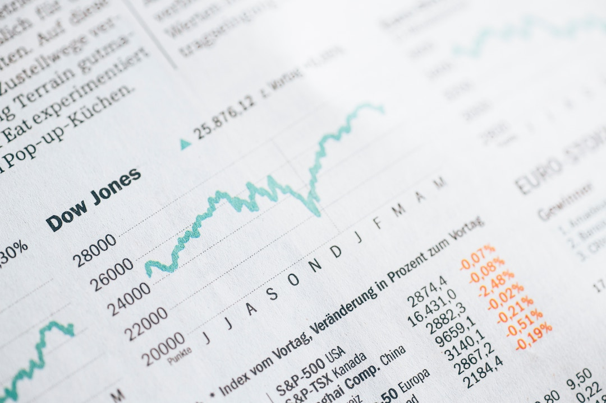
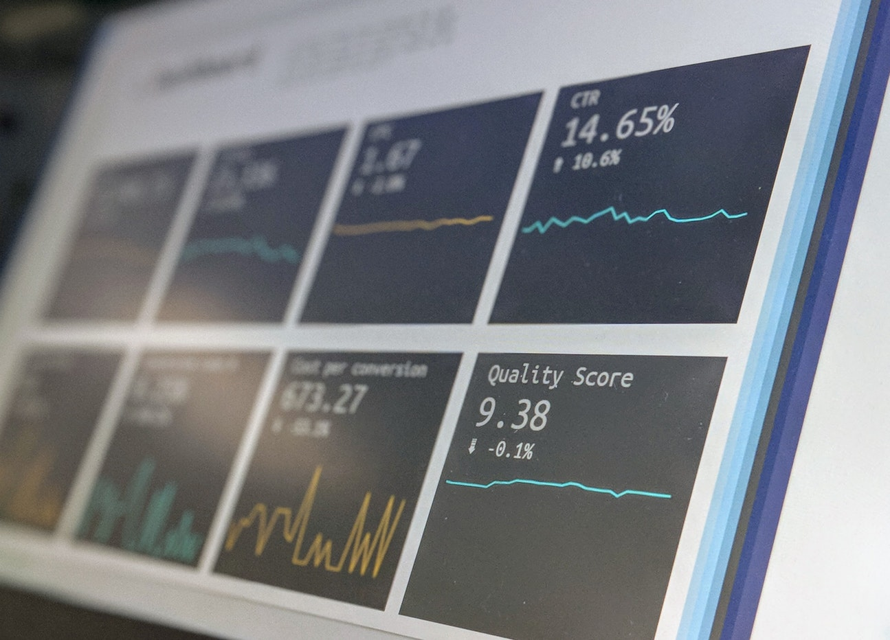

Tracking your crypto trading profit or loss (P&L) is crucial in evaluating the effectiveness of your trading strategies, investment decisions, and portfolio management strategy. In traditional financial markets, determining profits and losses is a relatively straightforward task as conventions and regulations are well-established. However, tracking P&L when trading crypto can be much more challenging because of:

1. Market fragmentation: a typical crypto trader has assets on multiple exchanges and wallets
2. Different asset pricing conventions (e.g., some assets are quoted vs. Bitcoin, Ethereum)
3. Non-standardized accounting methodologies

In this post, we’ll cover the following issues and share some useful tips about determining the profitability of your crypto trading strategies.

<h3 id="tldr">TL;DR</h3>

Hummingbot calculates profitability by determining the portfolio value of the starting balance and the current balance in terms of the **current exchange rate**.


<h3 id="table-of-contents">Table of Contents</h3>
- [Which asset should you use to benchmark your profit or loss - fiat, Ether, or Bitcoin?](#which-asset)
- [How does Hummingbot measure performance?](#how-measure)
- [Other considerations](#considerations) 

<!-- more -->

---


<h3 id="which-asset">Which asset should you use to benchmark your profit or loss - fiat, Ether, or Bitcoin?</h3>

Stock and derivative traders in the established finance world use fiat asset to measure their performance. However, measuring performance in the cryptocurrency world is not as straightforward due to the lack of standardized best practices. One of the biggest issues in tracking P&L is the range of currencies that one could use: fiat currencies, Bitcoin/Ether, or base/quote currencies. 



At first glance, it might seem most intuitive to measure performance in terms of a fiat asset, but there are many issues with doing so. Many exchanges don’t support fiat currencies, and alternative stablecoins such as USDC, TUSD, USDT, and DAI are subject to their own fluctuations with USD. In addition, fluctuations in the price between cryptocurrencies and fiat currencies make it difficult to accurately assess one’s portfolio management strategy within the cryptocurrency world.

Many traders use Bitcoin to measure the performance of their portfolio. Given that the most common “entry point” into the cryptocurrency world is Bitcoin, this choice makes sense for traders who are looking to assess the success of their overall portfolio management strategy. A similar argument can be made to justify measuring performance in terms of Ether as it is another common “entry point” into cryptocurrency trading.

For traders looking to analyze the performance of an individual trade or trading strategy, it makes the most sense to use the base/quote currency of a trading pair. Fluctuations in the exchange rate between the currencies of the trading pair and Bitcoin/Ether/fiat currencies make it difficult to accurately assess the success of a strategy or of a singular trade. We have described this issue in further detail [below](#dynamic).

> The formula noted above in the TL;DR section can be applied to a portfolio that uses multiple trading strategies across multiple exchanges.

<h3 id="how-measure">How does Hummingbot measure performance?</h3>

Users need to know whether they have actually gained or lost money from running Hummingbot. To this end, in version 0.9.0 of Hummingbot, we have added a performance analysis feature in the ‘history’ command.

There are many confounding variables that complicate the task of performance analysis. Hummingbot currently supports three different trading strategies, so our performance analysis computation had to be generalizable to any strategy. Two of the aforementioned trading strategies allow for trading of different pairs on different exchanges, so the feature also had to account for multiple balances across different exchanges.



With a constantly shifting quantity of tokens, there had to be a way to measure performance without having the effect of fluctuating exchange rates affect the perceived success of a trade. As a result, we decided to model and analyze a few different methods of measuring trade performance.

<h4 id="example">Example calculations</h4>

To fully illustrate the factors that we had to account for, let’s consider a scenario:

* We are market making on the ETH/BTC pair on Coinbase Pro. We began with **50 ETH** and **1.0 BTC**, at an **initial price of 0.02** (that is, 1 ETH = 0.02 BTC).

* After a few trades, we have **60 ETH** and **0.7 BTC**, but the **exchange rate has increased to 0.025** (1 ETH = 0.025 BTC).

<h4 id="dynamic">A dynamic model</h4>

The most intuitive way to measure change in portfolio value is to compute the value at the starting point of the trading and again at the end. We call this the **dynamic method** - that is, at each point in time, we use the exchange rate between the base and the quote assets to compute portfolio value.


Let’s apply this to the example above. Since we began with 50 ETH and 1.0 BTC, at an initial price of 0.02, the total starting value of our portfolio is 

```
(50 ETH * 0.02) + 1.0 = 2.0 BTC 
```

At the end of the trading, we have 60 ETH and 0.7 BTC at a price of 0.025, so the total value of our portfolio now is 

```
(60 ETH * 0.025) + 0.7 = 2.2 BTC. 
```

So our portfolio is worth more now, but does this mean that any of our trades were actually profitable? Actually, if we hadn’t made any of those trades, our portfolio would now be worth

```
(50 ETH * 0.025) + 1.0 = 2.25 BTC
```

This is 0.05 BTC less than what our portfolio is currently worth. **That is, we actually would have made more money if we hadn’t made any trades.**

This example illustrates a key issue with interpreting profitability using a dynamic exchange rate: fluctuations in the exchange rate distort the perceived success of trading. 

---

<h4 id="fixed">The fixed alternative</h4>

The issues we faced using the dynamic method implied that we needed to interpret profitability with a **fixed exchange rate**. The next most logical method was to compute the starting and current portfolio values in terms of the exchange rate at the point in time at which the trading was started. 


Using this method, our starting portfolio would be worth: 

```
(50 ETH * 0.02) + 1.0 BTC = 2.0 BTC
```

Our current portfolio would be worth:

```
(60 ETH * 0.02) + 0.7 BTC = 1.9 BTC 
```

This is a more accurate picture of the actual success of our trading. However, this approach was not meaningful in determining whether the trading was successful relative to the fluctuations in the exchange rate in the market. **That is, if we were to liquidate our holdings into the quote currencies based on the current price, would the trading have been successful relative to a scenario in which we made no trades?**


<h4 id="blended">A blended consensus</h4>

To avoid the inaccuracies of the dynamic method and the shortcomings of the fixed method, we took the best parts of each approach and combined them. Our **blended approach** uses the current exchange rate to compute the implied value of the starting portfolio and the actual value of the current exchange.


Applying this concept to the example above, our starting portfolio would be worth

```
(50 ETH * 0.025) + 1.0 BTC = 2.25 BTC
```

Out current portfolio would be worth:

```
(60 ETH * 0.025) + 0.7 BTC = 2.2 BTC
```

Let’s say the exchange rate continues to increase to 0.03 (that is, 1 ETH = 0.03 BTC), while we continue to make trades such that we have 70 ETH and 0.6 BTC. Our starting portfolio would be worth

```
(50 ETH * 0.03) + 1.0 BTC = 2.5 BTC
```

Our current portfolio would be worth:

```
(70 ETH * 0.03) + 0.6 BTC = 2.7 BTC
```

Based on these examples, we are able to see how this blended system avoids the pitfalls of using a dynamic exchange rate while it still accounts for changes in the exchange rate. 

**This is how Hummingbot also computes profits and losses.** 

The final calculation is simply a division of the current portfolio value by the starting portfolio value, both computed in terms of the current exchange rate. This calculation yields a percentage that is the profitability of the trading. 

When a Hummingbot user calls the ‘history’ command, this value gets printed out in the profitability section.

> This method also extends well to multiple exchanges. For example, if we are trading WETH/DAI on DDEX and ETH/USDC on Coinbase, the starting and current values of ETH and USDC will be converted to WETH and DAI, respectively, using the current conversion rates. Then the starting and current balances will computed in terms of the current WETH/DAI exchange rate.

<h3 id="considerations">Other considerations</h3>

Currently, Hummingbot’s performance analysis calculation only considers base token quantity and quote token quantity. For most exchanges, fees are taken as a percentage of the quantity of the quote token traded; however, some may take fees from a third token. For example, Binance has a 25% discount rate for users that pay fees using the BNB coin. Hummingbot’s performance analysis tool does not currently account for this scenario.

Additionally, this feature does not account for rewards earned through Hummingbot’s new [liquidity bounties program](../2019-06-introducing-liquidity-bounties-harmony/). This means that gains may be higher than accounted for. Finally, while this feature currently only reports one figure for overall trade performance, future releases of Hummingbot may report profitability for individual trades.
