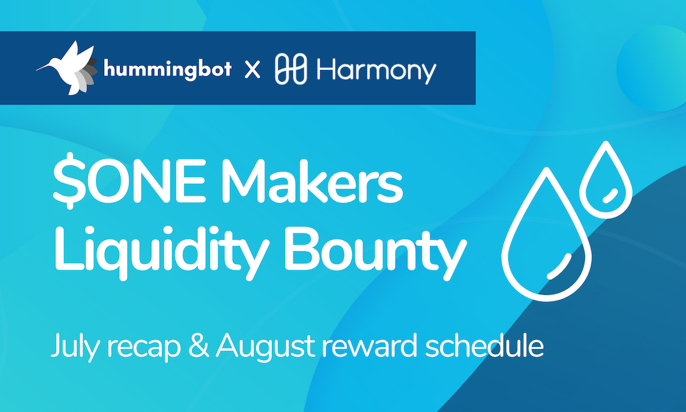
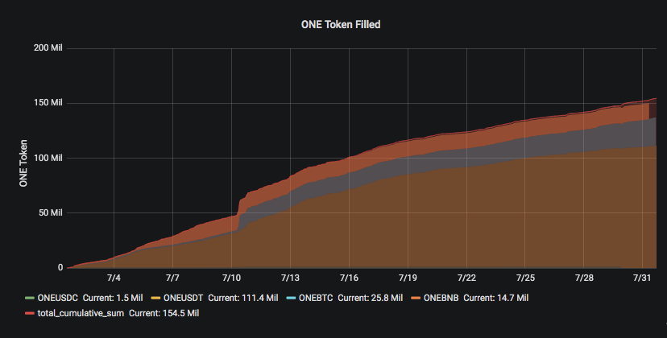
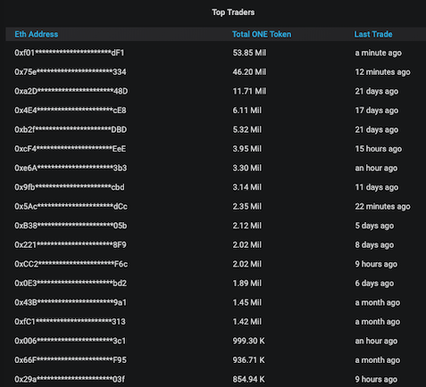
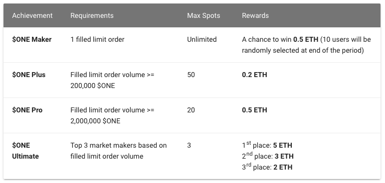

# $ONE Makers July recap & August reward schedule

It's been one month since we launched $ONE Makers, [the liquidity bounty program](../2019-06-introducing-liquidity-bounties-harmony/index.md) we've launched with [Harmony Protocol](https://harmony.one/). Thanks to everyone who signed up, ran market making bots for $ONE and spread the word about the program!

While we're still very early in our mission to **decentralize market making** by leveraging the power of community, data from the first month of $ONE Makers shows that it's possible.

We look forward to having more traders join the competition in August to earn rewards and create more liquidity to Harmony $ONE!  

<!-- more -->

### July statistics
 

During July, $ONE Makers bounty hunters:

⛳️️️️️️️️ Provided liquidity for **US$2.1 million** of filled orders (155 million $ONE)

⛳️ Performed **72,900 total trades**

⛳️ Accounted for **1.0% of total $ONE daily trading volume** during the month, including 2.2% on July 31!

⛳️ Averaged size per trade of US$29 (2,126 $ONE)

>  **On average, each person performed 1,429 trades and generated $41,000 of filled order volume during the month**

### July leaderboard

**Congrats to all the top bounty hunters!** We are currently in the process of verifying real trade volume and running analytics to detect wash trading. We expect that the process will take approximately one week, after which we will work with Harmony to distributed the rewards.

Below is the indicative leaderboard (prior to verification):

In the meanwhile, please check out our [top bounty hunter interview](../2019-07-top-bounty-hunter-interview1/index.md), where David Salter, one of our top bounty hunters, shares his experience and trading tips. David ranked #6 in July's competition and has been able to pocket 0.5%-3% profit per trading session by running Hummingbot. 

### August reward schedule

The `August schedule` replaces the volume-based rebate with more rewards tiers, along with prizes for the top 3 bounty hunters instead of just the top hunter. In addition, all participants receive a lottery ticket, which gives them a chance to win one of ten 0.5 ETH prizes that we will randomly draw at month end.

We believe that these changes will drive more participation and increase benefits for the majority of hunters, while still providing competitive incentives for the top bounty hunters.

### More info about $ONE Makers

- [What is $ONE Makers, and how to participate?](https://github.com/orgs/hummingbot/projects/7/views/1) 
- [$ONE Makers Webinar](https://youtu.be/m2LFEr9CVX8)
- [Hummingbot installation tutorials](https://www.youtube.com/watch?v=LX57Q26LZcw&list=PLDwlNkL_4MMczSzZiomX5wFFuF40z-KLl)
- [Have questions? Join the convo.](https://discord.hummingbot.io)

