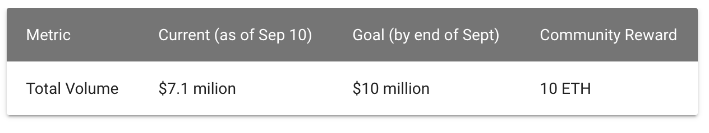
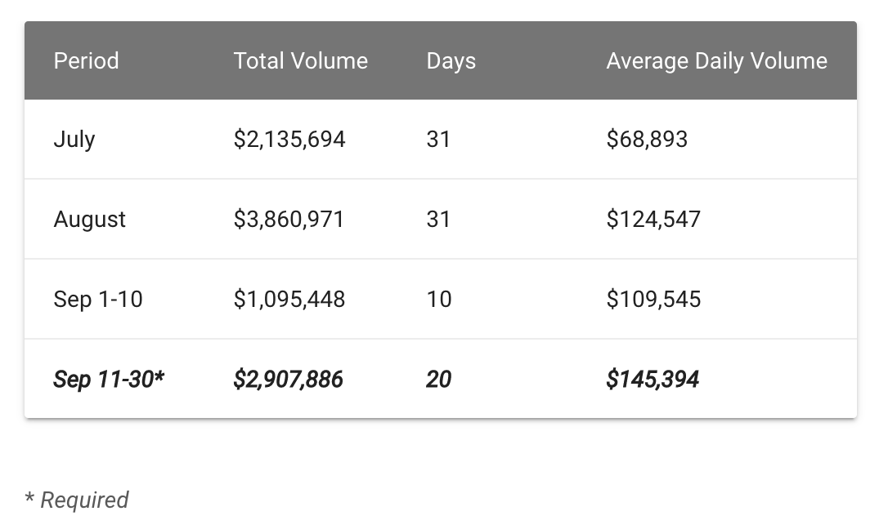
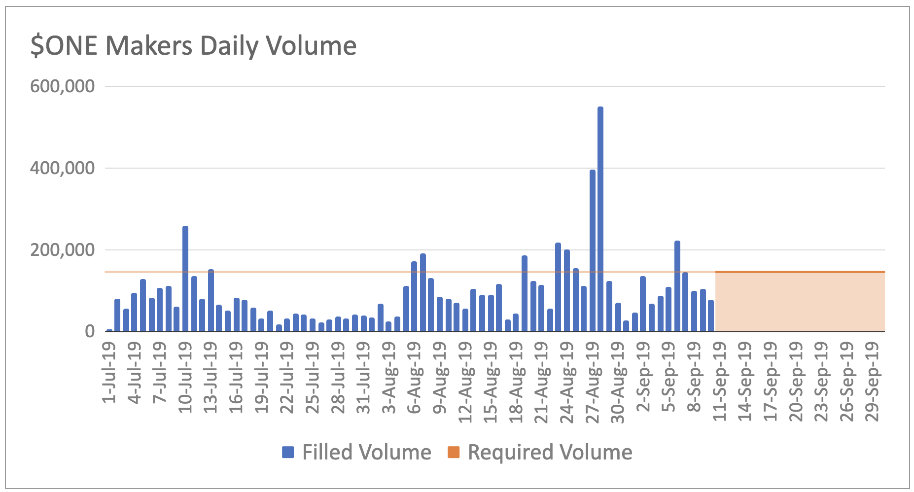

Since the launch of the [$ONE Makers program](/liquidity-mining/harmony), we and Harmony have been overwhelmed with the results thus far.  In our previous post ([Does community-based market making work?](/blog/2019-09-does-community-based-market-making-work/)), we explained that we have been very encouraged to see tangible signs that our mission of ***decentralizing market making*** is actually possible!

We are grateful to the early participants in the program, members of the Hummingbot and Harmony communities that have joined us on this journey.  We are happy to see participants and community members actively involved on our discord chat, helping each other and answering each other’s questions.  This collaboration and sense of community has inspired us to come up with a way to reward the community and promote collaboration.

To that end, we and Harmony are announcing an additional reward for September, a 10 ETH **$ONE Makers Community Bounty**.  This reward will be in addition to the previously announced rewards.

Now that we are in the third and final month of the program, filled volume currently stands at $7.1 million (as of September 10, 2019).  We are within striking distance of $10 million, so let’s all work together to hit that milestone!  

<!-- more -->

The terms of the community bounty rewards are as follows:

If $ONE Makers achieves this volume goal by the end of September, a community reward of 10 ETH will be distributed to all the bounty hunters, distributed proportionally based on each participant’s filled order volume in September.

#### How can we achieve this community goal?

We saw an 80% increase in filled volume from July to August.  In order to achieve the target September volume, we only need to achieve a 3% increase from August to September.

The required average daily volume for remainder of September must be $145,394; in comparison, the average daily volume over the same period (last 20 days) in August was $142,971.  Clearly, the goal is within reach!

This community reward exemplifies what both Hummingbot and Harmony stands for:
> #### Empowering a global community who work together to change the world.

Tell your friends about $ONE Makers, fire up your bots, and let’s achieve this goal together, as **ONE**!
