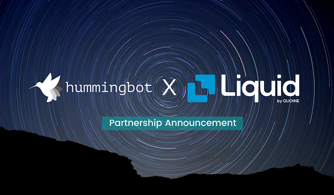

# Hummingbot announces partnership with and gitcoin bounty for Liquid.com

**We are extremely excited to announce that Hummingbot has partnered with Liquid Group to create an exchange integration for [Liquid.com](https://www.liquid.com/) that will enable users to deploy Hummingbot’s automated trading strategies on Liquid as well as pave the way for future liquidity rewards programs on the Liquid platform.**

One of the largest cryptocurrency exchanges in the world by fiat-crypto volumes, Liquid has close to 200 employees across Asia and recently [announced financing at a $1 billion+ valuation](https://techcrunch.com/2019/04/03/liquid-series-c-1-billion-bitmain-idg/). 

What makes us so excited about this partnership is the alignment of our companies’ core mission: enabling crypto to realize its potential by solving [liquidity](../2019-01-thin-crust-of-liquidity/index.md). We believe that Hummingbot’s ability to decentralize market making and Liquid’s single globally-sourced trading platform (its “World Book”) are highly complementary, benefiting Hummingbot users, Liquid users, and the general liquidity landscape for the crypto market.

Working together, we are one step closer to achieving our mission of increasing market efficiency and democratizing finance; **efficient trading and liquidity should be available to all, not just the largest digital assets or projects with the deepest pockets**.

<!-- more -->

### Security Review by Liquid’s CISO

Liquid is a regulated exchange in Japan and Liquid ex-Japan is registered in Singapore. Liquid ex-Japan will also be looking at licensing under the upcoming Payment Services Act. Consequently, Liquid abides to the highest levels of regulatory standards which include AML and security practices.

Prior to engaging in the partnership, Liquid’s CISO performed a security review of Hummingbot as well as of the team’s development infrastructure and code release practices.  We are pleased to announce that Hummingbot was approved, with Liquid’s CISO deeming that Hummingbot “do[es] not introduce any additional risk to our environment or customers”¹.

*Note: The security review focused on security aspects of Hummingbot only, and such statement is not in reference to or any assurance related to any inherent risk of transacting in or the trading of digital assets.*

### Business Development Review by Liquid’s Global Head of BD

From a client centric perspective, building the exchange connector to Hummingbot and providing decentralized market making incentives to the Hummingbot community will help provide much needed, sustainable liquidity for altcoin issuers on the Liquid platform, direct from the community. The ability for community members to market make at smaller quantities of token inventory is an exciting development in decentralized liquidity provisioning, ties in with the external partnerships that Liquid’s World Book is built for, and is a step closer towards decentralized finance.

### Leveraging the Community: Gitcoin Bounty for Exchange Connector

We are grateful to have a highly engaged and active community, and have been overwhelmed by the enthusiasm and involvement of our community in Hummingbot.  From the moment we announced Hummingbot, we have received and continue to receive ongoing requests from exchanges and protocols to add support, as well as strategy suggestions and other feature requests for Hummingbot.  Since our team is relatively small and takes a very diligent and comprehensive approach to building, testing, and maintaining new features, unfortunately we have not been able to add on as many features and capabilities as we’d like or accommodate all of these requests.

In light of this, over the past few weeks and months, our team has focused on refactoring and documenting our code base which has resulted in the reigning in of the addition of new features.  Our rationale for taking this approach is given our highly engaged community, the fastest way for us to build out the capabilities of Hummingbot is by enlisting the help of our community. To that end, we have focused on arming our community with the tools to build on top of Hummingbot in the form of cleaner, more documented code as well as developer resources (see our [Developer Docs](/developers/index.md).

As part of our partnership with Liquid, we are announcing a Gitcoin bounty to source a developer from the community to work closely with the Hummingbot and Liquid teams in order to develop an exchange connector.

> The Gitcoin bounty can be found here: [$5,000 Gitcoin Bounty for Hummingbot/Liquid.com](https://gitcoin.co/issue/CoinAlpha/hummingbot/909/3556).

This bounty is an additional initiative to promote and encourage developers from the community to contribute to our open source code base.  We plan on creating subsequent Gitcoin bounties in the future as well as generally finding ways to feature and reward community contributors.

### Market Maker Rewards

Upon completion of the Liquid exchange connector, Hummingbot and Liquid will be launching a market maker rewards program on the Liquid platform, to reward users of Hummingbot for providing liquidity on the Liquid exchange.

This new program follows on the success of the [Harmony ONE Makers program](https://hummingbot.io/liquidity-mining/harmony/), which was a big step in proving that community-based, decentralized market making can work.

We are excited to be able to offer similar programs in the near future for token issuers who have listed on Liquid as an alternative way to promote liquidity and trading efficiency in their tokens.

### Additional Information

For additional information, please navigate to the following pages:

- [Gitcoin Developer Bounty for Hummingbot/Liquid](https://gitcoin.co/issue/CoinAlpha/hummingbot/909/3556)
- [Liquid exchange](https://liquid.com)
- [Liquid whitepaper](https://s3-ap-southeast-1.amazonaws.com/liquid-site/quoine-liquid_v1.9.pdf)
- [Liquid blog](https://blog.liquid.com/)

🤓 **Developers**: *if you are interested to work on this bounty, please reach out to the Hummingbot team on [Discord](https://discord.hummingbot.io) or view the bounty on Gitcoin.*

🏛 **Token issuers**: *if your token is listed on Liquid or on [any of the exchanges](/exchanges/index.md) that Hummingbot is integrated with, please contact the team at [partnerships@hummingbot.io](mailto:partnerships@hummingbot.io) to learn more about our liquidity rewards programs.*