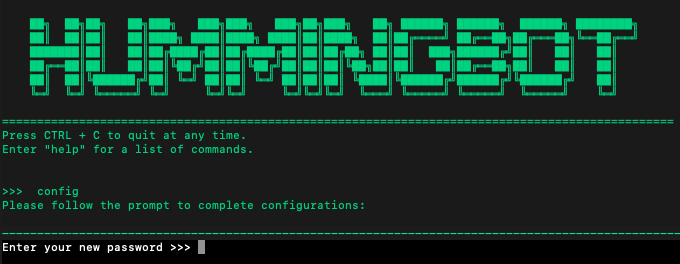
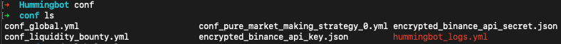

# Introducing Hummingbot's new key encryption feature


In an effort to make our users' sensitive configuration settings such as private keys, exchange API keys and secrets more secure, we have added a new feature that allows you to encrypt and decrypt your sensitive information since the version 0.20.0. 

Previously, your exchange API keys were saved in plain-text in the `conf_global.yml` global configuration file. Even though Hummingbot is local client software, this was a potential security risk because if someone was able to access your computer or cloud virtual machine, they could see your API keys and execute malicious trades with it.

<!-- more -->

The new Hummingbot client will prompt ```Enter your new password``` when you start the configuration process for the first time. 



This password you set will be used to encrypt both your Ethereum wallet private key and your exchange API keys. Now, every time you start the Hummingbot client, you have to enter this password in the client. Please note that for security reasons, the system **does not store this password anywhere**. That means in case of forgotten or lost password, there is no way to recover it. 

Now once you set the password, you'll be able to see a few encrypted files in your ```conf``` folder, and the global config file will not contain your private key and exchange API information anymore. 



>**For users who are upgrading from prior versions of Hummingbot, v0.20.0 and later versions automatically transfers existing API keys out of `conf_global.yml` and into this new encrypted format. This also replaces the password you used before to encrypt your Ethereum wallet private key.**

When you reopen the Hummingbot client, you have to re-enter the password you set before to proceed. Once you enter the password correctly, you can also change or edit your sensitive information.  

We hope this new encryption feature will help all of our users run high-frequency trading bots a bit more safely and securely!

##### More resources
- Read the Step 4: Configure a market making bot in the Quickstart guide
- Read the [v0.20.0 release notes](/release-notes/1.0.0.md)
- Read Hummingbot [Quickstart](../2022-01-level-1-introduction/index.md)