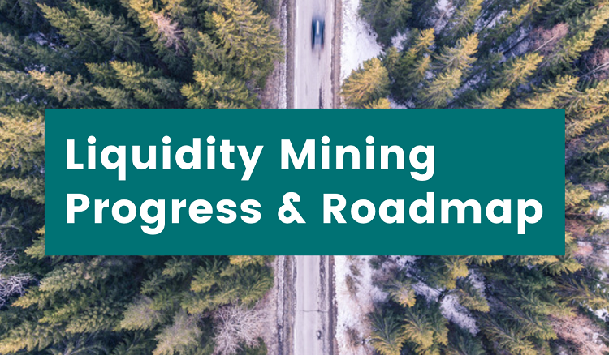
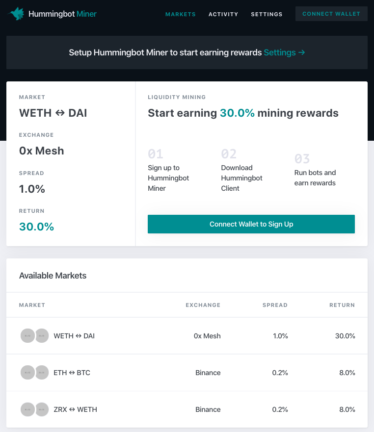

# Liquidity mining launch update

A few weeks ago, we announced [Liquidity Mining](../2019-11-liquidity-mining/index.md), a new way for you to earn yield on crypto assets you own by running Hummingbot and providing liquidity to our exchange and project partners.

Since then, we have been working hard on the infrastructure that will power liquidity mining. Before the holiday season kicks off, we are excited to share the launch plan with you.

<!-- more -->

### Technical Progress Update

##### Hummingbot Miners web app

We're building a web application called Hummingbot Miners that helps you sign up, browse and discover the markets and their mining rates, and track your payouts.

Here's a screenshot of the Markets view:

To be fully transparent and to involve our community, we worked with our friends at [Deep Work Studio](https://deepwork.studio/) to livestream the entire design process, from research to storyboarding to user testing. Click the links below to watch the replays:

1. [Session 1 - Research](https://youtu.be/N46nOYcdKEw)
2. [Session 2 - User Story Map](https://youtu.be/d64aQHvmPYY)
3. [Session 3 - User Testing](https://youtu.be/OmS8BkKSQMo)

##### Exchange data infrastructure

While the Hummingbot Miners app allows users to participate in liquidity mining, the core technology that powers liquidity mining is our exchange data collection and verification infrastructure.

For each exchange, we:

* Collect full-resolution order book data while ensuring availability via multiple, redundant collectors that are deduped and synchronized with Kafka.
* Aggregate and store order book data and make it available for replay.
* Build a reporting infrastructure that exposes API endpoints consumed by Hummingbot Miners.
* Set up monitoring that notifies us of outages and attempts to reconnect.
* Run machine learning algorithms that attempt to detect signs of market manipulation, such as wash trading and spoofing.

Currently, we are completing this work for Binance and 0x Mesh, the first two exchanges for which we will launch liquidity mining campaigns.

### Launch Plan

##### Launch current exchanges: mid-February 2020
In mid-February 2020, we plan to launch liquidity mining campaigns for our launch partners on 0x Mesh and Binance. In this initial wave, liquidity miners can earn yield on the following tokens:

* DAI (DAI) on Bamboo Relay
* Harmony (ONE)
* iExec (RLC)
* ZCoin (ZC)
* Zilliqa (ZIL)
* Solana (if listed on Binance or 0x)

**In each campaign, there will be approximately US$8,000 per month in rewards for liquidity miners to earn.**

##### Launch new exchanges: mid-March 2020

In mid-March 2020, we plan to launch campaigns on our new exchange partners. We are currently working with these partners to build the **exchange connector** that integrates the Hummingbot client with the exchange API. In order to iron out potential bugs that might affect the user experience, we extensively test new exchange connectors after they are released. Afterwards, we will build the **data collector** infrastructure that collects and verifies orders placed by liquidity miners.

We expect to launch campaigns on:

* Liquid
* Loopring

### Business and Community Updates
After we announced liquidity mining, many crypto exchanges and token projects have reached out to us and expressed interest. We plan to onboard these customers gradually to ensure that we deliver a great experience for our initial cohort of liquidity miners and launch partners.

Our community has been growing rapidly and organically. Currently, we have approximately 1,500 followers on [Twitter](https://twitter.com/hummingbot_io) and roughly the same number of members in [Discord](http://discord.hummingbot.io/).

In addition, we have about 500 members in our Bay Area [meetup](https://www.meetup.com/BayCrypto/) group and 370 subscribers on our [YouTube](https://www.youtube.com/channel/UCxzzdEnDRbylLMWmaMjywOA) channel.

### For more information
- [Liquidity mining whitepaper](/liquidity-mining.pdf)
- [Download Hummingbot](https://github.com/hummingbot/hummingbot)
- [Hummingbot whitepaper](/hummingbot.pdf)

For exchanges and projects that would like to learn more about liquidity mining, please contact us at [partnerships@hummingbot.io](mailto:partnerships@hummingbot.io).
