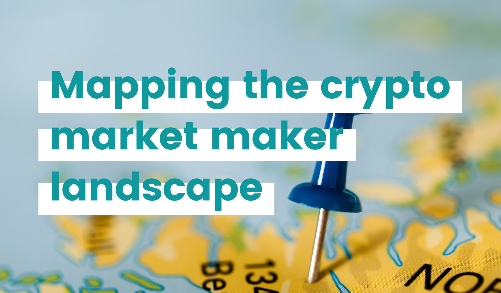

# Mapping the crypto market maker landscape: list of 34 market makers

## Summary

Market making is an indispensable but misunderstood sector of the crypto industry. Ever since we open sourced Hummingbot 10 months ago, we've learned a lot about market making from professional market makers who use Hummingbot, as well as from token projects who hire market makers.

In this post, we provide information that may help projects and exchanges who are considering hiring a professional market maker:

- [Part 1](#part1) lists questions that prospective clients of market makers may wish to ask
- [Part 2](#part2) provides a directory of crypto market makers around the world

<!-- more -->

## Part 1: Evaluating Market Makers

### What do market makers do?

Market makers, also known as liquidity providers, play a fundamental role in asset markets by simultaneously quoting bid (buy) and ask (sell) prices for assets on an exchange. By quoting prices at which they stand ready to buy and sell assets, they facilitate price discovery and liquid trading by other market participants. In addition, by quoting prices on different trading venues and arbitraging away inter-market dislocations across different markets, market makers increase overall market efficiency. 

### Market makers in traditional asset markets

In traditional securities markets such as equities, regulatory barriers prevent individuals and small firms from filling the market maker role. In addition, competitive barriers also prevent small participants from acting as market makers. In a practice known as co-location, high frequency trading (”HFT”) firms pay exchanges to place servers in close physical proximity to the exchange’s own servers, providing lower latency access to data feeds and trade execution. HFT firms have collectively spent massive sums building networks of wireless towers, fiber optic lines and submarine cables designed to provide millisecond-scale time advantages versus other market participants. Furthermore, fiat exchanges like NYSE and Nasdaq charge as much as $22,000 per month for access to market data feeds. Since HFT firms earn profits by performing a high volume of trades, they also tend to focus on making markets in large-capitalization stocks. 

### Market making in crypto markets 

Digital asset markets lowers the barriers to entry that impede the general public from market making in traditional financial markets. In particular, individual traders have direct market access to digital asset exchanges, enabling them to provide price quotes and execute trades programmatically using the same APIs as professional firms. Digital asset exchanges also provide market data feeds free of charge. 

While certain exchanges provide volume-based fee rebates that favor professional trading firms, they generally do not offer co-location or other features that provide significant competitive advantages to large players at the expense of smaller ones. In fact, the location of servers hosting a digital asset exchange is typically a tightly kept secret.  In addition, since the digital asset exchange landscape is highly competitive with hundreds of active, globally accessible venues, exchanges who introduce anti-competitive features risk losing business from individual traders and small firms. 

Yet despite the lowering of competitive barriers to market making, there remains **relatively few market makers** compared to the proliferation of digital assets and exchanges, leading to the extreme concentration in liquidity. Market makers for digital assets, primarily quantitative hedge funds and trading firms, are in high demand, evidenced by the compensation they receive from both exchanges and token issuers. 

According to [CoinDesk](https://www.coindesk.com/blockstack-will-pay-liquidity-provider-gsr-to-trade-its-stx-token?utm_source=twitter&utm_medium=coindesk&utm_term=&utm_content=&utm_campaign=Organic%20), Blockstack (STX) hired GSR to “provide services related to increasing the liquidity” of STX by paying “a one-time setup fee of $100,000 and a monthly payment of $20,000 for six months” and lending “$1 million-worth of bitcoin and ether with zero interest to fund the trading”.

Most exchanges charge higher fees for takers (traders who fill market price quotes) and a lower or even zero fees for makers (traders who provide price quotes). Some exchanges also provide rebates to market makers, in order to incentivize market making. 

Technical barriers prevent additional entrants from making markets for digital assets. Due to the highly volatile nature of digital asset prices as well as 24/7 trading hours, market makers may need to employ an automated, algorithmic approach in order to stay competitive. Unlike in fiat markets where the Financial Information eXchange (FIX) Protocol provides a standardized message format for electronic trading, digital asset exchange APIs vary in both format and reliability. Market making algorithms need to handle edge cases such as stale data, trade execution lag, as well as API downtime and errors. Writing robust, reliable market making algorithms that can trade on multiple exchanges requires significant specialized engineering resources.

### Why do you need market makers?

Market makers create important benefits to token projects and exchanges. First and foremost, market makers enable liquid trading so that buyers and sellers can readily buy and sell the asset at reasonable prices while minimizing the friction costs of transacting.  In other words, market makers aim to help maintain a healthy order book with tight bid/ask spreads. Healthy order books minimize volatility and increase the stability of the token price. 

In today’s fragmented crypto market, a $100k block trade of a top-50 coin could possibly result in a trader losing 10% due to **slippage**, the difference between the observed market price and the actual execution price. Lack of liquidity can also increase the risk of a **flash crash**, which occurs when a large market sell order clears out all the top buy offers in the order book and instantaneously moves the price downward substantially. For example, the 2017 Coinbase Pro flash crash led the exchange to refund millions in losses for affected users, terminate their margin trading program, and implement additional circuit breakers.

As [Arthur Breitman, Co-founder of Tezos](https://medium.com/tezos/towards-futarchy-in-tezos-54a7b8926967) pointed out in his blog post, “The most natural way to subsidize price discovery in a market is to pay market makers to maintain tight, double sided quotes. A naive market maker constantly offering to buy or sell with a reasonable spread will naturally lose money to informed traders. Paying the market maker permits funneling a subsidy towards the most efficient forecasters.” 

So why is an efficient trading market for a token issuer’s tokens important?  For token issuers who are trying to encourage the general public to adopt the use of their native token, a highly volatile and illiquid token could drive away potential users.  If would-be adopters are hit with a material penalty (in the form of slippage) just to acquire the tokens in the first place, or if the tokens are hard to acquire due to shallow order books, or if the value of acquired token holdings swings wildly, this could easily dissuade users from acquiring the token, and at very least, negatively impact their user experience.  Similarly, traders who want to transact in the token may be dissuaded from acquiring the tokens due to the risk of material friction costs from transactions as well as the uncertainty of being able to trade out of positions efficiently.

In order to improve token liquidity, most token projects, particularly those listed on the major exchanges, and newly launched or long-tail exchanges choose to hire professional market makers, while established exchanges will also incentivize market makers by providing low trading fees and even rebates.  

### OK, you’ve picked a maker maker! Then how do you measure its performance?

Today, many token projects and exchanges measure market makers’ performance based on trading volume or even price targets. 

We believe volume is an inferior metric because it is ex-post and can be easily manipulated. A market maker solely motivated by creating more volume might trade a lot only when market conditions are favorable and may not maintain consistent liquidity. As a result, this may not actually beneficially impact the trading dynamics of the token and could even make it worse, such as in the case of market makers pulling orders during periods of high volatility, exactly when they’re needed most!  Some unethical market makers even often fake the volume by wash trading, which means creating and filling their own orders.

Also, market makers should not be representing that they can achieve price targets, since trading for the purpose of influencing price levels is market manipulation.

We believe that **slippage** is a more robust indicator of liquidity than trading volume, and that a market maker’s performance should be measured on their impact on slippage. Slippage refers to the difference between the mid-market price of an asset and the price at which the trade is actually executed; the difference occurs because actual trade execution depends on depth or order book and the required amount of orders to fill the trade order size.  **The smaller the slippage, the better the liquidity**. Deep, liquid order books tend to have low slippage, while thin, illiquid order books have high slippage. Using slippage as the key performance metric can also prevent market makers’ attempts to put their own profit-seeking interest before token issuer’s liquidity-maximizing objectives. By setting wider bid-ask spread which results in higher slippage and lower volume, some market makers might seek to make more profit from trading rather than maximize the liquidity for their clients. 

## Part 2: Market Maker Directory

Due to the ever-increasing demand for liquidity in the crypto markets, a number of market making firms have emerged. Below, we provide a directory of 34 professional crypto market makers, in alphabetic order. **Please note that this directory does not constitute a recommendation for any of these firms, and this is not financial nor hiring advice**.

> **For market making firms:** Please email us at partnerships@hummingbot.io if you would like us to add or edit your listing.

##### Altonomy
[https://www.altonomy.com/#/](https://www.altonomy.com/#/)

According to the firm, it has direct partnerships with more than 80 token issuers, among which 40-plus are ranked top-200 by market capitalization, as well as top global and regional investment funds. Headquartered in Singapore, Altonomy closed a $7 million round funded by Polychain Capital last year. 

##### Amber Group
[https://www.amberaigroup.com/](https://www.amberaigroup.com/)

Based in Asia, Amber Group focuses on electronic market making and systematic trading in digital currencies - covering spot, futures, swaps, options and other derivatives. It provides liquidity for miners and mining pools, exchanges, hedge funds and token issuers. According to the firm, it has executed over $100 billion of trades across all products and categories since inception.

##### Alameda Research
[https://www.alameda-research.com/](https://www.alameda-research.com/)

Alameda Research is a quantitative cryptocurrency trading firm and liquidity provider. According to the firm, it manages over $100 million in digital assets and trades $600 million to $1.5 billion daily across thousands of products: major coins and altcoins, as well as their derivatives.

##### AlphaTheta

The mission of AlphaTheta is to create solutions for enhancing token marketability and building stability in the token ecosystem. 

##### Atomic Fund
[https://atomic.fund/](https://atomic.fund/)

According to its website, Atomic Fund quotes both ask and bid orders in a given order book for a financial instrument to provide liquidity, increase trading volumes and reduce market volatility. Clients can populate their own charts based on the data Atomic Fund collects.

##### B2C2
[https://www.b2c2.com/](https://www.b2c2.com/)

According to the firm, B2C2 is one of the largest cryptocurrency liquidity providers. Headquartered in the UK, with offices in London, Brussels and Tokyo, the firm was founded in 2015. 

##### Binary Financial
[http://binaryfin.com/](http://binaryfin.com/)

Founded in 2014, Binary Financial is a crypto hedge fund focusing on brokering and facilitating large block Bitcoin trades for high net worth clients and institutions, proprietary trading and electronic market making.

##### Citizen Hex
https://www.citizenhex.com/

According to the firm, Citizen Hex is purpose-built for the Ethereum era: a corporation centred around acquiring, securing, and trading ERC-20 tokens. Citizen Hex is building market-making tools to provide token liquidity on decentralized exchanges.

##### Coin Flow

Coin Flow is a crypto market maker based in Hong Kong, and it provides designated market making, exchange market making, and ICO Advisory services. It currently is offering market making services for top 100 coins. 

##### BlockVC
https://www.blockvc.com

BlockVC is a blockchain investment firm, which also provides life-cycle solutions including incubating, asset management and market making for its portfolio companies. 

##### Bluesky Capital
[https://www.blueskycapitalmanagement.com/](https://www.blueskycapitalmanagement.com/)

Bluesky Capital is a quantitative alternative investment manager, which provides market making services to ICOs and exchanges. 

##### Cumberland DRW
[https://cumberland.io/](https://cumberland.io/)

Cumberland provides liquidity support to over 40 cryptocurrencies. The company operates within a diversified principal trading firm known as DRW, which has more than 25 years of experience in markets around the world.

##### Efficient Frontier
[https://www.efrontier.io/](https://www.efrontier.io/)

Efficient Frontier is a crypto algorithmic trading firm and market maker with over 13 years of experience in traditional markets and 3 years in crypto. They trade over $100M a day in spot and derivatives markets.  

##### Fractal Wealth
http://www.fractalwealth.com

Fractal is a cryptocurrency trading and technology firm that provides liquidity to decentralized exchanges.

##### FBG Capital

FBG is a digital asset management firm in blockchain-based capital market.

##### Galois Capital
[https://galois.capital/](https://galois.capital/)

Based in San Francisco, Galois Capital primarily focuses on algorithmic market making and OTC trading.

##### Grasshopper Capital

Grasshopper Capital is an investment manager who works closely with founders helping them commercialise products quickly and effectively as well as opening doors for distribution.

##### Grapefruit Trading
https://gfru.it

Based in Chicago, Grapefruit Trading specializes in providing liquidity in cryptos. It is a subsidiary of 4170 Trading. According to the firm, its team members have been actively involved in the crypto space since 2010.

##### GSR
[https://www.gsr.io/](https://www.gsr.io/)

Founded in 2013, GSR is a Hong Kong-based algorithmic digital asset trading. According to its website, GSR has traded billions of dollars of digital assets utilizing its proprietary software suite, capable of satisfying all liquidity needs, from basic execution services to highly complex solutions. 

##### HedgeTech
[https://www.hedgetech.io/](https://www.hedgetech.io/)

HedgeTech is an algorithmic market maker that services issuers, exchanges and other market makers worldwide via two separate entities in the USA and Singapore. The firm has been recognized as a leading market maker by top institutions and world-renowned universities for the stability, security and scalability of its systems. 

##### Hiro Trading
https://www.hirotrading.io

Headquartered in London, Hiro Trading is a digital asset market making firm – covering both spot and derivative products. Comprising an experienced team of quantitative traders and data scientists, Hiro works closely with crypto exchanges and token issuers to provide their projects with institutional grade liquidity.

##### Jump Trading
[https://www.jumptrading.com/](https://www.jumptrading.com/)

Jump Trading is a global, quantitative-based trading firm. Jump has more than 700 employees across offices in Chicago, New York, London, Amsterdam, Shanghai, Singapore, and Gurgaon, India.

##### Kairon Labs
[https://www.kaironlabs.com/](https://www.kaironlabs.com/)

Founded in late 2018, Kairon Labs is based in Belgium and the Netherlands and offers market making for all utility tokens using proprietary trading software.

##### Keyrock
[https://keyrock.eu/](https://keyrock.eu/)

Founded in Belgium in 2017, Keyrock is a cryptocurrency market maker building scalable, self-adaptive algorithmic technologies to support efficient digital asset markets. 

##### Koinbros
[http://www.koinbros.com](http://www.koinbros.com)

Koinbros specialises in market-making services and over-the-counter trading on post-ICO utility tokens. We are a privately-owned multi-strategy trading firm. We are focused on seeking out trading and investment opportunities to grow our capital in the utility token markets. We bring together high caliber people, innovative and quantitative modeling, and cutting edge technology to seek out opportunities around cryptocurrency exchanges.

##### Octagon Strategy
https://trade.octfinancial.com

According to the firm, Octagon Strategy is the largest digital asset brokerage in the Asia-Pacific region. The desk facilitates institutions and individuals for the buying and selling of major cryptocurrencies. The team envisions drawing on its deep pools of liquidity to support high volume block trades of cryptocurrencies while ensuring a competitive pricing.

##### Origin X Capital

Founded in 2018 in Hong Kong, Origin X Capital (OXC) is a consulting firm and an international digital asset fund. 

##### Prycto
[https://prycto.com/](https://prycto.com/)

Prycto is a quantitative market maker based in Gibraltar, providing automatic and constant liquidity for your digital asset. According to the firm, it provides liquidity for clients at scale. 

##### Pulsar Trading
[https://www.pulsartradingcap.com/](https://www.pulsartradingcap.com/)

Based in Hong Kong, Pulsar Trading Capital is a proprietary trading firm, specialized in quantitative and high frequency trading. According to the firm, it has become a leading liquidity provider in the digital asset market since 2014.

##### QCP Capital
[https://qcp.capital/](https://qcp.capital/)

QCP Capital is a digital asset trading firm based in Singapore. QCP runs an OTC trading desk and provides digital asset trading services such as treasury management and market-making operations. QCP has a strategic focus on Southeast Asia but also operates in the UK, Japan and Australia.

##### Snap innovations
[https://snapinnovations.com/](https://snapinnovations.com/)

SNAP Innovations is an Artificial Intelligence, Blockchain and Financial Trading & Technology Solutions company. According to the firm, it provides programmatic liquidity for dozens of digital assets across 30 venues and hundreds of crosses.

##### Trade Terminal
[http://www.tradeterminal.io/](http://www.tradeterminal.io/)

San Jose-based Trade Terminal is a digital asset hedge fund, using data-driven algorithmic trading with its own data and research. 

##### Three Arrows Capital
[https://www.threearrowscap.com/](https://www.threearrowscap.com/)

Three Arrows Capital is a Singapore-based fund manager specialising in emerging markets.

##### Wintermute
[https://www.wintermute.com/](https://www.wintermute.com/)

Founded in July 2017 by three senior Optiver traders and developers with the mission to professionalise crypto market making, Wintermute Trading is one of the top global algorithmic market makers in crypto. They trade over 500 trading pairs on over 40 vetted exchanges, in both spot and derivatives.

## Conclusion

Market making has been playing a similar important role in the crypto markets as in the traditional markets. While the crypto industry is nascent and its market maker landscape highly fragmented, market makers are effectively increasing the tradability of assets as well as the overall efficiency of the markets and the token ecosystems.

Ideally, market makers should consistently place orders with tight spreads and large order sizes with minimal down-time to improve liquidity.  Since these actions would actually result in increased risk for the market maker, the market maker’s compensation should be aligned to reward for the additional risk of desired behaviors.  We therefore propose using **slippage** as a robust and motivational metric to measure your market making program, overlaid with periodical sampling over time to ensure order book consistency.

---

For exchanges and projects who would like to learn more about liquidity mining, please contact us at [partnerships@hummingbot.io](mailto:partnerships@hummingbot.io).
