# Case study: Zilliqa liquidity mining campaign

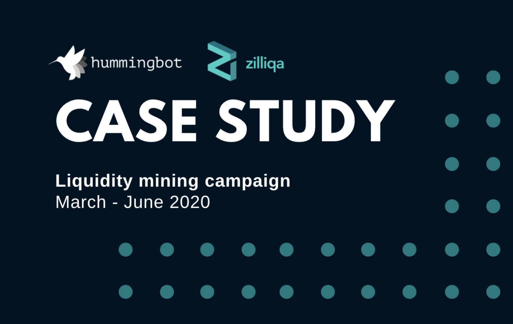

### Summary

Over the past few weeks, we have seen remarkable outperformance in Zilliqa tokens as the company has delivered on several platform initiatives (see the recent [Zilliqa May 2020 newsletter](https://blog.zilliqa.com/zilliqa-monthly-newsletter-may-2020-83a694add9ae)) and has continued to grow its global community.  In addition, Zilliqa has recently announced that it has entered into [staking partnerships](https://blog.zilliqa.com/zilliqa-set-to-introduce-staking-on-the-mainnet-soon-promises-added-value-and-efficiency-to-its-f2f80e38eacb) with KuCoin and Binance, and Binance is now supporting margin trading for ZIL tokens.

The token has materially outperformed even against the backdrop of the bullish overall crypto market. We've also seen resurgent interest in the trading of ZIL tokens, with daily traded volume consistently reaching tens of millions over the past few weeks:

<!-- more -->

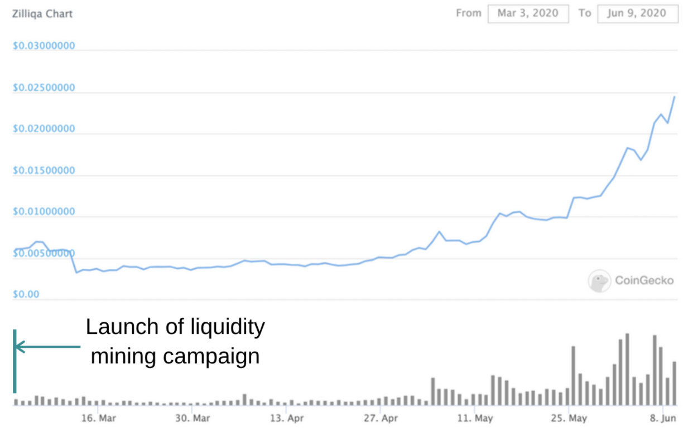

With liquidity mining, Zilliqa was able to solely rely on the group of individual liquidity miners to promote liquidity without spending large amounts (fees and token inventory) on professional services provided by market making firms. So far during the 3-month liquidity mining campaign period, **307 distinct liquidity miners participated and earned rewards**. **They were accounting for as much as 10-20% of total ZIL trading volume on Binance from March to April**, and as much as 30-60% for the less liquid trading pairs (ZILETH and ZILBNB). This result was considered successful by both of the Hummingbot and Zilliqa communities. 

### Trading community engagement: an important component of community engagement

A fundamental reason for this strong token performance we’ve witnessed is due to the quality of the project and its demonstrated progress on its platform and technology.  But also important is increased public awareness, community engagement and adoption.  Case in point, here is a post from June 2019 discussing ZIL price - [Why has Zilliqa’s token underperformed, despite the successful mainnet launch?](https://medium.com/swlh/why-has-zilliqas-token-underperformed-despite-the-successful-mainnet-launch-8ba1c48143d7). In contrast to the ZIL token performance seen in recent weeks, Zilliqa’s project development in 2019 (even something as substantial as a successful and stable mainnet launch!) did little to move ZIL token price and increase trading activity.

The cryptomarket, just like the stock market, represents an outlet of public perception and serves as an important benchmark of the progress and adoption of the project. As part of this outreach and marketing strategy in early 2020, Zilliqa became a Hummingbot liquidity mining launch partner in order to engage a key component of the token ecosystem: the trading community. 

With over 300 distinct participants running market making strategy competitively, this liquidity mining campaign enabled Zilliqa to:

- increase awareness of trading ZIL tokens and promote it to the crypto trader and algo trading community,
- demonstrate Zilliqa’s commitment to promoting ZIL liquidity, tradability, and support for its token,
- engage and reward its community for contributing to ZIL token’s liquidity.

### Results of the liquidity mining campaign

The liquidity mining campaign was received positively.  We saw consistent growth in the number of bots and open order volume committed to providing ZIL token liquidity.

Below are some of the key metrics throughout the course of the Zilliqa campaign:

- **307 distinct users** participated and earned rewards
- **Liquidity miners were accounting for as much as 10-20% of ZIL trading volume** from March to April, and as much as 30-60% for the less liquid trading pairs (ZILETH, ZILBNB)
- Through week 16 (June 21, 2020), **liquidity miners accounted for $21.4mm of filled order volume**, an average of $1.3mm of volume weekly while paying average rewards of only USDC 844 per week
- **Order book depth created by miners peaked at $73k and is currently around $20k** paying only USDC 750/rewards per week, demonstrating a cost effective way for issuers to generate order book depth

##### Top liquidity miner profile in Zilliqa campaign

- Occupation: software engineer of FAANG
- Quant/algo trading experience: none before Hummingbot
- Estimated capital deployed: approximately $5,000 - 10,000 of inventory
- Traded volume over 3 months: $4.7 million
- Number of trades: 66,425

*More detailed statistics presented at the end of this post.*

Throughout the liquidity mining campaign, Zilliqa actively marketed the campaign to its community and created a dedicated Zilliqa/Hummingbot telegram group, which created a forum to bring together the Hummingbot team with the Zilliqa community, for targeted and specific discussion on ZIL liquidity mining.

### Zilliqa graduating from the “long-tail” of crypto assets with liquidity mining

When we started the campaigns, total daily Binance trading volumes for eligible ZIL trading pairs ranged from approximately $250k-$2.5mm from March to April.  Given the surge of recent activity, ZIL tokens are now seeing as much as $20-30mm of traded volume daily on Binance alone.

With respect to token trading, Zilliqa has achieved the goal of all crypto projects: it now has sufficient organic interest and captured enough attention from the trading community to the point that it no longer needs to actively encourage market making.  In other words, **Zilliqa has graduated from the “long-tail” of crypto assets and has become more mainstream.  The ZIL token is currently ranked #42 on coingecko.com and coinmarketcap, with approximately $77mm of daily traded volume.** At the start of the liquidity mining campaign, ZIL was ranked #70.

As a result, **Zilliqa has decided to conclude its liquidity mining campaign at the end of June and cease spending on market making in general.** We would like to thank all of the miners who helped support the Zilliqa token and liquidity mining campaign over the past few months.

While it’s bittersweet for us that their campaign will be ending, we are very happy to have played a part in their success story and have had the opportunity to work with a great team!

### Liquidity mining campaign statistics

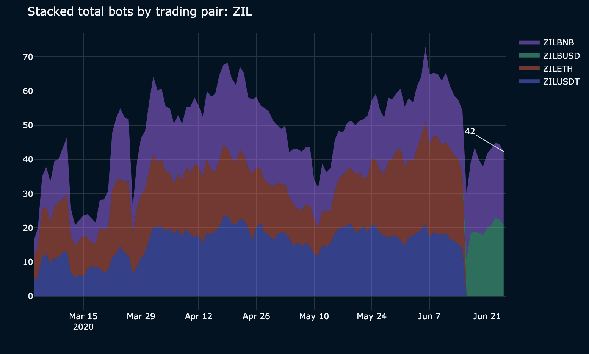
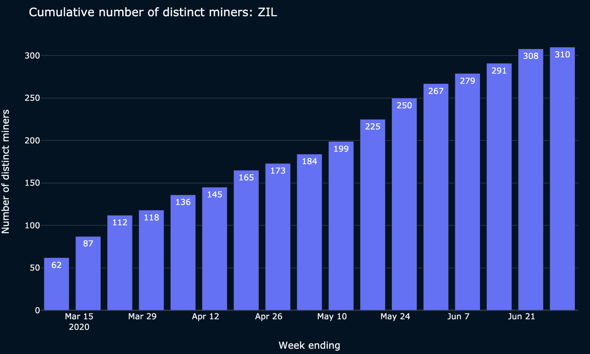
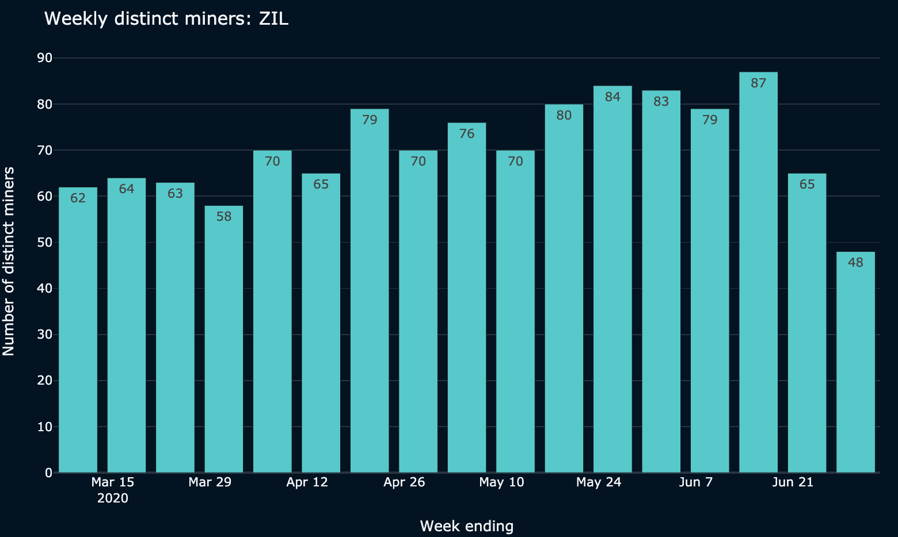
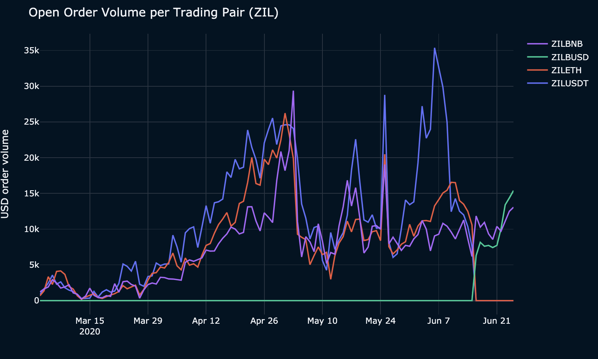
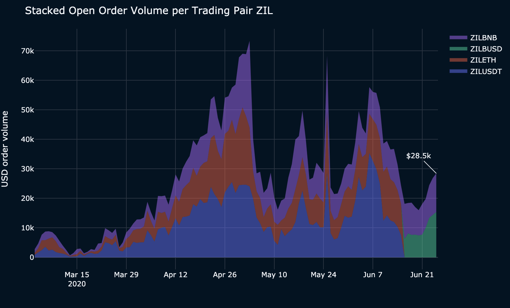
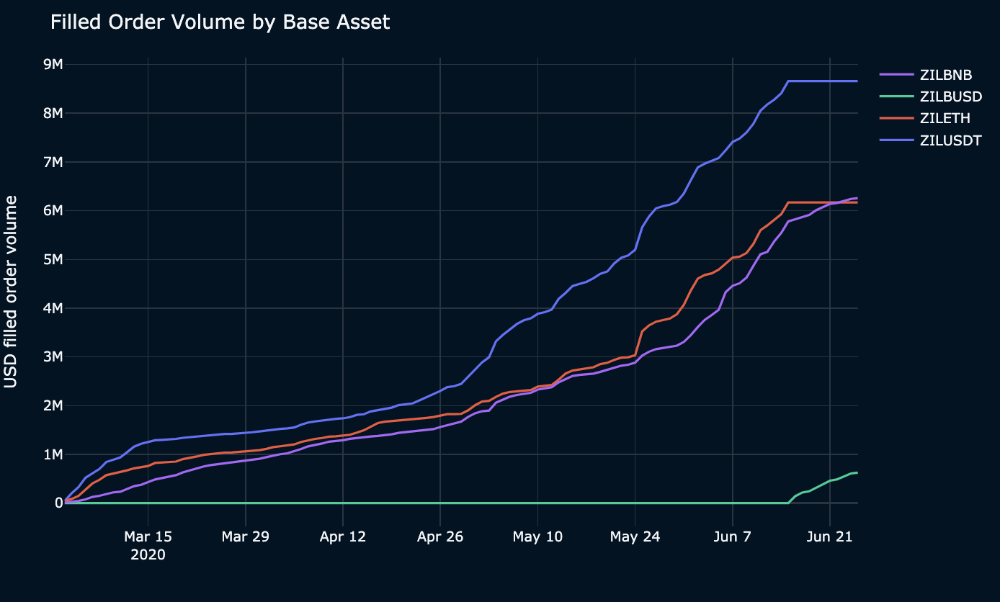
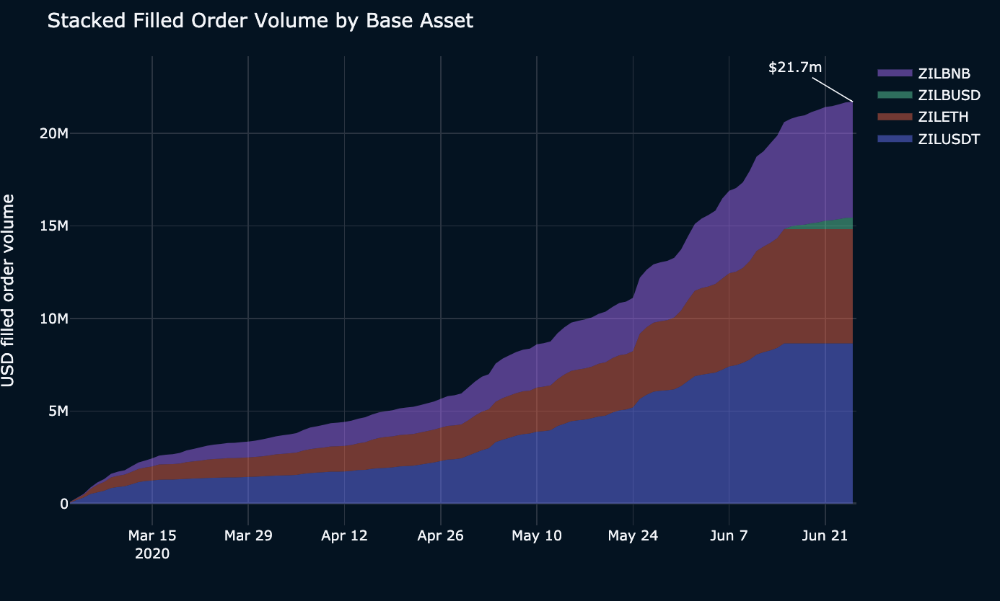
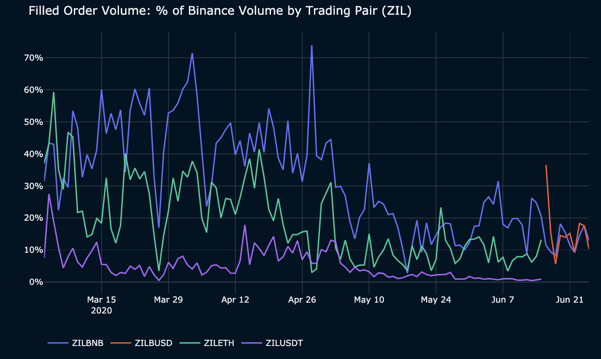
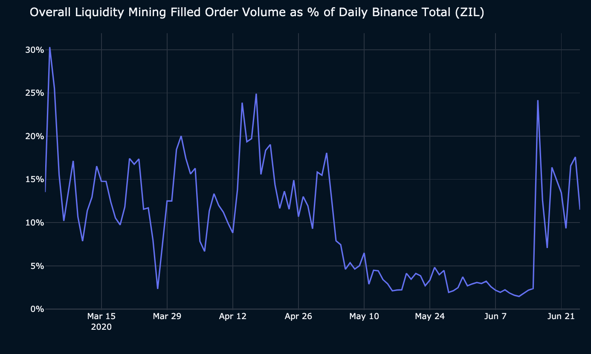

---
For more information:
- [Hummingbot Miner’s app](https://miners.hummingbot.io): current liquidity mining campaigns
- [Hummingbot Help Center](https://support.hummingbot.io/)
- [Liquidity mining free trainings](https://www.eventbrite.com/e/learn-to-use-hummingbot-crypto-market-making-live-training-session-tickets-100968806418)
- [Liquidity mining whitepaper](https://coinalpha.com/liquidity-mining-policy)
- [Getting started](../2022-01-level-1-b-introduction-to-hummingbot-and-hummingbot-liquidity-mining/index.md)

For exchanges and projects that would like to learn more about liquidity mining, please contact us at [partnerships@hummingbot.io](mailto:partnerships@hummingbot.io).
