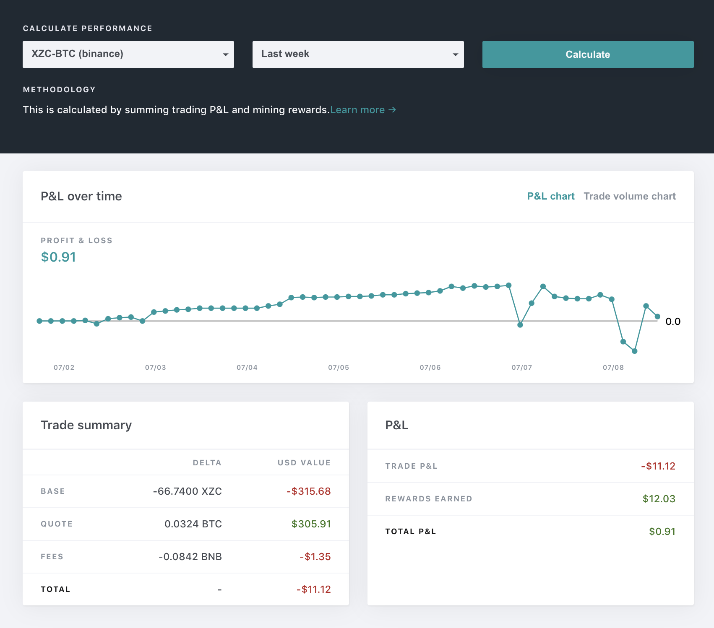
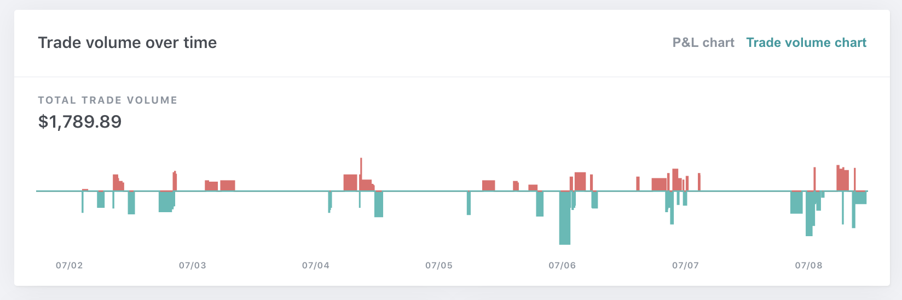

Are you getting richer with liquidity mining?

Understanding your mining performance can be quite tricky. There are many factors involved: trade earnings, moving token prices, fees charged in various crypto assets, and on top of that,
liquidity mining rewards! If only there is a way to capture everything holistically--

We're excited to share a new feature on the Hummingbot Miner app -- your [personal performance dashboard](https://miners.hummingbot.io/dashboard).

We did the hard work of data collection and analysis, so you don't have to!

### How to check my performance?
1. Log into [Hummingbot Miner](https://miners.hummingbot.io) with your wallet.
2. Navigate to Dashboard page and click the `Performance` tab.
3. Select the market you are trading in, as well as the a period (defaults to last hour).
4. Click Calculate.

You should see a time series graph for your past P&L, as well as a breakdown summary of your total earnings over the past period.

There will also be a time series trade volume chart that details your traded volume over the past period.

### How is performance calculated?

`trading P&L`: (Profit/loss from trading alone, ignoring liquidity Rewards)

= **base_asset_trade_delta**(change in base asset inventory) x **base_asset_usd_rate** (at present time)

+&nbsp;**quote_asset_trade_delta**(change in quote asset inventory) * **quote_asset_usd_rate** (at present time)

-&nbsp;sum (**fee_amount** * **fee_asset_usd_rate** (at time of trade)) for each trade.

`total P&L`: (Profit/loss from both trading and liquidity mining)

= **trading_p&l** + sum(**liquidity_mining_reward_amount** * **payout_asset_usd_rate** (at present time))

### Hope you enjoy this new feature. Happy mining!

---
- The performance dashboard is live now. [Check your performance](https://miners.hummingbot.io/dashboard) now.
- We are eager to hear your feedback. Help us improve by sharing your perspective on [discord](https://discord.hummingbot.io) or [reddit](https://www.reddit.com/r/Hummingbot/).
