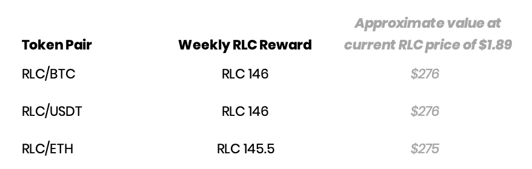
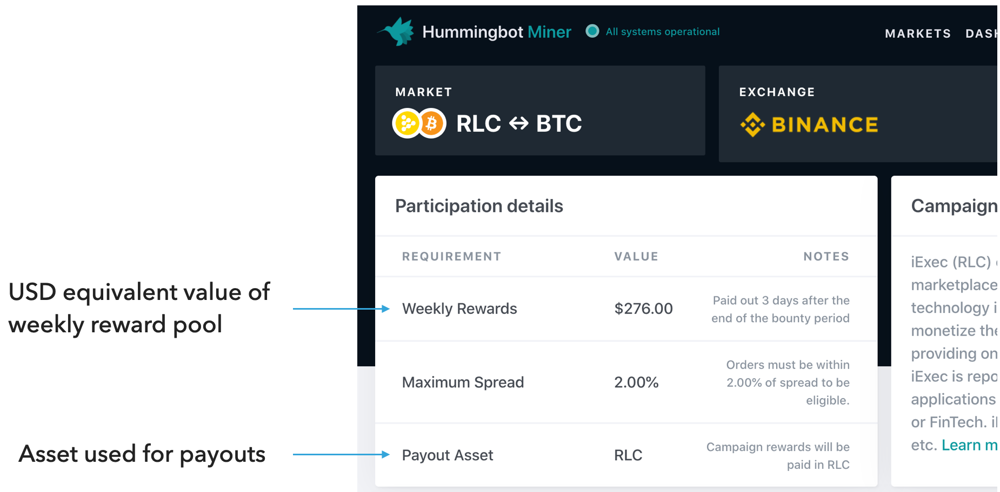

**Announcing a new milestone for the Hummingbot Liquidity Mining platform: the ability to pay out liquidity mining rewards in native tokens!**

We have implemented, tested, and are now rolling out this new feature for liquidity mining campaigns.

For campaigns paying out in native tokens, participating liquidity miners will earn rewards in the same way as they were previously (i.e.  rewards earned for each minute snapshot, weighted by their spread and order sizes); however, instead of USDC, rewards allocations will be denominated in and paid out in the native token.  Reward pools will be based on a fixed amount of native tokens for each reward period.

The inaugural campaign paying out rewards in native tokens is the iExec liquidity mining campaign. For the period starting Tuesday, August 18 12.00am UTC, liquidity miners participating in iExec’s campaign will start earning rewards in RLC. The weekly rewards available for the RLC campaign will be as follows:

<!-- more -->

When you click on a market in the miner’s app, you will now see the following:

The asset used for the campaign’s rewards will be displayed.  For display purposes only, the current approximate USD value of that reward is also shown.

#### Benefits for Token Issuers

Most, if not all, of the token issuers that we have discussed liquidity mining campaigns with have asked for the capability to pay out in native tokens.  Paying native tokens provide several benefits for issuers:

- Enables token issuers to fund a liquidity mining program and campaign in their native tokens
- Eliminates the need to sell, and possibly create selling pressure, on native tokens in order to fund USDC
- Creates a way of distributing rewards to the community of liquidity miners that are contributing to the token’s liquidity
- Encourage use of the native token

We believe that the ability to pay out native tokens will also encourage more issuers to launch new campaigns.

#### Benefits for Liquidity Miners

- Allows liquidity miners to accumulate base tokens for market making
- Eliminates the need to convert USDC rewards into base and/or quote tokens for trading
- Allows liquidity miners to participate in price upside; the value of liquidity mining rewards (in USD or quote asset terms) increases as the price of the native tokens increases.  *Although of course, this also means that liquidity miners are exposed to a drop in reward value (in USD terms) should the price of the token fall.*

#### ERC20 Token-Ready

RLC is an ERC20 token; our system is currently able to handle payouts of liquidity mining rewards for any ERC20 token.

#### Non-ERC20 Tokens / Non-Ethereum Tokens

We are planning to announce our first non-ERC20 liquidity mining reward pool in the next few weeks.  This will provide issuers another way of encouraging the use of their native blockchains.

Development is currently underway and we are in the process of testing out our rewards and payments infrastructure to support our first non-Ethereum blockchain.

Stay tuned, announcement coming soon!

---

#### Additional Information

**Token issuers:** please contact the team at [partnerships@hummingbot.io](mailto:partnerships@hummingbot.io) to learn more about running a Hummingbot Miners liquidity mining campaigns for your tokens.

Liquidity mining campaigns are currently live on Binance.com. We are planning to launch liquidity mining campaigns on KuCoin at the end of September.