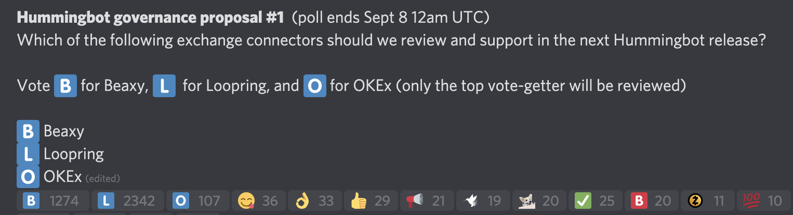

As Hummingbot’s community and usage have grown, we have seen increasing participation from community members in the form of code contributions, requests for features, strategies, and exchange connectors from users, bug reports, and generally increased engagement and discussions on our forums.  As the community has grown, it has become clear to us that there are many more stakeholders involved.  Previously, the decisions on the direction of Hummingbot were solely made by us, based on our discussions with users, feedback from some members of our community, and discussions with exchanges who’ve reached out to us about partnerships.  However, in order to better serve the broader community, we need to find a better way to democratize the direction of Hummingbot.  This means that our role would have to evolve into one that serves as more of an open-source project steward.

We have started to think about and explore what this new type of role means to us and to our community.  As a first step, we wanted to test the waters to see if there would actually even be any interest from the community to weigh in on the direction of Hummingbot.

<!-- more -->

We completed the [first Hummingbot connector governance trial](https://hummingbot.io/blog/2020-08-exchange-connector-governance/) earlier this month, where we asked the community to vote on which exchange connector to integrate next into Hummingbot.  We had developers submit and propose exchange connectors for [Beaxy](https://beaxy.com/), [Loopring](https://loopring.org/#/), and [OKEx](https://www.okex.com/).

We had overwhelming and unexpected support for the proposals, garnering over 3,700 votes:

Clearly, this achieved our main objective of proving that there would be interest from the community.  However, it did also show that there was a lot of room for improvement in the voting process.  Community members were quick to point out that they suspected bots voting and that there was no way of filtering out illegitimate votes.

Exploring governance will be an iterative learning process, throughout which we welcome any feedback from members of the community.  We encourage community members to discuss on the **#governance-chat** channel on our Discord or contact us at [governance@hummingbot.io](mailto:governance@hummingbot.io).

In response to the results and feedback thus far, we are planning the next steps outlined below.

### Next steps

#### Hummingbot to integrate all exchanges from governance proposal #1

Due to the questions raised regarding the fairness of voting, we have decided to go ahead and integrate all of the proposed exchanges in the upcoming releases, starting with Loopring, which we target to include in the upcoming 0.32.0 release. OKEX and Beaxy will follow in the subsequent releases. We appreciate the efforts of the Loopring, Beaxy, and Celo (who submitted the OKEx connector) communities in creating awareness for the governance vote as well as in submitting their proposed connectors.

#### Voting through Hummingbot Miners app

As a way of better aligning voting with active usage of Hummingbot, we will be integrating a voting mechanism into our Hummingbot Miner’s app.  The cumulative mining rewards earned by users on the platform will directly translate into the number of votes they will be able to place for governance proposals.

Below is a mock-up of the upcoming voting functionality in the Hummingbot Miner’s app:

Each miner will be able to allocate their votes across the available choices for each vote.

#### The next governance vote

In our [previous governance blog](https://hummingbot.io/blog/2020-08-exchange-connector-governance/), we outlined the plan to host a governance vote for each release.  However, as we currently are working to integrate all of the exchanges from governance proposal #1, we will have to postpone the next governance proposal for a later release, after the first 3 have been integrated.

In the meantime, if you have developed an exchange that you would like included in a future governance vote, we encourage you to submit a pull request to the Hummingbot codebase and reach out to us at [governance@hummingbot.io](mailto:governance@hummingbot.io) to discuss.

