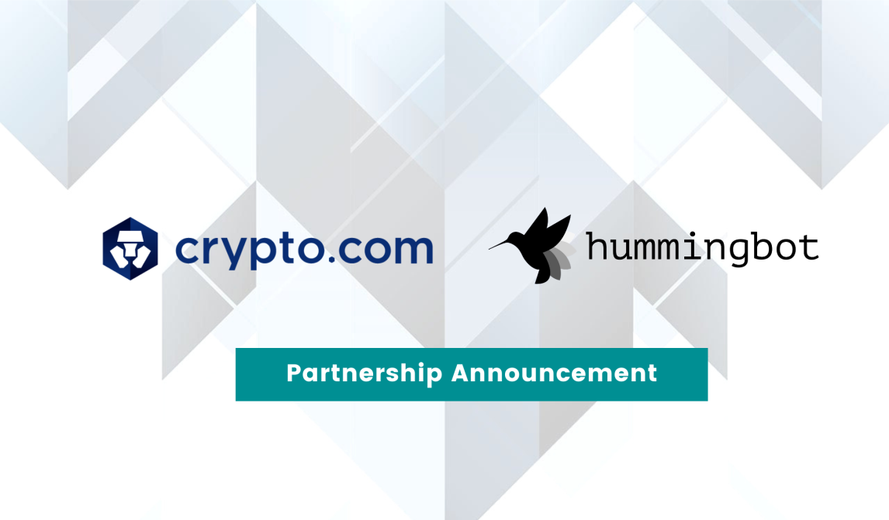
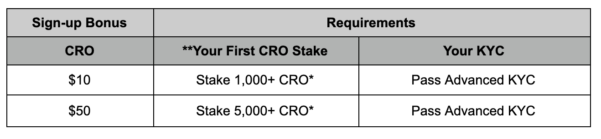

# Hummingbot partners with Crypto.com exchange for high frequency trading and liquidity mining

**Hummingbot is thrilled to announce that it has partnered with leading crypto exchange [Crypto.com Exchange](https://crypto.com/exchange) to integrate Hummingbot’s trading capabilities and bring [liquidity mining](https://miners.hummingbot.io/) to the exchange.**

We view our collaboration with Crypto.com Exchange as an important strategic partnership, due to our shared commitment to trading efficiency, liquidity, and deep order books.  Crypto.com has initiatives to promote trading competitions and includes liquidity mining as an important part of boosting liquidity on its platform.  Crypto.com has committed to sponsoring Hummingbot’s Liquidity Mining campaigns to reward users and communities providing market making and liquidity to its exchange.

<!-- more -->

#### Open-source, high-frequency trading for Crypto.com users

We have just released the latest version of Hummingbot [v0.31.0](https://docs.hummingbot.org/release-notes) which includes an integration to Crypto.com Exchange.  This integration enables Crypto.com’s account holders to deploy Hummingbot’s quantitative and algorithmic strategies to engage in high frequency, automated trading.  Strategies currently available include market making, arbitrage, liquidity mirroring, as well as trade execution strategies such as TWAP and VWAP execution.  Hummingbot also allows users to create their own custom strategies.  Hummingbot has been battle-tested by thousands of users from its vibrant and engaged open-source community. 

#### Liquidity Mining Infrastructure

Hummingbot will also be integrating its data systems and infrastructure to enable liquidity mining campaigns on Crypto.com.  We are targeting to roll out the liquidity mining infrastructure for Crypto.com by the beginning of Q4 2020.

The liquidity mining infrastructure integration includes trade data and real-time exchange order book collection, trade monitoring and verification, automated rewards payouts, as well as dashboards to report live liquidity mining returns, performance, and leaderboards.  In addition, Team Hummingbot will provide 24/7 live user support, marketing collaboration, and performance data reports.

Upon completion of the liquidity mining systems integration, Crypto.com has committed to offering reward pools for liquidity mining campaigns that reward users of Hummingbot for providing liquidity on the exchange for a wide range of tokens.

We are looking forward to being able to offer token issuers who have listed on Crypto.com a more economical, transparent, and fair alternative to hiring professional market makers for promoting liquidity and trading efficiency for their tokens.

### Crypto.com Affiliate

Hummingbot is an affiliate of Crypto.com. Anyone who signs up to Crypto.com Exchange, creates a new account, and passes Advanced KYC using Hummingbot’s affiliate code (`hummingbotcro`) will receive the following incentives:

One of Hummingbot’s core beliefs is that efficient trading and token liquidity is essential to the long-term adoption of cryptocurrency.  Furthermore, we believe that a decentralized, community-based and open approach, rather than relying on a limited group of quant fund/crypto market makers, is a long-term and sustainable way of achieving this.   We have committed to keeping Hummingbot open-source and free for everyone, always.  We appreciate our partners such as Crypto.com that help us to continue building on and maintaining Hummingbot.

### About Crypto.com Exchange

Crypto.com was founded in 2016 on a simple belief: it’s a basic human right for everyone to control their money, data and identity. Crypto.com serves over 3 million customers today, providing them with a powerful alternative to traditional financial services through the Crypto.com App, the Crypto.com Card and the Crypto.com Exchange.

### Additional Information

For additional information, please navigate to the following pages:

- [Crypto.com Exchange](https://www.crypto.com/exchange)
- [Blog](https://blog.crypto.com/) | [Twitter](https://twitter.com/cryptocom) | [Discord](https://discord.gg/B6cZahJ) | [Telegram](https://t.me/CryptoComOfficial)

> 🏛 **Token issuers**: *if your token is listed on Crypto.com or on [any of the exchanges](/exchanges/index.md) that Hummingbot is integrated with, please contact the team at [partnerships@hummingbot.io](mailto:partnerships@hummingbot.io) to learn more about our liquidity mining campaigns.*

CRO received as a deposit bonus during our ‘2% deposit bonus’ promotion does not count towards this staking requirement

**Sign-up Bonus is based on your first CRO stake amount.
