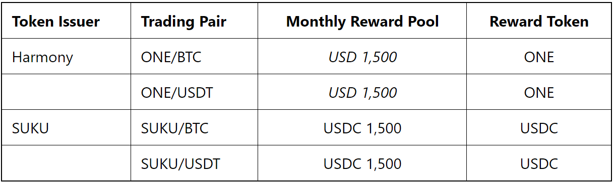
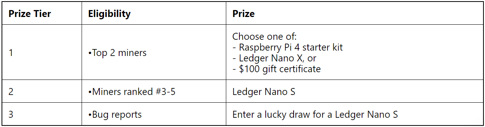

<table style="border: 1.5px solid black; width: 100% ; background-color:#D6EAF8; align:center; padding:10px">
<em><b>Update as of September 28, 2020: in light of the recent security incident with KuCoin, we have decided to postpone the open beta launch.  We will continue to monitor the situation and hope to launch in the near future.</b></em>
</table>

The next stage of Hummingbot liquidity mining is here!  We are thrilled to announce that we will be rolling out open beta liquidity mining campaigns on KuCoin on October 6, 12.00am UTC!  The Hummingbot team is in the final stages of integrating and testing the Hummingbot Miners infrastructure for KuCoin.

<!-- more -->

Liquidity mining on KuCoin offers issuers whose tokens are listed on KuCoin with a cost efficient, data-driven, and decentralized/community-based way of promoting liquidity for their tokens.  Benefits of a campaign for token issuers  include:

- promoting liquidity, order book depth, and trading efficiency for tokens
- engaging hundreds of quant/algo traders from the Hummingbot community to trade issuer’s tokens
- distributing token rewards to the communities contributing to liquidity

For liquidity miners, the additional exchange integration allows us to serve more token issuers and increase the total rewards pools available to miners!

### KuCoin liquidity mining launch

The initial open beta campaigns will offer rewards totalling USD 6,000 per month.  We are launching liquidity mining campaigns for our open beta partners Harmony and Suku:

**Open beta period**: October 6, 2020 12.00am UTC to October 20, 2020 12.00am UTC

Notes:

1. The Harmony campaign will be paying out rewards in native ONE tokens.  The actual amount of tokens will be set prior to campaign launched, based on the USD amounts indicated above.
2. Terms subject to change prior to launch; for the most up-to-date terms, please visit the [Hummingbot Miners app](https://miners.hummingbot.io/) or [liquidity mining documentation](https://docs.hummingbot.io/intro/liquidity-mining/).

### KuCoin VIP promotion for Hummingbot users!

 
<table style="border: 1.5px solid black; width: 100% ; background-color:#D6EAF8; align:center; padding:10px">
<b>As part of our partnership with KuCoin, Hummingbot users who set up a new account to trade on KuCoin will benefit from 0% maker fees and 0.07% taker fees for 3 months!</b>
</table>

Trading fees, particularly for high frequency, algorithmic trading can amount to significant costs for market makers and impact profitability.  We believe that this VIP promotion will be a huge benefit for our users!

In order to qualify, send an email to [vip@kucoin.com](mailto:vip@kucoin.com) and let them know that you are a Hummingbot user.  Note that this only applies to new accounts.

### Open beta period and prizes

The first two weeks of launch will be an open beta period.  During this time, we will be carefully monitoring the Hummingbot Miners system and encouraging users to start onboarding.  As a benefit for our open beta launch partners, Hummingbot is funding the reward pools over this period.

Liquidity mining rewards will be earned and paid out during this time and we would appreciate any feedback from users!

Liquidity mining rewards will be earned and paid out during this time and we would appreciate and encourage any feedback from users!

### About KuCoin

KuCoin is a leading centralized exchange that opened for cryptocurrency trading in September 2017 and has enjoyed steady growth into 2020. The KuCoin Exchange puts a high priority on the quality of the projects listed based on a well-trained research department that scours the blockchain industry for the highest quality projects. KuCoin provides an exchange service for users to conduct digital asset transactions securely and efficiently. Over time, KuCoin aims to provide long-lasting, increased value to its more than five million registered users, in over 100 countries. In November 2018, “The People’s Exchange” officially partnered with IDG Capital and Matrix Partners.

### Meet our launch partners

#### Harmony (ONE)

Harmony is back!! Harmony is no stranger to the Hummingbot community, having launched [the first ever pilot liquidity mining campaign](https://hummingbot.io/blog/2019-09-does-community-based-market-making-work/) and also being a [launch partner](https://hummingbot.io/blog/2020-03-liquidity-mining-launch/) for the Hummingbot Miners platform.

We are happy to have Harmony onboard again for the next stage of the Hummingbot Miners story, as a launch campaign on KuCoin.  The Harmony ONE community is also one of the first communities involved with and a supporter of Hummingbot and liquidity mining, so we’re happy to have another campaign for them.

[Harmony (ONE)](https://www.harmony.one/) is a fast and open blockchain for decentralized applications.  It has achieved secure and random state sharding. Harmony Mainnet supports thousands of nodes in multiple shards, producing blocks in a few seconds with instant finality. Its staking mechanism reduces centralization while supporting stake delegation, reward compounding and double-sign slashing.

Harmony aims to build an open network of nodes operated and governed by a large community.

Partnering with Harmony, we launched a successful pilot program rewarding community members for running market making bots for $ONE using Hummingbot in 2019.

#### SUKU

[SUKU](https://www.suku.world/) leverages decentralized finance (DeFi) protocols to enable transparency in supply chains and provide financial tools to disadvantaged suppliers, such as small farmers. SUKU’s team, which originates from the Deloitte Blockchain Lab, is actively providing successful solutions for their global partners, including Fortune 500 companies. SUKU’s network allows brands to trace, verify, and authenticate each step in a product’s journey. As a result of this information collection, brands have visibility into their supply chain and are able to share a verified history of their products. This allows them to better access and connect with the market of conscious consumers.

----
### Liquidity mining, coming soon to your favorite exchange...
In the first six months since the launch of the liquidity mining platform, our engineering team has been focused on scaling, optimizing, and making our core Hummingbot Miners infrastructure performant and resilient.  While KuCoin is only the second supported exchange for Hummingbot Miners, it marks a major milestone, establishing the process for us to add support for additional exchanges more quickly.  We had previously announced that we would be [integrating liquidity mining to crypto.com](https://hummingbot.io/blog/2020-09-hummingbot-partners-with-crypto-com/) in the coming weeks, and we plan to integrate many of the major crypto exchanges in the coming months.

----

### Additional Information
- [KuCoin](https://www.kucoin.com/)
- [KuCoin’s telegram](https://t.me/KuCoin_Exchange)

<table style="background-color:#D6EAF8">
  <tr>
🏛 <b>Token issuers</b>: contact the team at <a href="mailto:partnerships@hummingbot.io"><u>partnerships@hummingbot.io</u></a> to learn more about running liquidity mining campaigns on Kucoin, Binance.com, or to suggest the next exchange for us to integrate with!
  </tr>
</table> 

<table style="background-color:#F2F3F4" size="12">
  <tr>
🏦 <b>Exchanges</b>: contact <a href="mailto:partnerships@hummingbot.io"><u>partnerships@hummingbot.io</u></a> if you’d like to bring Hummingbot and liquidity mining to your exchange!
  </tr>
</table>
