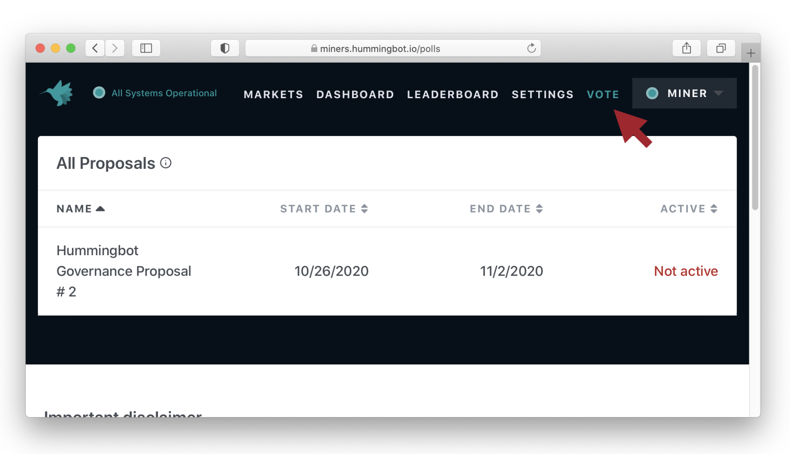
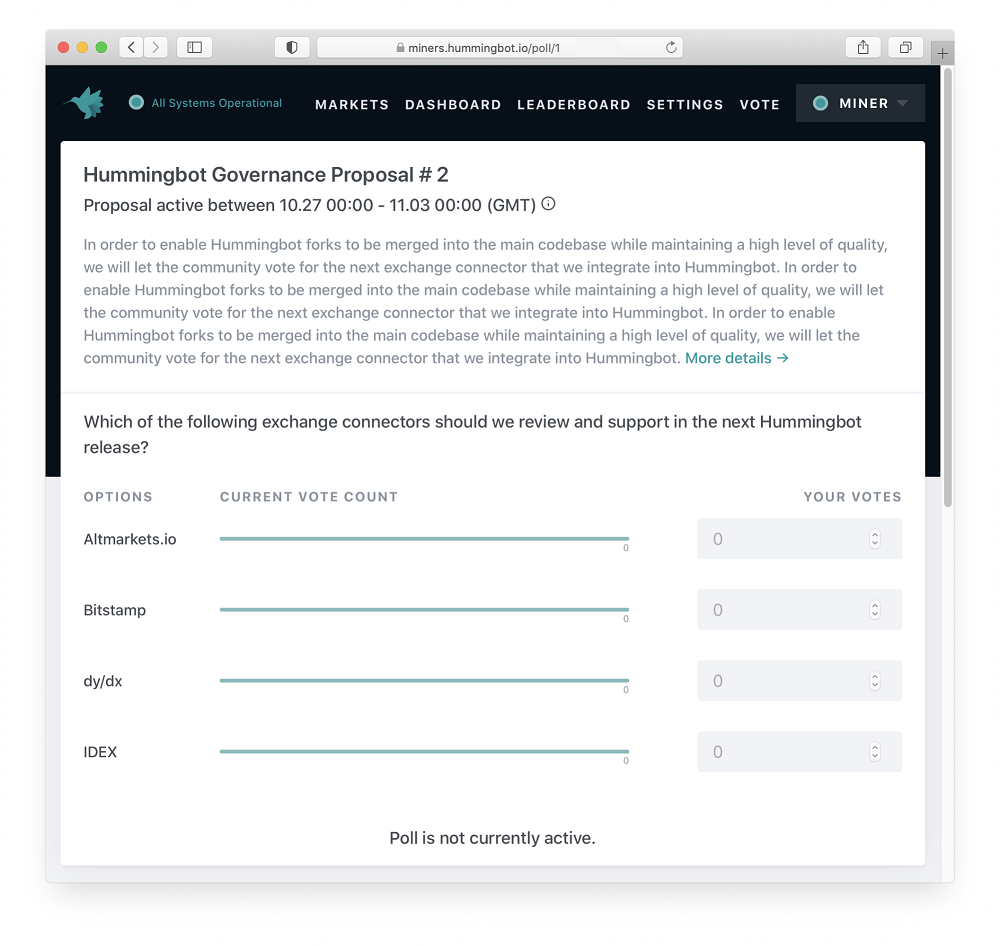

# Governance proposal #2

We are launching the 2nd Hummingbot governance proposal as well as the new voting portal on our [Hummingbot Miner](https://miner.hummingbot.io) app!

As mentioned in our previous [governance post](../2020-09-governance-proposal-1/index.md), votes for this current proposal will be based on Hummingbot Miner rewards, giving the ability to vote to members of the community who have been participating in and supporting currently active Hummingbot liquidity mining campaigns.  We welcome any suggestions and discussion on our discord channel [#governance-chat](https://discord.hummingbot.io) as we continue to evaluate and iterate on how best we can get the community involved in deciding the direction of Hummingbot.

<!-- more -->

> ## Proposal #2
 > Which of the following community-developed exchange connectors should be included into the core Hummingbot code base in the next release (0.34.0)?
 >   
 > ☐ **Altmarkets.io**
 >
 > ☐ **Bitstamp**
 >  
 > ☐ **dy/dx**
 >  
 > ☐ **IDEX**

Similar to [our first governance vote](https://www.reddit.com/r/Hummingbot/comments/ig3d3e/launching_hummingbot_connector_governance_the/), the Hummingbot core team will review, test, and incorporate the exchange connector for the winning exchange into our core code base, which will become an officially supported connector. 

## Voting Methodology

- **Votes per miner**: the total votes each miner has is based on the total amount of mining rewards they have earned in the most recent weekly reward period. For example, a miner who earned $100 in the rewards period will have 100 votes.

- **Miner reward period**: for the current proposal, the rewards period used to calculate total miner votes will be the most recently completed period: **Tuesday October 20, 2020 12.00am UTC to Monday October 26, 2020 11.59pm UTC**

- **Reward amounts will be rounded up to the nearest whole vote**: a miner who earned $0.01 of rewards is still entitled to 1 full vote, while a miner who earned $1.01 will have 2 votes, and so on. This allows for any miner who has earned any amount of rewards to have a minimum of 1 vote.  

## Timetable

- October 20, 2020 12.00am UTC to October 26, 2020 11.59pm UTC: rewards period referenced for determining miner vote amounts

- October 27, 2020: voting is opened

- November 3, 2020 12.00am UTC: votes are tallied and outcome determined

- Early December: planned release of Hummingbot v0.34.0

## How to vote

We have enabled a new [VOTE](https://miner.hummingbot.io/polls) tab on https://miner.hummingbot.io which shows all proposals:

After selecting the proposal, you see the following screen:

You can allocate your votes between the different choices.

## The candidates

Below are the four exchange connectors that you can vote for:

## Altmarkets.io

[Altmarkets.io](https://altmarkets.io/) is a centralized cryptocurrency exchange that was established in 2018 and is located in the United Kingdom. There are 51 coins and 68 trading pairs on the exchange.

**Current status**

https://github.com/CoinAlpha/hummingbot/pull/2442

The Altmarkets.io connector was developed by one of our active community members, **[TheHoliestRoger](https://github.com/TheHolyRoger)**, who has been an active contributor to the Hummingbot codebase.

## Bitstamp

[Bitstamp](https://www.bitstamp.net/) is a leading centralized cryptocurrency exchange that is headquartered in Luxembourg.  Established in 2011, it is one of the most long-standing cryptocurrency exchanges.  There are 7 coins and 29 trading pairs on the exchange. Bitstamp volume in the last 24 hours is reported to be at BTC 10,992.70. The most active trading pair on Bitstamp exchange is BTC/USD.

**Current status**

https://github.com/CoinAlpha/hummingbot/pull/2397

## dy/dx

[dY/dX](https://dydx.exchange/) is a decentralized trading platform that currently supports margin trading, spot trading, lending, and borrowing. dYdX runs on smart contracts on the Ethereum blockchain, and allows users to trade with no intermediaries.

**Current status**

The dy/dx connector has been developed by one of Team Hummingbot’s development partners who has developed several other connectors for other exchanges.

## IDEX

[IDEX](https://idex.io/) is the first Ethereum based decentralized smart contract exchange to support real-time trading and high transaction throughput.  IDEX takes a hybrid approach, combining an off-chain matching engine with a layer 2 smart contract settlement system for custody and asset transfers.

**Current status**

The IDEX team has developed a connector and will be issuing a pull request in the next few weeks.