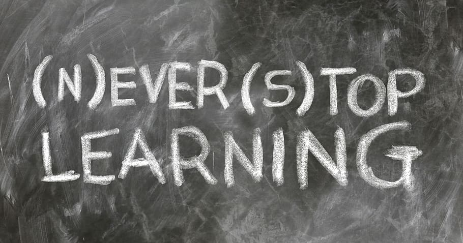

Good day Hummingbot community!

A month has passed since I published the first article on our blog, and after covering the three main strategies [pure market making](https://hummingbot.io/blog/2020-09-what-is-market-making/), [arbitrage](https://hummingbot.io/blog/2020-09-what-is-arbitrage/), [cross-exchange market making](https://hummingbot.io/blog/2020-09-what-is-cross-exchange-market-making/)) you can implement using Hummingbot, it's time to talk a bit about what the **Hummingbot Academy** is and what to expect from this project.

This is also a great opportunity to introduce myself to the community.

## A few satoshis about me

Hi, my name is Paulo Henrique Rebouças.

I am Brazilian, 38 years old, and have been a Civil Engineer and Project Manager for 11 years. Even though I like this profession, over the last years I have developed a passion for financial markets, with a special place in my heart reserved for cryptocurrencies.

<!-- more -->

While I always had an interest in finance, I started to get hyped about this topic around 6 years ago when I began researching everything related to investments, be it long-term, short-term, bonds, stock markets, economic laws and principles, day trading, indicators, strategies, etc. 

The more knowledge I acquired along the way, the more I wanted (and still want) to learn, and eventually, I started a blog to write about everything I was learning (if you are curious, you can check my older writings [here](https://financialjourney.dblog.org/)).

Right now I am in the process of a career transition and I am currently pursuing a certificate to become a Financial Advisor.

I discovered Bitcoin and cryptocurrency right at the beginning of this learning journey and my biggest regret, which I'm sure is shared by many, was selling out when the price hit US$ 500.00 a few months after buying.

But more important than the profit I missed by selling those bitcoins too early, there is something way more valuable that I learned about cryptocurrencies:

Cryptocurrencies and blockchain technology have a huge potential to democratize access to financial instruments previously only available to big investment institutions and accredited investors. 

I fully believe that Hummingbot is filling a big role in realizing this potential, by giving access to small investors the possibility to diversify their trading strategies through our [free and open-source market making/arbitrage robot](https://hummingbot.io/) as well as receiving financial incentives to provide liquidity to blockchain projects through liquidity mining campaigns.

## Knowledge is Power

In these 6 years of involvement with financial markets and cryptocurrencies, there is one lesson I learned that I consider the most important:

***Good and reliable knowledge is the most valuable asset anyone can acquire.***

With the technology that we have today, it is really easy and accessible to start dealing with all kinds of financial markets, be it stocks, bonds, securities, ETFs, cryptocurrencies, or any asset that is available in a free and open economy.

But with this ease comes a price: the first contact with these markets can happen when the person doesn't yet have much knowledge about how everything works and what the market dynamics are.  Usually, one of two things happens at this moment:

1 - The new investor does random bets in the market and incurs a big loss,

2 - The new investor does random bets in the market, close his trades with a big win, and thinks it simple and easy to make money on the financial markets. 

When 1 happens, the new investor might give up on trading or he could acknowledge the valuable lessons learned and decide that he needs to increase his knowledge base before risking any more of his funds.

While scenario 2 seems like it should be the positive scenario, it could ultimately be catastrophic for the investor: the investor's ***luck*** may incorrectly be perceived as skill and with this over-confidence, the trade may end up risking way more money than he should.

The same situation applies if you are a seasoned trader dipping your toes for the first time in the world of Market Making, Arbitrage, and automated trading.

While the fundamental concepts are the same, the way each type of operation applies these concepts are different.

This is why we created the **Hummingbot Academy**: we want our users to become better market makers/arbitrageurs by acquiring fundamental, as well as practical, knowledge behind everything that is possible to do with [Hummingbot](https://hummingbot.io/).

Our objective is to create a **knowledge hub** about everything related to market making, arbitrage, and algorithmic trading, and how to apply this knowledge to help you create and/or improve your trading strategy.

The first articles of the Hummingbot academy have already been published and are an introduction to the basic strategies that can be implemented with Humminbot: [Pure Market Making](https://hummingbot.io/blog/2020-09-what-is-market-making/), [Arbitrage](https://hummingbot.io/blog/2020-09-what-is-arbitrage/), and [Cross-Exchange Market Making](https://hummingbot.io/blog/2020-09-what-is-cross-exchange-market-making/). Be sure to check them out, if you haven't already.

And this is just the beginning...

## The Future of Hummingbot Academy

Let me show you a little secret:

Right now our team is working on a new website that will improve your experience with Hummingbot.

An important part of the new site will be the **education center**, where our users will be able to access all the knowledge we have already published as well as the future content we will be creating.

We want it to be a place where you will be able to easily find information about everything related to Hummingbot, with content that will help users with all levels of knowledge: from people that are hearing about market making for the first time to advanced and professional traders.

Here is what you can expect from the **Hummingbot Academy** in a near future:

- Articles about market making and arbitrage concepts like:
    - What are the risks related to market making\arbitrage operations;
    - How to measure profitability and efficiency of a strategy;
    - What is liquidity and how it impacts the markets;
    - How volatility can impact a market making strategy;
- How each concept is applied in a practical way with Hummingbot;
- What are the pros and cons of specific strategies;
- A knowledge base about scripts and how to create custom strategies;

And a lot more!

These are still the early days of the Academy, and there is a long road ahead of us, and we want you to be part of this journey. [Join our discord channel](https://discord.com/invite/2MN3UWg) and let us know what content you want to see on the Hummingbot Academy and also to discuss strategies with our community.

Meanwhile, here is the all the educational content we have already published for you to revisit:

- [A developer's guide to crypto algo trading](https://hummingbot.io/blog/2019-01-beginner-crypto-trader/)
- [A non-technical crypto trader's guide to python and algo trading](https://hummingbot.io/blog/2019-01-crypto-trading-guide-for-nontechnical/)
- [How to measure performance in crypto trading](https://hummingbot.io/blog/2019-07-measure-performance-crypto-trading/)
- [Hummingbot Strategy Hacks 101](https://hummingbot.io/blog/2019-09-strategy-hacks/)
- [How to use advanced market making features](https://hummingbot.io/blog/2019-11-advanced-market-making/)
- [Guest post: my take on market making and inventory risk](https://hummingbot.io/blog/2020-06-what-is-market-making-guest-post/)
- [What is market making?](https://hummingbot.io/blog/2020-09-what-is-market-making/)
- [What is Arbitrage?](https://hummingbot.io/blog/2020-09-what-is-arbitrage/)
- [What is cross exchange market making?](https://hummingbot.io/blog/2020-09-what-is-cross-exchange-market-making/)

See you soon!