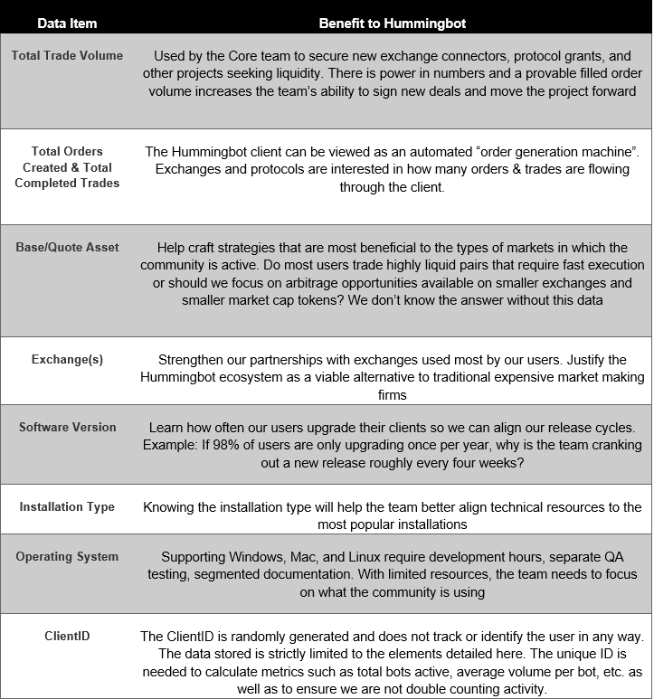

The open-source Hummingbot client is fulfilling its mission of democratizing market making. The growth in features, connectors, and community members has been incredible for the team to watch. With growth comes additional opportunities but also additional expenses. Our 24/7 online support and world class documentation is provided at no cost to the community. These services are provided by full-time paid employees around the world (did you know that Hummingbot has team members on six different continents?). There are multiple ways open-source projects raise funds. Some offer a scaled down “free” version that benefits from revenues generated by a paid “pro” version. Other projects ask for donations if users find the software beneficial. Hummingbot’s model is somewhat unique in that its users are already “contributing” by adding liquidity and trading volume to our exchange and protocol partners. However, continued growth and development is going to require us to prove those contributions.

To sustain development of the Hummingbot client, we partner with exchanges and protocols to build connectors and/or strategies. These partners need actionable data to convince their stakeholders and community members that a Hummingbot integration is worth the investment. The most common requests include total volume traded, total number users, and which trading pairs. Since the Hummingbot client doesn’t currently collect any data, we currently can't answer these questions well and rely on guesstimates based on volume measured on the Hummingbot Miner platform. However, we know from conversations with many community members that the volume activity on Hummingbot Miner is a small subset of the overall volume facilitated each week by the Hummingbot client. For these reasons, beginning with Hummingbot version 0.34, a “heartbeat” data collection mechanism will be implemented.

***Here are the key points of the heartbeat mechanism:***

- Heartbeat will send aggregate trade volume data to Hummingbot servers every 15 minutes

- Trade data will include volume totals, order count, trade count (not individual trades), tokens traded (base & quote), and exchange(s) used.

- Hummingbot client data will include software version, installation type (binary, source, Docker), O/S, and a random unique client ID*.

-  All data collected will be used exclusively by the Hummingbot team for analytical and marketing purposes only. The data will be neither accessible nor sold to any third party.

*** *More on the benefits of ClientID below***

As you can see, the data above is aggregated data intended solely to allow us to obtain more information on high-level usage statistics.  To be clear, we are not collecting individual trade-specific data or strategy configurations and we have purposely added code in the client that aggregates this data locally on the Hummingbot instance before sending the summary data to our servers.  As for the Hummingbot software data (e.g. version, installation type, and O/S), this will help the development and QA teams to prioritize features and efforts to ensure that we are efficiently addressing our user’s needs.

An FAQ with more technical details follow, but feel free to move on with your life if you love Hummingbot and trust our decision making around this much needed feature. If you have any questions or concerns not addressed in the FAQ, please reach out to us in the General or Support channels on Discord.

**FAQ**

**1)  Where is the heartbeat mechanism configured and what if I want to turn it off?**

The `conf_global.yml` file will have the following configuration parameters:

*- heartbeat_enabled: default = True*

*- heartbeat_interval_min: default = 15*

Changing the enabled flag to “False” will disable all data reporting. The heartbeat interval parameter may be adjusted if you’d rather send data on a slower or faster interval. Fifteen minutes was chosen and test by the team as a reasonable interval for an active trading Hummingbot instance

**2)  Why should I participate in these data gathering? What’s in it for me?**

The Hummingbot trading bot is free to use and yet is built and maintained by a world class core team of developers and finance industry experts. It allows anyone with any amount of capital to become a market marker and/or an arbitrageur on the world’s largest and most active platforms. You also get 24/7 free online support with knowledgeable, full-time paid support staff. Maybe you could share a bit of anonymous volume data to help us grow the product?

**3) What’s the reason/rationale for each piece of data collected?**

**4) How can I be sure that’s the only data Hummingbot is collecting?**

Hummingbot is 100% open-source. Once version 0.34 is released, please feel free to review for yourself…even better, please review and post on our Discord channels what you found. We’ve always been open and honest with our community members and you’ll find this case is no different.

*We welcome any feedback and can answer any additional questions you may have.  Please join our [discord community](https://discord.hummingbot.io) to chat with the team or send us an email at [dev@hummingbot.io](mailto:dev@hummingbot.io).*
