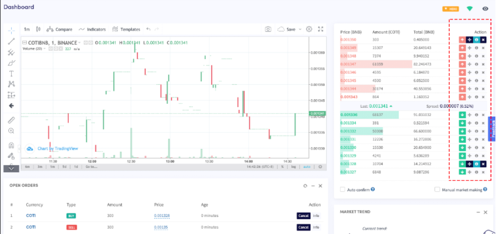
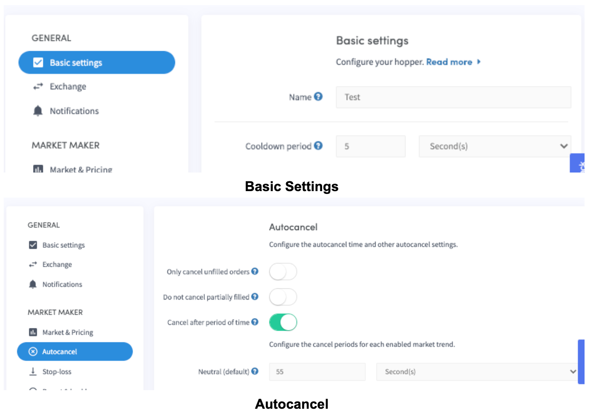
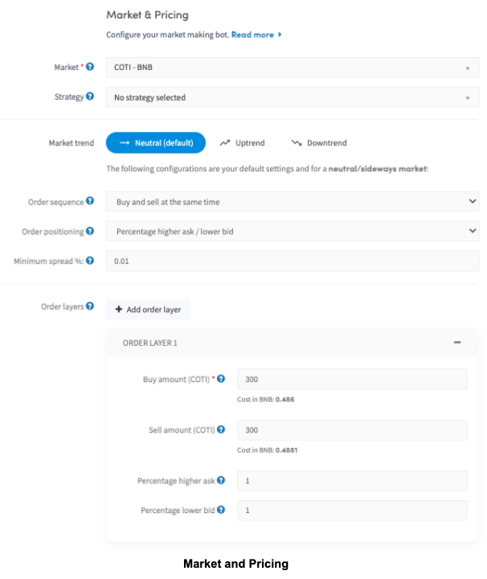
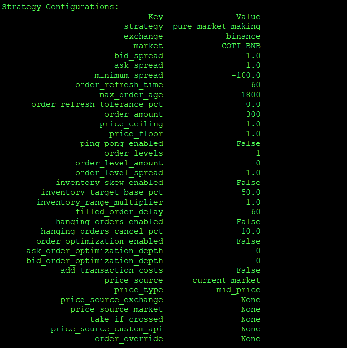
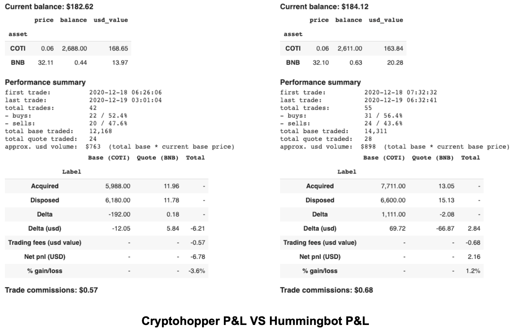
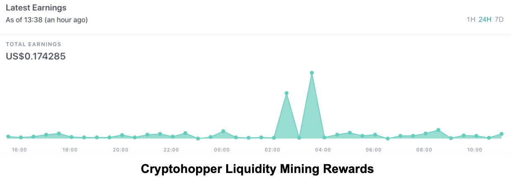
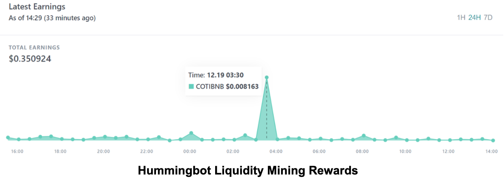

# Hummingbot vs Cryptohopper

Back in 2019, we investigated 12 bots based on their relative ease of use of installation, configuration, and operation in two blog posts, [Bot reviews, part 1](../2019-01-crypto-bot-reviews/index.md) and [Bot reviews, part 2](../2019-05-crypto-bot-reviews/index.md).

This time, we decided to do an more in-depth comparison of [Cryptohopper](https://www.cryptohopper.com/) against Hummingbot in terms of general features and market making parameters. Cryptohopper is a commercial web-based application while Hummingbot is a free and open source command line application.

We selected Cryptohopper because it also has a market making feature that's not available for many crypto trading bots, so you can actually use it to do liquidity mining on Hummingbot Miner, rather than running the open source Hummingbot software.

In addition to making an apple-to-apples comparison of features, we will also test out running the bots to earn rewards on Hummingbot Miner with both trading bots, so that you can make better decisions on which software to use for liquidity mining. 

<!-- more -->

# General Feature Comparison 

> We selected Cryptohopper's Hero tier since only that version supports their market making features.

# Features Compared

Overall, Cryptohopper has more features and strategies, but the number of exchanges supported is fewer. 
Cryptohopper allows the user to run only one bot at a time and costs US$99 per month, whereas Hummingbot is free to use as long as you run it on a local machine. You might want to use a cloud server to run the bot, which usually needs an extra cost of US$5-10 per month for one bot on average. Though backtesting is highly-requested for any algo trading strategy, it's not available for both bots for market making.

The TradingView integration of Cryptohopper is a nice feature as it provides a visualization of the trades, a quick summary of 
where the price action is, and also allows to set alerts for triggering trades. This feature is also in the product pipeline for Hummingbot. Let’s compare other aspects of these two bots. 

# Open-source vs. Closed-source

Hummingbot is open-source software so that the code is available to anyone. You can inspect and audit the code, help fix bugs, add features, and improve performance(see Hummingbot’s [Github](https://github.com/hummingbot/hummingbot)). 
However, Cryptohopper is closed-source software where the code is proprietary and not publicly available. Like operating through a black box, 
you will never know their private and trade-enabled exchange API keys are kept and how trades are executed. 

If you run Hummingbot, your private keys and exchange API keys are secure unless your computer/server is compromised (see [FAQ](https://docs.hummingbot.org/faq/) for details). 
Hummingbot Miner only uses the read-only API keys to extract and calculate the mining rewards [Privacy](https://coinalpha.com/privacy-policy). So rest assured. 

# Usability

You may now wonder how easy to use these two bots. Cryptohopper, with its graphic user interface, is easier to use as you do not need to download and install the bot, and the bot navigation is quite self-explanatory. On the Cryptohopper dashboard, you can even manually add orders using the right pane (see the red-dotted rectangle in the below image) and shift the positions up and down as desired. 

In contrast, Hummingbot requires a bit of work to set up and use, since users have to navigate a command line interface (CLI). At the very beginning, the learning curve might be steep for non-technical users. 

To help users get started, Hummingbot offers 24/7/365 support through Discord and an extensive list of resources such as 
`Hummingbot Academy`, [Hummingbot Docs](https://docs.hummingbot.org/), [Hummingbot Youtube channel](https://www.youtube.com/watch?v=jmq9TkoXN_o&list=PLDwlNkL_4MMekihXq7C-Nzx9YkivaZZ6r), and [Blog](https://hummingbot.org/blog/) to educate users and help you onboard your market making journey.

# Market Making Feature Comparison

The following table maps out the basic market making parameters that can be used in Cryptohopper and Hummingbot.

**Note:** Group of parameters in Cryptohopper are color-coded.

In addition to the basic parameters, Cryptohopper has some interesting advanced features:

- Market trend: you can control the market making orders during neutral, uptrend, or downtrend using Cryptohopper A.I. (proprietary algorithm) 
- Strategy designer: you can design a trading strategy using technical indicators and candlesticks

The revert/retry feature of Cryptohopper is similar to Hummingbot’s hanging order feature. 
Autocancel orders and cancel on-depth features are basically options to control your cancellation orders whereas Hummingbot uses inventory 
and hanging orders, which also enable you to better manage your inventory. You can read more about these advanced features in [the following blog](../2020-10-inventory-risk/index.md). 

One advanced parameter Hummingbot offers but Cryptohopper doesn’t have is the price source, which allows you to 
define where you can reference price from a source different from the exchange the bot is trading on. This enables you to 
trade on a slower market but based your price source on a faster market in which the price of the slower market will catch up in due time. 
You can read more over [here](../2020-11-commands-and-config-price-source/index.md).

As Hummingbot is catered to a more trader-developer type of audience, you can customize such features via custom scripts 
or contribute to the strategy in the codebase. One of the popular scripts to control sudden spread movements is [spreads_adjusted_on_volatility_script](https://github.com/hummingbot/hummingbot/blob/master/scripts/spreads_adjusted_on_volatility_script.py)  and the integration of external signals is on the product roadmap. 

In sum, both bots have similar basic market making features but the more advanced features vary. Cryptohopper’s 
more advanced features are catered to traders who tend to trade based on technical analysis and market trends and want to 
integrate these signals into trading, while Hummingbot’s advanced features enable you to customize your strategy and reference the 
outside price source easily. 

Next, we are going to run both bots for liquidity mining.

# We ran both for liquidity mining for 12 hours, here’s what we learned!

To make sure there is an apple-to-apples comparison, we tried our best to control the configuration and trading time to make sure all the variables are the same for both bots. 

For Cryptohopper, we use the following settings to start liquidity mining COTI-BNB with < 2% spread(only get rewards if spread is within 2%) and cooldown period + cancel after period of time for a total of 60 secs, which is the same as Hummingbot parameter ‘order refresh time’ of 60 secs.
- **Exchange:** Binance
- **Pair:** COTI-BNB
- **Cooldown period:** 5
- **Cancel after period of time:** 55
- **Market trend:** Neutral
- **Order sequence:** Buy and sell at the same time
- **Order positioning:** Percentage higher ask/lower bid
- **Buy amount:** 300
- **Sell amount:** 300
- **Percentage higher ask:** 1
- **Percentage lower bid:** 1

See the following screenshots for configuration.

The following screenshots show an example of how similar settings are created in Hummingbot.

After 12 hours of running both Hummingbot and Cryptohopper,  see the following Colab notebook table results for both miners side-by-side.

Both bots started with 1,500 COTI and 2.73 BNB.  The ending balance for both accounts are nearly the same at around US$182 for Cryptohopper and US$184 for Hummingbot.

Cryptohopper returned a P&L of -3.6%, a liquidity reward of $0.17, and executed 42 trades. Assuming the same profit projection for the next 30 days, the profit is (0.17x30x2 = ~US$10.2). Although there are liquidity mining rewards, it does not cover the subscription cost of US$99, unless the spreads are tightened for higher rewards, which bring more risks in the long run. 

> Note: Cryptohopper stopped working 3 hours before the 12 hour tesing period for both bots, which could have attributed to the negative P&L for Cryptohopper.

Hummingbot returned a P&L of 1.2%, liquidity reward of $0.35, and executed 55  trades. If using Hummingbot, assuming the same profit projection for the next 30 days, the profit is (0.35x30x2 = ~US$21). Hummingbot would have already covered back the VPS hosting around $5. 

Please note that the losses incurred were mainly due to the unforeseeable direction of market volatility during the testing period. The same profit projection assumption above is unlikely to hold true in reality because the market conditions fluctuate a great deal during any period of time

# Conclusion

For newbie users who want to understand market making, Cryptohopper is an easy option with its TradingView integration on their dashboard and its intuitive graphic UI. Cryptohopper market making is like a Tesla car with great driving experience and comfort, but an expensive price tag of $99 per bot.

On the other hand, Hummingbot is not a car but a twin-turbo 6L V12 engine that enables you to customize with any car parts (advanced market making features, custom scripts, etc.) you desire to build that car; of course, it depends on your skill level to get the best out of the engine. You can read more on how to fine-tune the engine in `Hummingbot Academy`. And more importantly, it’s all FREE. 

If you want to join liquidity mining and earn rewards, performance-wise, these two bots tend to get you similar results if you set them up with just basic market making configurations. We believe, if you try to set up your bots using more advanced features, the results will be largely divergent. 

Overall, Cryptohopper and Hummingbot are tailored to different user personas and use cases:

If you prefer a 10-min quick setup with visualization tools and built-in algos options that’s liquidity mining-ready, Cryptohopper suits you the best hands down. One of the major downsides is your trade-enable API keys have to be in Cryptohopper’s custody. 

If you want to have the full control of your own capital and secret APIs, and customize or develop your own market making strategies from the ground up without any privacy and security concerns, Hummingbot will bring the best value to you. We bet you’ll enjoy your “drive” with Hummingbot!

Hope this post helps you make your decision on which bot to use when considering joining liquidity mining! We’ll see you on the [leaderboard](https://miner.hummingbot.io/leaderboard)! 
