Can you think of a year more unforgettable than 2020?  

Since early 2020, the entire world has been enduring nonstop stresses and changes. At Hummingbot, we closed our office in Mountain View, California and decided to become a **fully remote** company. Today, we boast a rapidly growing team with employees from every continent in the world except Antarctica.  

Though this year was filled with plenty of awfulness, it also witnessed the robust growth of Hummingbot. Since we introduced [Liquidity Mining](https://hummingbot.io/blog/2020-03-liquidity-mining-launch/) in March, we have launched campaigns for 15 token projects and reached partnerships with a handful of major exchanges. We also made great efforts in making Hummingbot easier to use, more versatile, and more customizable. 

Below, we round up some of our biggest achievements and interesting stats in 2020 with visualizations. 

***We wish every Hummingbot community member has a great year ahead! We look forward optimistically to a brand new 2021.***

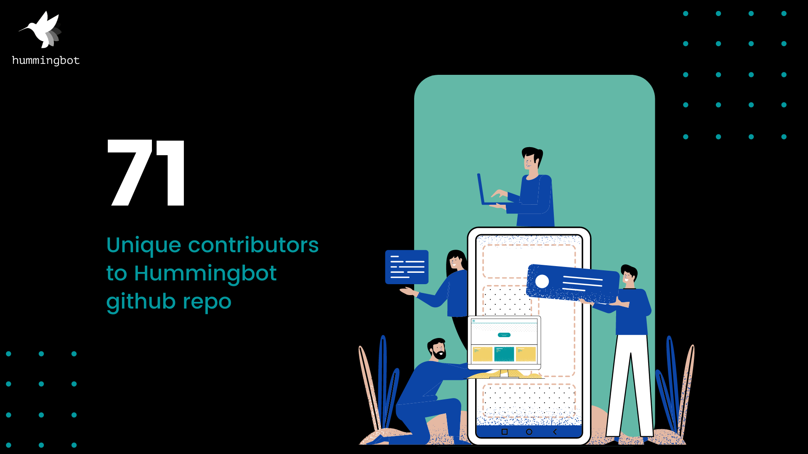

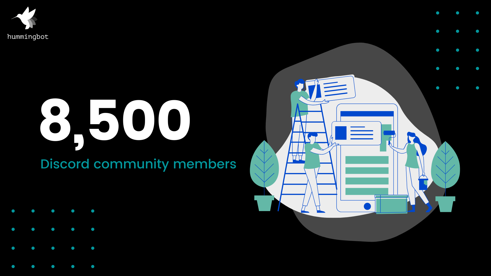
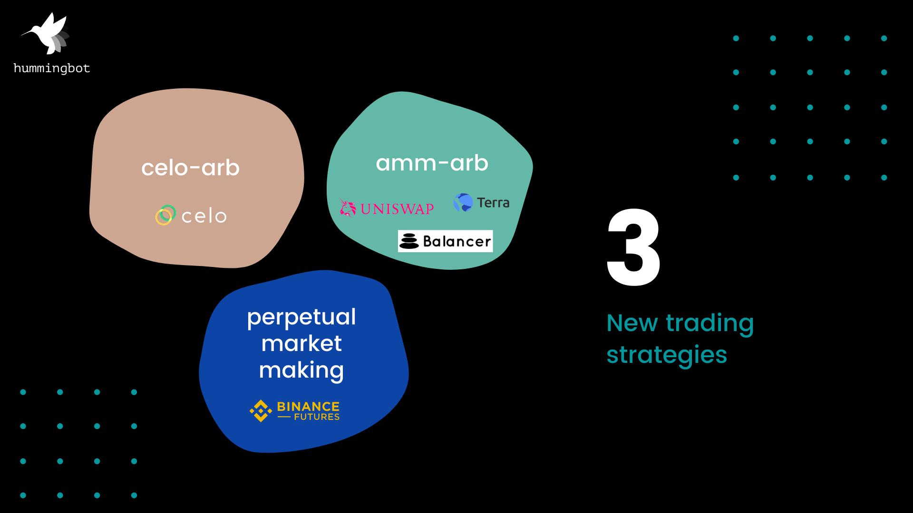
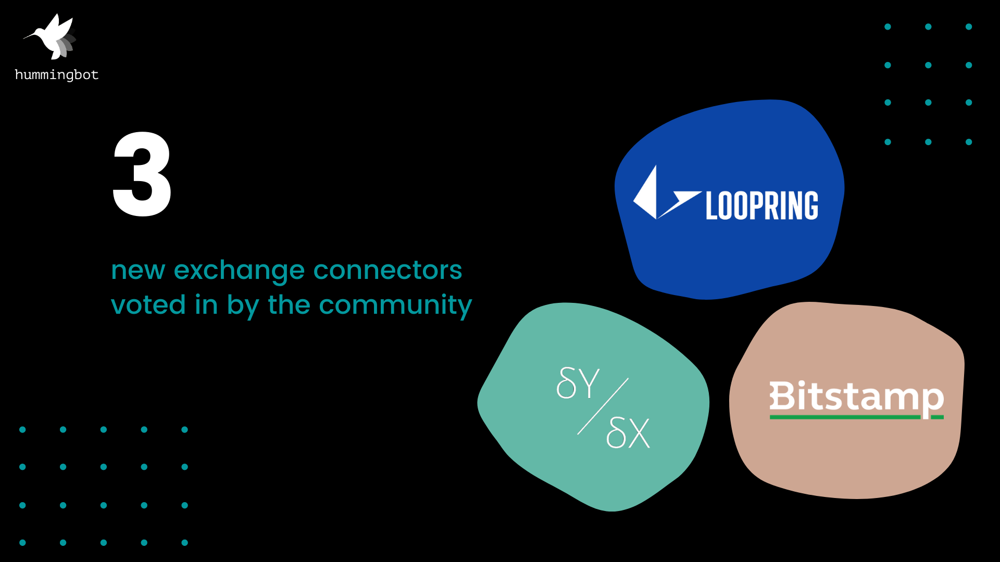
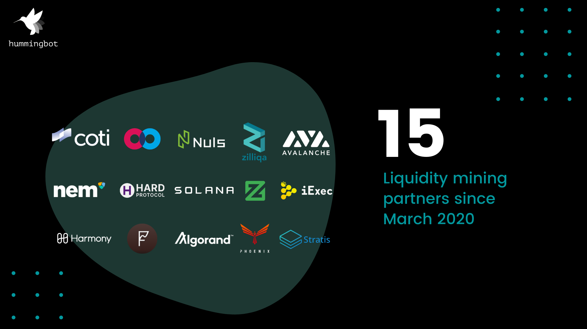
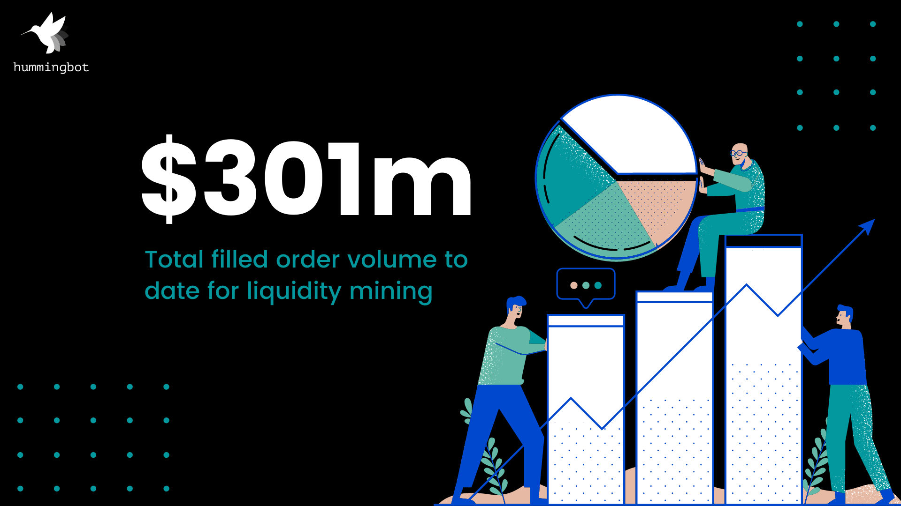
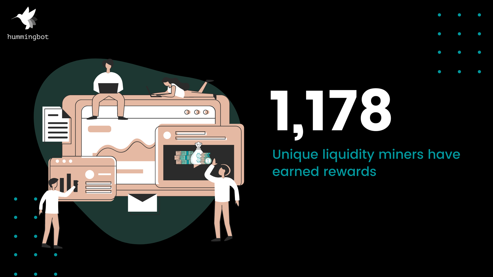
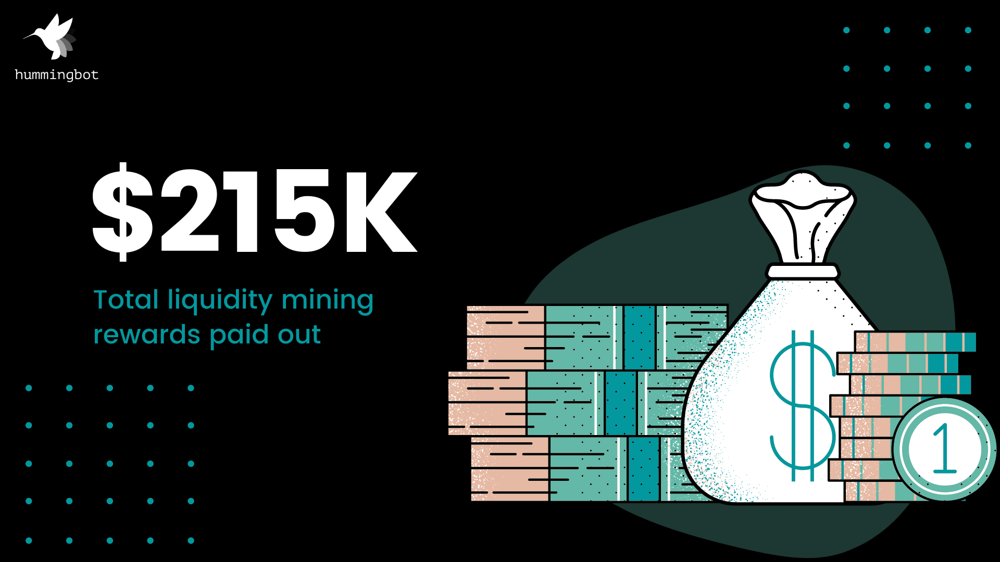

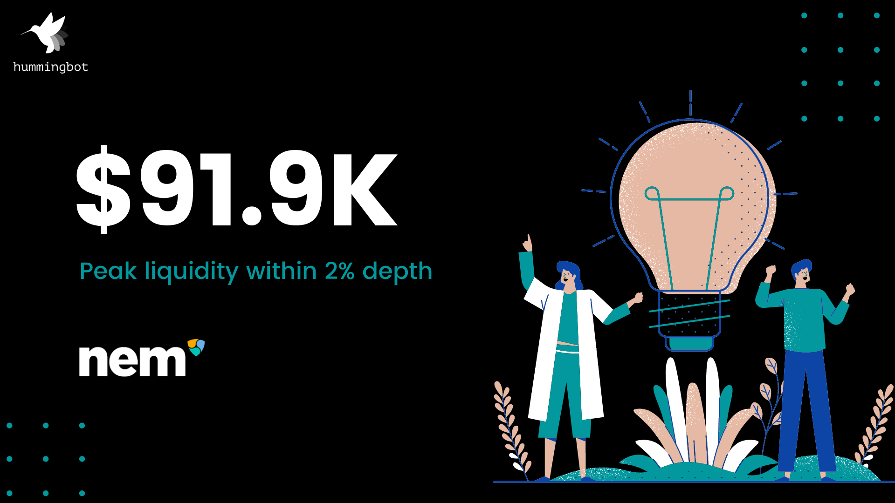
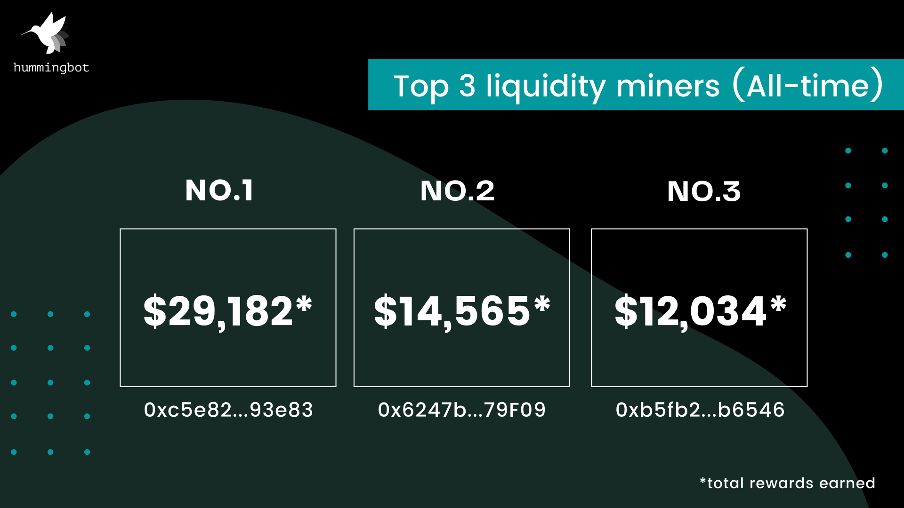
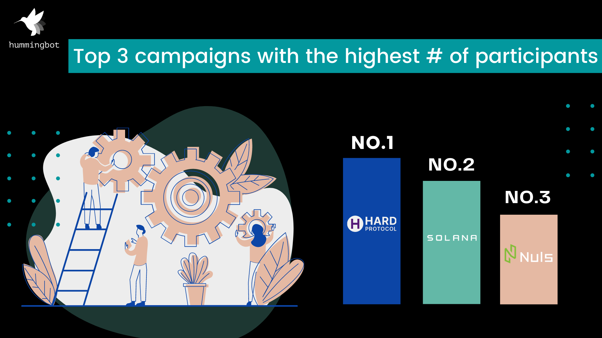
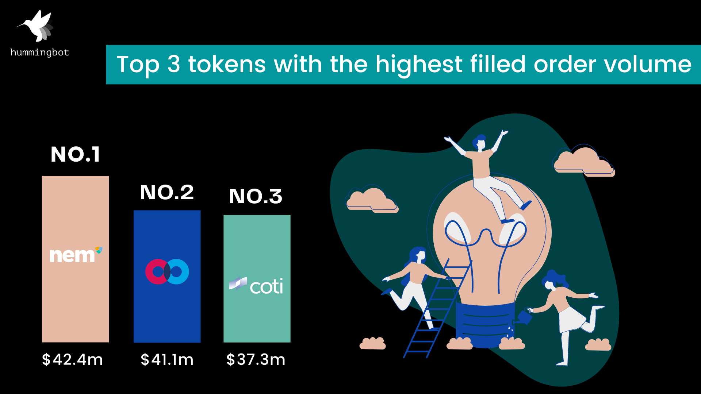
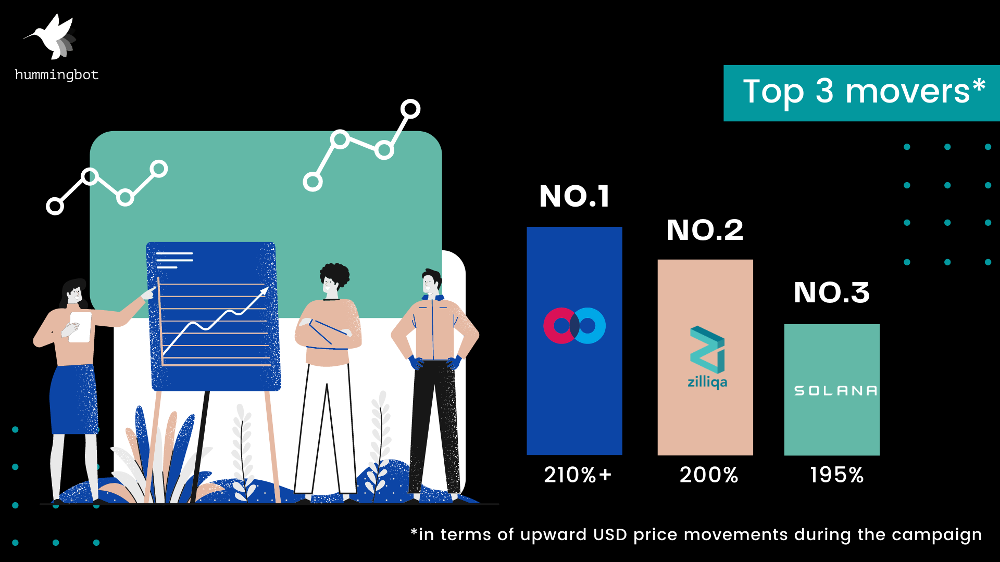