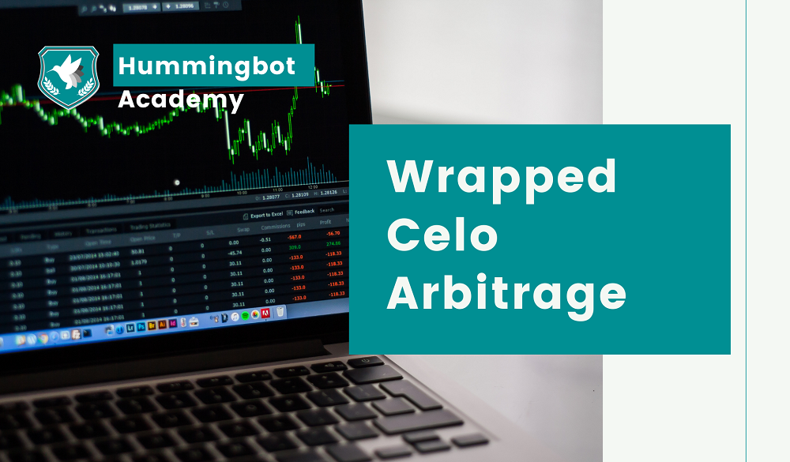
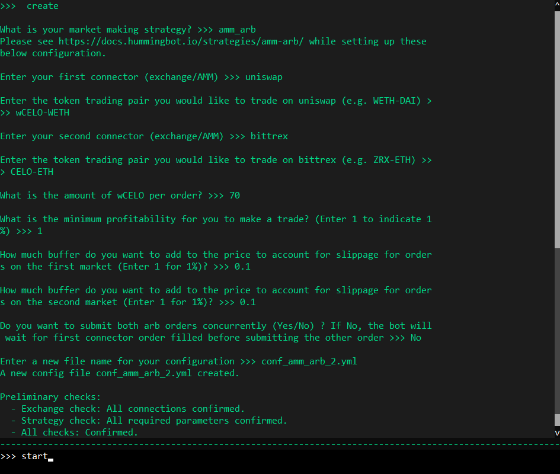
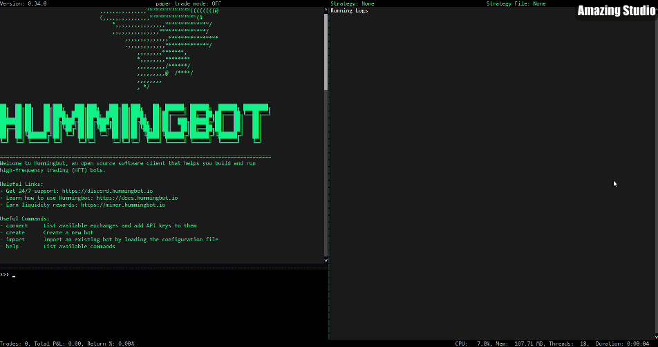

# New arbitrage opportunity: Wrapped CELO



Hello arbitrageurs and market makers!

Today I am bringing you some exciting news: CELO tokens have arrived on the Ethereum blockchain!

Last week, Anchorage and Tokensoft [announced](https://medium.com/wrapped/anchorage-and-tokensoft-bring-wrapped-celo-wcelo-cusd-wcusd-to-defi-d3dfc2975779) that they brought both CELO and cUSD to Ethereum through [Wrapped](https://www.wrapped.com/), connecting both layer one blockchains.


<!-- more -->

### What is a wrapped token?

Since CELO and Ethereum are two separate blockchains, it is impossible to establish direct communication between them. You can’t directly transfer ETH minted on Ethereum to the CELO chain as you can’t transfer CELO tokens to the Ethereum chain.

One solution to that problem is creating an ERC-20 token backed 1:1 by the original asset on its main blockchain.

That way, for every one wCUSD you have on your Ethereum wallet, there is one cUSD token reserved on the CELO blockchain.

To allow users to acquire and trade the CELO wrapped tokens, new liquidity pools were created on the Uniswap protocol.


That creates two different trading opportunities:

*   Become a liquidity provider on the Uniswap pools and earn trading fees while holding both assets;
*   Run an `amm-arb` strategy with Hummingbot to capture arbitrage opportunities between Uniswap and centralized exchanges.

### Setting up your arbitrage bot for wCELO and wCUSD

Are you looking for an easy way to take advantage of CELO and cUSD arbitrage opportunities between Uniswap and centralized exchanges? Hummingbot is the easiest way to do it because it offers an Automated Market Maker arbitrage strategy (`amm-arb`) ready to go.

We will go through how to set up your bot to search for these profitable opportunities!


### Choosing the markets

First, we need to know to which exchanges and protocols you can connect Hummingbot.

You can look at [CoinGecko](https://www.coingecko.com/en/coins/celo#markets) or any other similar service to find out where CELO and cUSD tokens are available to trade.

Our development team is continuously working on creating connectors to more exchanges. Still, on the latest release (0.34), you can connect to the following exchanges that have Celo tokens on their trading list:

*   [Bittrex](../../../exchanges/bittrex.md)
*   [Coinbase Pro](../../../exchanges/coinbase.md) (listed as CGLD)
*   [OKEx](../../../exchanges/okx.md)

On the AMM side, at the time of writing, you will find two liquidity pools available on **Uniswap**:

*   [ETH-wCELO](https://info.uniswap.org/pair/0x8d1ca95559abed542ef4402a252974221b5e1036)
*   [USDC-wCELO](https://info.uniswap.org/pair/0x0c0ba8863fd4bad4b3965f3d8f0ca4eed2ee11ff)

More options could be added in the future, but for now, we will go through how to setup Hummingbot to arbitrage between the ETH-wCELO pool and a centralized exchange of your choice.


### Wrap your ETH

Wrapped Ethereum (WETH) works the same way as a wrapped CELO: It’s a token representing ETH in a 1:1 ratio.

Why wrap Ethereum? Every time you trade ETH on an AMM like Uniswap, the protocol will wrap the ETH you send before executing the trade for the token you want to receive.

Every time your ETH is internally converted by the protocol to WETH, you pay an additional transaction fee on the blockchain. 

Therefore, if you execute many trades with unwrapped ETH, you add extra cost to your transactions.

### Installing Hummingbot

For Humminbot to communicate with the Ethereum blockchain, you'll need to install our Gateway instance to work as a bridge between the bot orders and the blockchain transactions.

Check out our [amm-arb strategy guide](../../../strategies/amm-arbitrage.md) that explains how to set up Hummingbot to trade on Uniswap. Return here after finishing the installation process and before you define your strategy in step 4.

> Important: Ensure that the gateway instance is running before starting the strategy, or Hummingbot won’t be able to communicate with the Ethereum blockchain.  

### Adding wCELO and wCUSD to the Hummingbot list

When creating the `amm-arb` strategy, Hummingbot uses the [1inch Token List](https://tokenlists.org/token-list?url=tokens.1inch.eth) by default to map ERC-20 symbols to their addresses, decimals, and other standard information. This allows you to ensure that you’re interacting with the correct Ethereum address when you trade on Uniswap and other DEXs.

Since wCELO and wCUSD are new tokens, these lists might not be updated, and you will have to add these tokens contracts to the Hummingbot list manually.

To do that, follow these steps:


1. Find the file `erc20_tokens_override.json` inside the `/hummingbot-conf` or `conf` folder in your Hummingbot root directory.

2. Replace the dummy values with the following contract addresses so that the file looks like this:
```
{
    "wCELO": "0xe452e6ea2ddeb012e20db73bf5d3863a3ac8d77a", 
    “wCUSD”: “0xad3e3fc59dff318beceaab7d00eb4f68b1ecf195”
}
```

3. Start the Hummingbot client

4. Now, Hummingbot is ready to look for the new tokens on Uniswap!

### Connecting to an exchange

After installing and starting Hummingbot (if you haven’t done that already), it’s time to connect to the exchange you will be arbitraging.

You can check [here](../../../exchanges/index.md) for an updated list of connectors available on Hummingbot and their status, along with instructions on connecting with each of them.

### Creating the `amm-arb` strategy

With both markets connected, all you need to do is create the arbitrage strategy.

On Hummingbot, execute the `create` command, and you will answer the following questions:




*   `What is your market making strategy?`

    Enter `amm-arb`.

*   `Enter your first connector (exchange/AMM)`

    You might enter any of them, but my recommendation is to choose the AMM protocol as the first connector due to the order execution being slower than centralized exchanges.

*   `Enter the token trading pair you would like to trade on uniswap`

    Select the liquidity pool. For ETH-wCELO, for example, type `wCELO-WETH`


    > Important: The position of each token ticker must be the same on both connectors, or the bot might not execute the correct calculations

*   `Enter your second connector (exchange/AMM)`

    Type what will be the second exchange the bot will be connecting to. For example, `bittrex`

*   `Enter the token trading pair you would like to trade on bittrex`

    In our example, we will use `CELO-ETH`. Note that you can pick different symbols from the trading pair in the first connector.

*   `What is the amount of wCELO per order?`

    Ensure that this value is bigger than the minimum required on both exchanges, or you risk not executing the strategy correctly.

*   `What is the minimum profitability for you to make a trade?`

    Hummingbot already accounts for the transaction cost on the profitability calculation, so the value you will enter here is the minimum profit margin you desire.

*   `How much buffer do you want to add to the price account for slippage for orders on the first (and second) market?`

    Since markets are dynamic, the time between the bot detecting an arbitrage opportunity and creating the orders, asset prices might change. The slippage buffer will make the bot send the orders adding (or subtracting) the % indicated here to the orders price to ensure they are executed.

*   `Do you want to submit both arb orders concurrently?`

    If `Yes`, the bot will send orders to both markets at the same time. If `No`, the bot will wait to complete the order on the first market before sending the order to the second market.

*   `Enter a new file name for your configuration`

    Choose the configuration file’s name so you can load it up again with the `import` command the next time you start the bot.


And there you go! Just hit `start`, and the bot will start to look for arbitrage opportunities!


_See above for a GIF of this strategy running live!_


### Conclusion

Arbitrage is an essential piece of the Automated Market Maker ecosystem. Since the price on AMMs is tied to the amount of liquidity available on the pool, price changes only happen when there is a trade.

Without arbitrage, price discovery on AMMs would take a longer time to happen, creating significant discrepancies between markets.

For a long time, executing arbitrage strategies wasn’t an easy task because there weren’t many options available to automate the steps needed to do this type of trade.

But Hummingbot aims to facilitate this kind of strategy, allowing traders to worry about finding opportunities rather than learning how to create a new tool for that.


## Join our community!

Our community is full of market makers and arbitrageurs who are willing to help each other make the best use of Hummingbot. You can join our [Discord channel](https://discord.com/invite/hummingbot) to talk about the hummingbot, strategies, liquidity mining, and anything else related to the cryptocurrency world, and receive direct support from our team.

To keep up with the news and updates, make sure to follow us on [Twitter](https://twitter.com/hummingbot_io) and our Community on [Reddit](https://www.reddit.com/r/Hummingbot/).

On our [Youtube Channel](https://www.youtube.com/channel/UCxzzdEnDRbylLMWmaMjywOA?sub_confirmation=1), you can find a lot of content about market making, including interviews with professional traders and cryptocurrency related events.
