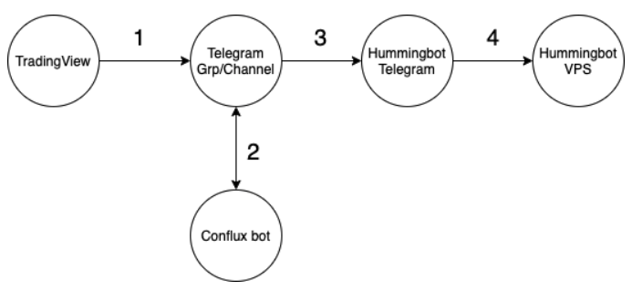
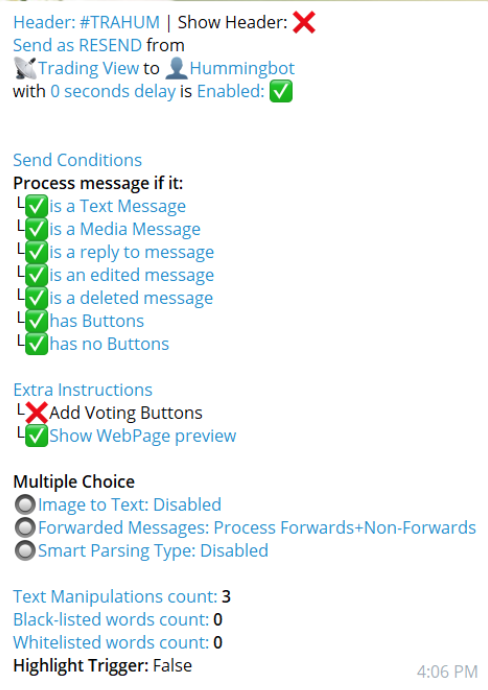
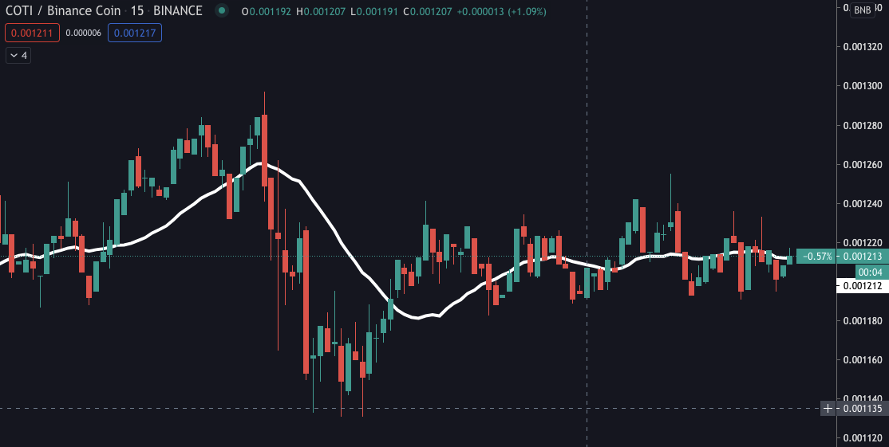

Some users may want to run [Hummingbot](https://bitcourier.co.uk/blog/hummingbot) for extended periods of time. Having a bot running for long periods of time has its advantages and disadvantages. The longer you have a bot running the more opportunities you have for a trade to occur. But this is not without the risk of shifts in the overall market leading to unfavorable trades. 

Mitigating risk is a core concept for effective market making. Market-makers look to do this by utilizing as many strategies and tools available to them. For example, Hummingbot has many advanced market making settings that allow the users to customize their trading experience and create their own strategies. Hummingbot even supports the use of telegram bots to allow you to constantly monitor your bot from your phone. Users like to have as many tools as possible to mitigate their risk; now the use of TradingView alerts can be added to their arsenal of tools to optimize the Hummingbot experience.

In this post, we explain the advantages of using TradingView alerts and the steps required to create and connect them to your Hummingbot to help streamline and automate your trading experience.

<!-- more -->

## What is TradingView?

TradingView is a popular website that many market-makers use to get real-time information and insights on markets. Using TradingView, you can view specific markets and their trends over time which are constantly updated. This information is crucial when making decisions as a market-maker. In addition to having information, TradingView has many tools to help users determine when trading conditions are favorable. 

## How does this relate to Hummingbot?

In order to maximize profits and mitigate risk using Hummingbot, users utilize as much information available to configure efficient market making strategies. Knowing when a good time to run a bot and when to shut it off is also an important element in effective market making. In order to do this, most users would look at the prices and trends of the markets they are trading on and decide if running a bot at that time is optimal. It is impossible for a human to constantly monitor the market to find the best opportunities to run bots or cut their losses. This is where using TradingView and their alerts system comes in. 

TradingView has a feature that allows users to create alerts that notify the user when certain conditions are met by the market. For example: an alert can be made when the price of Apple stocks goes up by $10. When Apple's stock increases the user will be immediately alerted. Available to pro TradingView members is the ability to export alerts to Webhooks. This feature allows TradingView triggers to be sent to thousands of different apps including Hummingbot. More information on the types of alerts that can be create can be found [here](https://www.TradingView.com/blog/en/webhooks-for-alerts-now-available-14054/).

Using TradingView alerts we can mitigate our bot’s market risk by having a bot running in trending or sideways markets while also shutting down the bot in downwards trending markets. Running a bot on a downwards trending market has many risks that are all mitigated if there is no bot running. Another benefit of using TradingView alerts is the synergy that it has with running Hummingbot on the cloud. With the TradingView alerts controlling your bot through telegram, your computer will continue to create and execute trades even if the computer is off. This will allow you to always have a bot running at optimal times without hardware limitations.TradingView alerts are highly customizable meaning there are an infinite amount of unique strategies that can be created.

## How do TradingView alerts connect to Hummingbot?

Using Hummingbot’s telegram feature users can control their bots from telegram messages. 
In addition to that TradingView’s webhook feature allows alerts to be sent to other platforms. 

In order to use these alerts to control Hummingbot, we use ConfluxBot, a telegram bot 
(costs $15/mth)that serves as the bridge between TradingView and Hummingbot. 

ConfluxBot is a webhook and a place that forwards TradingViews alerts to Hummingbots telegram in a format that will start/stop the bot.

## Instructions on connecting TradingView to Hummingbot

###  Step 1 Setting up ConfluxBot

1.  Follow the steps below to found [here](https://docs.hummingbot.io/features/telegram/) to set up your Hummingbot telegram
2.  Add ConfluxBot on [telegram](https://t.me/ConfluxBot) or searching @ConfluxBot
3.  Create a telegram channel. This channel is the receiver for TradingView triggers that are forwarded to the Hummingbot telegram bot. Make sure to add ConfluxBot to the channel and make them admin.
4.  **Tip:** Pin your created channel and your Hummingbot telegram number to make further steps easier
5.  Go to **ConfluxBot**
6.  Enter **/start**
7.  Click the **Connect Accounts**. Make sure to Follow the quick start guide to connect your telegram account.
8.  After your telegram account is linked click **Connect Accounts**.  Then click **Webhook**.
9.  Follow that link to find a list of URLS.
10. Find the URL of the channel that you created to confirm your channel is detected by ConfluxBot. Copy that URL.
11. Return to ConfluxBot, and click **Telegram Account**. You will be asked to share your contact information.
12. Click **Re-sender combinations**. 
13. Click **Add Combination**. A list of telegram and discord groups and channels are displayed
14. Search for your channel created and select its corresponding number as your source. If on step 4 you pinned your channel it would appear at the top of the list
15. Select your Hummingbot telegram number as the destination.
16. Click **Back to configs** to confirm that you have the correct source and destination. Your channel -> Hummingbot telegram

###  Step 2 Creating Alerts on TradingView

17. Go to **TradingView**  and search for the cryptocurrency pair your Hummingbot is configured with.
18. From there click **Full-featured chart** this opens the chart with more information and options.
19. When you are viewing the full-featured chart press **Alt+A** to open the alarm creating menu.
20. From their set the conditions that you need to be met in order to start your Hummingbot.
21. Under **Alert Actions** select **Webhook URL**.
22. Paste the URL that you got from step 10 in this box.
23. Under Message write **Start**.
24. Repeat steps 19-23 Instead with the stop conditions, enter **Stop** in the message box.
25. Once either start/stop messages are sent to the channel their should be additional text in front of them, for example #webhook Start or #webhook Stop. If not you can skip steps **26-29**. This problem is not major inorder to work around this you will need to perform text manipulation. 

### Step 3 Configuring ConfluxBot

26. Your previously created configuration should be displayed.
27. Select your combination then click **Text Manipulation**. 
28. From their type #webhook: this will make it so every time #webhook appears in a message it is removed.
29. Click **Back**.
30. If not already open, open the configuration page of your combination. This can be done by clicking **Set Up Forwards** then **Re-sender Combinations.** After that select your combination. 
31. Click **Forward/Resend**, and ensure the mode is in Resend. This allows text manipulation to be performed before sending the message to the bot.
32. Click **Show Headers**, and make sure it is disabled. We do this so when sending, the channel headers won't be included in the headers.
33. Finally **click Activate/Deactivate**, It will prompt you with Done! It will take 30 seconds for the change to take effect. Make sure that your ConfluxBot is  activated.
34. Double check make sure your configurations look something like this:

Now the bot should be able to start/stop based on your TradingView strategy and alert triggers!     
	Start and stop are not the only alert triggers that you can configure in TradingView alerts for Hummingbot Telegram bot. Since version 0.26, the following parameters can be triggered:

- bid_spread
- ask_spread
- order_amount
- order_levels
- order_level_spread
- inventory_target_base_pct
- inventory_range_multiplier
- filled_order_delay

For example, enter “config bid_spread 3”

**Note:** There are some issues with concurrent telegram connections, do test and limit the alerts to 2 per time interval.

### TradingView Sample Strategy for Thought

Using a simple moving average, you can configure to accumulate(buy) the coin during a downtrend and distribute(sell). Parameters to be used:

- bid_spread
- ask_spread

Example:
- Downtrend: bid_spread to 5%, ask_spread to 10%
- Uptrend: bid_spread to 1%, ask_spread to 2%

In this example, when price crosses down the moving average(downtrend), TradingView alerts are sent to the telegram bot to change the bid and ask spread; likewise, the same when price crosses up the moving average(uptrend).  

What this strategy does is that you will be accumulating the coin during downtrend at a higher spread, and selling the coins during uptrend at the lower spread. If you want to earn liquidity rewards, just need to set bid/ask parameters within 2% for uptrend/downtrend; thus, you have a hybrid strategy of accumulation and distribution cum liquidity mining.

## Summary

TradingView has tons of built-in technical indicators and scripts. If you prefer using TradingView to trigger Hummingbot, you need to have at least a Pro subscription(TradingView and a Plus subscription(Conflux)) to make your strategy work. In the long term, the Hummingbot team does intend to integrate the TradingView alerts, which is on the project roadmap. 
