### 10-month Summary Statistics
For a discussion and explanation of some of the metrics we are tracking, please see our blog post - [Liquidity mining: April recap](https://hummingbot.io/blog/2020-05-liquidity-mining-2nd-month-recap/).

To date, we have seen 1,179 unique miners participate in providing liquidity on Hummingbot Miner. From March 2020 to December 2020, order book depth created by liquidity miners resulted in $303.6 million of traded volume. Meanwhile, the rewards paid out to miners has totaled USD 215,362 equivalent, resulting in cost-effective market making for token issuers.

Since the platform’s launch, we have run campaigns on Binance.com for 15 different token issuers for 46 different trading pairs. In December, we launched three new campaigns, for [Ava Lab’s Avalanche](https://hummingbot.io/blog/2020-12-ava-labs-avalanche-hummingbot-liquidity-mining/) (AVAX) tokens, [Phoenix Global](https://hummingbot.io/blog/2020-12-phoenix-global-hummingbot-liquidity-mining/) (PHB), and [Frontier](https://hummingbot.io/blog/2020-12-frontier-hummingbot-liquidity-mining-campaign/) (FRONT).  We have proven that our system and concept of liquidity mining is able to serve token issuers’ needs efficiently and effectively.

<!-- more -->

As we kick off 2021, we hope to carry the momentum of strong activity in December to the new year! We are already working on announcing new campaigns shortly as well as looking to expand liquidity mining capabilities to additional exchanges.  After launching the platform, our focus in 2020 had mainly been on system stability and scalability.  This allowed us to lay the groundwork for efficient expansion to additional exchanges, which is our key initiative for 2021. So stay tuned!
 
***Through December 31, 2020***

- New milestone for the month: (1) filled order volume surpassed $300M

    - Filled order volume surpassed $300M in December, bringing the total overall miner traded volume to $303.6 million

- USD equivalent 215,362 cumulative rewards paid out

- 4,626 total sign-ups, with 1179 distinct miners having participated and earning rewards

- The top ranked miner has earned equivalent USD 29,181 rewards in total and #2 miner has earned equivalent USD 14,564
 
### Cumulative Rewards Paid Out to Date

Miners have earned USD 215,362 equivalent in rewards, in a combination of USDC, USDT, XEM, RLC, XZC, USDT-TRON, ALGO, and USDT ASA (Algorand Standard Asset). We continue to expand the capabilities of Hummingbot Miner to allow us to payout rewards in issuers’ own native tokens on their own blockchain.

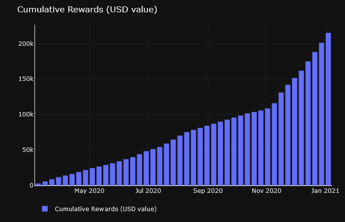

### Number of Distinct Miners

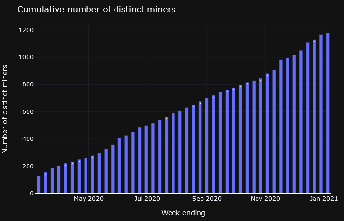
We saw 15% growth in the number of distinct miners in December

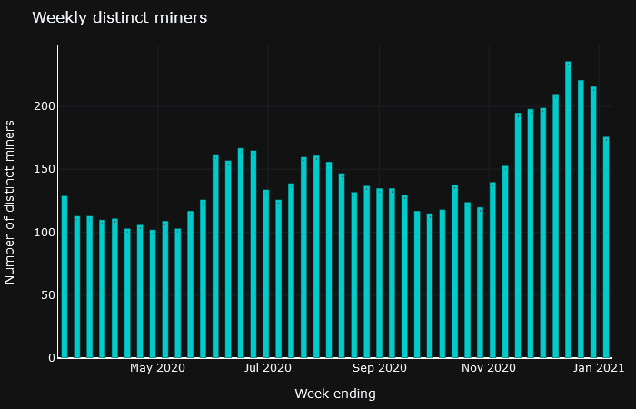 
We saw 8.5% growth in the number of weekly active miners in December

### Total Number of Bots

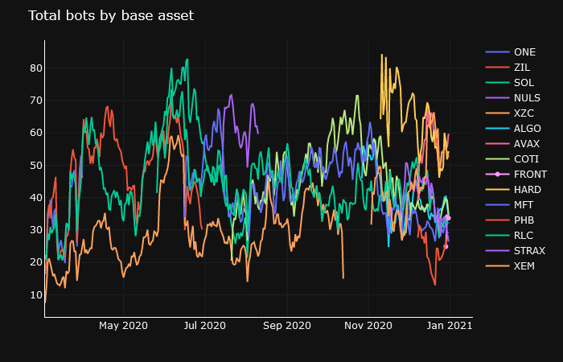 

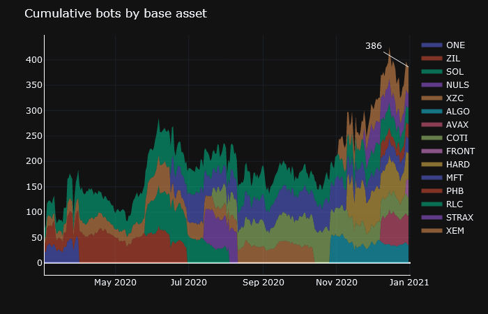 

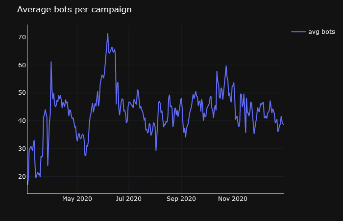 

### Open Order Volume

***Total Value Locked***

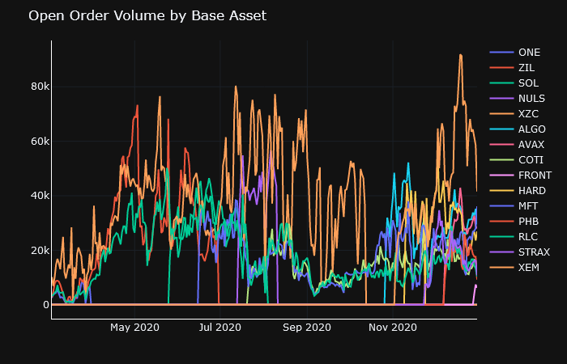 

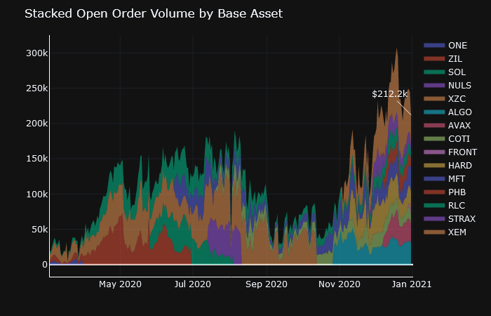 

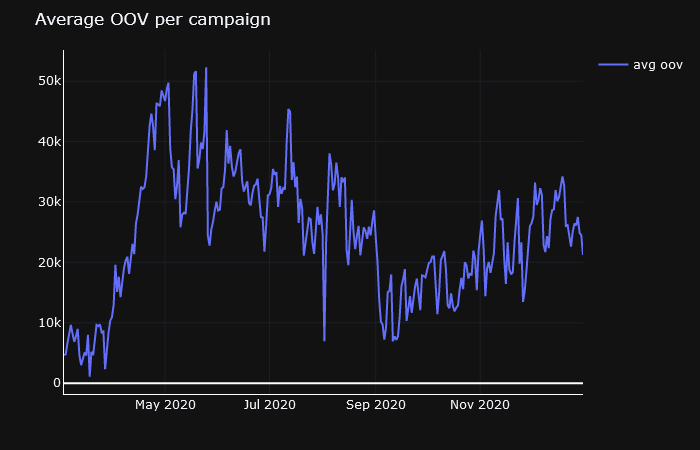 

### Average Amount of Liquidity (Open Order Volume) per Bot

Currently approx. $860 of open order volume/liquidity has been created per bot.

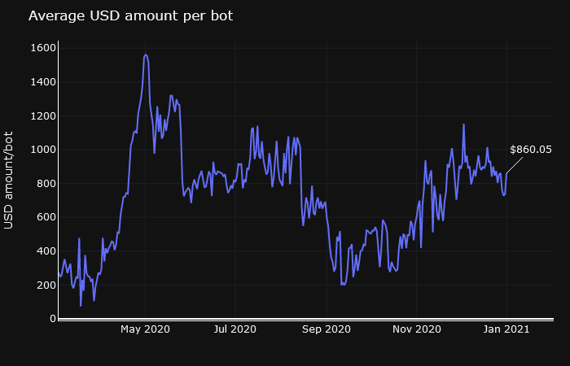

### Filled Order Volume

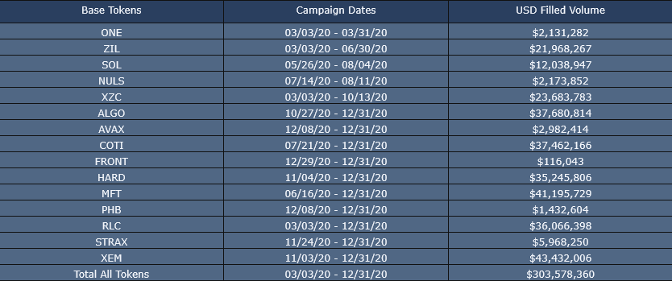
Filled order volume: March 3, 2020, to December 31, 2020

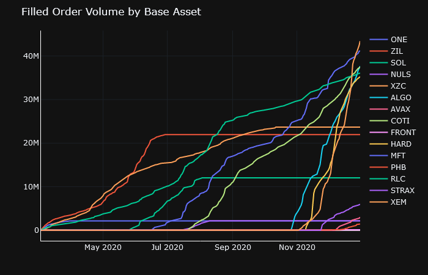

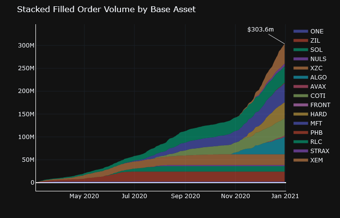

### Filled Volume as % of Binance Totals

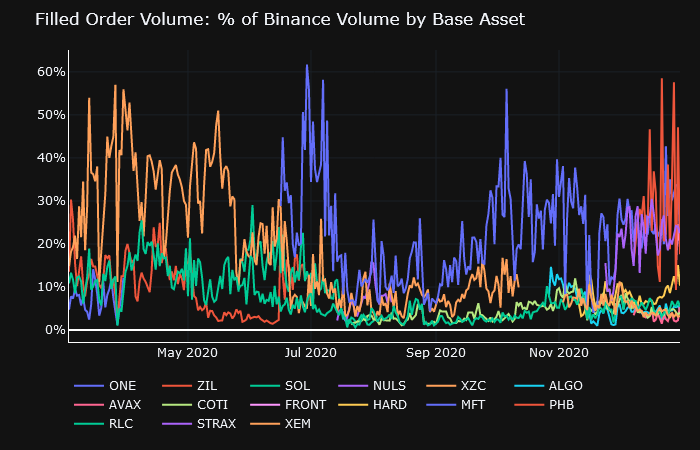

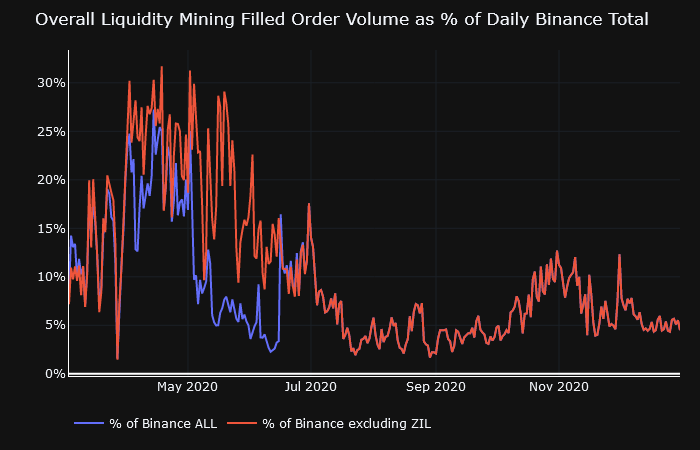

### Filled Order Volume VS. Reward pool

While liquidity mining does not compensate miners for filled order volume, the increased liquidity and order book depth created by miners does translate into increased trading efficiently and, consequently, additional trading volume. Trading volume is important for issuers since exchanges typically use traded volume as a benchmark more deciding whether or not to maintain or remove token listings

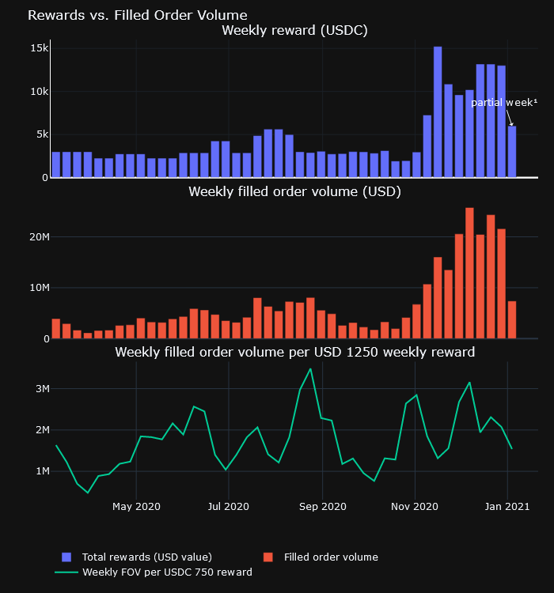

- A total reward pool of equivalent USD 215,362 yielded $303.6 million of traded volume across campaigns¹

- On average, a weekly reward pool of equivalent USD 1,250 (our minimum recommended amount for issuers for a campaign), resulted in monthly average of $2.8M filled order volume¹

***Note 1) Liquidity mining does not reward for filled order volume nor does it guarantee a certain amount of filled order volume. The above figures are based on historical data from currently running and historical liquidity mining campaigns.***

**There was a range across campaigns, which can be seen in the following charts:**

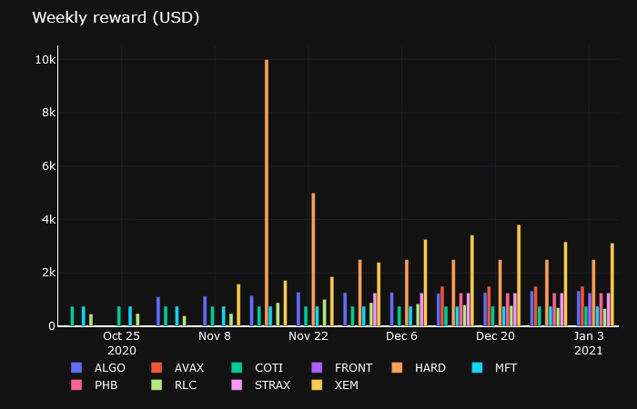   

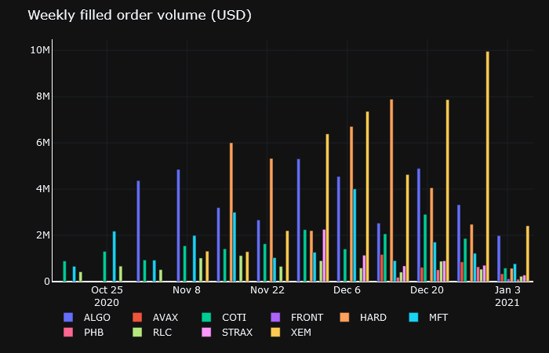
(Note: last data point is partial week data to December 31, 2020)

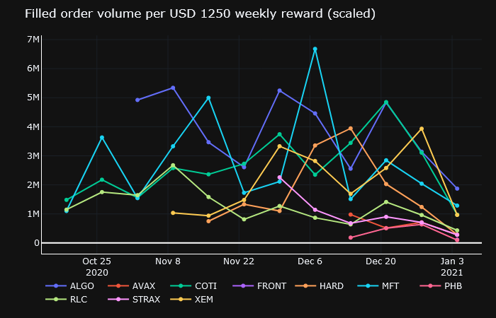
(Note: last data point is partial week data to December 31, 2020)

### Learn More

- [Hummingbot Miner app](https://miners.hummingbot.io)
- [Liquidity mining basic training replay](https://youtu.be/QksultmszQM)
- [Liquidity mining advanced training replay](https://youtu.be/0I-M_k0mVf8)
- [Active campaigns](https://docs.hummingbot.io/miner/liquidity-mining/current-rewards&terms/#current-campaign-terms)
- [Hummingbot Help Center](https://hummingbot.zendesk.com/hc/en-us)

---

For exchanges and projects who would like to learn more about liquidity mining, please contact us at [partnerships@hummingbot.io](mailto:partnerships@hummingbot.io).