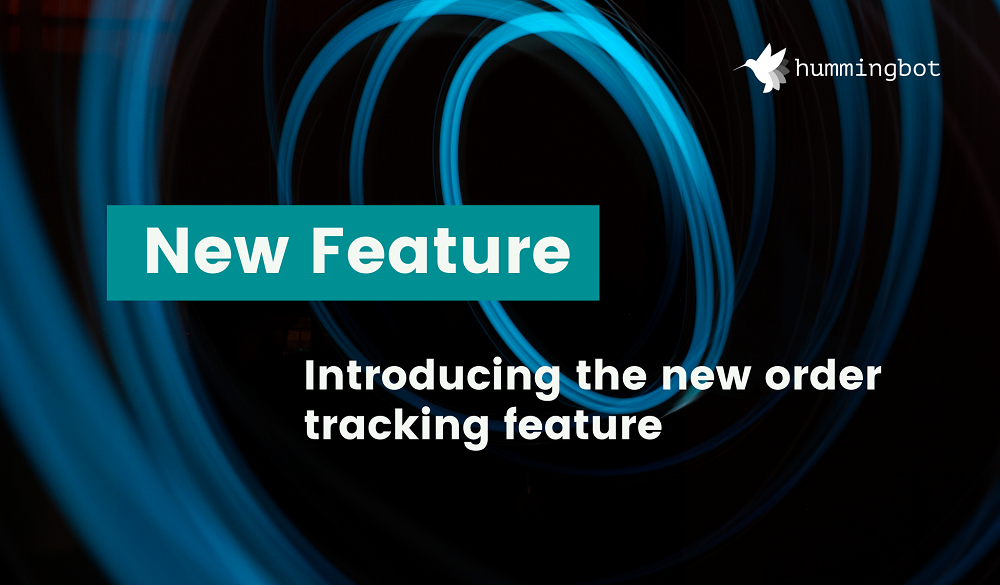
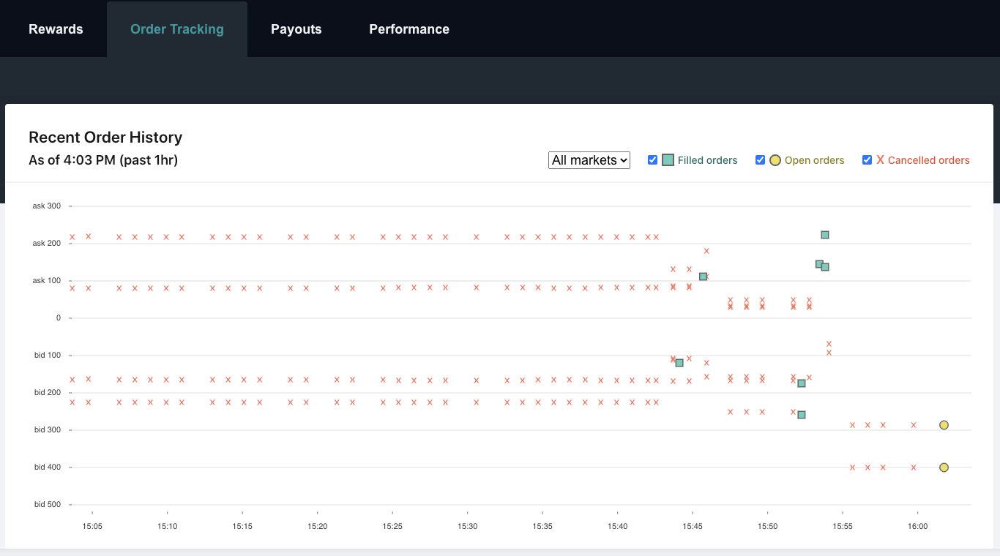
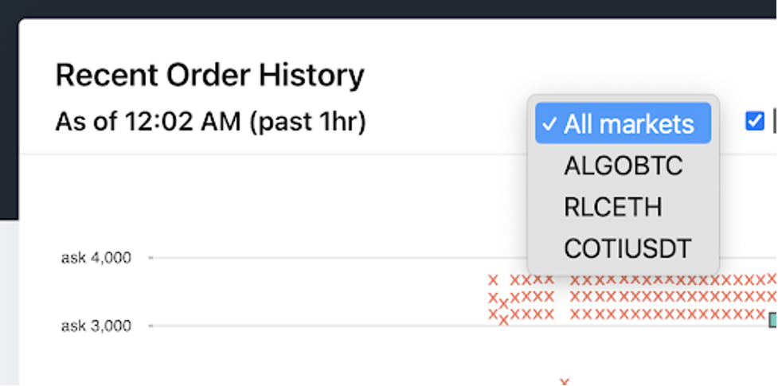
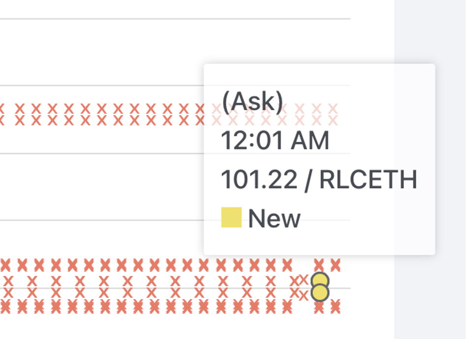

# New order tracking feature 

**We have just released a new feature in Hummingbot Miner that allows users to track the real-time orders created by their bots registered for liquidity mining!**

Users participating in liquidity mining will quickly notice that the Hummingbot Miner system typically requires about 30 minutes to start displaying their rewards.  For example, if you registered for liquidity mining and started running a bot now, you would only see rewards on the dashboard approximately 30 minutes from now.  The reason for this delay is that the Hummingbot Miner system needs to collect all users’ order data, process and sequence this data, and then apply the calculations for allocating rewards to each individual user.  Only after this entire data pipeline process is completed for all miners is the system able to display each individual user’s order and rewards data.

This long feedback loop is not ideal, since miners have to wait 30 minutes to know if they are even earning rewards at all in the first place.  And if there’s a problem with their bot or the orders they’re creating, any fixes or adjustments would require another half an hour to confirm if such changes have resolved the issue.

<!-- more -->

With the new **Order Tracking** feature we just launched, miners will now be able to confirm that their orders have been picked up by our systems within minutes or even seconds.  As soon as orders are created by a miner, they will be picked up and displayed in the new **Order Tracking** tab on the miner dashboard.   While getting the full rewards data will still require the full 30 minutes to process, users will now at least be able to confirm that their orders are being captured in the system and are being processed for rewards.

The new order tracking tab lets users track the status of their orders in real time, presented as a time series graph with order size (in amount of base asset) as the vertical axis.  Ask orders are shown above zero, while bid sizes are shown below zero.  Orders are also designated as filled, open, or cancelled. The order data is shown over the past one hour and the data is updated each minute.

##### Users can also filter orders by different markets, via a dropdown selection:

##### Mousing over points will display the quantity of the order:

We welcome any feedback and suggestions you may have.  Please feel free to discuss with our team on our [discord](https://discord.hummingbot.io) or send us an email at [miner@hummingbot.io](mailto:miner@hummingbot.io)

### Hope you will enjoy this new feature. Happy Mining!

