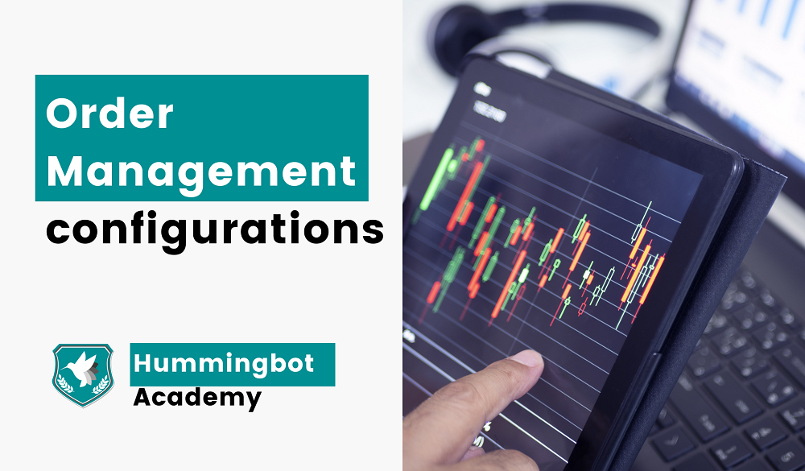
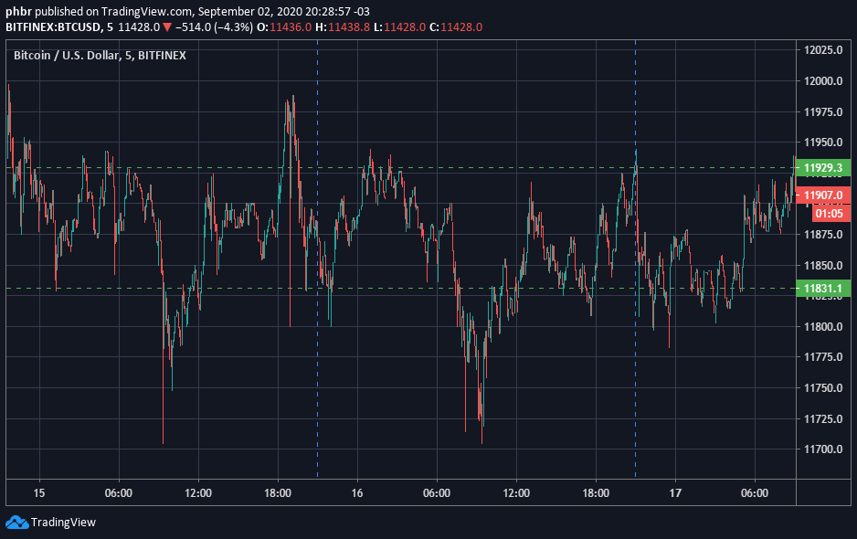
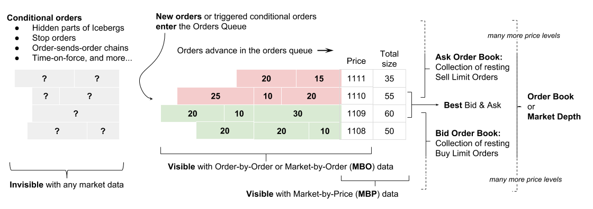

# How to Manage Your Orders



Welcome to another piece of this series where we go through all possible configurations you can use on Hummingbot and explore the concepts behind them!

Today we are going to talk about Order Management, and we will be covering the following topics:


*   As a market maker, what kind of order management is needed;
*   How to manage your orders on the Hummingbot Client;
*   Why and how traders keep jumping offers on the order book;
*   What is and how to use order optimization;
*   Expanding the order management using scripts;

If you missed the previous articles of this series, here is what we have already covered:

<!-- more -->


*   [Hummingbot Commands - Part 1](https://hummingbot.io/blog/2020-11-commands-and-configs-part1/)
*   [Hummingbot Commands and Configurations - Part 2](https://hummingbot.io/blog/2020-11-commands-and-configs-part2/)
*   [Price Sources and Price Types](https://hummingbot.io/blog/2020-11-commands-and-config-price-source/)


## Order management is the market maker survival toolkit

So you installed Hummingbot, created a `pure_market_making` strategy, hit `start`. Now you are just waiting for it to start “printing” money without you ever touching it again, right?

While this would be the ideal situation (and there are some ways to make this happen), it isn’t a good idea to just start your bot and never think about it again.

As mentioned in our [introduction article](https://hummingbot.io/blog/2020-09-what-is-market-making/), market-making profits come from capturing the market spread, and the ideal situation is when the market is moving sideways.





But as we all know, markets aren’t static, and capturing market spreads is about figuring out if the current order flow is coming from informed or uninformed traders.


## The battle between informed vs. uninformed traders

There are many different players on the markets with various reasons for buying or selling a specific asset.

But at its core, these reasonings can be boiled down to two kinds: Informed or Uninformed.

There is no judgment of value here, but it is just a simplification of the nature of trading decisions.

An **uninformed trade** isn't taking into consideration the expected direction the market price is going in the near (or even long) future.

On the other hand, an **informed trade** is using whatever information the player has access to (be it insider information, fundamental analysis, or technical analysis), positioning themselves in the right direction of the price movement. 

A **market maker** benefits when there are more **uninformed trades** happening because that means there is no clear direction in the price, and the sideway movement might stay around for a long time, allowing him to capture more spreads.


## Adapting = surviving

If the only players on the market were **uninformed traders**, all the **market makers** would have to do is set their desired spread, turn on their bots, and start planning their next vacation in Ibiza.

But the moment the **informed traders** enter the game, it is a clear indication a directional change will happen at any moment.

And this is terrible news for the market makers because, as we talked on the [inventory risk article](https://hummingbot.io/blog/2020-10-inventory-risk/), they are now exposed to the risk of increasing the inventory on only one side of the trade, leading to unprofitable trades.

A quick and straightforward adaptation for that situation is that if a trend direction is detected, the Market Maker will shorten the spread on one side and widen it on the other. 

On uptrends, small bid spread with wide ask spread; on downtrends, small ask spread and wide bid spread. 

How to detect informed trade on the markets deserve a whole article on the subject (and I will be working on that soon), but if you want to start going down the rabbit hole, look at the [big list of academic research on this topic](https://www.google.com/search?q=market%20making%20detecting%20informed%20trading).

But the main point is: **Market makers** must be aware of these changes, and their primary tool to adapt is **order management**.


## How to manage your orders with Hummingbot

Hummingbot users can change how their strategy will handle the order management through the `config` command.

Below is a list of the strategy parameters that are related to order management. To change them, type `config &lt;parameter>` on your Hummingbot client.


#### **bid_spread & ask_spread**

Changing the bid and ask spread is the bread & butter of a market-making strategy.

With this parameter, you will define the % from the `price_type` your orders will be created (read [this article](https://hummingbot.io/blog/2020-11-commands-and-config-price-source/) if you want more information about price configurations).

This is the parameter that you usually want to change when looking to adapt to changing market conditions.

Another example of why you would want to change the `bid_spread` and the `ask_spread` is when there is a change in the volatility: With high volatility, you will probably want to increase the spread size to take more significant profits on these moments.


#### **order_amount**

Another essential piece of a market-making strategy is deciding what is going to be the order size.

You should take some time to think about what is going to be the size of each order your bot is creating, or you might end up without enough inventory to continue trading.

For example, let’s say that you have 5,000 USD and 0.1 BTC on your account, and the current mid-price for the BTC/USD market is at 50,000 USD.

If you set your `config order_size` to 0.1 BTC, creating one ask offer and one bid offer, what will happen if your ask offer is taken?

You will now have around 10k USD and 0 BTC. On the next order refresh, when the bot would create two new opposing orders on the market, you won’t have enough BTC inventory, and only one buy offer will be created.

There is no right or wrong approach to defining what `order_amount` will be used by Hummingbot, but the value must fit your strategy.

The `order_size` example above could be interesting if you are using `ping_pong_enabled`, but probably won’t work if you are using `hanging_orders`


#### **order_refresh_time & filled_order_delay**

There are two basic ways to “understand time” in the market-making universe: High Frequency & Low Frequency.

**High-Frequency Trading** focuses on creating a lot of orders in a small amount of time, looking to capture many smaller spreads.

**Low-Frequency Trading** tries to trade less frequently but usually aims to capture bigger price swings.

Each approach has its base concepts, but the main difference between them is how fast the trader wants his orders to be created and canceled.

With `config order_refresh_time`, you will tell Hummingbot how many seconds your orders will be created and canceled. For example, with a value of 60, every 1 minute, your current orders will be canceled, and new ones will be created.

But if one of your orders is taken, `filled_order_delay` will define how long the bot must wait until new orders are created. There is a balance that must be aimed at with this setting: if it takes too long to create new orders, you might miss trading opportunities; if you create new orders too fast, you might execute a trade on a wrong position, like selling at really low prices due to a flash crash.


#### **order_refresh_tolerance_pct**

On order book markets, the most common rule that defines which of the orders posted by different traders at the same price have priority is a FIFO rule (first in, first out).

When new orders are added to the book at a given price, they will be positioned at the end of the line. 

Orders added first will be taken first.

The aggregated order book that appears on the exchanges showing the total volume available to trade at each price, but behind the scenes, it looks more like this:



*Source: [Bookmap wiki](https://bookmap.com/wiki/Market_Mechanics)*

If you (or your bot) cancel an order and recreate it at the same price, this new order will go to the end of the line on that price.

This is where the `order_refresh_tolerance_pct` can be useful for your strategy. 

Sometimes, the price change on the market is minimal. 

If you have the `order_refresh_tolerance_pct` on your Hummingbot set to 0, no matter how big the price change, the bot will cancel the current orders and create new ones, sending them to the end of the priority line.

But if you don’t want your orders to lose the current priority spot when these small changes happen, you have to change this setting to a value higher than zero (in a percentage value).

An example, with an `order_refresh_tolerace_pct = 0.5`, your Hummingbot instance will only cancel the current orders and create new ones if the price changed more than 0.5%.


#### **minimum_spread**

Another possible situation is if you want to keep your orders at a minimum spread size from the market price (or whatever `price_type` you are using).

Adding a positive value (in percentage) to the `minimum_spread` setting will cancel the current order every time the spread of your bid or ask offers goes below that percentage value.

As described on our [documentation site](https://docs.hummingbot.io/strategies/minimum-spread/):

## Sample Configuration

```json
- bid_spread : 0.50
- ask_spread : 0.50
- minimum_spread : 0.49
- order_refresh_time : 60.0
```

With the above configuration, the bot creates buy and sell orders at 0.5% spread from mid price.

```
00:28:31 - Creating 1 bid orders at (Size, Price): ['0.05 ETH, 227.41USDC']
00:28:31 - Creating 1 ask orders at (Size, Price): ['0.05 ETH, 229.69USDC']
00:28:31 - Created LIMIT_MAKER BUY order x-XEKWYICX-BEHUC1593217711001924 for 0.05000000 ETHUSDC.
00:28:31 - Created LIMIT_MAKER SELL order x-XEKWYICX-SEHUC1593217711002203 for 0.05000000 ETHUSDC.
```

```
Orders:
   Level  Type  Price Spread Amount (Orig)  Amount (Adj)       Age
       1  sell 229.69  0.49%          0.05          0.05  00:00:00
       1   buy 227.41  0.50%          0.05          0.05  00:00:00
```

Even before the 60 seconds refresh time was up, the sell order was cancelled when its spread went below the minimum.

```
00:28:40 - Order is below minimum spread (0.0049). Cancelling Order: (Sell) ID - x-XEKWYICX-SEHUC1593217711002203
00:28:40 - Cancelling the limit order x-XEKWYICX-SEHUC1593217711002203.
```

```
Orders:
   Level Type  Price Spread Amount (Orig)  Amount (Adj)       Age
       1  buy 227.41  0.52%          0.05          0.05  00:00:12
```

In the next order refresh new buy and sell orders with 0.5% spreads will be created.

## Conclusion

Your market-making strategy might be straightforward or use a hundred different indicators to make calculations and decisions of what must be done.

But keep in mind that, at the end of this process, a fundamental question must be asked (and answered):

**What must be done with the orders?**

How and when the orders must be created (or canceled) on the market is the final decision that your strategy must answer. Understanding how orders are managed is a crucial piece of finding a profitable strategy.


## Join our community

Our community is full of market makers and arbitrageurs who are willing to help each other make the best use of Hummingbot. You can join our [Discord channel](https://discord.com/invite/2MN3UWg) to talk about the hummingbot, strategies, liquidity mining, and anything else related to the cryptocurrency world and receive direct support from our team.

To keep up with the news and updates, make sure to follow us on [Twitter](https://twitter.com/hummingbot_io) and our Community on [Reddit](https://www.reddit.com/r/Hummingbot/).

On our[Youtube Channel](https://www.youtube.com/channel/UCxzzdEnDRbylLMWmaMjywOA?sub_confirmation=1), you can find a lot of content about market making, including interviews with professional traders and cryptocurrency-related events.
